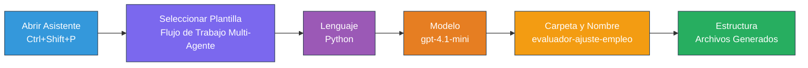
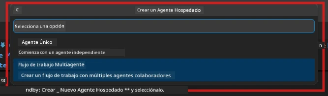

# Módulo 2 - Crear la estructura del proyecto Multi-Agente

En este módulo, utilizas la [extensión Microsoft Foundry](https://marketplace.visualstudio.com/items?itemName=TeamsDevApp.vscode-ai-foundry) para **crear la estructura de un proyecto de flujo de trabajo multi-agente**. La extensión genera toda la estructura del proyecto: `agent.yaml`, `main.py`, `Dockerfile`, `requirements.txt`, `.env` y la configuración de depuración. Luego personalizas estos archivos en los Módulos 3 y 4.

> **Nota:** La carpeta `PersonalCareerCopilot/` en este laboratorio es un ejemplo completo y funcional de un proyecto multi-agente personalizado. Puedes crear un proyecto nuevo desde cero (recomendado para el aprendizaje) o estudiar el código existente directamente.

---

## Paso 1: Abrir el asistente para crear un agente alojado


1. Presiona `Ctrl+Shift+P` para abrir la **Paleta de Comandos**.
2. Escribe: **Microsoft Foundry: Create a New Hosted Agent** y selecciónalo.
3. Se abrirá el asistente para crear un agente alojado.

> **Alternativa:** Haz clic en el icono de **Microsoft Foundry** en la Barra de Actividades → haz clic en el icono **+** junto a **Agents** → **Create New Hosted Agent**.

---

## Paso 2: Elegir la plantilla de flujo de trabajo multi-agente

El asistente te pide seleccionar una plantilla:

| Plantilla | Descripción | Cuándo usar |
|----------|-------------|-------------|
| Agente único | Un agente con instrucciones y herramientas opcionales | Laboratorio 01 |
| **Flujo de trabajo Multi-Agente** | Múltiples agentes que colaboran mediante WorkflowBuilder | **Este laboratorio (Laboratorio 02)** |

1. Selecciona **Flujo de trabajo Multi-Agente**.
2. Haz clic en **Siguiente**.



---

## Paso 3: Elegir el lenguaje de programación

1. Selecciona **Python**.
2. Haz clic en **Siguiente**.

---

## Paso 4: Seleccionar tu modelo

1. El asistente muestra los modelos desplegados en tu proyecto Foundry.
2. Selecciona el mismo modelo que usaste en el Laboratorio 01 (por ejemplo, **gpt-4.1-mini**).
3. Haz clic en **Siguiente**.

> **Consejo:** [`gpt-4.1-mini`](https://learn.microsoft.com/azure/foundry/foundry-models/concepts/models-sold-directly-by-azure#gpt-41-series) se recomienda para desarrollo: es rápido, económico y maneja bien los flujos multi-agente. Cambia a `gpt-4.1` para el despliegue final en producción si quieres una salida de mayor calidad.

---

## Paso 5: Elegir la ubicación de la carpeta y el nombre del agente

1. Se abre un cuadro de diálogo para seleccionar la carpeta destino:
   - Si sigues el repositorio del taller: navega a `workshop/lab02-multi-agent/` y crea una nueva subcarpeta
   - Si comienzas desde cero: elige cualquier carpeta
2. Ingresa un **nombre** para el agente alojado (por ejemplo, `resume-job-fit-evaluator`).
3. Haz clic en **Crear**.

---

## Paso 6: Espera a que se complete la creación de la estructura

1. VS Code abre una nueva ventana (o actualiza la ventana actual) con el proyecto creado.
2. Deberías ver esta estructura de archivos:

```
resume-job-fit-evaluator/
├── .env                ← Environment variables (placeholders)
├── .vscode/
│   └── launch.json     ← Debug configuration
├── agent.yaml          ← Agent definition (kind: hosted)
├── Dockerfile          ← Container configuration
├── main.py             ← Multi-agent workflow code (scaffold)
└── requirements.txt    ← Python dependencies
```

> **Nota del taller:** En el repositorio del taller, la carpeta `.vscode/` está en la **raíz del espacio de trabajo** con archivos compartidos `launch.json` y `tasks.json`. Las configuraciones de depuración para el Laboratorio 01 y el Laboratorio 02 están ambas incluidas. Al presionar F5, selecciona **"Lab02 - Multi-Agent"** del menú desplegable.

---

## Paso 7: Entender los archivos creados (específicos para multi-agente)

La estructura multi-agente difiere de la estructura de agente único en varios aspectos clave:

### 7.1 `agent.yaml` - Definición del agente

```yaml
kind: hosted
name: resume-job-fit-evaluator
description: >
  A multi-agent workflow that evaluates resume-to-job fit.
metadata:
  authors:
    - Microsoft
  tags:
    - Multi-Agent Workflow
    - Resume Evaluator
protocols:
  - protocol: responses
    version: v1
environment_variables:
  - name: PROJECT_ENDPOINT
    value: ${PROJECT_ENDPOINT}
  - name: MODEL_DEPLOYMENT_NAME
    value: ${MODEL_DEPLOYMENT_NAME}
```

**Diferencia clave con el Laboratorio 01:** La sección `environment_variables` puede incluir variables adicionales para puntos finales MCP u otra configuración de herramientas. El `name` y la `description` reflejan el caso de uso multi-agente.

### 7.2 `main.py` - Código del flujo de trabajo multi-agente

La estructura incluye:
- **Múltiples cadenas de instrucciones para agentes** (una constante por agente)
- **Múltiples gestores de contexto [`AzureAIAgentClient.as_agent()`](https://learn.microsoft.com/python/api/overview/azure/ai-agents-readme)** (uno por agente)
- **[`WorkflowBuilder`](https://learn.microsoft.com/agent-framework/workflows/agents-in-workflows)** para conectar a los agentes
- **`from_agent_framework()`** para servir el flujo de trabajo como un endpoint HTTP

```python
from agent_framework import WorkflowBuilder, tool
from agent_framework.azure import AzureAIAgentClient
from azure.ai.agentserver.agentframework import from_agent_framework
```

La importación extra [`WorkflowBuilder`](https://learn.microsoft.com/agent-framework/workflows/agents-in-workflows) es nueva comparada con el Laboratorio 01.

### 7.3 `requirements.txt` - Dependencias adicionales

El proyecto multi-agente usa los mismos paquetes base que el Laboratorio 01, más paquetes relacionados con MCP:

```
agent-framework-azure-ai==1.0.0rc3
agent-framework-core==1.0.0rc3
azure-ai-agentserver-agentframework==1.0.0b16
azure-ai-agentserver-core==1.0.0b16
debugpy
agent-dev-cli --pre
```

> **Nota importante sobre versiones:** El paquete `agent-dev-cli` requiere la bandera `--pre` en `requirements.txt` para instalar la última versión preliminar. Esto es necesario para la compatibilidad de Agent Inspector con `agent-framework-core==1.0.0rc3`. Consulta [Módulo 8 - Solución de problemas](08-troubleshooting.md) para detalles de versiones.

| Paquete | Versión | Propósito |
|---------|---------|-----------|
| [`agent-framework-azure-ai`](https://learn.microsoft.com/agent-framework/overview/) | `1.0.0rc3` | Integración Azure AI para [Microsoft Agent Framework](https://github.com/microsoft/agent-framework) |
| [`agent-framework-core`](https://learn.microsoft.com/agent-framework/overview/) | `1.0.0rc3` | Núcleo de ejecución (incluye WorkflowBuilder) |
| `azure-ai-agentserver-agentframework` | `1.0.0b16` | Tiempo de ejecución del servidor de agentes alojados |
| `azure-ai-agentserver-core` | `1.0.0b16` | Abstracciones principales del servidor de agentes |
| `debugpy` | última | Depuración de Python (F5 en VS Code) |
| `agent-dev-cli` | `--pre` | CLI local para desarrollo + backend de Agent Inspector |

### 7.4 `Dockerfile` - Igual que en Laboratorio 01

El Dockerfile es idéntico al del Laboratorio 01: copia archivos, instala dependencias de `requirements.txt`, expone el puerto 8088 y ejecuta `python main.py`.

```dockerfile
FROM python:3.14-slim
WORKDIR /app
COPY ./ .
RUN pip install --upgrade pip && \
    if [ -f requirements.txt ]; then \
        pip install -r requirements.txt; \
    else \
      echo "No requirements.txt found" >&2; exit 1; \
    fi
EXPOSE 8088
CMD ["python", "main.py"]
```

---

### Punto de control

- [ ] Completado el asistente → se ve la nueva estructura del proyecto
- [ ] Puedes ver todos los archivos: `agent.yaml`, `main.py`, `Dockerfile`, `requirements.txt`, `.env`
- [ ] `main.py` incluye la importación `WorkflowBuilder` (confirma que se seleccionó la plantilla multi-agente)
- [ ] `requirements.txt` incluye tanto `agent-framework-core` como `agent-framework-azure-ai`
- [ ] Entiendes cómo la estructura multi-agente difiere de la de agente único (múltiples agentes, WorkflowBuilder, herramientas MCP)

---

**Anterior:** [01 - Entender la arquitectura Multi-Agente](01-understand-multi-agent.md) · **Siguiente:** [03 - Configurar agentes y entorno →](03-configure-agents.md)

---

<!-- CO-OP TRANSLATOR DISCLAIMER START -->
**Descargo de responsabilidad**:
Este documento ha sido traducido utilizando el servicio de traducción automática [Co-op Translator](https://github.com/Azure/co-op-translator). Aunque nos esforzamos por la precisión, tenga en cuenta que las traducciones automáticas pueden contener errores o inexactitudes. El documento original en su idioma nativo debe considerarse la fuente autorizada. Para información crítica, se recomienda una traducción profesional realizada por humanos. No nos hacemos responsables de ningún malentendido o interpretación errónea derivada del uso de esta traducción.
<!-- CO-OP TRANSLATOR DISCLAIMER END -->