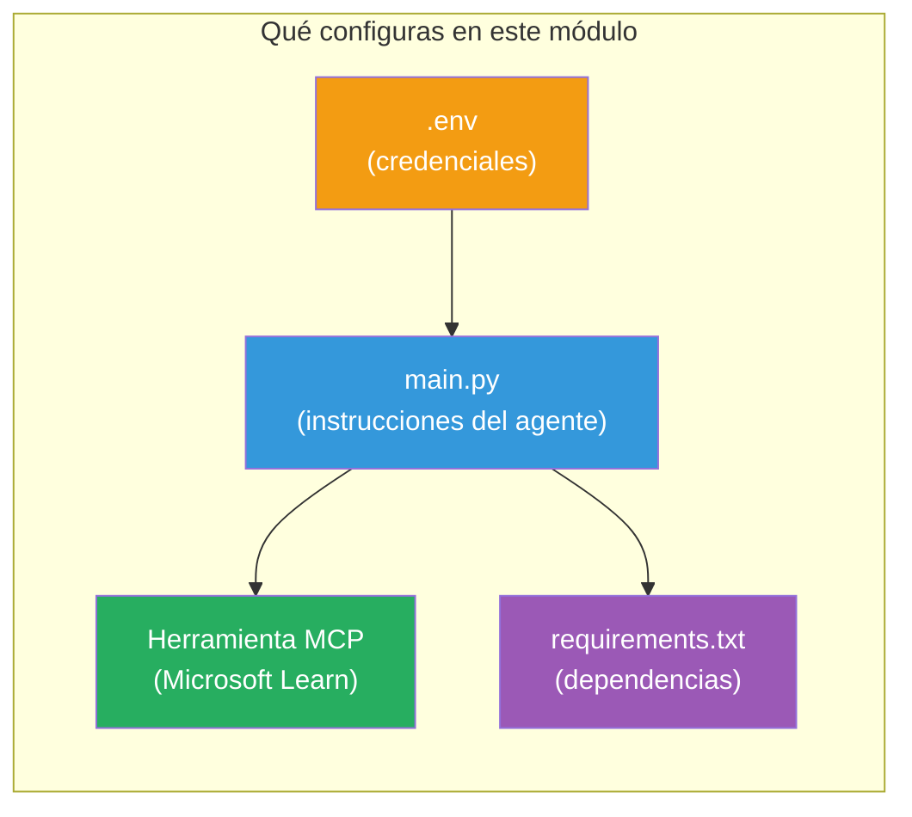

# Módulo 3 - Configurar Agentes, Herramienta MCP y Entorno

En este módulo, personalizarás el proyecto multiagente generado. Escribirás instrucciones para los cuatro agentes, configurarás la herramienta MCP para Microsoft Learn, configurarás variables de entorno, e instalarás dependencias.


> **Referencia:** El código totalmente funcional se encuentra en [`PersonalCareerCopilot/main.py`](../../../../../workshop/lab02-multi-agent/PersonalCareerCopilot/main.py). Úsalo como referencia mientras construyes el tuyo propio.

---

## Paso 1: Configurar variables de entorno

1. Abre el archivo **`.env`** en la raíz de tu proyecto.
2. Completa los detalles de tu proyecto Foundry:

   ```env
   PROJECT_ENDPOINT=https://<your-account>.services.ai.azure.com/api/projects/<your-project>
   MODEL_DEPLOYMENT_NAME=gpt-4.1-mini
   ```

3. Guarda el archivo.

### Dónde encontrar estos valores

| Valor | Cómo encontrarlo |
|-------|-----------------|
| **Endpoint del proyecto** | Barra lateral de Microsoft Foundry → haz clic en tu proyecto → URL del endpoint en la vista de detalles |
| **Nombre de despliegue del modelo** | Barra lateral de Foundry → expande proyecto → **Modelos + endpoints** → nombre junto al modelo desplegado |

> **Seguridad:** Nunca hagas commit del archivo `.env` en control de versiones. Agrégalo a `.gitignore` si no está ya incluido.

### Mapeo de variables de entorno

El `main.py` del multiagente lee nombres de variables estándar y específicos del taller:

```python
PROJECT_ENDPOINT = os.getenv("AZURE_AI_PROJECT_ENDPOINT") or os.getenv("PROJECT_ENDPOINT")
MODEL_DEPLOYMENT_NAME = os.getenv(
    "AZURE_AI_MODEL_DEPLOYMENT_NAME",
    os.getenv("MODEL_DEPLOYMENT_NAME", "gpt-4.1-mini"),
)
MICROSOFT_LEARN_MCP_ENDPOINT = os.getenv(
    "MICROSOFT_LEARN_MCP_ENDPOINT", "https://learn.microsoft.com/api/mcp"
)
```

El endpoint MCP tiene un valor predeterminado sensato, no necesitas configurarlo en `.env` a menos que quieras sobreescribirlo.

---

## Paso 2: Escribir instrucciones para los agentes

Este es el paso más crítico. Cada agente necesita instrucciones cuidadosamente redactadas que definan su rol, formato de salida y reglas. Abre `main.py` y crea (o modifica) las constantes de instrucciones.

### 2.1 Agente Parseador de CV

```python
RESUME_PARSER_INSTRUCTIONS = """\
You are the Resume Parser.
Extract resume text into a compact, structured profile for downstream matching.

Output exactly these sections:
1) Candidate Profile
2) Technical Skills (grouped categories)
3) Soft Skills
4) Certifications & Awards
5) Domain Experience
6) Notable Achievements

Rules:
- Use only explicit or strongly implied evidence.
- Do not invent skills, titles, or experience.
- Keep concise bullets; no long paragraphs.
- If input is not a resume, return a short warning and request resume text.
"""
```

**¿Por qué estas secciones?** El MatchingAgent necesita datos estructurados para hacer la puntuación. Secciones consistentes hacen que el traspaso entre agentes sea confiable.

### 2.2 Agente de Descripción de Puesto

```python
JOB_DESCRIPTION_INSTRUCTIONS = """\
You are the Job Description Analyst.
Extract a structured requirement profile from a JD.

Output exactly these sections:
1) Role Overview
2) Required Skills
3) Preferred Skills
4) Experience Required
5) Certifications Required
6) Education
7) Domain / Industry
8) Key Responsibilities

Rules:
- Keep required vs preferred clearly separated.
- Only use what the JD states; do not invent hidden requirements.
- Flag vague requirements briefly.
- If input is not a JD, return a short warning and request JD text.
"""
```

**¿Por qué separar requerido vs preferido?** El MatchingAgent usa pesos diferentes para cada uno (Habilidades Requeridas = 40 puntos, Habilidades Preferidas = 10 puntos).

### 2.3 Agente Matching

```python
MATCHING_AGENT_INSTRUCTIONS = """\
You are the Matching Agent.
Compare parsed resume output vs JD output and produce an evidence-based fit report.

Scoring (100 total):
- Required Skills 40
- Experience 25
- Certifications 15
- Preferred Skills 10
- Domain Alignment 10

Output exactly these sections:
1) Fit Score (with breakdown math)
2) Matched Skills
3) Missing Skills
4) Partially Matched
5) Experience Alignment
6) Certification Gaps
7) Overall Assessment

Rules:
- Be objective and evidence-only.
- Keep partial vs missing separate.
- Keep Missing Skills precise; it feeds roadmap planning.
"""
```

**¿Por qué puntuación explícita?** La puntuación reproducible permite comparar ejecuciones y depurar problemas. La escala de 100 puntos es fácil de interpretar para usuarios finales.

### 2.4 Agente Analizador de Brechas

```python
GAP_ANALYZER_INSTRUCTIONS = """\
You are the Gap Analyzer and Roadmap Planner.
Create a practical upskilling plan from the matching report.

Microsoft Learn MCP usage (required):
- For EVERY High and Medium priority gap, call tool `search_microsoft_learn_for_plan`.
- Use returned Learn links in Suggested Resources.
- Prefer Microsoft Learn for free resources.

CRITICAL: You MUST produce a SEPARATE detailed gap card for EVERY skill listed in
the Missing Skills and Certification Gaps sections of the matching report. Do NOT
skip or combine gaps. Do NOT summarize multiple gaps into one card.

Output format:
1) Personalized Learning Roadmap for [Role Title]
2) One DETAILED card per gap (produce ALL cards, not just the first):
   - Skill
   - Priority (High/Medium/Low)
   - Current Level
   - Target Level
   - Suggested Resources (include Learn URL from tool results)
   - Estimated Time
   - Quick Win Project
3) Recommended Learning Order (numbered list)
4) Timeline Summary (week-by-week)
5) Motivational Note

Rules:
- Produce every gap card before writing the summary sections.
- Keep it specific, realistic, and actionable.
- Tailor to candidate's existing stack.
- If fit >= 80, focus on polish/interview readiness.
- If fit < 40, be honest and provide a staged path.
"""
```

**¿Por qué énfasis en "CRÍTICO"?** Sin instrucciones explícitas para producir TODAS las tarjetas de brecha, el modelo tiende a generar solo 1-2 tarjetas y resumir el resto. El bloque "CRÍTICO" previene esta truncación.

---

## Paso 3: Definir la herramienta MCP

El GapAnalyzer usa una herramienta que llama al [servidor MCP de Microsoft Learn](https://learn.microsoft.com/azure/foundry/agents/how-to/tools/model-context-protocol). Añade esto a `main.py`:

```python
import json
from agent_framework import tool
from mcp.client.session import ClientSession
from mcp.client.streamable_http import streamable_http_client

@tool
async def search_microsoft_learn_for_plan(
    skill: str, role: str = "", max_results: int = 5
) -> str:
    """Search Microsoft Learn MCP and return curated official links for roadmap planning."""
    query = " ".join(part for part in [skill, role, "learning path module"] if part).strip()
    query = query or "job skills learning path"

    try:
        async with streamable_http_client(MICROSOFT_LEARN_MCP_ENDPOINT) as (
            read_stream, write_stream, _,
        ):
            async with ClientSession(read_stream, write_stream) as session:
                await session.initialize()
                result = await session.call_tool(
                    "microsoft_docs_search", {"query": query}
                )

        if not result.content:
            return (
                "No results returned from Microsoft Learn MCP. "
                "Fallback: https://learn.microsoft.com/training/support/catalog-api"
            )

        payload_text = getattr(result.content[0], "text", "")
        data = json.loads(payload_text) if payload_text else {}
        items = data.get("results", [])[:max(1, min(max_results, 10))]

        if not items:
            return f"No direct Microsoft Learn results found for '{skill}'."

        lines = [f"Microsoft Learn resources for '{skill}':"]
        for i, item in enumerate(items, start=1):
            title = item.get("title") or item.get("url") or "Microsoft Learn Resource"
            url = item.get("url") or item.get("link") or ""
            lines.append(f"{i}. {title} - {url}".rstrip(" -"))
        return "\n".join(lines)
    except Exception as ex:
        return (
            f"Microsoft Learn MCP lookup unavailable. Reason: {ex}. "
            "Fallbacks: https://learn.microsoft.com/api/mcp"
        )
```

### Cómo funciona la herramienta

| Paso | Qué sucede |
|------|------------|
| 1 | GapAnalyzer decide que necesita recursos para una habilidad (p.ej., "Kubernetes") |
| 2 | Framework llama a `search_microsoft_learn_for_plan(skill="Kubernetes")` |
| 3 | La función abre una conexión [HTTP transmitible](https://learn.microsoft.com/agent-framework/agents/tools/hosted-mcp-tools) a `https://learn.microsoft.com/api/mcp` |
| 4 | Llama a `microsoft_docs_search` en el [servidor MCP](https://learn.microsoft.com/azure/foundry/agents/how-to/tools/model-context-protocol) |
| 5 | El servidor MCP devuelve resultados de búsqueda (título + URL) |
| 6 | La función formatea resultados como lista numerada |
| 7 | GapAnalyzer incorpora las URLs en la tarjeta de brecha |

### Dependencias MCP

Las librerías cliente MCP se incluyen transitivamente vía [`agent-framework-core`](https://learn.microsoft.com/agent-framework/overview/). No necesitas agregarlas en `requirements.txt` por separado. Si encuentras errores de importación, verifica:

```powershell
pip list | Select-String "mcp"
```

Se espera que el paquete `mcp` esté instalado (versión 1.x o superior).

---

## Paso 4: Conectar los agentes y el flujo de trabajo

### 4.1 Crear agentes con gestores de contexto

```python
from contextlib import asynccontextmanager

@asynccontextmanager
async def create_agents():
    async with (
        get_credential() as credential,
        AzureAIAgentClient(
            project_endpoint=PROJECT_ENDPOINT,
            model_deployment_name=MODEL_DEPLOYMENT_NAME,
            credential=credential,
        ).as_agent(
            name="ResumeParser",
            instructions=RESUME_PARSER_INSTRUCTIONS,
        ) as resume_parser,
        AzureAIAgentClient(
            project_endpoint=PROJECT_ENDPOINT,
            model_deployment_name=MODEL_DEPLOYMENT_NAME,
            credential=credential,
        ).as_agent(
            name="JobDescriptionAgent",
            instructions=JOB_DESCRIPTION_INSTRUCTIONS,
        ) as jd_agent,
        AzureAIAgentClient(
            project_endpoint=PROJECT_ENDPOINT,
            model_deployment_name=MODEL_DEPLOYMENT_NAME,
            credential=credential,
        ).as_agent(
            name="MatchingAgent",
            instructions=MATCHING_AGENT_INSTRUCTIONS,
        ) as matching_agent,
        AzureAIAgentClient(
            project_endpoint=PROJECT_ENDPOINT,
            model_deployment_name=MODEL_DEPLOYMENT_NAME,
            credential=credential,
        ).as_agent(
            name="GapAnalyzer",
            instructions=GAP_ANALYZER_INSTRUCTIONS,
            tools=[search_microsoft_learn_for_plan],
        ) as gap_analyzer,
    ):
        yield resume_parser, jd_agent, matching_agent, gap_analyzer
```

**Puntos clave:**
- Cada agente tiene su propia instancia `AzureAIAgentClient`
- Solo GapAnalyzer recibe `tools=[search_microsoft_learn_for_plan]`
- `get_credential()` regresa [`ManagedIdentityCredential`](https://learn.microsoft.com/python/api/overview/azure/identity-readme#managed-identity-support) en Azure, [`DefaultAzureCredential`](https://learn.microsoft.com/azure/developer/python/sdk/authentication/credential-chains#defaultazurecredential-overview) localmente

### 4.2 Construir el grafo del flujo de trabajo

```python
def create_workflow(resume_parser, jd_agent, matching_agent, gap_analyzer):
    workflow = (
        WorkflowBuilder(
            name="ResumeJobFitEvaluator",
            start_executor=resume_parser,
            output_executors=[gap_analyzer],
        )
        .add_edge(resume_parser, jd_agent)
        .add_edge(resume_parser, matching_agent)
        .add_edge(jd_agent, matching_agent)
        .add_edge(matching_agent, gap_analyzer)
        .build()
    )
    return workflow.as_agent()
```

> Consulta [Flujos de trabajo como agentes](https://learn.microsoft.com/agent-framework/workflows/as-agents) para entender el patrón `.as_agent()`.

### 4.3 Iniciar el servidor

```python
async def main() -> None:
    validate_configuration()
    async with create_agents() as (resume_parser, jd_agent, matching_agent, gap_analyzer):
        agent = create_workflow(resume_parser, jd_agent, matching_agent, gap_analyzer)
        from azure.ai.agentserver.agentframework import from_agent_framework
        await from_agent_framework(agent).run_async()

if __name__ == "__main__":
    asyncio.run(main())
```

---

## Paso 5: Crear y activar el entorno virtual

### 5.1 Crear el entorno

```powershell
cd workshop\lab02-multi-agent\PersonalCareerCopilot
python -m venv .venv
```

### 5.2 Activarlo

**PowerShell (Windows):**
```powershell
.\.venv\Scripts\Activate.ps1
```

**macOS/Linux:**
```bash
source .venv/bin/activate
```

### 5.3 Instalar dependencias

```powershell
pip install -r requirements.txt
```

> **Nota:** La línea `agent-dev-cli --pre` en `requirements.txt` asegura que se instale la última versión en vista previa. Esto es necesario para la compatibilidad con `agent-framework-core==1.0.0rc3`.

### 5.4 Verificar la instalación

```powershell
pip list | Select-String "agent-framework|agentserver|agent-dev"
```

Salida esperada:
```
agent-dev-cli                  0.0.1b260316
agent-framework-azure-ai       1.0.0rc3
agent-framework-core            1.0.0rc3
azure-ai-agentserver-agentframework 1.0.0b16
azure-ai-agentserver-core      1.0.0b16
```

> **Si `agent-dev-cli` muestra una versión antigua** (p.ej., `0.0.1b260119`), el Inspector de Agentes fallará con errores 403/404. Para actualizar: `pip install agent-dev-cli --pre --upgrade`

---

## Paso 6: Verificar la autenticación

Ejecuta la misma comprobación de autenticación del Laboratorio 01:

```powershell
az account show --query "{name:name, id:id}" --output table
```

Si falla, ejecuta [`az login`](https://learn.microsoft.com/cli/azure/authenticate-azure-cli-interactively).

Para flujos multiagente, los cuatro agentes comparten la misma credencial. Si la autenticación funciona para uno, funciona para todos.

---

### Punto de control

- [ ] `.env` tiene valores válidos en `PROJECT_ENDPOINT` y `MODEL_DEPLOYMENT_NAME`
- [ ] Las 4 constantes de instrucciones de agentes están definidas en `main.py` (ResumeParser, JD Agent, MatchingAgent, GapAnalyzer)
- [ ] La herramienta MCP `search_microsoft_learn_for_plan` está definida y registrada con GapAnalyzer
- [ ] `create_agents()` crea los 4 agentes con instancias individuales de `AzureAIAgentClient`
- [ ] `create_workflow()` construye el grafo correcto con `WorkflowBuilder`
- [ ] Entorno virtual creado y activado (`(.venv)` visible)
- [ ] `pip install -r requirements.txt` se completa sin errores
- [ ] `pip list` muestra todos los paquetes esperados en las versiones correctas (rc3 / b16)
- [ ] `az account show` retorna tu suscripción

---

**Anterior:** [02 - Scaffold Multi-Agent Project](02-scaffold-multi-agent.md) · **Siguiente:** [04 - Patrones de Orquestación →](04-orchestration-patterns.md)

---

<!-- CO-OP TRANSLATOR DISCLAIMER START -->
**Aviso Legal**:
Este documento ha sido traducido utilizando el servicio de traducción automática [Co-op Translator](https://github.com/Azure/co-op-translator). Aunque nos esforzamos por la precisión, tenga en cuenta que las traducciones automáticas pueden contener errores o inexactitudes. El documento original en su idioma nativo debe considerarse la fuente autorizada. Para información crítica, se recomienda la traducción profesional humana. No nos hacemos responsables de cualquier malentendido o mala interpretación derivada del uso de esta traducción.
<!-- CO-OP TRANSLATOR DISCLAIMER END -->