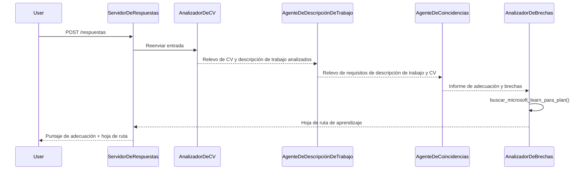

# Módulo 3 - Configurar instrucciones, entorno e instalar dependencias

⏱️ ~15 min

En este módulo, transformas el esqueleto generado en **tu** flujo de trabajo multiagente: configurando variables de entorno, escribiendo instrucciones para los agentes, agregando la herramienta MCP, conectando el grafo del flujo de trabajo e instalando dependencias.

> **Referencia:** El código completo y funcional está en [`PersonalCareerCopilot/main.py`](../../../../../workshop/lab02-multi-agent/PersonalCareerCopilot/main.py). Úsalo como referencia mientras construyes tu propio grafo de flujo de trabajo y bloques de indicaciones.

---

## Cómo encajan los cuatro agentes


```mermaid
sequenceDiagram
    participant User
    participant Server as ServidorDeRespuestas
    participant RP as AnalizadorDeCV
    participant JD as AgenteDeDescripciónDeTrabajo
    participant MA as AgenteDeCoincidencias
    participant GA as AnalizadorDeBrechas

    User->>Server: POST /respuestas
    Server->>RP: Reenviar entrada
    RP-->>JD: Relevo de CV y descripción de trabajo analizados
    JD-->>MA: Relevo de requisitos de descripción de trabajo y CV
    MA-->>GA: Informe de adecuación y brechas
    GA->>GA: buscar_microsoft_learn_para_plan()
    GA-->>Server: Hoja de ruta de aprendizaje
    Server-->>User: Puntaje de adecuación + hoja de ruta
```

---

## Paso 1: Configurar variables de entorno

1. Abre el archivo **`.env`** en la raíz de tu proyecto (creado por el asistente de esqueleto).
2. Reemplaza los marcadores con tus valores reales del Laboratorio 01.

<details open>
<summary><strong>🅰️ Ruta A - Suscripción Foundry</strong></summary>

```env
FOUNDRY_PROJECT_ENDPOINT=https://<your-account>.services.ai.azure.com/api/projects/<your-project>
AZURE_AI_MODEL_DEPLOYMENT_NAME=gpt-4.1-mini
```

> **Dónde encontrar los valores:** Consulta [Laboratorio 01, Módulo 1](../../lab01-single-agent/docs/01-setup.md#deploy-a-model--assign-rbac).

</details>

<details open>
<summary><strong>🅱️ Ruta B - Foundry Local</strong></summary>

```env
FOUNDRY_PROJECT_ENDPOINT=http://localhost:5273/v1
AZURE_AI_MODEL_DEPLOYMENT_NAME=phi-4-mini
```

> Todas las inferencias se ejecutan en tu máquina; ningún dato sale de tu dispositivo. Ejecuta `foundry model list` para confirmar el alias exacto del modelo. La única solicitud externa es la llamada a la herramienta MCP a `https://learn.microsoft.com/api/mcp`.

> **Dónde encontrar los valores:** Consulta [Laboratorio 01, Módulo 1 - ruta local](../../lab01-single-agent/docs/01-setup.md#step-2-set-up-based-on-your-access).

</details>

> **Seguridad:** Nunca cometas `.env` al control de versiones. Ya debería estar en `.gitignore`.

---

## Paso 2: Escribir instrucciones para los agentes

Las instrucciones definen el rol de cada agente, el formato de salida y las reglas. Abre `main.py` y define (o reemplaza) las cuatro constantes de instrucciones: las cadenas completas están en [`PersonalCareerCopilot/main.py`](../../../../../workshop/lab02-multi-agent/PersonalCareerCopilot/main.py).

### 2.1 `RESUME_PARSER_INSTRUCTIONS`
Convierte el currículum en un perfil estructurado del candidato **y** copia literalmente la descripción del trabajo en `[JOB DESCRIPTION PASS-THROUGH]`. Ambas secciones etiquetadas deben aparecer en la salida.

> **¿Por qué el paso intermedio?** Con `context_mode="last_agent"`, ResumeParser es el **único** agente que ve el mensaje original del usuario. Si no copia el JD adelante, los agentes posteriores nunca lo ven.

### 2.2 `JOB_DESCRIPTION_INSTRUCTIONS`
Lee `[PARSED RESUME]` y `[JOB DESCRIPTION PASS-THROUGH]` de la salida de ResumeParser. Produce `[JD REQUIREMENTS]` (requisitos estructurados) y `[PARSED RESUME PASS-THROUGH]` (copia literal del currículum para MatchingAgent).

### 2.3 `MATCHING_AGENT_INSTRUCTIONS`
Lee `[JD REQUIREMENTS]` y `[PARSED RESUME PASS-THROUGH]`. Genera un informe de ajuste puntuado (0–100) con desglose matemático, habilidades coincidentes, habilidades faltantes y alineación de experiencia.

### 2.4 `GAP_ANALYZER_INSTRUCTIONS`
Lee el informe de ajuste. Por **cada** habilidad faltante, llama a `search_microsoft_learn_for_plan` para obtener recursos de Microsoft Learn. Produce una tarjeta detallada por brecha y una hoja de ruta de aprendizaje semana a semana.

---

## Paso 3: Agregar la herramienta MCP

El GapAnalyzer llama al [servidor MCP de Microsoft Learn](https://learn.microsoft.com/azure/foundry/agents/how-to/tools/model-context-protocol) para obtener recursos reales de aprendizaje para cada brecha de habilidad. La función completa `search_microsoft_learn_for_plan` está en [`PersonalCareerCopilot/main.py`](../../../../../workshop/lab02-multi-agent/PersonalCareerCopilot/main.py).

Registra la herramienta en el GapAnalyzer al crear el agente:

```python
gap_analyzer = Agent(
    client=client,
    instructions=GAP_ANALYZER_INSTRUCTIONS,
    name="GapAnalyzer",
    tools=[search_microsoft_learn_for_plan],
)
```

> Consulta [`PersonalCareerCopilot/main.py`](../../../../../workshop/lab02-multi-agent/PersonalCareerCopilot/main.py) para ver el grafo completo `WorkflowBuilder` con `FoundryChatClient`, `AgentExecutor` y todas las llamadas `add_edge()`.

---

## Paso 4: Crear entorno virtual e instalar dependencias

> ⚠️ **No omitas este paso.** Sin las dependencias instaladas, la depuración con F5 fallará.

### 4.1 Crear el entorno virtual

```powershell
python -m venv .venv
```

### 4.2 Activarlo

| SO | Comando |
|----|---------|
| **Windows (PowerShell)** | `.\.venv\Scripts\Activate.ps1` |
| **Windows (CMD)** | `.venv\Scripts\activate.bat` |
| **macOS / Linux** | `source .venv/bin/activate` |

Deberías ver `(.venv)` en el prompt de tu terminal.

### 4.3 Instalar dependencias

```powershell
pip install -r requirements.txt
```

### 4.4 Verificar

```powershell
pip list | Select-String "agent-framework|mcp|debugpy"
```

Esperado: `agent-framework-foundry`, `agent-framework-foundry-hosting`, `mcp` y `debugpy` listados.

---

## Paso 5: Verificar autenticación

<details open>
<summary><strong>🅰️ Ruta A - Credencial Azure</strong></summary>

```powershell
az account show --query "{name:name, id:id}" --output table
```

Si falla, ejecuta [`az login`](https://learn.microsoft.com/cli/azure/authenticate-azure-cli-interactively).

Los cuatro agentes comparten un `FoundryChatClient` y un `DefaultAzureCredential`. Si la autenticación funciona para uno, funciona para todos.

</details>

<details open>
<summary><strong>🅱️ Ruta B - Foundry Local</strong></summary>

No se requiere autenticación para pruebas locales.

</details>

---

### ✅ Punto de control

> No procedas al Módulo 04 hasta que: **(1)** `(.venv)` sea visible en tu prompt Y **(2)** `pip install -r requirements.txt` haya completado correctamente.

- [ ] `.env` tiene el endpoint válido y nombre de despliegue del modelo (no marcadores)
- [ ] Las 4 constantes de instrucciones de agente definidas en `main.py` (ResumeParser, agente JD, MatchingAgent, GapAnalyzer)
- [ ] La herramienta MCP `search_microsoft_learn_for_plan` definida y registrada en GapAnalyzer
- [ ] `FoundryChatClient` + 4 `Agent` + 4 `AgentExecutor` creados en `main()`
- [ ] `WorkflowBuilder` construye el grafo secuencial correcto con las 3 llamadas `add_edge()`
- [ ] Entorno virtual creado y activado (`(.venv)` visible en prompt)
- [ ] `pip install -r requirements.txt` completado sin errores
- [ ] **Ruta A:** `az account show` funciona O el icono de Cuentas en VS Code muestra la cuenta iniciada

---

**Anterior:** [02 - Scaffold Multi-Agent Project](02-scaffold-multi-agent.md) · **Siguiente:** [04 - Orchestration Patterns →](04-orchestration-patterns.md)

---

<!-- CO-OP TRANSLATOR DISCLAIMER START -->
**Descargo de responsabilidad**:
Este documento ha sido traducido utilizando el servicio de traducción automática [Co-op Translator](https://github.com/Azure/co-op-translator). Aunque nos esforzamos por la precisión, tenga en cuenta que las traducciones automatizadas pueden contener errores o inexactitudes. El documento original en su idioma nativo debe considerarse la fuente autorizada. Para información crítica, se recomienda una traducción profesional humana. No somos responsables de cualquier malentendido o interpretación errónea que surja del uso de esta traducción.
<!-- CO-OP TRANSLATOR DISCLAIMER END -->