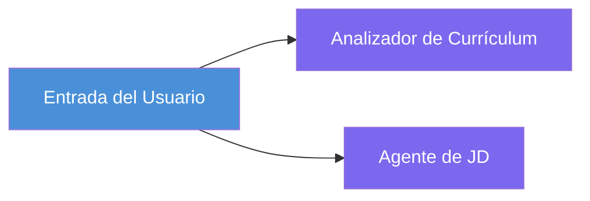
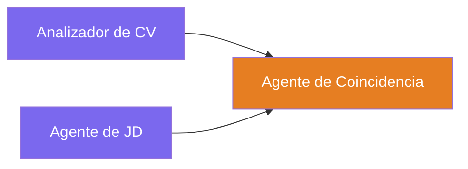
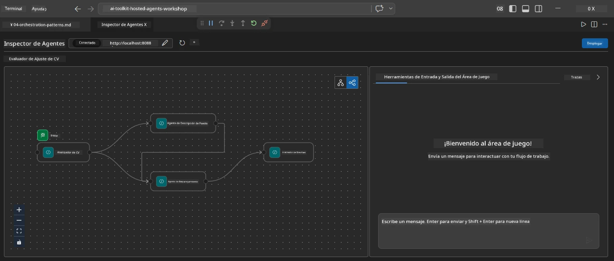
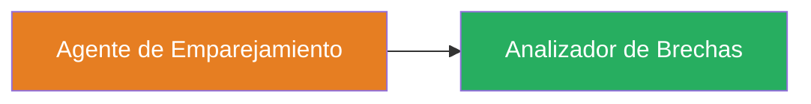
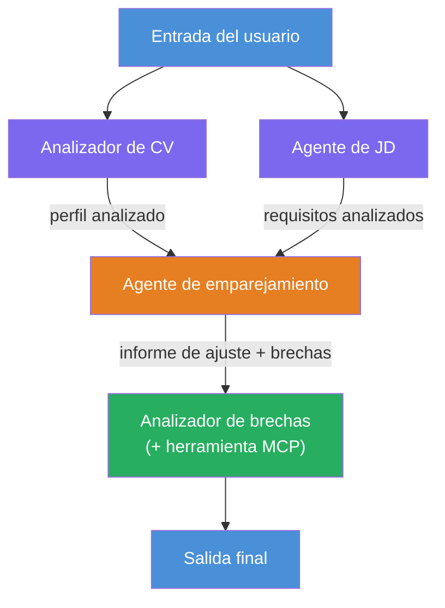
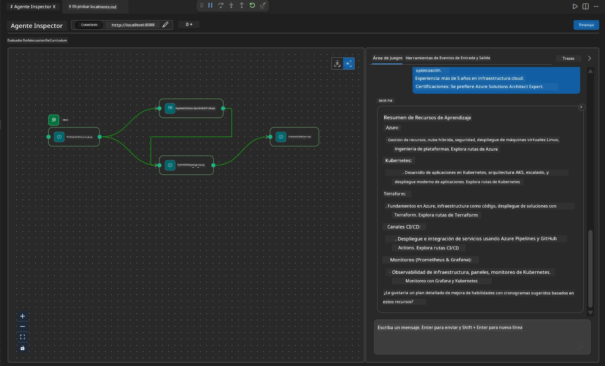

# Módulo 4 - Patrones de orquestación

En este módulo, exploras los patrones de orquestación usados en el Evaluador de Ajuste de Trabajo para CV y aprendes a leer, modificar y extender el gráfico del flujo de trabajo. Entender estos patrones es esencial para depurar problemas de flujo de datos y construir tus propios [flujos de trabajo multiagente](https://learn.microsoft.com/agent-framework/workflows/).

---

## Patrón 1: Fan-out (división paralela)

El primer patrón en el flujo de trabajo es **fan-out**: una única entrada se envía a múltiples agentes simultáneamente.


En el código, esto ocurre porque `resume_parser` es el `start_executor`: recibe primero el mensaje del usuario. Luego, porque tanto `jd_agent` como `matching_agent` tienen conexiones desde `resume_parser`, el framework enruta la salida de `resume_parser` a ambos agentes:

```python
.add_edge(resume_parser, jd_agent)         # Salida de ResumeParser → Agente JD
.add_edge(resume_parser, matching_agent)   # Salida de ResumeParser → Agente de coincidencia
```

**Por qué esto funciona:** ResumeParser y JD Agent procesan diferentes aspectos de la misma entrada. Ejecutarlos en paralelo reduce la latencia total en comparación con hacerlo secuencialmente.

### Cuándo usar fan-out

| Caso de uso | Ejemplo |
|-------------|---------|
| Subtareas independientes | Parsing de CV vs. parsing de JD |
| Redundancia / votación | Dos agentes analizan los mismos datos, un tercero elige la mejor respuesta |
| Salida multi-formato | Un agente genera texto, otro genera JSON estructurado |

---

## Patrón 2: Fan-in (agregación)

El segundo patrón es **fan-in**: múltiples salidas de agentes se recopilan y envían a un único agente posterior.


En código:

```python
.add_edge(resume_parser, matching_agent)   # Salida de ResumeParser → MatchingAgent
.add_edge(jd_agent, matching_agent)        # Salida del agente JD → MatchingAgent
```

**Comportamiento clave:** Cuando un agente tiene **dos o más conexiones entrantes**, el framework espera automáticamente que **todos** los agentes anteriores terminen antes de ejecutar el agente posterior. MatchingAgent no comienza hasta que ResumeParser y JD Agent han terminado.

### Qué recibe MatchingAgent

El framework concatena las salidas de todos los agentes ascendentes. La entrada de MatchingAgent se ve así:

```
[ResumeParser output]
---
Candidate Profile:
  Name: Jane Doe
  Technical Skills: Python, Azure, Kubernetes, ...
  ...

[JobDescriptionAgent output]
---
Role Overview: Senior Cloud Engineer
Required Skills: Python, Azure, Terraform, ...
...
```

> **Nota:** El formato exacto de la concatenación depende de la versión del framework. Las instrucciones del agente deben estar escritas para manejar tanto salida estructurada como no estructurada de los agentes ascendentes.



---

## Patrón 3: Cadena secuencial

El tercer patrón es **encadenamiento secuencial**: la salida de un agente alimenta directamente al siguiente.


En código:

```python
.add_edge(matching_agent, gap_analyzer)    # Salida de MatchingAgent → GapAnalyzer
```

Este es el patrón más simple. GapAnalyzer recibe la puntuación de ajuste de MatchingAgent, habilidades coincidentes/faltantes y brechas. Luego llama a la [herramienta MCP](https://learn.microsoft.com/azure/foundry/agents/how-to/tools/model-context-protocol) para cada brecha para obtener recursos de Microsoft Learn.

---

## El gráfico completo

Combinar los tres patrones produce el flujo de trabajo completo:


### Línea de tiempo de ejecución

```mermaid
gantt
    title Cronograma de Ejecución del Agente
    dateFormat X
    axisFormat %s

    section Paralelo
    Resume Parser       :rp, 0, 3
    JD Agent            :jd, 0, 2

    section Secuencial
    Matching Agent      :ma, 3, 5
    Gap Analyzer        :ga, 5, 9
```


> El tiempo total de reloj de pared es aproximadamente `max(ResumeParser, JD Agent) + MatchingAgent + GapAnalyzer`. GapAnalyzer suele ser el más lento porque realiza múltiples llamadas a la herramienta MCP (una por brecha).

---

## Leyendo el código de WorkflowBuilder

Aquí está la función completa `create_workflow()` de `main.py`, anotada:

```python
def create_workflow(resume_parser, jd_agent, matching_agent, gap_analyzer):
    workflow = (
        WorkflowBuilder(
            name="ResumeJobFitEvaluator",

            # El primer agente en recibir la entrada del usuario
            start_executor=resume_parser,

            # El/los agente(s) cuyo(s) resultado(s) se convierte(n) en la respuesta final
            output_executors=[gap_analyzer],
        )
        # Distribución: La salida de ResumeParser va tanto a JD Agent como a MatchingAgent
        .add_edge(resume_parser, jd_agent)
        .add_edge(resume_parser, matching_agent)

        # Convergencia: MatchingAgent espera tanto a ResumeParser como a JD Agent
        .add_edge(jd_agent, matching_agent)

        # Secuencial: La salida de MatchingAgent alimenta a GapAnalyzer
        .add_edge(matching_agent, gap_analyzer)

        .build()
    )
    return workflow.as_agent()
```

### Tabla resumen de conexiones

| # | Conexión | Patrón | Efecto |
|---|----------|---------|--------|
| 1 | `resume_parser → jd_agent` | Fan-out | JD Agent recibe la salida de ResumeParser (más la entrada original del usuario) |
| 2 | `resume_parser → matching_agent` | Fan-out | MatchingAgent recibe la salida de ResumeParser |
| 3 | `jd_agent → matching_agent` | Fan-in | MatchingAgent también recibe la salida de JD Agent (espera ambos) |
| 4 | `matching_agent → gap_analyzer` | Secuencial | GapAnalyzer recibe informe de ajuste + lista de brechas |

---

## Modificando el gráfico

### Añadiendo un nuevo agente

Para agregar un quinto agente (por ejemplo, un **InterviewPrepAgent** que genera preguntas de entrevista basadas en el análisis de brechas):

```python
# 1. Definir instrucciones
INTERVIEW_PREP_INSTRUCTIONS = """\
You are the Interview Prep Agent.
Given a gap analysis and fit report, generate 10 targeted interview questions
the candidate should prepare for.
"""

# 2. Crear el agente (dentro del bloque async with)
AzureAIAgentClient(
    project_endpoint=PROJECT_ENDPOINT,
    model_deployment_name=MODEL_DEPLOYMENT_NAME,
    credential=credential,
).as_agent(
    name="InterviewPrepAgent",
    instructions=INTERVIEW_PREP_INSTRUCTIONS,
) as interview_prep,

# 3. Añadir conexiones en create_workflow()
.add_edge(matching_agent, interview_prep)   # recibe el informe de ajuste
.add_edge(gap_analyzer, interview_prep)     # también recibe tarjetas de brecha

# 4. Actualizar output_executors
output_executors=[interview_prep],  # ahora el agente final
```

### Cambiando el orden de ejecución

Para hacer que JD Agent se ejecute **después** de ResumeParser (secuencial en lugar de paralelo):

```python
# Eliminar: .add_edge(resume_parser, jd_agent) ← ya existe, mantenerlo
# Eliminar el paralelismo implícito NO haciendo que jd_agent reciba la entrada del usuario directamente
# El start_executor envía primero a resume_parser, y jd_agent solo recibe
# la salida de resume_parser a través del enlace. Esto los hace secuenciales.
```

> **Importante:** El `start_executor` es el único agente que recibe la entrada cruda del usuario. Todos los demás agentes reciben la salida de sus conexiones ascendentes. Si quieres que un agente también reciba la entrada cruda del usuario, debe tener una conexión desde el `start_executor`.

---

## Errores comunes en el gráfico

| Error | Síntoma | Solución |
|-------|---------|----------|
| Falta conexión a `output_executors` | El agente corre pero la salida está vacía | Asegurar que hay un camino desde `start_executor` a cada agente en `output_executors` |
| Dependencia circular | Bucle infinito o tiempo de espera | Verificar que ningún agente retroalimente a un agente ascendente |
| Agente en `output_executors` sin conexión entrante | Salida vacía | Añadir al menos un `add_edge(source, that_agent)` |
| Múltiples `output_executors` sin fan-in | La salida contiene sólo la respuesta de un agente | Usar un único agente de salida que agregue, o aceptar múltiples salidas |
| Falta `start_executor` | `ValueError` en tiempo de compilación | Siempre especificar `start_executor` en `WorkflowBuilder()` |

---

## Depurando el gráfico

### Usando Agent Inspector

1. Inicia el agente localmente (F5 o terminal - ver [Módulo 5](05-test-locally.md)).
2. Abre Agent Inspector (`Ctrl+Shift+P` → **Foundry Toolkit: Open Agent Inspector**).
3. Envía un mensaje de prueba.
4. En el panel de respuesta del Inspector, busca la **salida en streaming**; muestra la contribución de cada agente en secuencia.



### Usando logging

Agrega registros a `main.py` para rastrear el flujo de datos:

```python
import logging
logger = logging.getLogger("resume-job-fit")

# En create_workflow(), después de construir:
logger.info("Workflow graph built with edges: RP→JD, RP→MA, JD→MA, MA→GA")
```

Los logs del servidor muestran el orden de ejecución de los agentes y las llamadas a la herramienta MCP:

```
INFO:resume-job-fit:Starting Resume -> Job Fit Evaluator HTTP server...
INFO:resume-job-fit:Server running on http://localhost:8088
INFO:agent_framework:Executing agent: ResumeParser
INFO:agent_framework:Executing agent: JobDescriptionAgent
INFO:agent_framework:Waiting for upstream agents: ResumeParser, JobDescriptionAgent
INFO:agent_framework:Executing agent: MatchingAgent
INFO:agent_framework:Executing agent: GapAnalyzer
INFO:agent_framework:Tool call: search_microsoft_learn_for_plan(skill="Kubernetes")
POST https://learn.microsoft.com/api/mcp → 200
INFO:agent_framework:Tool call: search_microsoft_learn_for_plan(skill="Terraform")
POST https://learn.microsoft.com/api/mcp → 200
```

---

### Lista de verificación

- [ ] Puedes identificar los tres patrones de orquestación en el flujo de trabajo: fan-out, fan-in y cadena secuencial
- [ ] Entiendes que los agentes con múltiples conexiones entrantes esperan a que todos los agentes ascendentes terminen
- [ ] Puedes leer el código de `WorkflowBuilder` y mapear cada llamada `add_edge()` al gráfico visual
- [ ] Comprendes la línea de tiempo de ejecución: agentes paralelos primero, luego agregación, luego secuencial
- [ ] Sabes cómo agregar un nuevo agente al gráfico (definir instrucciones, crear agente, añadir conexiones, actualizar salida)
- [ ] Puedes identificar errores comunes del gráfico y sus síntomas

---

**Anterior:** [03 - Configure Agents & Environment](03-configure-agents.md) · **Siguiente:** [05 - Test Locally →](05-test-locally.md)

---

<!-- CO-OP TRANSLATOR DISCLAIMER START -->
**Aviso legal**:  
Este documento ha sido traducido utilizando el servicio de traducción automática [Co-op Translator](https://github.com/Azure/co-op-translator). Aunque nos esforzamos por la precisión, tenga en cuenta que las traducciones automatizadas pueden contener errores o inexactitudes. El documento original en su idioma nativo debe considerarse la fuente autorizada. Para información crítica, se recomienda la traducción profesional realizada por humanos. No nos hacemos responsables de malentendidos o interpretaciones erróneas derivadas del uso de esta traducción.
<!-- CO-OP TRANSLATOR DISCLAIMER END -->