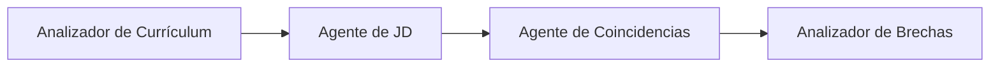
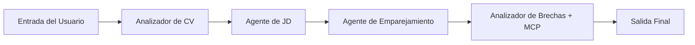

# Módulo 4 - Patrones de Orquestación

⏱️ ~10 min

En este módulo, exploras los patrones de orquestación utilizados en el Evaluador de Ajuste de Trabajo por Currículum y aprendes a leer, modificar y ampliar el grafo de flujo de trabajo. Entender estos patrones es esencial para depurar problemas de flujo de datos y construir tus propios [flujos de trabajo multiagente](https://learn.microsoft.com/agent-framework/workflows/).

---

## Patrón 1: Cadena secuencial

El patrón fundamental en el flujo de trabajo es una **cadena secuencial** - la salida de cada agente alimenta directamente al siguiente.


```mermaid
flowchart LR
    RP[Analizador de Currículum] --> JD[Agente de JD]
    JD --> MA[Agente de Coincidencias]
    MA --> GA[Analizador de Brechas]
```

En el código, cada llamada `add_edge()` crea un paso en la cadena:

```python
.add_edge(resume_executor, jd_executor)       # Salida de ResumeParser → JD Agent
.add_edge(jd_executor, matching_executor)     # Salida de JD Agent → MatchingAgent
.add_edge(matching_executor, gap_executor)    # Salida de MatchingAgent → GapAnalyzer
```

> **¿Por qué secuencial, no fan-out/fan-in?** `WorkflowBuilder` usa **semántica OR** para las conexiones entrantes: un ejecutor downstream se activa tan pronto como **cualquiera** de sus predecesores termina. Si `matching_executor` tuviera dos conexiones entrantes (tanto de `resume_executor` como de `jd_executor`), se activaría dos veces - una vez cuando ResumeParser termina y otra cuando JD Agent termina - provocando que GapAnalyzer también se ejecute dos veces y la salida apareciera duplicada. La canalización secuencial evita esto por completo.

## Patrón 2: Reenvío de contenido

Debido a que `context_mode="last_agent"` significa que cada ejecutor solo ve la salida de su **predecesor directo**, los agentes en una cadena secuencial deben pasar explícitamente cualquier dato que los agentes downstream necesiten.

En este flujo de trabajo:
- **ResumeParser** copia la JD literalmente en `[JOB DESCRIPTION PASS-THROUGH]` (para que JD Agent pueda encontrarla).
- **JD Agent** copia el `[PARSED RESUME]` literalmente en `[PARSED RESUME PASS-THROUGH]` (para que MatchingAgent pueda comparar ambos perfiles).

```
ResumeParser output
└─ [PARSED RESUME]               ← extracted by JD Agent
└─ [JOB DESCRIPTION PASS-THROUGH] ← extracted by JD Agent

JD Agent output
└─ [JD REQUIREMENTS]             ← extracted by MatchingAgent
└─ [PARSED RESUME PASS-THROUGH]  ← extracted by MatchingAgent
```

Cada sección de reenvío debe copiarse **literalmente** - resumirla o parafrasearla rompe el agente downstream que depende de ella.

---

## El grafo completo

La combinación del patrón de cadena secuencial y de reenvío de contenido produce el flujo de trabajo completo:


```mermaid
flowchart LR
    U[Entrada del Usuario] --> RP[Analizador de CV]
    RP --> JD[Agente de JD]
    JD --> MA[Agente de Emparejamiento]
    MA --> GA[Analizador de Brechas + MCP]
    GA --> O[Salida Final]
```

El Inspector de Agentes muestra esta misma estructura de grafo cuando el agente se ejecuta localmente. Consulta [Módulo 5 - Prueba local](05-test-locally.md) para capturas de pantalla.

---

## Leyendo el código de WorkflowBuilder

La función completa `create_workflow()` está en [`PersonalCareerCopilot/main.py`](../../../../../workshop/lab02-multi-agent/PersonalCareerCopilot/main.py). Las tres llamadas `add_edge()` construyen la canalización secuencial:

| # | Arista | Efecto |
|---|--------|--------|
| 1 | `resume_executor → jd_executor` | JD Agent recibe `[PARSED RESUME]` + `[JOB DESCRIPTION PASS-THROUGH]` |
| 2 | `jd_executor → matching_executor` | MatchingAgent recibe `[JD REQUIREMENTS]` + `[PARSED RESUME PASS-THROUGH]` |
| 3 | `matching_executor → gap_executor` | GapAnalyzer recibe reporte de ajuste + lista de brechas |

---

## Modificando el grafo

### Añadiendo un nuevo agente

Para añadir un quinto agente (por ejemplo, un **InterviewPrepAgent** después de GapAnalyzer):

1. Define una constante `INTERVIEW_PREP_INSTRUCTIONS`.
2. Crea objetos `Agent` + `AgentExecutor` (mismo patrón que los cuatro existentes).
3. Añade `.add_edge(gap_executor, interview_exec)` en `WorkflowBuilder`.
4. Actualiza `output_executors=[interview_exec]`.

> **Importante:** `start_executor` es el único agente que recibe la entrada bruta del usuario. Todos los demás agentes reciben salida de su conexión upstream.

---

## Errores comunes en el grafo

| Error | Síntoma | Solución |
|-------|---------|----------|
| Arista faltante hacia `output_executors` | El agente se ejecuta pero la salida está vacía | Asegúrate de que hay un camino desde `start_executor` a cada agente en `output_executors` |
| Dependencia circular | Bucle infinito o timeout | Verifica que ningún agente retroalimente a un agente upstream |
| Agente en `output_executors` sin arista entrante | Salida vacía | Añade al menos un `add_edge(fuente, ese_agente)` |
| Múltiples `output_executors` sin fan-in | La salida contiene solo la respuesta de un agente | Usa un único agente de salida que agregue, o acepta múltiples salidas |
| Falta `start_executor` | `ValueError` en tiempo de compilación | Siempre especifica `start_executor` en `WorkflowBuilder()` |

---

## Depurando el grafo

### Usando Agent Inspector

1. Inicia el agente localmente con F5.
2. Abre Agent Inspector (`Ctrl+Shift+P` → **Foundry Toolkit: Open Agent Inspector**).
3. Envía un mensaje de prueba.
4. En el panel de respuestas del Inspector, busca la **salida en streaming** - muestra la contribución de cada agente en secuencia.


### Usando registros de logging

Añade logging a `main.py` para rastrear el flujo de datos:

```python
import logging
logger = logging.getLogger("resume-job-fit")

# En main(), después de construir el flujo de trabajo:
logger.info("Workflow graph built with edges: RP→JD, JD→MA, MA→GA")
```

Los registros del servidor muestran el orden de ejecución de agentes y llamadas a herramientas MCP:

```
INFO:agent_framework:Executing agent: ResumeParser
INFO:agent_framework:Executing agent: JobDescriptionAgent
INFO:agent_framework:Executing agent: MatchingAgent
INFO:agent_framework:Executing agent: GapAnalyzer
INFO:agent_framework:Tool call: search_microsoft_learn_for_plan(skill="Kubernetes")
POST https://learn.microsoft.com/api/mcp → 200
INFO:agent_framework:Tool call: search_microsoft_learn_for_plan(skill="Terraform")
POST https://learn.microsoft.com/api/mcp → 200
```

---

### Punto de control

- [ ] Puedes identificar los dos patrones de orquestación en el flujo de trabajo: cadena secuencial y reenvío de contenido
- [ ] Entiendes por qué `context_mode="last_agent"` requiere reenvío explícito de datos entre agentes
- [ ] Puedes leer el código `WorkflowBuilder` y mapear cada llamada `add_edge()` al grafo visual
- [ ] Sabes cómo añadir un nuevo agente al final de la canalización
- [ ] Puedes identificar errores comunes en el grafo y sus síntomas

---

**Anterior:** [03 - Configurar agentes y entorno](03-configure-agents.md) · **Siguiente:** [05 - Prueba local →](05-test-locally.md)

---

<!-- CO-OP TRANSLATOR DISCLAIMER START -->
**Descargo de responsabilidad**:
Este documento ha sido traducido utilizando el servicio de traducción automática [Co-op Translator](https://github.com/Azure/co-op-translator). Aunque nos esforzamos por la precisión, tenga en cuenta que las traducciones automatizadas pueden contener errores o inexactitudes. El documento original en su idioma nativo debe considerarse la fuente autorizada. Para información crítica, se recomienda una traducción profesional humana. No somos responsables de cualquier malentendido o interpretación errónea que surja del uso de esta traducción.
<!-- CO-OP TRANSLATOR DISCLAIMER END -->