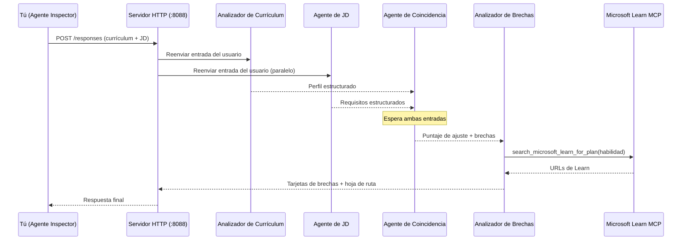
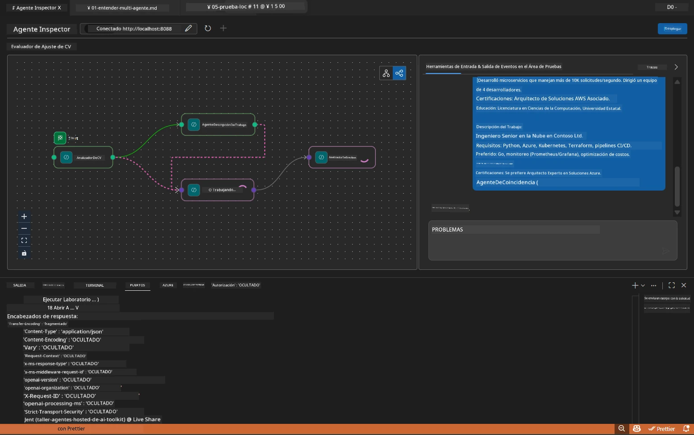

# Módulo 5 - Prueba Local (Multi-Agente)

En este módulo, ejecutas el flujo de trabajo multi-agente localmente, lo pruebas con Agent Inspector y verificas que los cuatro agentes y la herramienta MCP funcionen correctamente antes de desplegar en Foundry.

### Qué sucede durante una prueba local


---

## Paso 1: Iniciar el servidor del agente

### Opción A: Usando la tarea de VS Code (recomendado)

1. Presiona `Ctrl+Shift+P` → escribe **Tasks: Run Task** → selecciona **Run Lab02 HTTP Server**.
2. La tarea inicia el servidor con debugpy adjunto en el puerto `5679` y el agente en el puerto `8088`.
3. Espera a que la salida muestre:

```
INFO:resume-job-fit:Starting Resume -> Job Fit Evaluator HTTP server...
INFO:resume-job-fit:Server running on http://localhost:8088
```

### Opción B: Usando la terminal manualmente

```powershell
cd workshop\lab02-multi-agent\PersonalCareerCopilot
```

Activa el entorno virtual:

**PowerShell (Windows):**
```powershell
.\.venv\Scripts\Activate.ps1
```

**macOS/Linux:**
```bash
source .venv/bin/activate
```

Inicia el servidor:

```powershell
python -m debugpy --listen 127.0.0.1:5679 -m agentdev run main.py --verbose --port 8088
```

### Opción C: Usando F5 (modo depuración)

1. Presiona `F5` o ve a **Run and Debug** (`Ctrl+Shift+D`).
2. Selecciona la configuración de lanzamiento **Lab02 - Multi-Agent** del menú desplegable.
3. El servidor inicia con soporte completo para puntos de interrupción.

> **Consejo:** El modo depuración te permite establecer puntos de interrupción dentro de `search_microsoft_learn_for_plan()` para inspeccionar las respuestas de MCP, o dentro de las cadenas de instrucciones de los agentes para ver qué recibe cada agente.

---

## Paso 2: Abrir Agent Inspector

1. Presiona `Ctrl+Shift+P` → escribe **Foundry Toolkit: Open Agent Inspector**.
2. Agent Inspector se abre en una pestaña del navegador en `http://localhost:5679`.
3. Deberías ver la interfaz del agente lista para aceptar mensajes.

> **Si Agent Inspector no se abre:** Asegúrate de que el servidor esté totalmente iniciado (ves el registro "Server running"). Si el puerto 5679 está ocupado, consulta [Módulo 8 - Solución de problemas](08-troubleshooting.md).

---

## Paso 3: Ejecutar pruebas básicas

Ejecuta estas tres pruebas en orden. Cada una prueba progresivamente más partes del flujo de trabajo.

### Prueba 1: Currículum básico + descripción del trabajo

Pega lo siguiente en Agent Inspector:

```
Resume:
Jane Doe
Senior Software Engineer with 5 years of experience in Python, Django, and AWS.
Built microservices handling 10K+ requests/second. Led a team of 4 developers.
Certifications: AWS Solutions Architect Associate.
Education: B.S. Computer Science, State University.

Job Description:
Senior Cloud Engineer at Contoso Ltd.
Required: Python, Azure, Kubernetes, Terraform, CI/CD pipelines.
Preferred: Go, monitoring (Prometheus/Grafana), cost optimization.
Experience: 5+ years in cloud infrastructure.
Certifications: Azure Solutions Architect Expert preferred.
```

**Estructura esperada de la respuesta:**

La respuesta debe contener la salida de los cuatro agentes en secuencia:

1. **Salida del Analizador de Currículum** - Perfil estructurado del candidato con habilidades agrupadas por categoría
2. **Salida del Agente de JD** - Requisitos estructurados con habilidades requeridas vs. preferidas separadas
3. **Salida del Agente de Matching** - Puntaje de ajuste (0-100) con desglose, habilidades coincidentes, habilidades faltantes, brechas
4. **Salida del Analizador de Brechas** - Tarjetas individuales de brechas para cada habilidad faltante, cada una con URLs de Microsoft Learn



### Qué verificar en la Prueba 1

| Verificación | Esperado | ¿Pasa? |
|--------------|----------|--------|
| La respuesta contiene un puntaje de ajuste | Número entre 0-100 con desglose | |
| Se listan habilidades coincidentes | Python, CI/CD (parcial), etc. | |
| Se listan habilidades faltantes | Azure, Kubernetes, Terraform, etc. | |
| Existen tarjetas de brechas por cada habilidad faltante | Una tarjeta por habilidad | |
| URLs de Microsoft Learn están presentes | Enlaces reales de `learn.microsoft.com` | |
| No hay mensajes de error en la respuesta | Salida estructurada limpia | |

### Prueba 2: Verificar ejecución de la herramienta MCP

Mientras se ejecuta la Prueba 1, revisa el **terminal del servidor** para entradas de registro MCP:

```
GET https://learn.microsoft.com/api/mcp → 405 (Method Not Allowed)
POST https://learn.microsoft.com/api/mcp → 200
DELETE https://learn.microsoft.com/api/mcp → 405 (Method Not Allowed)
```

| Entrada de registro | Significado | ¿Esperado? |
|---------------------|-------------|------------|
| `GET ... → 405` | Cliente MCP realiza sondeo con GET durante inicialización | Sí - normal |
| `POST ... → 200` | Llamada real a la herramienta al servidor MCP de Microsoft Learn | Sí - esta es la llamada real |
| `DELETE ... → 405` | Cliente MCP realiza sondeo con DELETE durante limpieza | Sí - normal |
| `POST ... → 4xx/5xx` | La llamada a la herramienta falló | No - ver [Solución de problemas](08-troubleshooting.md) |

> **Punto clave:** Las líneas `GET 405` y `DELETE 405` son **comportamiento esperado**. Solo preocúpate si las llamadas `POST` retornan códigos diferentes a 200.

### Prueba 3: Caso límite - candidato con alto puntaje

Pega un currículum que coincida estrechamente con la JD para verificar que el GapAnalyzer maneja escenarios de alto puntaje:

```
Resume:
Alex Chen
Senior Cloud Engineer with 7 years of experience.
Skills: Python, Azure (AKS, Functions, DevOps), Kubernetes, Terraform, CI/CD (GitHub Actions, Azure Pipelines), Go, Prometheus, Grafana, cost optimization.
Certifications: Azure Solutions Architect Expert, Azure DevOps Engineer Expert.
Led infrastructure migration to Azure for 3 enterprise clients.
Education: M.S. Computer Science, Tech University.

Job Description:
Senior Cloud Engineer at Contoso Ltd.
Required: Python, Azure, Kubernetes, Terraform, CI/CD pipelines.
Preferred: Go, monitoring (Prometheus/Grafana), cost optimization.
Experience: 5+ years in cloud infrastructure.
Certifications: Azure Solutions Architect Expert preferred.
```

**Comportamiento esperado:**
- El puntaje de ajuste debe ser **80 o más** (la mayoría de las habilidades coinciden)
- Las tarjetas de brechas deben enfocarse en la preparación para la entrevista o pulido más que en aprendizaje básico
- Las instrucciones del GapAnalyzer dicen: "Si el puntaje >= 80, enfócate en preparación/pulido para entrevista"

---

## Paso 4: Verificar completitud de la salida

Después de ejecutar las pruebas, verifica que la salida cumpla estos criterios:

### Lista de verificación de estructura de salida

| Sección | Agente | ¿Presente? |
|---------|--------|------------|
| Perfil del candidato | Resume Parser | |
| Habilidades técnicas (agrupadas) | Resume Parser | |
| Resumen del rol | JD Agent | |
| Habilidades requeridas vs. preferidas | JD Agent | |
| Puntaje de ajuste con desglose | Matching Agent | |
| Habilidades coincidentes / faltantes / parciales | Matching Agent | |
| Tarjeta de brechas por habilidad faltante | Gap Analyzer | |
| URLs de Microsoft Learn en tarjetas de brechas | Gap Analyzer (MCP) | |
| Orden de aprendizaje (numerado) | Gap Analyzer | |
| Resumen de la línea de tiempo | Gap Analyzer | |

### Problemas comunes en esta etapa

| Problema | Causa | Solución |
|----------|--------|----------|
| Solo 1 tarjeta de brecha (el resto truncado) | Instrucciones del GapAnalyzer faltan bloque CRÍTICO | Añade el párrafo `CRITICAL:` a las `GAP_ANALYZER_INSTRUCTIONS` - ver [Módulo 3](03-configure-agents.md) |
| No hay URLs de Microsoft Learn | Punto de acceso MCP inaccesible | Verifica conexión a internet. Confirma que `MICROSOFT_LEARN_MCP_ENDPOINT` en `.env` es `https://learn.microsoft.com/api/mcp` |
| Respuesta vacía | `PROJECT_ENDPOINT` o `MODEL_DEPLOYMENT_NAME` no configurados | Verifica valores en archivo `.env`. Ejecuta `echo $env:PROJECT_ENDPOINT` en terminal |
| Puntaje de ajuste es 0 o falta | MatchingAgent no recibió datos previos | Revisa que existan `add_edge(resume_parser, matching_agent)` y `add_edge(jd_agent, matching_agent)` en `create_workflow()` |
| El agente arranca pero sale inmediatamente | Error de importación o falta de dependencia | Ejecuta `pip install -r requirements.txt` de nuevo. Revisa terminal para rastros de error |
| Error `validate_configuration` | Variables de entorno faltantes | Crea `.env` con `PROJECT_ENDPOINT=<tu-endpoint>` y `MODEL_DEPLOYMENT_NAME=<tu-modelo>` |

---

## Paso 5: Prueba con tus propios datos (opcional)

Prueba a pegar tu propio currículum y una descripción real de trabajo. Esto ayuda a verificar:

- Que los agentes manejen diferentes formatos de currículum (cronológico, funcional, híbrido)
- Que el Agente de JD maneje diferentes estilos de JD (viñetas, párrafos, estructurado)
- Que la herramienta MCP devuelva recursos relevantes para habilidades reales
- Que las tarjetas de brechas se personalicen según tu experiencia específica

> **Nota de privacidad:** Al probar localmente, tus datos permanecen en tu máquina y solo se envían a tu implementación de Azure OpenAI. No se registran ni almacenan por la infraestructura del taller. Usa nombres ficticios si prefieres (ej., "Jane Doe" en lugar de tu nombre real).

---

### Punto de control

- [ ] Servidor iniciado exitosamente en el puerto `8088` (el registro muestra "Server running")
- [ ] Agent Inspector abierto y conectado al agente
- [ ] Prueba 1: Respuesta completa con puntaje de ajuste, habilidades coincidentes/faltantes, tarjetas de brechas y URLs de Microsoft Learn
- [ ] Prueba 2: Registros MCP muestran `POST ... → 200` (llamadas a herramienta exitosas)
- [ ] Prueba 3: Candidato con alto puntaje obtiene 80+ con recomendaciones enfocadas en pulido
- [ ] Todas las tarjetas de brechas están presentes (una por habilidad faltante, sin truncamiento)
- [ ] No hay errores ni rastros de fallo en el terminal del servidor

---

**Anterior:** [04 - Patrones de orquestación](04-orchestration-patterns.md) · **Siguiente:** [06 - Desplegar en Foundry →](06-deploy-to-foundry.md)

---

<!-- CO-OP TRANSLATOR DISCLAIMER START -->
**Descargo de responsabilidad**:  
Este documento ha sido traducido utilizando el servicio de traducción automática [Co-op Translator](https://github.com/Azure/co-op-translator). Aunque nos esforzamos por la precisión, tenga en cuenta que las traducciones automatizadas pueden contener errores o inexactitudes. El documento original en su idioma nativo debe considerarse la fuente autorizada. Para información crítica, se recomienda una traducción profesional realizada por humanos. No nos hacemos responsables de malentendidos o interpretaciones erróneas que surjan del uso de esta traducción.
<!-- CO-OP TRANSLATOR DISCLAIMER END -->