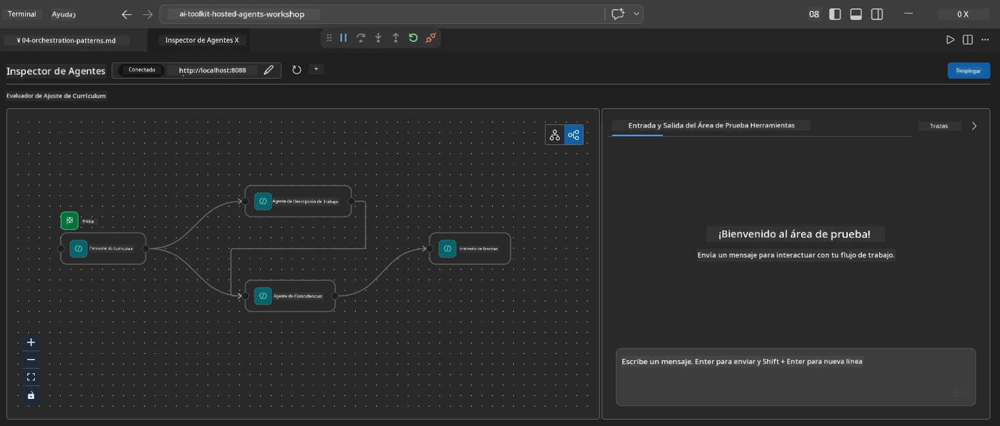
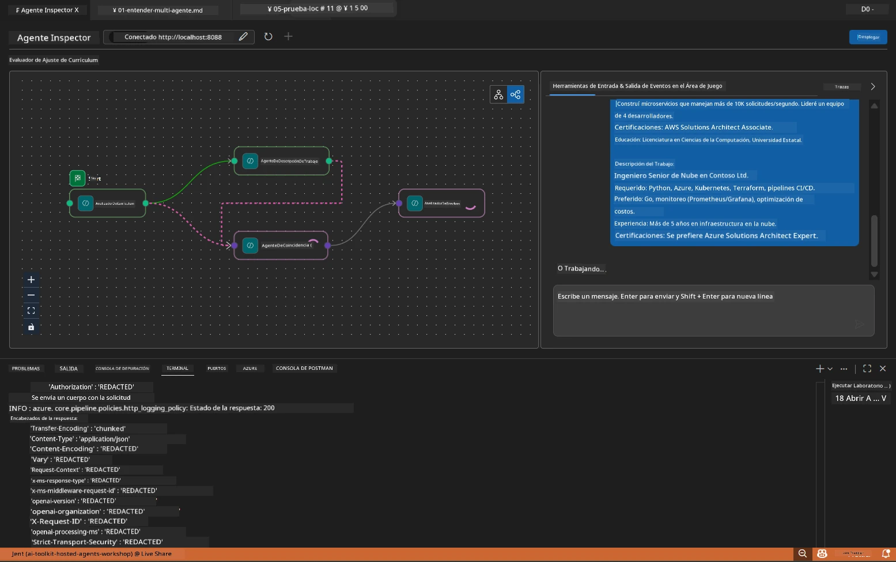
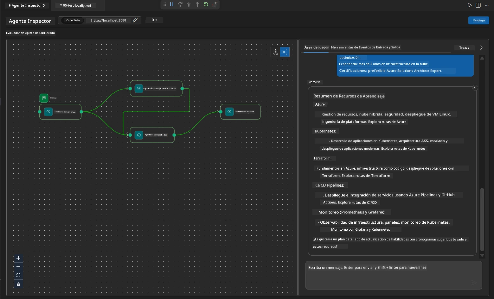

# Módulo 5 - Prueba Localmente

⏱️ ~15 min

En este módulo, ejecutas el flujo de trabajo multi-agente localmente, lo pruebas con Agent Inspector y verificas que los cuatro agentes y la herramienta MCP funcionen correctamente antes de desplegar.

---

## Paso 1: Iniciar el servidor de agentes

### Opción A: Usar la tarea de VS Code (recomendado)

1. Abre `workshop/lab02-multi-agent/PersonalCareerCopilot/` como tu carpeta en VS Code.
2. Presiona `Ctrl+Shift+P` → escribe **Tasks: Run Task** → selecciona **Run Agent HTTP Server**.
3. La tarea inicia el servidor con debugpy adjunto en el puerto `5679` y el agente en el puerto `8088`.
4. Espera a que la salida muestre:

```
INFO:resume-job-fit:Starting Resume -> Job Fit Evaluator HTTP server...
INFO:resume-job-fit:Server running on http://localhost:8088
```

### Opción B: Usar F5 (modo depuración)

1. Presiona `F5` → selecciona **Debug Local Agent HTTP Server**.
2. El servidor inicia con soporte completo para puntos de interrupción, útil para inspeccionar respuestas del MCP o salidas del agente.

---

## Paso 2: Abrir Agent Inspector

1. Presiona `Ctrl+Shift+P` → escribe **Foundry Toolkit: Open Agent Inspector**.
2. Agent Inspector se abre como un panel de VS Code conectado a `http://localhost:8088`.
3. Deberías ver la interfaz del agente lista para aceptar mensajes.



> **Si Agent Inspector no se abre:** Asegúrate de que el servidor esté completamente iniciado (ves el registro "Server running"). Si el puerto 5679 está ocupado, consulta [Módulo 8 - Solución de problemas](08-troubleshooting.md).

---

## Paso 2b: (Opcional) Abrir el Visualizador de Flujo de Trabajo

El Foundry Toolkit incluye un **Visualizador de Flujo de Trabajo** en tiempo real que muestra cómo interactúan los agentes mientras se ejecuta el grafo. Esto es especialmente útil para depurar multi-agentes.

1. Presiona `Ctrl+Shift+P` → escribe **Foundry Toolkit: Open Visualizer for Hosted Agents**.
2. Se abre una nueva pestaña en VS Code mostrando el grafo de ejecución en vivo.
3. Mientras envías mensajes en Agent Inspector, el visualizador se actualiza automáticamente - los nodos verdes indican agentes completados, y las aristas animadas muestran datos fluyendo entre ellos.

> **Conflicto de puertos:** Si el puerto del visualizador ya está en uso, cámbialo en Configuración de VS Code → **Extensiones** → **Microsoft Foundry Configuration** → **Hosted Agents: Visualizer Port**.

---

## Paso 3: Ejecutar pruebas básicas

Ejecuta estas tres pruebas en orden. Cada una prueba progresivamente más del flujo.

### Prueba 1: Currículum básico + descripción de trabajo

Pega lo siguiente en Agent Inspector:

```
Resume:
Jane Doe
Senior Software Engineer with 5 years of experience in Python, Django, and AWS.
Built microservices handling 10K+ requests/second. Led a team of 4 developers.
Certifications: AWS Solutions Architect Associate.
Education: B.S. Computer Science, State University.

Job Description:
Senior Cloud Engineer at Contoso Ltd.
Required: Python, Azure, Kubernetes, Terraform, CI/CD pipelines.
Preferred: Go, monitoring (Prometheus/Grafana), cost optimization.
Experience: 5+ years in cloud infrastructure.
Certifications: Azure Solutions Architect Expert preferred.
```

**Estructura de salida esperada:**

La respuesta debe contener la salida de los cuatro agentes en secuencia:

1. **Salida del analizador de currículum** - Dos secciones etiquetadas: `[CURRÍCULUM PARSEADO]` (perfil del candidato con habilidades agrupadas) y `[REVISIÓN DESCRIPCIÓN DE TRABAJO]` (texto literal de JD que alimenta al Agente de JD)
2. **Salida del Agente de JD** - Requerimientos estructurados con habilidades requeridas vs. preferidas separadas
3. **Salida del Agente de Matching** - Puntaje de ajuste (0-100) con desglose, habilidades coincidentes, habilidades faltantes, brechas
4. **Salida del Analizador de Brechas** - Tarjetas individuales de brechas para cada habilidad faltante, cada una con URLs de Microsoft Learn





### Qué verificar en la Prueba 1

| Verificar | Esperado | ¿Pasa? |
|-------|----------|-------|
| La respuesta contiene un puntaje de ajuste | Número entre 0-100 con desglose | |
| Se listan las habilidades coincidentes | Python, CI/CD (parcial), etc. | |
| Se listan las habilidades faltantes | Azure, Kubernetes, Terraform, etc. | |
| Existen tarjetas de brecha para cada habilidad faltante | Una tarjeta por habilidad | |
| URLs de Microsoft Learn están presentes | Enlaces reales a `learn.microsoft.com` | |
| No hay mensajes de error en la respuesta | Salida estructurada limpia | |

### Prueba 2: Caso límite - candidato muy adecuado

Pega un currículum que coincida estrechamente con la JD para verificar que el GapAnalyzer maneje escenarios de alta adecuación:

```
Resume:
Alex Chen
Senior Cloud Engineer with 7 years of experience.
Skills: Python, Azure (AKS, Functions, DevOps), Kubernetes, Terraform, CI/CD (GitHub Actions, Azure Pipelines), Go, Prometheus, Grafana, cost optimization.
Certifications: Azure Solutions Architect Expert, Azure DevOps Engineer Expert.
Led infrastructure migration to Azure for 3 enterprise clients.
Education: M.S. Computer Science, Tech University.

Job Description:
Senior Cloud Engineer at Contoso Ltd.
Required: Python, Azure, Kubernetes, Terraform, CI/CD pipelines.
Preferred: Go, monitoring (Prometheus/Grafana), cost optimization.
Experience: 5+ years in cloud infrastructure.
Certifications: Azure Solutions Architect Expert preferred.
```

**Comportamiento esperado:**
- El puntaje de ajuste debe ser **80+** (la mayoría de habilidades coinciden)
- Las tarjetas de brecha deben enfocarse en pulir/preparación para entrevistas más que en aprendizaje fundamental
- Las instrucciones del GapAnalyzer dicen: "Si el ajuste >= 80, enfócate en pulir/preparación para entrevistas"

---

## Paso 4: Prueba con tus propios datos (opcional)

Intenta pegar tu propio currículum y una descripción de trabajo real. Esto ayuda a verificar:

- Los agentes manejan diferentes formatos de currículum (cronológico, funcional, híbrido)
- El Agente de JD maneja diferentes estilos de JD (puntos enumerados, párrafos, estructurado)
- La herramienta MCP devuelve recursos relevantes para habilidades reales
- Las tarjetas de brecha están personalizadas a tu experiencia específica

> **Privacidad - Ruta A (nube Foundry):** El texto del currículum y JD se envía a tu despliegue de Azure OpenAI para inferencia. No se registra ni almacena en la infraestructura del taller. Usa nombres ficticios (por ejemplo, "Jane Doe") si prefieres.
>
> **Privacidad - Ruta B (Foundry Local):** Las cuatro inferencias de agentes se ejecutan completamente en tu dispositivo. Tu currículum y descripción de trabajo **nunca salen de tu máquina**. La única llamada externa es la herramienta MCP para obtener recursos desde `https://learn.microsoft.com/api/mcp`; esa consulta contiene solo el nombre de la habilidad, no tus datos personales.

---

### Punto de control

- [ ] Servidor iniciado correctamente en el puerto `8088` (el registro muestra "Server running")
- [ ] Agent Inspector abierto y conectado al agente
- [ ] Prueba 1: Respuesta completa con puntaje de ajuste, habilidades coincidentes/faltantes, tarjetas de brechas y URLs de Microsoft Learn
- [ ] Prueba 2: Candidato muy adecuado obtiene puntaje 80+ con recomendaciones enfocadas en pulir
- [ ] Todas las tarjetas de brecha presentes (una por cada habilidad faltante, sin truncamiento)
- [ ] No hay errores ni rastros de pila en el terminal del servidor

---

**Anterior:** [04 - Patrones de orquestación](04-orchestration-patterns.md) · **Siguiente:** [06 - Desplegar en Foundry →](06-deploy-to-foundry.md)

---

<!-- CO-OP TRANSLATOR DISCLAIMER START -->
**Descargo de responsabilidad**:
Este documento ha sido traducido utilizando el servicio de traducción automática [Co-op Translator](https://github.com/Azure/co-op-translator). Aunque nos esforzamos por la precisión, tenga en cuenta que las traducciones automatizadas pueden contener errores o inexactitudes. El documento original en su idioma nativo debe considerarse la fuente autorizada. Para información crítica, se recomienda una traducción profesional humana. No somos responsables de cualquier malentendido o interpretación errónea que surja del uso de esta traducción.
<!-- CO-OP TRANSLATOR DISCLAIMER END -->