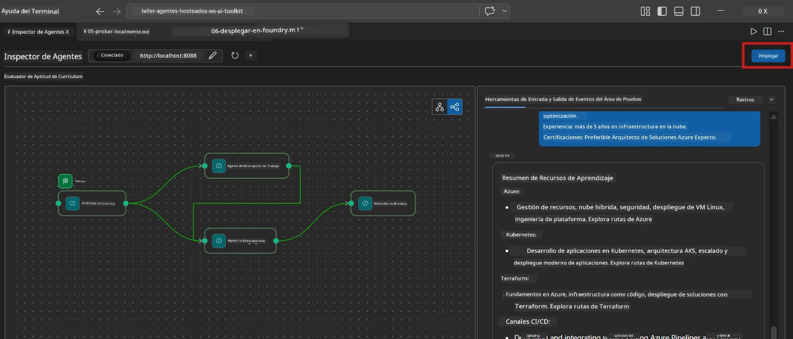
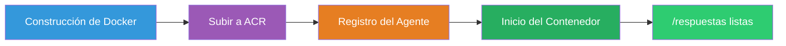
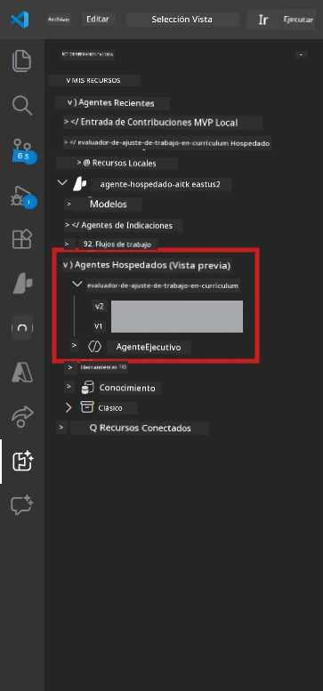

# Module 6 - Despliegue en Foundry Agent Service

En este módulo, despliegas tu flujo de trabajo multiagente probado localmente en [Microsoft Foundry](https://learn.microsoft.com/azure/foundry/agents/concepts/hosted-agents) como un **Agente Hospedado**. El proceso de despliegue construye una imagen de contenedor Docker, la envía a [Azure Container Registry (ACR)](https://learn.microsoft.com/azure/container-registry/container-registry-intro) y crea una versión de agente hospedado en [Foundry Agent Service](https://learn.microsoft.com/azure/foundry/agents/how-to/publish-agent).

> **Diferencia clave con el Laboratorio 01:** El proceso de despliegue es idéntico. Foundry trata tu flujo de trabajo multiagente como un único agente hospedado; la complejidad está dentro del contenedor, pero la superficie de despliegue es el mismo endpoint `/responses`.

---

## Verificación de requisitos previos

Antes de desplegar, verifica cada elemento a continuación:

1. **El agente pasa las pruebas locales básicas:**
   - Completaste las 3 pruebas en [Módulo 5](05-test-locally.md) y el flujo de trabajo produjo salida completa con tarjetas gap y URLs de Microsoft Learn.

2. **Tienes el rol [Azure AI User](https://learn.microsoft.com/azure/foundry/concepts/rbac-foundry):**
   - Asignado en [Laboratorio 01, Módulo 2](../../lab01-single-agent/docs/02-create-foundry-project.md). Verifica:
   - [Azure Portal](https://portal.azure.com) → recurso de tu proyecto **Foundry** → **Control de acceso (IAM)** → **Asignaciones de rol** → confirma que **[Azure AI User](https://aka.ms/foundry-ext-project-role)** está listado para tu cuenta.

3. **Has iniciado sesión en Azure en VS Code:**
   - Comprueba el ícono de Cuentas en la esquina inferior izquierda de VS Code. Deberías ver tu nombre de cuenta.

4. **`agent.yaml` tiene valores correctos:**
   - Abre `PersonalCareerCopilot/agent.yaml` y verifica:
     ```yaml
     environment_variables:
       - name: PROJECT_ENDPOINT
         value: ${PROJECT_ENDPOINT}
       - name: MODEL_DEPLOYMENT_NAME
         value: ${MODEL_DEPLOYMENT_NAME}
     ```
   - Estos deben coincidir con las variables de entorno que lee tu `main.py`.

5. **`requirements.txt` tiene versiones correctas:**
   ```
   agent-framework-azure-ai==1.0.0rc3
   agent-framework-core==1.0.0rc3
   azure-ai-agentserver-agentframework==1.0.0b16
   azure-ai-agentserver-core==1.0.0b16
   debugpy
   agent-dev-cli --pre
   ```

---

## Paso 1: Iniciar el despliegue

### Opción A: Desplegar desde el Agent Inspector (recomendado)

Si el agente está ejecutándose mediante F5 con el Agent Inspector abierto:

1. Observa la **esquina superior derecha** del panel Agent Inspector.
2. Haz clic en el botón **Deploy** (icono de nube con una flecha hacia arriba ↑).
3. Se abre el asistente de despliegue.



### Opción B: Desplegar desde la Paleta de Comandos

1. Presiona `Ctrl+Shift+P` para abrir la **Paleta de Comandos**.
2. Escribe: **Microsoft Foundry: Deploy Hosted Agent** y selecciónalo.
3. Se abre el asistente de despliegue.

---

## Paso 2: Configurar el despliegue

### 2.1 Seleccionar el proyecto objetivo

1. Un menú desplegable muestra tus proyectos Foundry.
2. Selecciona el proyecto que usaste durante el taller (por ejemplo, `workshop-agents`).

### 2.2 Seleccionar el archivo del agente contenedor

1. Te pedirán seleccionar el punto de entrada del agente.
2. Navega a `workshop/lab02-multi-agent/PersonalCareerCopilot/` y elige **`main.py`**.

### 2.3 Configurar recursos

| Configuración | Valor recomendado | Notas |
|---------|------------------|-------|
| **CPU** | `0.25` | Por defecto. Los flujos de trabajo multiagente no necesitan más CPU porque las llamadas al modelo son I/O-bounded |
| **Memoria** | `0.5Gi` | Por defecto. Aumenta a `1Gi` si agregas herramientas de procesamiento de datos pesadas |

---

## Paso 3: Confirmar y desplegar

1. El asistente muestra un resumen del despliegue.
2. Revisa y haz clic en **Confirm and Deploy**.
3. Observa el progreso en VS Code.

### Qué sucede durante el despliegue

Observa el panel **Output** de VS Code (selecciona el desplegable "Microsoft Foundry"):


1. **Construcción de Docker** - Construye el contenedor desde tu `Dockerfile`:
   ```
   Step 1/6 : FROM python:3.14-slim
   Step 2/6 : WORKDIR /app
   ...
   Successfully built abc123def456
   ```

2. **Docker push** - Envía la imagen a ACR (1-3 minutos en el primer despliegue).

3. **Registro del agente** - Foundry crea un agente hospedado usando metadatos de `agent.yaml`. El nombre del agente es `resume-job-fit-evaluator`.

4. **Inicio del contenedor** - El contenedor inicia en la infraestructura gestionada de Foundry con una identidad administrada por el sistema.

> **El primer despliegue es más lento** (Docker sube todas las capas). Los despliegues subsecuentes reutilizan capas en caché y son más rápidos.

### Notas específicas para multiagente

- **Los cuatro agentes están dentro de un solo contenedor.** Foundry ve un único agente hospedado. El grafo WorkflowBuilder se ejecuta internamente.
- **Las llamadas MCP van hacia fuera.** El contenedor necesita acceso a internet para alcanzar `https://learn.microsoft.com/api/mcp`. La infraestructura gestionada de Foundry lo proporciona por defecto.
- **[Identidad gestionada](https://learn.microsoft.com/python/api/overview/azure/identity-readme#managed-identity-support).** En el entorno hospedado, `get_credential()` en `main.py` devuelve `ManagedIdentityCredential()` (porque `MSI_ENDPOINT` está configurado). Esto es automático.

---

## Paso 4: Verificar el estado del despliegue

1. Abre la barra lateral **Microsoft Foundry** (haz clic en el ícono Foundry en la Barra de Actividades).
2. Expande **Hosted Agents (Preview)** bajo tu proyecto.
3. Busca **resume-job-fit-evaluator** (o el nombre de tu agente).
4. Haz clic en el nombre del agente → expande versiones (por ejemplo, `v1`).
5. Haz clic en la versión → revisa **Container Details** → **Status**:



| Estado | Significado |
|--------|-------------|
| **Started** / **Running** | Contenedor está en ejecución, agente está listo |
| **Pending** | Contenedor está iniciando (espera 30-60 segundos) |
| **Failed** | Contenedor falló al iniciar (revisa los logs - abajo) |

> **El arranque multiagente tarda más** que el de un solo agente porque el contenedor crea 4 instancias de agentes al inicio. Es normal un estado "Pending" hasta por 2 minutos.

---

## Errores comunes de despliegue y soluciones

### Error 1: Permiso denegado - `agents/write`

```
Error: lacks the required data action 
Microsoft.CognitiveServices/accounts/AIServices/agents/write
```

**Solución:** Asigna el rol **[Azure AI User](https://learn.microsoft.com/azure/foundry/concepts/rbac-foundry)** a nivel de **proyecto**. Consulta [Módulo 8 - Solución de problemas](08-troubleshooting.md) para instrucciones paso a paso.

### Error 2: Docker no está en ejecución

```
Error: Docker build failed / Cannot connect to Docker daemon
```

**Solución:**
1. Inicia Docker Desktop.
2. Espera a que diga "Docker Desktop is running".
3. Verifica: `docker info`
4. **Windows:** Asegúrate de que el backend WSL 2 esté habilitado en la configuración de Docker Desktop.
5. Intenta de nuevo.

### Error 3: pip install falla durante la construcción Docker

```
Error: Could not find a version that satisfies the requirement agent-dev-cli
```

**Solución:** La bandera `--pre` en `requirements.txt` se maneja diferente en Docker. Asegúrate de que tu `requirements.txt` tenga:
```
agent-dev-cli --pre
```

Si Docker sigue fallando, crea un `pip.conf` o pasa `--pre` vía argumento de build. Consulta [Módulo 8](08-troubleshooting.md).

### Error 4: La herramienta MCP falla en agente hospedado

Si el Gap Analyzer deja de producir URLs de Microsoft Learn después del despliegue:

**Causa raíz:** La política de red puede bloquear el HTTPS saliente desde el contenedor.

**Solución:**
1. Normalmente no afecta la configuración predeterminada de Foundry.
2. Si ocurre, verifica si la red virtual del proyecto Foundry tiene un NSG que bloquee salidas HTTPS.
3. La herramienta MCP tiene URLs de reserva integradas, así que el agente seguirá produciendo salida (sin URLs en vivo).

---

### Punto de control

- [ ] El comando de despliegue se completó sin errores en VS Code
- [ ] El agente aparece bajo **Hosted Agents (Preview)** en la barra lateral de Foundry
- [ ] El nombre del agente es `resume-job-fit-evaluator` (o el nombre que elegiste)
- [ ] El estado del contenedor muestra **Started** o **Running**
- [ ] (Si hubo errores) Identificaste el error, aplicaste la solución y redeplegaste exitosamente

---

**Anterior:** [05 - Test Locally](05-test-locally.md) · **Siguiente:** [07 - Verify in Playground →](07-verify-in-playground.md)

---

<!-- CO-OP TRANSLATOR DISCLAIMER START -->
**Descargo de responsabilidad**:  
Este documento ha sido traducido utilizando el servicio de traducción por IA [Co-op Translator](https://github.com/Azure/co-op-translator). Aunque nos esforzamos por la exactitud, tenga en cuenta que las traducciones automáticas pueden contener errores o inexactitudes. El documento original en su idioma nativo debe considerarse la fuente autorizada. Para información crítica, se recomienda una traducción profesional humana. No nos hacemos responsables de ningún malentendido o interpretación errónea derivada del uso de esta traducción.
<!-- CO-OP TRANSLATOR DISCLAIMER END -->