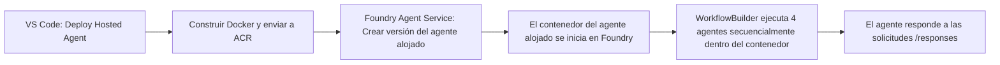
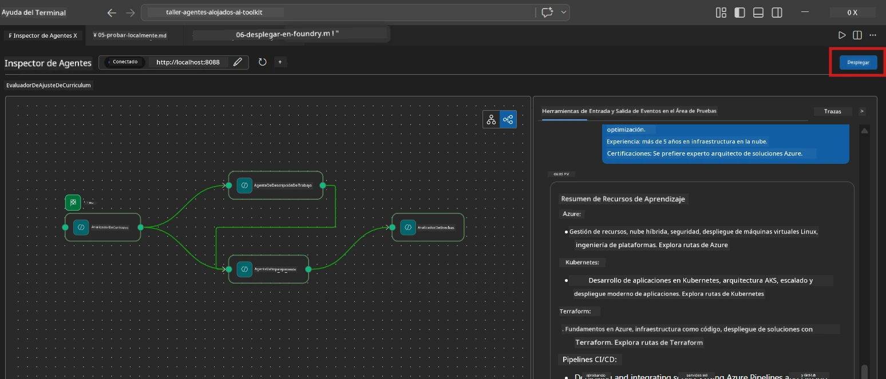
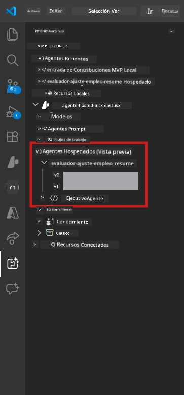

# Módulo 6 - Desplegar al Servicio Foundry Agent

⏱️ ~10 min

En este módulo, despliegas tu flujo de trabajo multi-agente probado localmente a [Microsoft Foundry](https://learn.microsoft.com/azure/foundry/agents/concepts/hosted-agents) como un **Agente Alojado**. El proceso de despliegue construye una imagen de contenedor Docker, la sube a [Azure Container Registry (ACR)](https://learn.microsoft.com/azure/container-registry/container-registry-intro), y crea una versión de agente alojado en [Foundry Agent Service](https://learn.microsoft.com/azure/foundry/agents/how-to/publish-agent).

> **Diferencia clave respecto al Laboratorio 01:** El proceso de despliegue es idéntico. Foundry trata tu flujo de trabajo multi-agente como un único agente alojado: la complejidad está dentro del contenedor, pero la superficie de despliegue es la misma en el endpoint `/responses`.

### Pipeline de despliegue


```mermaid
flowchart LR
    A[VS Code: Deploy Hosted Agent] --> B[Construir Docker y enviar a ACR]
    B --> C[Foundry Agent Service: Crear versión del agente alojado]
    C --> D[El contenedor del agente alojado se inicia en Foundry]
    D --> E[WorkflowBuilder ejecuta 4 agentes secuencialmente dentro del contenedor]
    E --> F[El agente responde a las solicitudes /responses]
```

---

## Verificación de prerrequisitos

Antes de desplegar, verifica cada punto a continuación:

1. **El agente pasa las pruebas iniciales locales:**
   - Completaste las 3 pruebas en [Módulo 5](05-test-locally.md) y el flujo de trabajo produjo salida completa con tarjetas de brechas y URLs de Microsoft Learn.

2. **Tienes el rol [Foundry User](https://learn.microsoft.com/azure/foundry/concepts/rbac-foundry)** (para desplegar, necesitas como mínimo **Foundry Project Manager** a nivel proyecto):

   > **Nota:** Los roles RBAC de Foundry fueron renombrados recientemente - **Foundry User**, **Foundry Owner** y **Foundry Project Manager** antes se llamaban Azure AI User, Azure AI Owner y Azure AI Project Manager. Los IDs y permisos de rol se mantienen igual.

   - Verifica en el [Portal de Azure](https://portal.azure.com) → recurso de tu **proyecto** de Foundry → **Control de acceso (IAM)** → **Asignaciones de rol** → confirma que **Foundry User** (o superior) está listado para tu cuenta.

3. **Estás conectado a Azure en VS Code:**
   - Revisa el ícono de Cuentas en la esquina inferior izquierda de VS Code. Deberías ver el nombre de tu cuenta.

4. **`agent.yaml` tiene valores correctos:**
   - Abre `PersonalCareerCopilot/agent.yaml` y verifica:
     ```yaml
     environment_variables:
       - name: AZURE_AI_MODEL_DEPLOYMENT_NAME
         value: ${AZURE_AI_MODEL_DEPLOYMENT_NAME}
     ```
   - `FOUNDRY_PROJECT_ENDPOINT` **no** se lista aquí - Foundry lo inyecta en tiempo de ejecución. Solo es necesario declarar `AZURE_AI_MODEL_DEPLOYMENT_NAME`.

5. **`requirements.txt` tiene versiones correctas:**
   ```
   agent-framework-foundry
   agent-framework-foundry-hosting
   mcp<2,>=1.24.0
   debugpy
   ```

---

## Paso 1: Iniciar el despliegue

### Opción A: Desplegar desde el Inspector de Agente (recomendado)

Si el agente está corriendo con F5 y el Inspector de Agente está abierto:

1. Mira en la **esquina superior derecha** del panel del Inspector de Agente.
2. Haz clic en el botón **Desplegar** (ícono de nube con una flecha hacia arriba ↑).
3. Se abre el asistente de despliegue.



### Opción B: Desplegar desde la Paleta de Comandos

1. Presiona `Ctrl+Shift+P` para abrir la **Paleta de Comandos**.
2. Escribe: **Foundry Toolkit: Deploy Hosted Agent** y selecciónalo.
3. Se abre el asistente de despliegue.

---

## Paso 2: Configurar el despliegue

### 2.1 Selecciona el proyecto destino

1. Se muestra un menú desplegable con tus proyectos de Foundry.
2. Selecciona el proyecto que usaste durante todo el taller (por ejemplo, `workshop-agents`).

### 2.2 Selecciona el archivo del agente contenedor

1. Te pedirán seleccionar el punto de entrada del agente.
2. Navega a `workshop/lab02-multi-agent/PersonalCareerCopilot/` y elige **`main.py`**.

### 2.3 Configura recursos

| Configuración | Valor recomendado | Notas |
|-------------|------------------|-------|
| **Método de despliegue** | **Contenedor** (recomendado) o **Código** | Contenedor construye una imagen Docker; Código sube el código fuente como un ZIP (vista previa) |
| **Registro de contenedores** | **ACR predeterminado** | Foundry crea y administra uno para ti |
| **CPU** | `0.25` | Valor por defecto. Los flujos multi-agente no necesitan más CPU porque las llamadas al modelo son I/O-bound |
| **Memoria** | `0.5Gi` | Valor por defecto. Aumenta a `1Gi` si añades herramientas de procesamiento de datos pesadas |

---

## Paso 3: Confirmar y desplegar

1. El asistente muestra un resumen del despliegue.
2. Revisa y haz clic en **Confirmar y Desplegar**.
3. Observa el progreso en VS Code.

### Qué sucede durante el despliegue

Observa el panel **Output** de VS Code (selecciona el desplegable "Microsoft Foundry"):

1. **Construcción de Docker** - Construye el contenedor desde tu `Dockerfile`
   ```
   Step 1/6 : FROM python:3.12-slim
   Step 2/6 : WORKDIR /app
   ...
   Successfully built abc123def456
   ```

2. **Push de Docker** - Empuja la imagen a ACR (1-3 minutos en el primer despliegue).

3. **Registro del agente** - Foundry crea un agente alojado usando la metadata de `agent.yaml`. El nombre del agente es `resume-job-fit-evaluator`.

4. **Inicio del contenedor** - El contenedor inicia en la infraestructura gestionada de Foundry con una identidad administrada por el sistema.

> **El primer despliegue es más lento** (Docker sube todas las capas). Despliegues subsiguientes reutilizan capas cacheadas y son más rápidos.

### Notas específicas para multi-agentes

- **Los cuatro agentes están dentro de un solo contenedor.** Foundry ve un único agente alojado. El grafo WorkflowBuilder corre internamente.
- **Las llamadas MCP son salientes.** El contenedor necesita acceso a internet para alcanzar `https://learn.microsoft.com/api/mcp`. La infraestructura gestionada de Foundry lo proporciona por defecto.
- **[Identidad Administrada](https://learn.microsoft.com/azure/foundry/agents/concepts/agent-identity).** Foundry crea automáticamente una **identidad Entra dedicada por agente** para cada agente alojado en tiempo de despliegue. En el entorno alojado, `DefaultAzureCredential` resuelve a esta identidad automáticamente - no se necesita configuración manual de identidad administrada.

---

## Paso 4: Verificar estado del despliegue

1. Abre la barra lateral **Microsoft Foundry** (haz clic en el ícono de Foundry en la Barra de Actividad).
2. Expande **Hosted Agents (Preview)** bajo tu proyecto.
3. Encuentra **resume-job-fit-evaluator** (o el nombre de tu agente).
4. Haz clic en el nombre del agente → expande versiones (ej., `v1`).
5. Haz clic en la versión → revisa **Detalles del contenedor** → **Estado**:



| Estado | Significado |
|--------|------------|
| **active** | El agente está ejecutándose y listo para aceptar solicitudes |
| **creating** | El contenedor está iniciando (espera 30–60 segundos) |
| **failed** | El contenedor no pudo iniciarse (revisa los logs - ver más abajo) |

> **Nota:** La barra lateral de VS Code puede mostrar etiquetas como "Running" o "Started" mientras que el estado interno de la API usa `active`/`creating`. Cualquiera indica el mismo estado.

> **El inicio multi-agente toma más tiempo** que un agente único porque el contenedor crea 4 instancias de agente al iniciar. `creating` por hasta 2 minutos es normal.

---

## Errores comunes en el despliegue y soluciones

### Error 1: Permiso denegado - `agents/write`

```
Error: lacks the required data action 
Microsoft.CognitiveServices/accounts/AIServices/agents/write
```

**Solución:** Asigna el rol **[Foundry User](https://learn.microsoft.com/azure/foundry/concepts/rbac-foundry)** (antes **Azure AI User**) a nivel de **proyecto**. Consulta [Módulo 8 - Solución de problemas](08-troubleshooting.md) para instrucciones paso a paso.

### Error 2: Docker no está corriendo

```
Error: Docker build failed / Cannot connect to Docker daemon
```

**Solución:**
1. Inicia Docker Desktop.
2. Espera a que diga "Docker Desktop is running".
3. Verifica: `docker info`
4. **Windows:** Asegúrate que el backend WSL 2 esté habilitado en configuraciones de Docker Desktop.
5. Reintenta.

### Error 3: pip install falla durante la construcción de Docker

```
Error: Could not find a version that satisfies the requirement agent-framework-foundry
```

**Solución:** Verifica que `requirements.txt` coincida con:
```
agent-framework-foundry
agent-framework-foundry-hosting
mcp<2,>=1.24.0
debugpy
```

Si la construcción sigue fallando, tu red Docker puede estar bloqueando PyPI. Revisa `docker info` para configuración de proxy.

### Error 4: La herramienta MCP falla en agente alojado

Si el Analizador de Brechas deja de producir URLs de Microsoft Learn después del despliegue:

**Causa raíz:** La política de red puede estar bloqueando HTTPS saliente desde el contenedor.

**Solución:**
1. Esto usualmente no es un problema con la configuración predeterminada de Foundry.
2. Si ocurre, verifica si la red virtual del proyecto Foundry tiene un NSG que bloquee HTTPS saliente.
3. La herramienta MCP tiene URLs de respaldo integradas, así que el agente todavía producirá salida (pero sin URLs en vivo).

---

### Punto de control

- [ ] El comando de despliegue se completó sin errores en VS Code
- [ ] El agente aparece bajo **Hosted Agents (Preview)** en la barra lateral de Foundry
- [ ] El nombre del agente es `resume-job-fit-evaluator` (o el nombre que elegiste)
- [ ] El estado del contenedor muestra **Started** o **Running**
- [ ] (Si hubo errores) Identificaste el error, aplicaste la solución, y desplegaste exitosamente

---

**Anterior:** [05 - Testear localmente](05-test-locally.md) · **Siguiente:** [07 - Verificar en Playground →](07-verify-in-playground.md)

---

<!-- CO-OP TRANSLATOR DISCLAIMER START -->
**Descargo de responsabilidad**:
Este documento ha sido traducido utilizando el servicio de traducción automática [Co-op Translator](https://github.com/Azure/co-op-translator). Aunque nos esforzamos por la precisión, tenga en cuenta que las traducciones automatizadas pueden contener errores o inexactitudes. El documento original en su idioma nativo debe considerarse la fuente autorizada. Para información crítica, se recomienda una traducción profesional humana. No somos responsables de cualquier malentendido o interpretación errónea que surja del uso de esta traducción.
<!-- CO-OP TRANSLATOR DISCLAIMER END -->