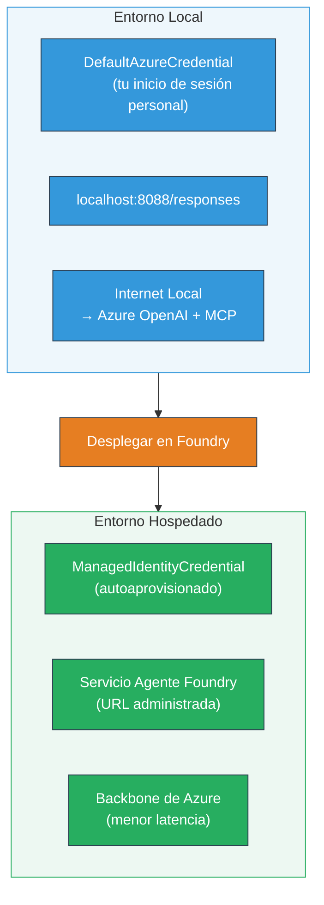

# Módulo 7 - Verificación en Playground

En este módulo, probarás tu flujo de trabajo multi-agente desplegado tanto en **VS Code** como en el **[Foundry Portal](https://ai.azure.com)**, confirmando que el agente se comporta de manera idéntica a las pruebas locales.

---

## ¿Por qué verificar después del despliegue?

Tu flujo de trabajo multi-agente funcionó perfectamente de forma local, entonces ¿por qué probarlo de nuevo? El entorno hospedado difiere en varios aspectos:


| Diferencia | Local | Hospedado |
|-----------|-------|--------|
| **Identidad** | [`DefaultAzureCredential`](https://learn.microsoft.com/azure/developer/python/sdk/authentication/credential-chains#defaultazurecredential-overview) (tu inicio de sesión personal) | [`ManagedIdentityCredential`](https://learn.microsoft.com/python/api/overview/azure/identity-readme#managed-identity-support) (auto-provisionado) |
| **Punto de conexión** | `http://localhost:8088/responses` | Punto de conexión de [Foundry Agent Service](https://learn.microsoft.com/azure/foundry/agents/concepts/hosted-agents) (URL gestionada) |
| **Red** | Máquina local → Azure OpenAI + MCP saliente | Backbone de Azure (menor latencia entre servicios) |
| **Conectividad MCP** | Internet local → `learn.microsoft.com/api/mcp` | Contenedor saliente → `learn.microsoft.com/api/mcp` |

Si alguna variable de entorno está mal configurada, RBAC es diferente, o el MCP saliente está bloqueado, lo detectarás aquí.

---

## Opción A: Probar en VS Code Playground (recomendado primero)

La [extensión Foundry](https://marketplace.visualstudio.com/items?itemName=TeamsDevApp.vscode-ai-foundry) incluye un Playground integrado que te permite chatear con tu agente desplegado sin salir de VS Code.

### Paso 1: Navega a tu agente hospedado

1. Haz clic en el icono **Microsoft Foundry** en la **Barra de Actividades** de VS Code (barra lateral izquierda) para abrir el panel de Foundry.
2. Expande tu proyecto conectado (ejemplo: `workshop-agents`).
3. Expande **Hosted Agents (Preview)**.
4. Deberías ver el nombre de tu agente (ejemplo: `resume-job-fit-evaluator`).

### Paso 2: Selecciona una versión

1. Haz clic en el nombre del agente para expandir sus versiones.
2. Haz clic en la versión que desplegaste (ejemplo: `v1`).
3. Se abrirá un **panel de detalles** mostrando los Detalles del Contenedor.
4. Verifica que el estado sea **Started** o **Running**.

### Paso 3: Abre el Playground

1. En el panel de detalles, haz clic en el botón **Playground** (o clic derecho en la versión → **Open in Playground**).
2. Se abrirá una interfaz de chat en una pestaña de VS Code.

### Paso 4: Ejecuta tus pruebas básicas

Usa las mismas 3 pruebas del [Módulo 5](05-test-locally.md). Escribe cada mensaje en la caja de entrada del Playground y presiona **Enviar** (o **Enter**).

#### Prueba 1 - Currículum completo + JD (flujo estándar)

Pega el prompt completo del currículum + JD del Módulo 5, Prueba 1 (Jane Doe + Senior Cloud Engineer en Contoso Ltd).

**Esperado:**
- Puntuación de ajuste con desglose matemático (escala de 100 puntos)
- Sección de habilidades coincidentes
- Sección de habilidades faltantes
- **Una tarjeta de brecha por cada habilidad que falta** con URLs de Microsoft Learn
- Hoja de ruta de aprendizaje con línea de tiempo

#### Prueba 2 - Prueba rápida corta (entrada mínima)

```
RESUME: 3 years Python developer, knows Django and PostgreSQL, no cloud experience.

JOB: Cloud DevOps Engineer requiring AWS, Kubernetes, Terraform, CI/CD. 5 years needed.
```

**Esperado:**
- Puntuación de ajuste baja (< 40)
- Evaluación honesta con ruta de aprendizaje escalonada
- Varias tarjetas de brecha (AWS, Kubernetes, Terraform, CI/CD, brecha de experiencia)

#### Prueba 3 - Candidato con alta afinidad

```
RESUME:
10 years Azure Cloud Architect. AZ-305 certified. Expert in AKS, Terraform, Azure DevOps, 
Azure Functions, Helm, Prometheus, Grafana, Python, Go. Led platform team of 8.

JOB:
Senior Cloud Engineer. Required: AKS, Terraform, Azure DevOps, Python. Preferred: Helm, Go.
5+ years experience. AZ-305 preferred.
```

**Esperado:**
- Puntuación de ajuste alta (≥ 80)
- Enfoque en preparación para entrevistas y pulido
- Pocas o ninguna tarjeta de brecha
- Línea de tiempo corta centrada en la preparación

### Paso 5: Compara con los resultados locales

Abre tus notas o la pestaña del navegador del Módulo 5 donde guardaste respuestas locales. Para cada prueba:

- ¿La respuesta tiene la **misma estructura** (puntuación de ajuste, tarjetas de brecha, hoja de ruta)?
- ¿Sigue la **misma rúbrica de puntuación** (desglose en escala de 100 puntos)?
- ¿Las **URLs de Microsoft Learn** siguen presentes en las tarjetas de brecha?
- ¿Hay **una tarjeta de brecha por cada habilidad faltante** (no truncada)?

> **Diferencias menores en redacción son normales** - el modelo es no determinista. Enfócate en la estructura, consistencia de puntuación y uso de herramientas MCP.

---

## Opción B: Probar en el Foundry Portal

El [Foundry Portal](https://ai.azure.com) proporciona un playground basado en web útil para compartir con compañeros o interesados.

### Paso 1: Abre el Foundry Portal

1. Abre tu navegador y navega a [https://ai.azure.com](https://ai.azure.com).
2. Inicia sesión con la misma cuenta de Azure que has usado durante el taller.

### Paso 2: Navega a tu proyecto

1. En la página principal, busca **Proyectos recientes** en la barra lateral izquierda.
2. Haz clic en el nombre de tu proyecto (ejemplo: `workshop-agents`).
3. Si no lo ves, haz clic en **Todos los proyectos** y búscalo.

### Paso 3: Encuentra tu agente desplegado

1. En la navegación izquierda del proyecto, haz clic en **Build** → **Agents** (o busca la sección **Agents**).
2. Deberías ver una lista de agentes. Encuentra tu agente desplegado (ejemplo: `resume-job-fit-evaluator`).
3. Haz clic en el nombre del agente para abrir su página de detalles.

### Paso 4: Abre el Playground

1. En la página de detalles del agente, mira la barra de herramientas superior.
2. Haz clic en **Open in playground** (o **Try in playground**).
3. Se abrirá una interfaz de chat.

### Paso 5: Ejecuta las mismas pruebas básicas

Repite las 3 pruebas del apartado VS Code Playground anterior. Compara cada respuesta con los resultados locales (Módulo 5) y de VS Code Playground (Opción A arriba).

---

## Verificación específica para multi-agente

Más allá de la corrección básica, verifica estos comportamientos específicos multi-agente:

### Ejecución de la herramienta MCP

| Verificación | Cómo verificar | Condición de aprobación |
|--------------|----------------|-------------------------|
| Llamadas MCP exitosas | Las tarjetas de brecha contienen URLs `learn.microsoft.com` | URLs reales, no mensajes de fallback |
| Múltiples llamadas MCP | Cada brecha de alta/media prioridad tiene recursos | No sólo la primera tarjeta de brecha |
| Fallback MCP funciona | Si faltan URLs, verificar texto de fallback | El agente sigue generando tarjetas de brecha (con o sin URLs) |

### Coordinación del agente

| Verificación | Cómo verificar | Condición de aprobación |
|--------------|----------------|-------------------------|
| Los 4 agentes funcionan | La salida contiene puntuación de ajuste Y tarjetas de brecha | La puntuación viene de MatchingAgent, tarjetas de GapAnalyzer |
| Ejecución paralela | El tiempo de respuesta es razonable (< 2 min) | Si > 3 min, la ejecución paralela podría no funcionar |
| Integridad del flujo de datos | Las tarjetas de brecha hacen referencia a habilidades del informe de coincidencia | No hay habilidades inventadas que no estén en el JD |

---

## Rúbrica de validación

Usa esta rúbrica para evaluar el comportamiento hospedado de tu flujo multi-agente:

| # | Criterio | Condición de aprobación | ¿Pasó? |
|---|----------|-------------------------|--------|
| 1 | **Corrección funcional** | El agente responde a currículum + JD con puntuación y análisis de brechas | |
| 2 | **Consistencia en puntuación** | La puntuación se basa en escala de 100 puntos con desglose matemático | |
| 3 | **Completitud de tarjetas de brecha** | Una tarjeta por cada habilidad faltante (sin truncar ni combinar) | |
| 4 | **Integración de herramienta MCP** | Las tarjetas incluyen URLs reales de Microsoft Learn | |
| 5 | **Consistencia estructural** | La estructura de salida coincide entre ejecuciones local y hospedada | |
| 6 | **Tiempo de respuesta** | El agente hospedado responde en menos de 2 minutos para evaluación completa | |
| 7 | **Sin errores** | No hay errores HTTP 500, tiempos de espera o respuestas vacías | |

> Un "aprobado" significa que los 7 criterios se cumplen para las 3 pruebas básicas en al menos un playground (VS Code o Portal).

---

## Solución de problemas en Playground

| Síntoma | Causa probable | Solución |
|---------|----------------|----------|
| El playground no carga | El estado del contenedor no es "Started" | Regresa a [Módulo 6](06-deploy-to-foundry.md), verifica el estado del despliegue. Espera si está en "Pending" |
| El agente devuelve respuesta vacía | Nombre de despliegue del modelo no coincide | Verifica en `agent.yaml` → `environment_variables` → `MODEL_DEPLOYMENT_NAME` que coincida con el modelo desplegado |
| El agente devuelve mensaje de error | Falta permiso de [RBAC](https://learn.microsoft.com/azure/foundry/concepts/rbac-foundry) | Asigna **[Azure AI User](https://aka.ms/foundry-ext-project-role)** en el alcance del proyecto |
| No hay URLs de Microsoft Learn en tarjetas | MCP saliente bloqueado o servidor MCP no disponible | Verifica si el contenedor puede acceder a `learn.microsoft.com`. Revisa [Módulo 8](08-troubleshooting.md) |
| Sólo 1 tarjeta de brecha (truncada) | Las instrucciones de GapAnalyzer no incluyen bloque "CRÍTICO" | Revisa [Módulo 3, Paso 2.4](03-configure-agents.md) |
| Puntuación muy diferente a local | Modelo o instrucciones desplegadas diferentes | Compara variables de entorno en `agent.yaml` con `.env` local. Vuelve a desplegar si es necesario |
| "Agente no encontrado" en Portal | El despliegue sigue propagándose o falló | Espera 2 minutos, actualiza. Si sigue ausente, vuelve a desplegar desde [Módulo 6](06-deploy-to-foundry.md) |

---

### Punto de control

- [ ] Probado el agente en VS Code Playground - las 3 pruebas básicas pasaron
- [ ] Probado el agente en Playground del [Foundry Portal](https://ai.azure.com) - las 3 pruebas básicas pasaron
- [ ] Respuestas son estructuralmente consistentes con pruebas locales (puntuación, tarjetas de brechas, hoja de ruta)
- [ ] URLs de Microsoft Learn presentes en las tarjetas (herramienta MCP funcionando en entorno hospedado)
- [ ] Una tarjeta de brecha por cada habilidad faltante (sin truncamiento)
- [ ] Sin errores ni tiempos de espera durante las pruebas
- [ ] Rúbrica de validación completada (los 7 criterios pasan)

---

**Anterior:** [06 - Deploy to Foundry](06-deploy-to-foundry.md) · **Siguiente:** [08 - Troubleshooting →](08-troubleshooting.md)

---

<!-- CO-OP TRANSLATOR DISCLAIMER START -->
**Aviso legal**:  
Este documento ha sido traducido utilizando el servicio de traducción automática [Co-op Translator](https://github.com/Azure/co-op-translator). Aunque nos esforzamos por la exactitud, tenga en cuenta que las traducciones automáticas pueden contener errores o imprecisiones. El documento original en su idioma nativo debe considerarse la fuente autorizada. Para información crítica, se recomienda una traducción profesional realizada por humanos. No nos hacemos responsables de ningún malentendido o interpretación errónea derivada del uso de esta traducción.
<!-- CO-OP TRANSLATOR DISCLAIMER END -->