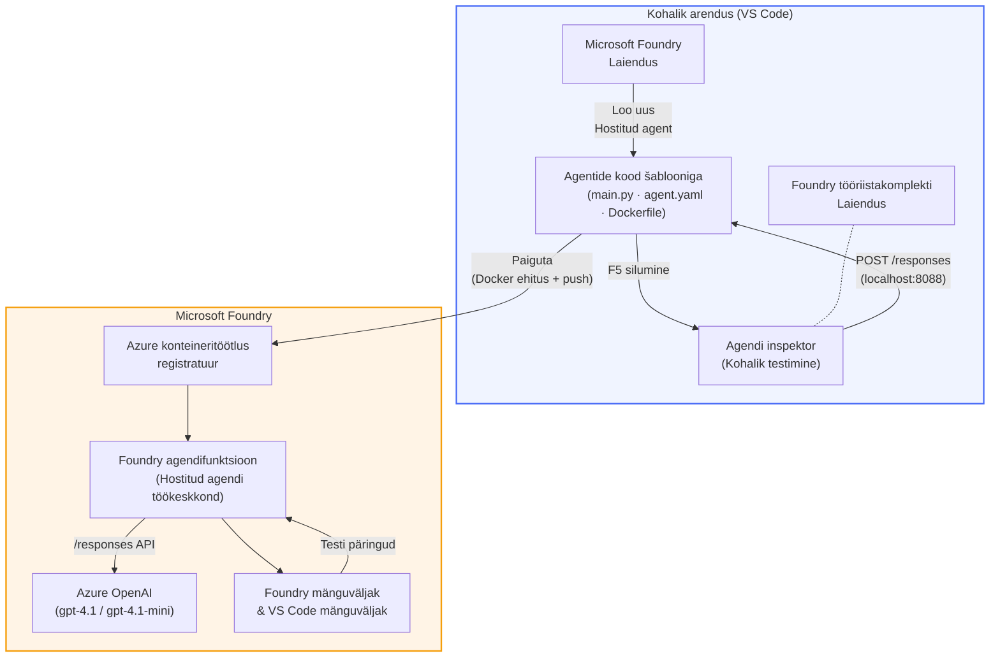

# Foundry tööriistakomplekt + Foundry majutatud agendid töötuba

[](https://www.python.org/)
[](https://github.com/microsoft/agents)
[](https://learn.microsoft.com/azure/ai-foundry/agents/concepts/hosted-agents/)
[](https://ai.azure.com/)
[](https://learn.microsoft.com/azure/ai-services/openai/)
[](https://learn.microsoft.com/cli/azure/install-azure-cli)
[](https://learn.microsoft.com/azure/developer/azure-developer-cli/install-azd)
[](https://www.docker.com/)
[](https://marketplace.visualstudio.com/items?itemName=ms-windows-ai-studio.windows-ai-studio)
[](LICENSE)

Ehita, testi ja juuruta tehisintellekti agente **Microsoft Foundry Agent Service**-i kohta kui **hostitud agente** – täielikult VS Code’ist kasutades **Microsoft Foundry laiendust** ja **Foundry tööriistakomplekti**.

> **Hostitud agendid on hetkel eelvaates.** Toetatud regioonid on piiratud – vaata [regioonide saadavust](https://learn.microsoft.com/azure/foundry/agents/concepts/hosted-agents#region-availability).

> Iga töötoa sees asuv `agent/` kaust on **automatiseeritult genereeritud** Foundry laienduse poolt – selle järel kohandad koodi, testid kohapeal ja juurutad.

### 🌐 Mitmekeelne tugi

#### Toetatud GitHub Action’i kaudu (automatiseeritud & alati ajakohane)

<!-- CO-OP TRANSLATOR LANGUAGES TABLE START -->
[Araabia](../ar/README.md) | [Bengali](../bn/README.md) | [Bulgaaria](../bg/README.md) | [Burmai (Myanmar)](../my/README.md) | [Hiina (lihtsustatud)](../zh-CN/README.md) | [Hiina (traditsiooniline, Hongkong)](../zh-HK/README.md) | [Hiina (traditsiooniline, Macau)](../zh-MO/README.md) | [Hiina (traditsiooniline, Taiwan)](../zh-TW/README.md) | [Horvaadi](../hr/README.md) | [Tšehhi](../cs/README.md) | [Taani](../da/README.md) | [Hollandi](../nl/README.md) | [Eesti](./README.md) | [Soome](../fi/README.md) | [Prantsuse](../fr/README.md) | [Saksa](../de/README.md) | [Kreeka](../el/README.md) | [Heebrea](../he/README.md) | [Hindi](../hi/README.md) | [Ungari](../hu/README.md) | [Indoneesia](../id/README.md) | [Itaalia](../it/README.md) | [Jaapani](../ja/README.md) | [Kannada](../kn/README.md) | [Khmeri](../km/README.md) | [Korea](../ko/README.md) | [Leedu](../lt/README.md) | [Malai](../ms/README.md) | [Malajalami](../ml/README.md) | [Marathi](../mr/README.md) | [Nepali](../ne/README.md) | [Nigeeria pidžin](../pcm/README.md) | [Norra](../no/README.md) | [Pärsia (Farsi)](../fa/README.md) | [Poola](../pl/README.md) | [Portugali (Brasiilia)](../pt-BR/README.md) | [Portugali (Portugal)](../pt-PT/README.md) | [Punjabi (Gurmukhi)](../pa/README.md) | [Rumeenia](../ro/README.md) | [Vene](../ru/README.md) | [Serbia (kirillitsas)](../sr/README.md) | [Slaavi](../sk/README.md) | [Sloveeni](../sl/README.md) | [Hispaania](../es/README.md) | [Suahiili](../sw/README.md) | [Rootsi](../sv/README.md) | [Tagalogi (Filipiinid)](../tl/README.md) | [Tamiili](../ta/README.md) | [Telugu](../te/README.md) | [Tai](../th/README.md) | [Türgi](../tr/README.md) | [Ukraina](../uk/README.md) | [Urdu](../ur/README.md) | [Vietnami](../vi/README.md)

> **Eelistad kloonimist lokaalselt?**
>
> See hoidla sisaldab 50+ keele tõlget, mis suurendab allalaadimise mahtu märgatavalt. Kui soovid kloonida ilma tõlgeteta, kasuta sparsi checkout’i:
>
> **Bash / macOS / Linux:**
> ```bash
> git clone --filter=blob:none --sparse https://github.com/microsoft-foundry/Foundry_Toolkit_for_VSCode_Lab.git
> cd Foundry_Toolkit_for_VSCode_Lab
> git sparse-checkout set --no-cone '/*' '!translations' '!translated_images'
> ```
>
> **CMD (Windows):**
> ```cmd
> git clone --filter=blob:none --sparse https://github.com/microsoft-foundry/Foundry_Toolkit_for_VSCode_Lab.git
> cd Foundry_Toolkit_for_VSCode_Lab
> git sparse-checkout set --no-cone "/*" "!translations" "!translated_images"
> ```
>
> See annab sulle kõik vajaliku kursuse läbimiseks palju kiiremalt alla laadituna.
<!-- CO-OP TRANSLATOR LANGUAGES TABLE END -->

---

## Arhitektuur


**Voog:** Foundry laiendus genereerib agendi → sa kohandad koodi ja juhiseid → testid lokaalselt Agent Inspectoriga → juurutad Foundrys (Dockeri pilt tõstetakse ACR-i) → kontrollid Playground’is.

---

## Mida sa ehitad

| Labor | Kirjeldus | Olemasolek |
|-------|-----------|------------|
| **Labor 01 - Üksikagent** | Ehita **"Selgita nagu oleksin juhtkonna liige" agent**, testi seda kohapeal ja juuruta Foundrys | ✅ Saadaval |
| **Labor 02 - Mitmeagendi töövoog** | Ehita **"CV → töö sobivuse hindaja"** - 4 agenti teevad koostööd CV sobivuse hindamiseks ja õpperaja genereerimiseks | ✅ Saadaval |

---

## Tutvu Juhtkonna Agendiga

Selles töökojas ehitad **"Selgita nagu oleksin juhtkonna liige" agendi** – tehisintellekti agendi, mis võtab keerulise tehnilise žargooni ja tõlgib selle rahulikuks, juhtruumile sobivaks kokkuvõtteks. Sest olgem ausad, ükski C-tasandi juht ei taha kuulda "keerme-ressursside ammendumist, mida põhjustasid sünkroonsed kõned versioonis v3.2."

Selle agendi ehitasin pärast liiga palju juhtumeid, kus minu perfektne post-mortem sai vastuseks: *"Nii et... kas veebileht on maas või mitte?"*

### Kuidas see töötab

Sa annad tehnilise uuenduse sisendiks. See annab tagasi juhtkonnale mõeldud kokkuvõtte – kolm põhijuppi, ilma žargoonita, ilma virnade jälgedeta, ilma eksistentsiaalse hirmuta. Lihtsalt **mis juhtus**, **äri mõju** ja **järgmine samm**.

### Vaata seda tegevuses

**Sa ütled:**
> "API latentsus suurenes tõttu teemade grupi ammendumisest, mida põhjustasid versioonis v3.2 lisatud sünkroonsed kõned."

**Agent vastab:**

> **Juhtkonna kokkuvõte:**
> - **Mis juhtus:** Pärast viimast versiooni aeglustus süsteem.
> - **Ärimõju:** Mõned kasutajad kogesid teenuse kasutamisel viivitusi.
> - **Järgmine samm:** Muudatus tühistati ja parandust valmistatakse ette enne uuesti juurutamist.

### Miks just see agent?

See on äärmiselt lihtne, üheotstarbeline agent – ideaalne majutatud agendi töövoo õppimiseks algusest lõpuni ilma keeruliste tööriistade ummikutesse sattumata. Ja ausalt öeldes? Iga insenerimeeskond võiks sellist vaja minna.

---

## Töötuba struktuur

```
📂 Foundry_Toolkit_for_VSCode_Lab/
├── 📄 README.md                      ← You are here
├── 📂 ExecutiveAgent/                ← Standalone hosted agent project
│   ├── agent.yaml
│   ├── Dockerfile
│   ├── main.py
│   └── requirements.txt
└── 📂 workshop/
    ├── 📂 lab01-single-agent/        ← Full lab: docs + agent code
    │   ├── README.md                 ← Hands-on lab instructions
    │   ├── 📂 docs/                  ← Step-by-step tutorial modules
    │   │   ├── 00-prerequisites.md
    │   │   ├── 01-install-foundry-toolkit.md
    │   │   ├── 02-create-foundry-project.md
    │   │   ├── 03-create-hosted-agent.md
    │   │   ├── 04-configure-and-code.md
    │   │   ├── 05-test-locally.md
    │   │   ├── 06-deploy-to-foundry.md
    │   │   ├── 07-verify-in-playground.md
    │   │   └── 08-troubleshooting.md
    │   └── 📂 agent/                 ← Reference solution (auto-scaffolded by Foundry extension)
    │       ├── agent.yaml
    │       ├── Dockerfile
    │       ├── main.py
    │       └── requirements.txt
    └── 📂 lab02-multi-agent/         ← Resume → Job Fit Evaluator
        ├── README.md                 ← Hands-on lab instructions (end-to-end)
        ├── 📂 docs/                  ← Step-by-step tutorial modules
        │   ├── 00-prerequisites.md
        │   ├── 01-understand-multi-agent.md
        │   ├── 02-scaffold-multi-agent.md
        │   ├── 03-configure-agents.md
        │   ├── 04-orchestration-patterns.md
        │   ├── 05-test-locally.md
        │   ├── 06-deploy-to-foundry.md
        │   ├── 07-verify-in-playground.md
        │   └── 08-troubleshooting.md
        └── 📂 PersonalCareerCopilot/ ← Reference solution (multi-agent workflow)
            ├── agent.yaml
            ├── Dockerfile
            ├── main.py
            └── requirements.txt
```

> **Märkus:** Iga töötoa sees olev `agent/` kaust on see, mida **Microsoft Foundry laiendus** genereerib kui valid käsurealt `Microsoft Foundry: Create a New Hosted Agent`. Failid kohandatakse seejärel sinu agendi juhiste, tööriistade ja seadistustega. Labor 01 juhendab sind, kuidas see nullist uuesti luua.

---

## Alustamine

### 1. Klooni hoidla

```bash
git clone https://github.com/microsoft-foundry/Foundry_Toolkit_for_VSCode_Lab.git
cd Foundry_Toolkit_for_VSCode_Lab
```

### 2. Loo Python virtuaalkeskkond

```bash
python -m venv venv
```

Aktiveeri see:

- **Windows (PowerShell):**
  ```powershell
  .\venv\Scripts\Activate.ps1
  ```

- **macOS / Linux:**
  ```bash
  source venv/bin/activate
  ```

### 3. Paigalda sõltuvused

```bash
pip install -r workshop/lab01-single-agent/agent/requirements.txt
```

### 4. Sea keskkonnamuutujad

Kopeeri näidiskuv fail `.env` agent-kaustast ja täida oma väärtused:

```bash
cp workshop/lab01-single-agent/agent/.env.example workshop/lab01-single-agent/agent/.env
```

Muuda faili `workshop/lab01-single-agent/agent/.env`:

```env
AZURE_AI_PROJECT_ENDPOINT=https://<your-account>.services.ai.azure.com/api/projects/<your-project>
MODEL_DEPLOYMENT_NAME=<your-model-deployment-name>
```

### 5. Järgi töötoa laboreid

Iga labor on iseseisev oma moodulitega. Alusta **Labor 01**-st, et õppida põhialuseid, seejärel liiguta **Labor 02**-sse mitmeagendi töövoogude jaoks.

#### Labor 01 - Üksikagent ([täielikud juhised](workshop/lab01-single-agent/README.md))

| # | Moodul | Link |
|---|--------|------|
| 1 | Loe eeltingimused | [00-prerequisites.md](workshop/lab01-single-agent/docs/00-prerequisites.md) |
| 2 | Paigalda Foundry Toolkit & Foundry laiendus | [01-install-foundry-toolkit.md](workshop/lab01-single-agent/docs/01-install-foundry-toolkit.md) |
| 3 | Loo Foundry projekt | [02-create-foundry-project.md](workshop/lab01-single-agent/docs/02-create-foundry-project.md) |
| 4 | Loo majutatud agent | [03-create-hosted-agent.md](workshop/lab01-single-agent/docs/03-create-hosted-agent.md) |
| 5 | Sea juhised & keskkond | [04-configure-and-code.md](workshop/lab01-single-agent/docs/04-configure-and-code.md) |
| 6 | Testi kohapeal | [05-test-locally.md](workshop/lab01-single-agent/docs/05-test-locally.md) |
| 7 | Juuruta Foundrys | [06-deploy-to-foundry.md](workshop/lab01-single-agent/docs/06-deploy-to-foundry.md) |
| 8 | Kontrolli Playground’is | [07-verify-in-playground.md](workshop/lab01-single-agent/docs/07-verify-in-playground.md) |
| 9 | Probleemide lahendamine | [08-troubleshooting.md](workshop/lab01-single-agent/docs/08-troubleshooting.md) |

#### Labor 02 - Mitmeagendi töövoog ([täielikud juhised](workshop/lab02-multi-agent/README.md))

| # | Moodul | Link |
|---|--------|------|
| 1 | Eeltingimused (Labor 02) | [00-prerequisites.md](workshop/lab02-multi-agent/docs/00-prerequisites.md) |
| 2 | Mõista mitmeagendi arhitektuuri | [01-understand-multi-agent.md](workshop/lab02-multi-agent/docs/01-understand-multi-agent.md) |
| 3 | Genereeri mitmeagendi projekt | [02-scaffold-multi-agent.md](workshop/lab02-multi-agent/docs/02-scaffold-multi-agent.md) |
| 4 | Sea agendid & keskkond | [03-configure-agents.md](workshop/lab02-multi-agent/docs/03-configure-agents.md) |
| 5 | Orkestreerimise mustrid | [04-orchestration-patterns.md](workshop/lab02-multi-agent/docs/04-orchestration-patterns.md) |
| 6 | Testi kohapeal (mitmeagent) | [05-test-locally.md](workshop/lab02-multi-agent/docs/05-test-locally.md) |
| 7 | Deployimine Foundrysse | [06-deploy-to-foundry.md](workshop/lab02-multi-agent/docs/06-deploy-to-foundry.md) |
| 8 | Kontroll playground'is | [07-verify-in-playground.md](workshop/lab02-multi-agent/docs/07-verify-in-playground.md) |
| 9 | Tõrkeotsing (mitmeagendiline) | [08-troubleshooting.md](workshop/lab02-multi-agent/docs/08-troubleshooting.md) |

---

## Hooldaja

<table>
<tr>
    <td align="center"><a href="https://github.com/ShivamGoyal03">
        <br />
        <sub><b>Shivam Goyal</b></sub>
    </a><br />
    </td>
</tr>
</table>

---

## Vajalikud õigused (kiirviide)

| Stsenaarium | Vajalikud rollid |
|-------------|------------------|
| Uue Foundry projekti loomine | **Azure AI omaniku** roll Foundry ressursil |
| Paigaldamine olemasolevasse projekti (uued ressursid) | **Azure AI omaniku** + **Kaastöötaja** roll tellimuses |
| Paigaldamine täielikult seadistatud projekti | **Lugeja** roll kontol + **Azure AI kasutaja** roll projektis |

> **Oluline:** Azure `Owner` ja `Contributor` rollid sisaldavad ainult *haldus* õigusi, mitte *arenduse* (andmete toimingute) õigusi. Agentide ehitamiseks ja juurutamiseks on vajalikud **Azure AI kasutaja** või **Azure AI omaniku** õigused.

---

## Viited

- [Kiire algus: juuruta oma esimene majutatud agent (VS Code)](https://learn.microsoft.com/azure/foundry/agents/quickstarts/quickstart-hosted-agent)
- [Mis on majutatud agendid?](https://learn.microsoft.com/azure/foundry/agents/concepts/hosted-agents)
- [Loo majutatud agendi töövood VS Code'is](https://learn.microsoft.com/azure/foundry/agents/how-to/vs-code-agents-workflow-pro-code)
- [Juuruta majutatud agent](https://learn.microsoft.com/azure/foundry/agents/how-to/deploy-hosted-agent)
- [RBAC Microsoft Foundrys](https://learn.microsoft.com/azure/foundry/concepts/rbac-foundry)
- [Arhitektuuriülevaate agendi näidis](https://github.com/Azure-Samples/agent-architecture-review-sample) - Reaalmaailma majutatud agent MCP tööriistade, Excalidraw diagrammide ja kahekordse juurutusega

---

## Litsents

[MIT](../../LICENSE)

---

<!-- CO-OP TRANSLATOR DISCLAIMER START -->
**Lahtiütlus**:  
See dokument on tõlgitud AI tõlketeenuse [Co-op Translator](https://github.com/Azure/co-op-translator) abil. Kuigi püüame saavutada täpsust, palun arvestage, et automaatsed tõlked võivad sisaldada vigu või ebatäpsusi. Originaaldokument selle emakeeles tuleks pidada autoriteetseks allikaks. Olulise teabe puhul soovitatakse kasutada professionaalset inimtõlget. Me ei vastuta selle tõlke kasutamisest tingitud arusaamatuste või valesti mõistmiste eest.
<!-- CO-OP TRANSLATOR DISCLAIMER END -->