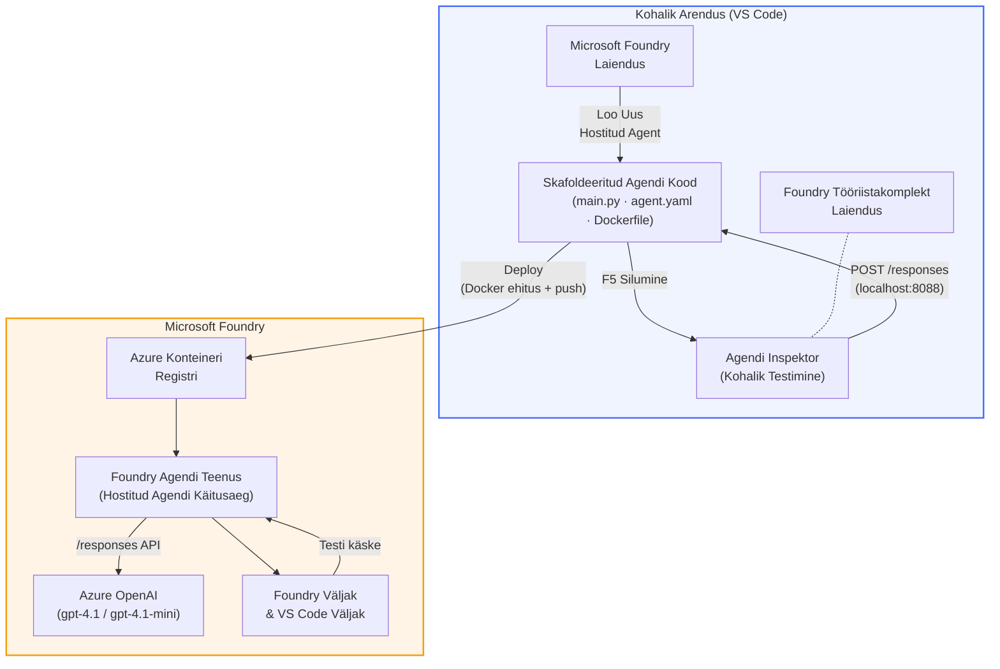

# Foundry tööriistakomplekt + Foundry hostitud agendid töötuba

[](https://www.python.org/)
[](https://github.com/microsoft/agents)
[](https://learn.microsoft.com/azure/ai-foundry/agents/concepts/hosted-agents/)
[](https://ai.azure.com/)
[](https://learn.microsoft.com/azure/ai-services/openai/)
[](https://learn.microsoft.com/cli/azure/install-azure-cli)
[](https://learn.microsoft.com/azure/developer/azure-developer-cli/install-azd)
[](https://www.docker.com/)
[](https://marketplace.visualstudio.com/items?itemName=ms-windows-ai-studio.windows-ai-studio)
[](LICENSE)

Ehita, testi ja juuruta AI agente **Microsoft Foundry Agent Service’i** kui **hostitud agente** – täielikult VS Code’is kasutades **Microsoft Foundry laiendust** ja **Foundry tööriistakomplekti**.

> **Hostitud agendid on hetkel eelvaates.** Toetatud piirkonnad on piiratud – vaata [piirkonna saadavust](https://learn.microsoft.com/azure/foundry/agents/concepts/hosted-agents#region-availability).

> Kaust `agent/` iga töötoa sees on **automaatse struktuuriga loodud** Foundry laienduse poolt – sa kohandad seejärel koodi, testid lokaalselt ja juurutad.

<!-- CO-OP TRANSLATOR LANGUAGES TABLE START -->
[Arabic](../ar/README.md) | [Bengali](../bn/README.md) | [Bulgarian](../bg/README.md) | [Burmese (Myanmar)](../my/README.md) | [Chinese (Simplified)](../zh-CN/README.md) | [Chinese (Traditional, Hong Kong)](../zh-HK/README.md) | [Chinese (Traditional, Macau)](../zh-MO/README.md) | [Chinese (Traditional, Taiwan)](../zh-TW/README.md) | [Croatian](../hr/README.md) | [Czech](../cs/README.md) | [Danish](../da/README.md) | [Dutch](../nl/README.md) | [Estonian](./README.md) | [Finnish](../fi/README.md) | [French](../fr/README.md) | [German](../de/README.md) | [Greek](../el/README.md) | [Hebrew](../he/README.md) | [Hindi](../hi/README.md) | [Hungarian](../hu/README.md) | [Indonesian](../id/README.md) | [Italian](../it/README.md) | [Japanese](../ja/README.md) | [Kannada](../kn/README.md) | [Khmer](../km/README.md) | [Korean](../ko/README.md) | [Lithuanian](../lt/README.md) | [Malay](../ms/README.md) | [Malayalam](../ml/README.md) | [Marathi](../mr/README.md) | [Nepali](../ne/README.md) | [Nigerian Pidgin](../pcm/README.md) | [Norwegian](../no/README.md) | [Persian (Farsi)](../fa/README.md) | [Polish](../pl/README.md) | [Portuguese (Brazil)](../pt-BR/README.md) | [Portuguese (Portugal)](../pt-PT/README.md) | [Punjabi (Gurmukhi)](../pa/README.md) | [Romanian](../ro/README.md) | [Russian](../ru/README.md) | [Serbian (Cyrillic)](../sr/README.md) | [Slovak](../sk/README.md) | [Slovenian](../sl/README.md) | [Spanish](../es/README.md) | [Swahili](../sw/README.md) | [Swedish](../sv/README.md) | [Tagalog (Filipino)](../tl/README.md) | [Tamil](../ta/README.md) | [Telugu](../te/README.md) | [Thai](../th/README.md) | [Turkish](../tr/README.md) | [Ukrainian](../uk/README.md) | [Urdu](../ur/README.md) | [Vietnamese](../vi/README.md)

> **Eelistad kloonida kohapeal?**
>
> See hoidla sisaldab 50+ keele tõlget, mis suurendab allalaadimismahtu märkimisväärselt. Tõlgeteta kloonimiseks kasuta spetsiifilist checkout’i ehk sparse checkouti:
>
> **Bash / macOS / Linux:**
> ```bash
> git clone --filter=blob:none --sparse https://github.com/microsoft-foundry/Foundry_Toolkit_for_VSCode_Lab.git
> cd Foundry_Toolkit_for_VSCode_Lab
> git sparse-checkout set --no-cone '/*' '!translations' '!translated_images'
> ```
>
> **CMD (Windows):**
> ```cmd
> git clone --filter=blob:none --sparse https://github.com/microsoft-foundry/Foundry_Toolkit_for_VSCode_Lab.git
> cd Foundry_Toolkit_for_VSCode_Lab
> git sparse-checkout set --no-cone "/*" "!translations" "!translated_images"
> ```
>
> See annab sulle kõik vajaliku kursuse lõpetamiseks palju kiirema allalaadimisega.
<!-- CO-OP TRANSLATOR LANGUAGES TABLE END -->

---

## Arhitektuur


**Töövoog:** Foundry laiendus loob agendi struktuuri → sina kohandad koodi ja juhiseid → testid lokaalselt Agent Inspectori abil → juurutad Foundrys (Docker pilt lükatakse ACR-i) → kontrollid Playgrounds.

---

## Mida sa ehitad

| Lab | Kirjeldus | Staatus |
|-----|-----------|---------|
| **Lab 01 - Ühe agendi loomine** | Ehita **"Selgita nagu ma oleks juhtivtöötaja" agent**, testi seda lokaalselt ja juuruta Foundry’sse | ✅ Saadaval |
| **Lab 02 - Mitme agendi töövoog** | Ehita **"CV → töö sobivuse hindaja"** - 4 agenti teevad koostööd CV sobivuse hindamisel ja õpikeskkonna teekonna loomisel | ✅ Saadaval |

---

## Tutvu Juhtivtöötaja agendiga

Selles töötoas ehitad AI-agendi nimega **"Selgita nagu ma oleks juhtivtöötaja"** – see agent võtab keerulise tehnilise sõnastuse ja tõlgib selle rahulikuks, nõupidamisruumiks sobivaks kokkuvõtteks. Sest olgem ausad, keegi C-tasandi juhistest ei taha kuulda "niidivoo ammendumisest, mis tekkis sünkroonsete väljakutsete tõttu versioonis 3.2."

Ma lõin selle agendi pärast ühte liiast intsidenti, kus mu perfektne järeldus sai vastuseks: *“Nii et... kas veebileht on all või mitte?”*

### Kuidas see toimib

Sa annad talle tehnilise uuenduse. Ta vastab juhtivtöötaja kokkuvõttega – kolm märksõna, ilma igasuguse erialase žargooni, ilma virna jälgedeta ja ilma eksistentsiaalse hirmuta. Ainult **mis juhtus**, **äri mõju** ja **järgmised sammud**.

### Vaata seda tegutsemas

**Sa ütled:**
> "API latentsus suurenes niidivoo ammendumise tõttu, mis tekkis sünkroonsete väljakutsete tõttu versioonis 3.2."

**Agent vastab:**

> **Juhtivtöötaja kokkuvõte:**
> - **Mis juhtus:** Pärast viimast uuendust süsteem aeglustus.
> - **Äri mõju:** Mõned kasutajad kogesid teenuse kasutamisel viivitusi.
> - **Järgmine samm:** Muudatus on tagasi võetud ja parandust valmistatakse ette enne uuesti juurutamist.

### Miks see agent?

See on surmlihtne, ühe eesmärgiga agent – ideaalne õppetööks hostitud agendi töövoo lõpuni õppimiseks ilma keeruka tööriistakomplektita. Ja ausalt? Iga insenerimeeskond võiks sellist üht vajada.

---

## Töötoa ülesehitus

```
📂 Foundry_Toolkit_for_VSCode_Lab/
├── 📄 README.md                      ← You are here
├── 📂 ExecutiveAgent/                ← Standalone hosted agent project
│   ├── agent.yaml
│   ├── Dockerfile
│   ├── main.py
│   └── requirements.txt
└── 📂 workshop/
    ├── 📂 lab01-single-agent/        ← Full lab: docs + agent code
    │   ├── README.md                 ← Hands-on lab instructions
    │   ├── 📂 docs/                  ← Step-by-step tutorial modules
    │   │   ├── 00-prerequisites.md
    │   │   ├── 01-install-foundry-toolkit.md
    │   │   ├── 02-create-foundry-project.md
    │   │   ├── 03-create-hosted-agent.md
    │   │   ├── 04-configure-and-code.md
    │   │   ├── 05-test-locally.md
    │   │   ├── 06-deploy-to-foundry.md
    │   │   ├── 07-verify-in-playground.md
    │   │   └── 08-troubleshooting.md
    │   └── 📂 agent/                 ← Reference solution (auto-scaffolded by Foundry extension)
    │       ├── agent.yaml
    │       ├── Dockerfile
    │       ├── main.py
    │       └── requirements.txt
    └── 📂 lab02-multi-agent/         ← Resume → Job Fit Evaluator
        ├── README.md                 ← Hands-on lab instructions (end-to-end)
        ├── 📂 docs/                  ← Step-by-step tutorial modules
        │   ├── 00-prerequisites.md
        │   ├── 01-understand-multi-agent.md
        │   ├── 02-scaffold-multi-agent.md
        │   ├── 03-configure-agents.md
        │   ├── 04-orchestration-patterns.md
        │   ├── 05-test-locally.md
        │   ├── 06-deploy-to-foundry.md
        │   ├── 07-verify-in-playground.md
        │   └── 08-troubleshooting.md
        └── 📂 PersonalCareerCopilot/ ← Reference solution (multi-agent workflow)
            ├── agent.yaml
            ├── Dockerfile
            ├── main.py
            └── requirements.txt
```

> **Märkus:** Kaust `agent/` iga töötoa sees on see mis **Microsoft Foundry laiendus** genereerib, kui käivitad Command Palette’is käsku `Microsoft Foundry: Create a New Hosted Agent`. Failid kohandatakse siis sinu agendi juhiste, tööriistade ja konfiguratsiooniga. Lab 01 viib sind samm-sammult läbi selle loomise nullist.

---

## Alustamine

### 1. Klooni hoidla

```bash
git clone https://github.com/microsoft-foundry/Foundry_Toolkit_for_VSCode_Lab.git
cd Foundry_Toolkit_for_VSCode_Lab
```

### 2. Sea üles Python virtuaalne keskkond

```bash
python -m venv venv
```

Aktiveeri see:

- **Windows (PowerShell):**
  ```powershell
  .\venv\Scripts\Activate.ps1
  ```
- **macOS / Linux:**
  ```bash
  source venv/bin/activate
  ```

### 3. Paigalda sõltuvused

```bash
pip install -r workshop/lab01-single-agent/agent/requirements.txt
```

### 4. Konfigureeri keskkonnamuutujad

Kopeeri agent-kaustas olev näidisfail `.env` ja täida oma väärtused:

```bash
cp workshop/lab01-single-agent/agent/.env.example workshop/lab01-single-agent/agent/.env
```

Muuda faili `workshop/lab01-single-agent/agent/.env`:

```env
AZURE_AI_PROJECT_ENDPOINT=https://<your-account>.services.ai.azure.com/api/projects/<your-project>
MODEL_DEPLOYMENT_NAME=<your-model-deployment-name>
```

### 5. Järgi töötoa harjutusi

Iga töölaud on iseseisev oma moodulitega. Alusta **Lab 01**-st, et õppida põhialuseid, seejärel liigu edasi **Lab 02**-le mitme agendi töövoogude jaoks.

#### Lab 01 - Üks agent ([täielikud juhised](workshop/lab01-single-agent/README.md))

| # | Moodul | Link |
|---|--------|------|
| 1 | Loe eeltingimusi | [00-prerequisites.md](workshop/lab01-single-agent/docs/00-prerequisites.md) |
| 2 | Paigalda Foundry tööriistakomplekt & laiendus | [01-install-foundry-toolkit.md](workshop/lab01-single-agent/docs/01-install-foundry-toolkit.md) |
| 3 | Loo Foundry projekt | [02-create-foundry-project.md](workshop/lab01-single-agent/docs/02-create-foundry-project.md) |
| 4 | Loo hostitud agent | [03-create-hosted-agent.md](workshop/lab01-single-agent/docs/03-create-hosted-agent.md) |
| 5 | Konfigureeri juhised & keskkond | [04-configure-and-code.md](workshop/lab01-single-agent/docs/04-configure-and-code.md) |
| 6 | Testi lokaalselt | [05-test-locally.md](workshop/lab01-single-agent/docs/05-test-locally.md) |
| 7 | Juuruta Foundrysse | [06-deploy-to-foundry.md](workshop/lab01-single-agent/docs/06-deploy-to-foundry.md) |
| 8 | Kontrolli playground’is | [07-verify-in-playground.md](workshop/lab01-single-agent/docs/07-verify-in-playground.md) |
| 9 | Tõrkeotsing | [08-troubleshooting.md](workshop/lab01-single-agent/docs/08-troubleshooting.md) |

#### Lab 02 - Mitme agendi töövoog ([täielikud juhised](workshop/lab02-multi-agent/README.md))

| # | Moodul | Link |
|---|--------|------|
| 1 | Eeltingimused (Lab 02) | [00-prerequisites.md](workshop/lab02-multi-agent/docs/00-prerequisites.md) |
| 2 | Mõista mitme agendi arhitektuuri | [01-understand-multi-agent.md](workshop/lab02-multi-agent/docs/01-understand-multi-agent.md) |
| 3 | Loo mitme agendi projekt | [02-scaffold-multi-agent.md](workshop/lab02-multi-agent/docs/02-scaffold-multi-agent.md) |
| 4 | Konfigureeri agendid ja keskkond | [03-configure-agents.md](workshop/lab02-multi-agent/docs/03-configure-agents.md) |
| 5 | Orkestreerimismustrid | [04-orchestration-patterns.md](workshop/lab02-multi-agent/docs/04-orchestration-patterns.md) |
| 6 | Testi lokaalselt (mitme agendi puhul) | [05-test-locally.md](workshop/lab02-multi-agent/docs/05-test-locally.md) |
| 7 | Rakendamine Foundry keskkonda | [06-deploy-to-foundry.md](workshop/lab02-multi-agent/docs/06-deploy-to-foundry.md) |
| 8 | Kontroll playground’is | [07-verify-in-playground.md](workshop/lab02-multi-agent/docs/07-verify-in-playground.md) |
| 9 | Probleemide lahendamine (multi-agent) | [08-troubleshooting.md](workshop/lab02-multi-agent/docs/08-troubleshooting.md) |

---

## Hooldaja

<table>
<tr>
    <td align="center"><a href="https://github.com/ShivamGoyal03">
        <br />
        <sub><b>Shivam Goyal</b></sub>
    </a><br />
    </td>
</tr>
</table>

---

## Vajalikud õigused (kiirviide)

| Stsenaarium | Vajalikud rollid |
|----------|---------------|
| Uue Foundry projekti loomine | **Azure AI Owner** Foundry ressursil |
| Rakendamine olemasolevasse projekti (uued ressursid) | **Azure AI Owner** + **Contributor** tellimuse tasemel |
| Rakendamine täielikult konfigureeritud projekti | **Reader** kontol + **Azure AI User** projektis |

> **Oluline:** Azure `Owner` ja `Contributor` rollid sisaldavad ainult *haldamis* õigusi, mitte *arenduse* (andmete töötlemise) õigusi. Agentide ehitamiseks ja rakendamiseks on vaja **Azure AI User** või **Azure AI Owner** rolli.

---

## Viited

- [Kiirkäivitus: Rakenda oma esimene hostitud agent (VS Code)](https://learn.microsoft.com/azure/foundry/agents/quickstarts/quickstart-hosted-agent)
- [Mis on hostitud agendid?](https://learn.microsoft.com/azure/foundry/agents/concepts/hosted-agents)
- [Loo hostitud agentide töövoog VS Code’is](https://learn.microsoft.com/azure/foundry/agents/how-to/vs-code-agents-workflow-pro-code)
- [Rakenda hostitud agent](https://learn.microsoft.com/azure/foundry/agents/how-to/deploy-hosted-agent)
- [RBAC Microsoft Foundry jaoks](https://learn.microsoft.com/azure/foundry/concepts/rbac-foundry)
- [Arhitektuuri ülevaate agenti näidis](https://github.com/Azure-Samples/agent-architecture-review-sample) - Tegeliku maailma hostitud agent koos MCP tööriistade, Excalidraw diagrammide ja kahekordse rakendusega

---


## Litsents

[MIT](../../LICENSE)

---

<!-- CO-OP TRANSLATOR DISCLAIMER START -->
**Vastutusest loobumine**:
See dokument on tõlgitud tehisintellekti tõlketeenuse [Co-op Translator](https://github.com/Azure/co-op-translator) abil. Kuigi me püüame tagada täpsust, tuleb arvestada, et automaatsed tõlked võivad sisaldada vigu või ebatäpsusi. Originaaldokument oma algkeeles tuleks pidada autoriteetseks allikaks. Olulise teabe puhul soovitatakse kasutada professionaalset inimtõlget. Me ei vastuta selles tõlkes sisalduvate eksiarvamuste või väärarusaamade eest.
<!-- CO-OP TRANSLATOR DISCLAIMER END -->