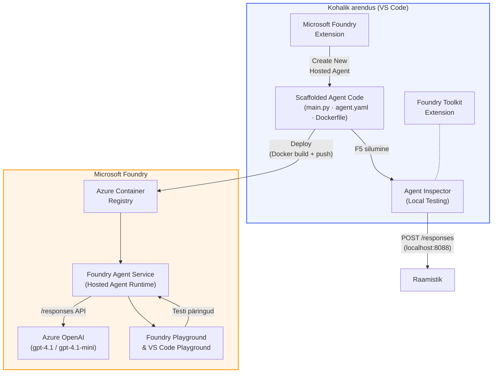

# Foundry tööriistakomplekt + Foundry majutatud agentide töötuba

[](https://www.python.org/)
[](https://github.com/microsoft/agents)
[](https://learn.microsoft.com/azure/foundry/agents/concepts/hosted-agents)
[](https://ai.azure.com/)
[](https://learn.microsoft.com/azure/ai-services/openai/)
[](https://learn.microsoft.com/cli/azure/install-azure-cli)
[](https://learn.microsoft.com/azure/developer/azure-developer-cli/install-azd)
[](https://www.docker.com/)
[](https://marketplace.visualstudio.com/items?itemName=ms-windows-ai-studio.windows-ai-studio)
[](LICENSE)

Loo, testi ja juuruta tehisintellekti agendid **Microsoft Foundry agentide teenusesse** kui **hostitud agendid** - täielikult VS Code'i kaudu, kasutades **Microsoft Foundry laiendust** ja **Foundry tööriistakomplekti**.

> **Hostitud agendid on praegu eelvaates.** Toetatud regioonid on piiratud - vaata [regioonide kättesaadavust](https://learn.microsoft.com/azure/foundry/agents/concepts/hosted-agents#region-availability).

> Iga töötoa sees olevat `agent/` kausta genereerib automaatselt Foundry laiendus - seejärel kohandad koodi, testid kohapeal ja juurutad.

### 🌐 Mitmekeelne tugi

#### GitHub Actioni kaudu toetatud (automatiseeritud ja alati ajakohane)

<!-- CO-OP TRANSLATOR LANGUAGES TABLE START -->
[Arabic](../ar/README.md) | [Bengali](../bn/README.md) | [Bulgarian](../bg/README.md) | [Burmese (Myanmar)](../my/README.md) | [Chinese (Simplified)](../zh-CN/README.md) | [Chinese (Traditional, Hong Kong)](../zh-HK/README.md) | [Chinese (Traditional, Macau)](../zh-MO/README.md) | [Chinese (Traditional, Taiwan)](../zh-TW/README.md) | [Croatian](../hr/README.md) | [Czech](../cs/README.md) | [Danish](../da/README.md) | [Dutch](../nl/README.md) | [Estonian](./README.md) | [Finnish](../fi/README.md) | [French](../fr/README.md) | [German](../de/README.md) | [Greek](../el/README.md) | [Hebrew](../he/README.md) | [Hindi](../hi/README.md) | [Hungarian](../hu/README.md) | [Indonesian](../id/README.md) | [Italian](../it/README.md) | [Japanese](../ja/README.md) | [Kannada](../kn/README.md) | [Khmer](../km/README.md) | [Korean](../ko/README.md) | [Lithuanian](../lt/README.md) | [Malay](../ms/README.md) | [Malayalam](../ml/README.md) | [Marathi](../mr/README.md) | [Nepali](../ne/README.md) | [Nigerian Pidgin](../pcm/README.md) | [Norwegian](../no/README.md) | [Persian (Farsi)](../fa/README.md) | [Polish](../pl/README.md) | [Portuguese (Brazil)](../pt-BR/README.md) | [Portuguese (Portugal)](../pt-PT/README.md) | [Punjabi (Gurmukhi)](../pa/README.md) | [Romanian](../ro/README.md) | [Russian](../ru/README.md) | [Serbian (Cyrillic)](../sr/README.md) | [Slovak](../sk/README.md) | [Slovenian](../sl/README.md) | [Spanish](../es/README.md) | [Swahili](../sw/README.md) | [Swedish](../sv/README.md) | [Tagalog (Filipino)](../tl/README.md) | [Tamil](../ta/README.md) | [Telugu](../te/README.md) | [Thai](../th/README.md) | [Turkish](../tr/README.md) | [Ukrainian](../uk/README.md) | [Urdu](../ur/README.md) | [Vietnamese](../vi/README.md)

> **Eelistad kloonimist lokaalselt?**
>
> See hoidla sisaldab 50+ keele tõlget, mis suurendab allalaaditava faili mahtu märkimisväärselt. Kui soovid kloonida ilma tõlgeteta, kasuta harva välja kontrollimist:
>
> **Bash / macOS / Linux:**
> ```bash
> git clone --filter=blob:none --sparse https://github.com/microsoft-foundry/Foundry_Toolkit_for_VSCode_Lab.git
> cd Foundry_Toolkit_for_VSCode_Lab
> git sparse-checkout set --no-cone '/*' '!translations' '!translated_images'
> ```
>
> **CMD (Windows):**
> ```cmd
> git clone --filter=blob:none --sparse https://github.com/microsoft-foundry/Foundry_Toolkit_for_VSCode_Lab.git
> cd Foundry_Toolkit_for_VSCode_Lab
> git sparse-checkout set --no-cone "/*" "!translations" "!translated_images"
> ```
>
> See annab sulle kõik vajaliku kursuse lõpetamiseks palju kiiremalt.
<!-- CO-OP TRANSLATOR LANGUAGES TABLE END -->

---

## Arhitektuur


```mermaid
flowchart TB
    subgraph Local["Kohalik arendus (VS Code)"]
        direction TB
        FE["Microsoft Foundry
        Extension"]
        FoundryToolkit["Foundry Toolkit
        Extension"]
        Scaffold["Scaffolded Agent Code
        (main.py · agent.yaml · Dockerfile)"]
        Inspector["Agent Inspector
        (Local Testing)"]
        FE -- "Create New
        Hosted Agent" --> Scaffold
        Scaffold -- "F5 silumine" --> Inspector
        FoundryToolkit -.- Inspector
    end

    subgraph Cloud["Microsoft Foundry"]
        direction TB
        ACR["Azure Container
        Registry"]
        AgentService["Foundry Agent Service
        (Hosted Agent Runtime)"]
        Model["Azure OpenAI
        (gpt-4.1 / gpt-4.1-mini)"]
        Playground["Foundry Playground
        & VS Code Playground"]
        ACR --> AgentService
        AgentService -- "/responses API" --> Model
        AgentService --> Playground
    end

    Scaffold -- "Deploy
    (Docker build + push)" --> ACR
    Inspector -- "POST /responses
    (localhost:8088)" --> Raamistik
    Playground -- "Testi päringud" --> AgentService

    style Local fill:#f0f4ff,stroke:#4a6cf7,stroke-width:2px
    style Cloud fill:#fff4e6,stroke:#f59e0b,stroke-width:2px
```

**Töövoog:** Foundry laiendus genereerib agendi → sina kohandad koodi ja juhiseid → testid kohapeal Agent Inspectoriga → juurutad Foundry-sse (Docker pilt läheb ACR-i) → kontrollid Playground'is.

---

## Mida sa ehitad

| Töötoa nr | Kirjeldus | Staatus |
|-----|-------------|--------|
| **Töötoa 01 - Üks Agent** | Ehita **"Seleta nagu oleksin juht" agent**, testi kohapeal ja juuruta Foundry-sse | ✅ Saadaval |
| **Töötoa 02 - Mitme Agendi Töövoog** | Ehita **"CV → Töö sobivuse hindaja"** - 4 agenti teevad koostööd CV sobivuse hindamisel ja õppekava koostamisel | ✅ Saadaval |

---

## Tutvu Juhtimisagendiga

Selles töötubas ehitad **"Seleta nagu oleksin juht" agendi** - tehisintellekti agendi, mis võtab keerulise tehnilise žargooni ja tõlgib selle rahulikuks, juhatuse koosolekuks valmis kokkuvõtteks. Ausalt öeldes ei taha ükski C-taseme juht kuulda "v3.2 versioonis sisse viidud sünkroonsete kutsude poolt põhjustatud lõimingurühma ammendumist".

Selle agendi loodud ma pärast liiga palju juhtumeid, kus minu perfektselt koostatud järelanalüüsile järgnes vastus: *"Nii et... kas veebisait on maas või mitte?"*

### Kuidas see toimib

Sa annad talle tehnilise uuenduse. Ta tagastab juhtkonnale mõeldud kokkuvõtte - kolm põhipunkti, ilma žargoonita, ilma veajälgedeta, ilma eksistentsiaalse ärevuseta. Lihtsalt **mis juhtus**, **äri mõju** ja **järgmine samm**.

### Vaata, kuidas see töötab

**Sa ütled:**
> "API latentsus kasvas lõimingurühma ammendumise tõttu, mis tekkis v3.2 versioonis kasutusele võetud sünkroonsete kutsude tõttu."

**Agent vastab:**

> **Juhtkonna kokkuvõte:**
> - **Mis juhtus:** Pärast viimast versiooni aeglustus süsteem.
> - **Äriline mõju:** Mõned kasutajad kogenud teenuse kasutamisel viivitusi.
> - **Järgmine samm:** Muudatus tühistati ja parandust valmistatakse ette enne uuesti juurutamist.

### Miks just see agent?

See on väga lihtne, ühe eesmärgiga agent - täiuslik õppimaks hostitud agendi töövoogu otsast lõpuni ilma keeruliste tööriistadega kinni jäämata. Ja ausalt öeldes? Iga arendusmeeskond vajaks sellist.

---

## Töötuba struktuur

```
📂 Foundry_Toolkit_for_VSCode_Lab/
├── 📄 README.md                      ← You are here
└── 📂 workshop/
    ├── 📂 lab01-single-agent/        ← Full lab: docs + agent code
    │   ├── README.md                 ← Hands-on lab instructions
    │   ├── 📂 docs/                  ← Step-by-step tutorial modules
    │   │   ├── 00-prerequisites.md
    │   │   ├── 01-setup.md
    │   │   ├── 02-create-hosted-agent.md
    │   │   ├── 03-configure-and-code.md
    │   │   ├── 04-test-locally.md
    │   │   ├── 05-deploy-to-foundry.md
    │   │   ├── 06-verify-in-playground.md
    │   │   ├── 07-summary.md
    │   │   └── 08-troubleshooting.md
    │   └── 📂 agent/                 ← Reference solution (auto-scaffolded by Foundry extension)
    │       ├── agent.yaml
    │       ├── Dockerfile
    │       ├── main.py
    │       └── requirements.txt
    └── 📂 lab02-multi-agent/         ← Resume → Job Fit Evaluator
        ├── README.md                 ← Hands-on lab instructions (end-to-end)
        ├── 📂 docs/                  ← Step-by-step tutorial modules
        │   ├── 00-prerequisites.md
        │   ├── 01-understand-multi-agent.md
        │   ├── 02-scaffold-multi-agent.md
        │   ├── 03-configure-agents.md
        │   ├── 04-orchestration-patterns.md
        │   ├── 05-test-locally.md
        │   ├── 06-deploy-to-foundry.md
        │   ├── 07-verify-in-playground.md
        │   └── 08-troubleshooting.md
        └── 📂 PersonalCareerCopilot/ ← Reference solution (multi-agent workflow)
            ├── agent.yaml
            ├── Dockerfile
            ├── main.py
            └── requirements.txt
```

> **Märkus:** Iga töötoa sees olev `agent/` kaust on see, mida **Microsoft Foundry laiendus** genereerib, kui valid käsurealt `Microsoft Foundry: Create a New Hosted Agent`. Failid kohandatakse seejärel sinu agendi juhiste, tööriistade ja konfiguratsiooniga. Töötoa 01 juhendab sind selle loomisega algusest peale.

---

## Alustamine

### 1. Klooni hoidla

```bash
git clone https://github.com/microsoft-foundry/Foundry_Toolkit_for_VSCode_Lab.git
cd Foundry_Toolkit_for_VSCode_Lab
```

### 2. Loo Python virtuaalne keskkond

```bash
python -m venv venv
```

Aktiveeri see:

- **Windows (PowerShell):**
  ```powershell
  .\venv\Scripts\Activate.ps1
  ```
- **macOS / Linux:**
  ```bash
  source venv/bin/activate
  ```

### 3. Paigalda sõltuvused

```bash
pip install -r workshop/lab01-single-agent/agent/requirements.txt
```

### 4. Sea keskkonnamuutujad

Kopeeri agent-kataloogi sees olev näidise `.env` fail ja täida oma väärtustega:

```bash
cp workshop/lab01-single-agent/agent/.env.example workshop/lab01-single-agent/agent/.env
```

Muuda faili `workshop/lab01-single-agent/agent/.env`:

```env
AZURE_AI_PROJECT_ENDPOINT=https://<your-account>.services.ai.azure.com/api/projects/<your-project>
AZURE_AI_MODEL_DEPLOYMENT_NAME=<your-model-deployment-name>
```

### 5. Järgi töötoa juhiseid

Iga töötoa moodulid on iseseisvad. Alusta **Töötoast 01**, et õppida põhialuseid, seejärel liigu edasi **Töötoa 02** juurde mitme agendi töövoogude jaoks.

#### Töötoa 01 - Üks Agent ([täielikud juhised](workshop/lab01-single-agent/README.md))

| # | Moodul | Link |
|---|--------|------|
| 1 | Loe eeltingimused | [00-prerequisites.md](workshop/lab01-single-agent/docs/00-prerequisites.md) |
| 2 | Paigalda Foundry tööriistakomplekt ja laiendus | [01-setup.md](workshop/lab01-single-agent/docs/01-setup.md) |
| 3 | Loo Foundry projekt | [01-setup.md](workshop/lab01-single-agent/docs/01-setup.md) |
| 4 | Loo hostitud agent | [02-create-hosted-agent.md](workshop/lab01-single-agent/docs/02-create-hosted-agent.md) |
| 5 | Sea juhised ja keskkond | [03-configure-and-code.md](workshop/lab01-single-agent/docs/03-configure-and-code.md) |
| 6 | Testi kohapeal | [04-test-locally.md](workshop/lab01-single-agent/docs/04-test-locally.md) |
| 7 | Juuruta Foundry-sse | [05-deploy-to-foundry.md](workshop/lab01-single-agent/docs/05-deploy-to-foundry.md) |
| 8 | Kontrolli Playground'is | [06-verify-in-playground.md](workshop/lab01-single-agent/docs/06-verify-in-playground.md) |
| 9 | Tõrkeotsing | [08-troubleshooting.md](workshop/lab01-single-agent/docs/08-troubleshooting.md) |

#### Töötoa 02 - Mitme Agendi Töövoog ([täielikud juhised](workshop/lab02-multi-agent/README.md))

| # | Moodul | Link |
|---|--------|------|
| 1 | Eeltingimused (Töötoa 02) | [00-prerequisites.md](workshop/lab02-multi-agent/docs/00-prerequisites.md) |
| 2 | Sõnasta mitme agendi arhitektuur | [01-understand-multi-agent.md](workshop/lab02-multi-agent/docs/01-understand-multi-agent.md) |
| 3 | Genereeri mitme agendi projekt | [02-scaffold-multi-agent.md](workshop/lab02-multi-agent/docs/02-scaffold-multi-agent.md) |
| 4 | Sea agendid ja keskkond | [03-configure-agents.md](workshop/lab02-multi-agent/docs/03-configure-agents.md) |
| 5 | Orkestreerimismustrid | [04-orchestration-patterns.md](workshop/lab02-multi-agent/docs/04-orchestration-patterns.md) |
| 6 | Testi kohapeal (mitme agendi jaoks) | [05-test-locally.md](workshop/lab02-multi-agent/docs/05-test-locally.md) |

| 7 | Juhtimine Foundrysse paigutamine | [06-deploy-to-foundry.md](workshop/lab02-multi-agent/docs/06-deploy-to-foundry.md) |
| 8 | Kontroll playground'is | [07-verify-in-playground.md](workshop/lab02-multi-agent/docs/07-verify-in-playground.md) |
| 9 | Tõrkeotsing (mitmeagendi) | [08-troubleshooting.md](workshop/lab02-multi-agent/docs/08-troubleshooting.md) |

---

## Hooldaja

<table>
<tr>
    <td align="center"><a href="https://github.com/ShivamGoyal03">
        <br />
        <sub><b>Shivam Goyal</b></sub>
    </a><br />
    </td>
</tr>
</table>

---

## Nõutavad õigused (kiire viide)

| Stsenaarium | Nõutavad rollid |
|----------|---------------|
| Uue Foundry projekti loomine | **Azure AI Owner** Foundry ressursil |
| Paigutamine olemasolevasse projekti (uuede ressurssidega) | **Azure AI Owner** + **Contributor** tellimuses |
| Täielikult seadistatud projekti paigutamine | **Reader** kontol + **Azure AI User** projektis |

> **Tähtis:** Azure `Owner` ja `Contributor` rollid hõlmavad ainult *haldustoimingute* õigusi, mitte *arendustegevuse* (andmete toimingute) õigusi. Agentide ehitamiseks ja juurutamiseks on vaja **Azure AI User** või **Azure AI Owner** õigusi.

---

## Viited

- [Kiirjuhend: juuruta oma esimene majutatud agent (VS Code)](https://learn.microsoft.com/azure/foundry/agents/quickstarts/quickstart-hosted-agent)
- [Mis on majutatud agendid?](https://learn.microsoft.com/azure/foundry/agents/concepts/hosted-agents)
- [Loo majutatud agentide töövooge VS Codes](https://learn.microsoft.com/azure/foundry/agents/how-to/vs-code-agents-workflow-pro-code)
- [Juuruta majutatud agent](https://learn.microsoft.com/azure/foundry/agents/how-to/deploy-hosted-agent)
- [RBAC Microsoft Foundry jaoks](https://learn.microsoft.com/azure/foundry/concepts/rbac-foundry)
- [Arhitektuuri ülevaate agendi näidismudel](https://github.com/Azure-Samples/agent-architecture-review-sample) - Reaalne majutatud agent MCP tööriistade, Excalidraw diagrammidega ning topeltjuurutusega

---


## Litsents

[MIT](../../LICENSE)

---

<!-- CO-OP TRANSLATOR DISCLAIMER START -->
**Lahtiütlus**:
See dokument on tõlgitud kasutades AI tõlketeenust [Co-op Translator](https://github.com/Azure/co-op-translator). Kuigi me püüdleme täpsuse poole, palun pange tähele, et automatiseeritud tõlgetes võib esineda vigu või ebatäpsusi. Originaaldokument selle emakeeles tuleks pidada autoriteetseks allikaks. Olulise teabe puhul soovitatakse kasutada professionaalset inimtõlget. Me ei vastuta selle tõlkega seotud eksimustest või valesti mõistmistest.
<!-- CO-OP TRANSLATOR DISCLAIMER END -->