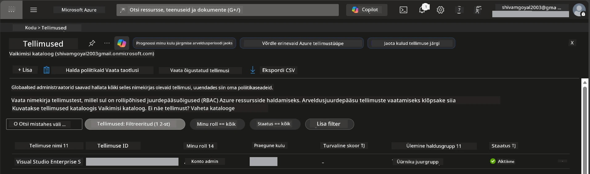

# Moodul 0 - Eeltingimused

Enne töötuba alustamist kinnitage, et teil on valmis järgmised tööriistad, ligipääs ja keskkond. Järgige kõiki allolevaid samme – ärge vahele jätke.

---

## 1. Azure konto ja tellimus

### 1.1 Looge või kontrollige oma Azure tellimust

1. Avage veebibrauser ja minge aadressile [https://azure.microsoft.com/free/](https://azure.microsoft.com/free/).
2. Kui teil pole Azure kontot, klõpsake nuppu **Alusta tasuta** ja järgige registreerumisprotsessi. Vajate Microsofti kontot (või looge see) ja krediitkaarti isikutuvastuseks.
3. Kui teil on juba konto, logige sisse aadressil [https://portal.azure.com](https://portal.azure.com).
4. Portaalis klõpsake vasakul navigeerimisribal nuppu **Subscriptions** (Tellimused) (või otsige ülaservas "Subscriptions").
5. Kontrollige, et teil oleks vähemalt üks **Aktivne** tellimus. Märkige üles **Subscription ID** – seda vajate hiljem.



### 1.2 Mõistke vajalikke RBAC rolle

[Hosted Agent](https://learn.microsoft.com/azure/foundry/agents/concepts/hosted-agents) juurutamiseks on vajalikud **andmete tegevuse** õigused, mida tavalised Azure `Owner` ja `Contributor` rollid ei hõlma. Teil peab olema üks neist [rollide kombinatsioonidest](https://learn.microsoft.com/azure/foundry/concepts/rbac-foundry#built-in-roles):

| Stsenaarium | Vajalikud rollid | Kus neid määrata |
|-------------|------------------|------------------|
| Loo uus Foundry projekt | **Azure AI Owner** Foundry ressursil | Foundry ressurss Azure Portaalis |
| Juuruta olemasolevasse projekti (uued ressursid) | **Azure AI Owner** + **Contributor** tellimusel | Tellimus + Foundry ressurss |
| Juuruta täielikult konfigureeritud projekti | **Reader** kontol + **Azure AI User** projektis | Konto + Projekt Azure Portaalis |

> **Oluline:** Azure `Owner` ja `Contributor` rollid hõlmavad vaid *haldustegevusi* (ARM toimingud). Teil on vaja [**Azure AI User**](https://learn.microsoft.com/azure/foundry/concepts/rbac-foundry#built-in-roles) (või kõrgemat) rolli *andmete tegevuste* jaoks, näiteks `agents/write`, mida on vaja agentide loomiseks ja juurutamiseks. Nende rollide määramise teete [Moodulis 2](02-create-foundry-project.md).

---

## 2. Kohalike tööriistade installimine

Installige allpool iga tööriist. Pärast installimist kontrollige, et see töötab, käivitades kontrollkäsku.

### 2.1 Visual Studio Code

1. Minge aadressile [https://code.visualstudio.com/](https://code.visualstudio.com/).
2. Laadige alla installer oma operatsioonisüsteemi jaoks (Windows/macOS/Linux).
3. Käivitage installeri vaikevalikutega.
4. Avage VS Code ja veenduge, et see käivitub.

### 2.2 Python 3.10+

1. Minge aadressile [https://www.python.org/downloads/](https://www.python.org/downloads/).
2. Laadige alla Python versioon 3.10 või uuem (soovitatav 3.12+).
3. **Windows:** Installimise ajal märkige esimesel ekraanil ruut **"Add Python to PATH"**.
4. Avage terminal ja kontrollige:

   ```powershell
   python --version
   ```

   Oodatav väljund: `Python 3.10.x` või uuem.

### 2.3 Azure CLI

1. Minge aadressile [https://learn.microsoft.com/cli/azure/install-azure-cli](https://learn.microsoft.com/cli/azure/install-azure-cli).
2. Järgige oma operatsioonisüsteemi installijuhiseid.
3. Kontrollige:

   ```powershell
   az --version
   ```

   Oodatav: `azure-cli 2.80.0` või uuem.

4. Logige sisse:

   ```powershell
   az login
   ```

### 2.4 Azure Developer CLI (azd)

1. Minge aadressile [https://learn.microsoft.com/azure/developer/azure-developer-cli/install-azd](https://learn.microsoft.com/azure/developer/azure-developer-cli/install-azd).
2. Järgige oma OS-i installijuhiseid. Windowsis:

   ```powershell
   winget install microsoft.azd
   ```

3. Kontrollige:

   ```powershell
   azd version
   ```

   Oodatav: `azd version 1.x.x` või uuem.

4. Logige sisse:

   ```powershell
   azd auth login
   ```

### 2.5 Docker Desktop (valikuline)

Dockerit vajate ainult juhul, kui soovite enne juurutamist lokaalselt konteineripilti luua ja testida. Foundry laiendus haldab konteinerite ehitamist automaatselt juurutamise ajal.

1. Minge aadressile [https://docs.docker.com/get-docker/](https://docs.docker.com/get-docker/).
2. Laadige alla ja installige Docker Desktop oma OS-i jaoks.
3. **Windows:** Veenduge, et installimisel on valitud WSL 2 taustsüsteem.
4. Käivitage Docker Desktop ja oodake, kuni süsteemses salves kuvatakse ikooniga teade **"Docker Desktop töötab"**.
5. Avage terminal ja kontrollige:

   ```powershell
   docker info
   ```

   See peaks kuvama Docker süsteemiinfo ilma vigadeta. Kui näete `Cannot connect to the Docker daemon`, oodake paar sekundit, kuni Docker täielikult käivitub.

---

## 3. VS Code laienduste installimine

Vajalikke on kolm laiendust. Paigaldage need **enne** töötuba.

### 3.1 Microsoft Foundry VS Code jaoks

1. Avage VS Code.
2. Vajutage `Ctrl+Shift+X`, et avada laienduste panel.
3. Otsingusse tippige **"Microsoft Foundry"**.
4. Leidke **Microsoft Foundry for Visual Studio Code** (väljaandja: Microsoft, ID: `TeamsDevApp.vscode-ai-foundry`).
5. Klõpsake **Installi**.
6. Pärast installi näete vasakul ribal ikooni **Microsoft Foundry**.

### 3.2 Foundry Toolkit

1. Laienduste panelis otsige **"Foundry Toolkit"**.
2. Leidke **Foundry Toolkit** (väljaandja: Microsoft, ID: `ms-windows-ai-studio.windows-ai-studio`).
3. Klõpsake **Installi**.
4. **Foundry Toolkit** ikoon ilmub tegevusribale.

### 3.3 Python

1. Laienduste panelis otsige **"Python"**.
2. Leidke **Python** (väljaandja: Microsoft, ID: `ms-python.python`).
3. Klõpsake **Installi**.

---

## 4. Logi sisse Azure keskkonda VS Code kaudu

[Microsoft Agent Framework](https://learn.microsoft.com/agent-framework/overview/) kasutab autentimiseks [`DefaultAzureCredential`](https://learn.microsoft.com/azure/developer/python/sdk/authentication/credential-chains#defaultazurecredential-overview) meetodit. Teil peab olema Azure konto aktiivsena VS Code's.

### 4.1 Logi sisse VS Code kaudu

1. Vaadake VS Code all vasakut nurka ja klõpsake **Accounts** ikoonil (inimese siluett).
2. Klõpsake **Sign in to use Microsoft Foundry** (või **Logi sisse Azure'iga**).
3. Avaneb brauseriaknas, kuhu logite sisse Azure kontoga, millel on ligipääs tellimusele.
4. Tagasi VS Code'sse. Näete oma kontonime all vasakul.

### 4.2 (Valikuline) Logi sisse Azure CLI kaudu

Kui olete installinud Azure CLI ja eelistate käsureapõhist autentimist:

```powershell
az login
```

See avab brauseri sisselogimiseks. Logige sisse ja seadistage õige tellimus:

```powershell
az account set --subscription "<your-subscription-id>"
```

Kontrollige:

```powershell
az account show --query "{name:name, id:id, state:state}" --output table
```

Peaksite nägema oma tellimuse nime, ID-d ja olekut = `Enabled`.

### 4.3 (Alternatiiv) Teenusepõhine autentimine

CI/CD või jagatud keskkondade jaoks seadke järgmised keskkonnamuutujad:

```powershell
$env:AZURE_TENANT_ID = "<your-tenant-id>"
$env:AZURE_CLIENT_ID = "<your-client-id>"
$env:AZURE_CLIENT_SECRET = "<your-client-secret>"
```

---

## 5. Eelvaate piirangud

Enne jätkamist teadke praegusi piiranguid:

- [**Hosted Agents**](https://learn.microsoft.com/azure/foundry/agents/concepts/hosted-agents) on hetkel **avalikus eelvaates** – neid ei soovitata tootmiskeskkondades kasutada.
- **Toetuspiirkonnad on piiratud** – kontrollige [piirkonna saadavust](https://learn.microsoft.com/azure/foundry/agents/concepts/hosted-agents#region-availability) enne ressursside loomist. Vale piirkonna valimisel juurutamine ebaõnnestub.
- `azure-ai-agentserver-agentframework` pakett on eelversioonis (`1.0.0b16`) – API-d võivad muutuda.
- Skaalapiirangud: hosted agents toetavad 0-5 koopiat (kaasa arvatud nullini skaaleerimine).

---

## 6. Kontrollnimekiri

Kontrollige iga alljärgnevat punkti. Kui mõni samm ebaõnnestub, minge tagasi ja parandage enne jätkamist.

- [ ] VS Code avaneb ilma vigadeta
- [ ] Python 3.10+ on PATH-s (`python --version` näitab `3.10.x` või uuemat)
- [ ] Azure CLI on installitud (`az --version` näitab `2.80.0` või uuemat)
- [ ] Azure Developer CLI on installitud (`azd version` kuvab versiooniteavet)
- [ ] Microsoft Foundry laiendus on paigaldatud (ikoon nähtav tegevusribal)
- [ ] Foundry Toolkit laiendus on paigaldatud (ikoon nähtav tegevusribal)
- [ ] Python laiendus on paigaldatud
- [ ] Olete Azure sisse logitud VS Code's (kontode ikoon, all vasakul)
- [ ] `az account show` tagastab teie tellimuse andmed
- [ ] (Valikuline) Docker Desktop töötab (`docker info` kuvab süsteemiinfot ilma vigadeta)

### Kontrollpunkt

Avage VS Code tegevusriba ja veenduge, et näete nii **Foundry Toolkit** kui ka **Microsoft Foundry** külgriba vaateid. Klõpsake mõlemal ja kontrollige, et need laevad ilma vigadeta.

---

**Järgmine:** [01 - Install Foundry Toolkit & Foundry Extension →](01-install-foundry-toolkit.md)

---

<!-- CO-OP TRANSLATOR DISCLAIMER START -->
**Vastutusest loobumine**:
See dokument on tõlgitud kasutades tehisintellekti tõlketeenust [Co-op Translator](https://github.com/Azure/co-op-translator). Kuigi me püüame täpsust, palun arvestage, et automaatsed tõlked võivad sisaldada vigu või ebatäpsusi. Algne dokument oma emakeeles peaks olema autoriteetne allikas. Olulise teabe puhul soovitatakse kasutada professionaalset inimtõlget. Me ei vastuta tõlke kasutamisest tingitud arusaamatuste ega valesti mõistmiste eest.
<!-- CO-OP TRANSLATOR DISCLAIMER END -->