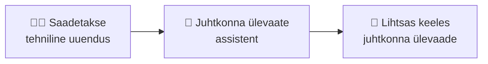

# Moodul 0 - Sissejuhatus

⏱️ ~10 min

> [!WARNING]
> **Eelvaade & piirangud:** [Hostitud agendid](https://learn.microsoft.com/azure/foundry/agents/concepts/hosted-agents) on praegu **avalikus eelvaates** - ei soovitata tootmiskeskkondadele. Ole teadlik järgmistest:
> - **Toetatud piirkonnad on piiratud** - kontrolli enne ressursside loomist [piirkonna saadavust](https://learn.microsoft.com/azure/foundry/agents/concepts/hosted-agents#region-availability). Kui valid mittetoetatud piirkonna, ebaõnnestub juurutus.
> - `azure-ai-agentserver-agentframework` pakett on eelversioonis - API-d võivad versiooniti muutuda.
> - Skaala piirangud: hostitud agendid toetavad 0–5 koopiat (sh skaala nulli).
> - Mõned selles töötoas näidatud funktsioonid võivad teenuse GA-le liikumisel muutuda.

## Mida sa ehitad

Selles töötoas ehitad sa **"Selgita nagu olen juht"** agendi - hostitud tehisintellekti agendi, mis muudab keerulised tehnilised uuendused lihtsaks ingliskeelseks juhtide kokkuvõtteks.

```mermaid
flowchart LR
    A["🧑‍💻 Saadetakse\ntehniline uuendus"] --> B["🤖 Juhtkonna ülevaate\nassistent"]
    B --> C["📝 Lihtsas keeles\njuhtkonna ülevaade"]
```

**Agent kasutab:**
- **Microsoft Agent Frameworki** - agendi loogika ja struktuuri jaoks
- **Foundry Toolkit for VS Code’i** - skaffoldimiseks, lokaalseks testimiseks ja juurutamiseks
- **Tehisintellekti mudelit** (nt `gpt-4.1-mini/gpt-5-mini`) - kokkuvõtete genereerimiseks

Selle töötoa lõpuks on sul töötav agent, mida saad testida lokaalselt Agent Inspectoriga ja valikuliselt pilve juurutada.

---

## Mis on hostitud agendid?

**Hostitud agent** on tehisintellekti agent, mis töötab Microsoft Foundry hallatava teenusena. Oma infrastruktuuri haldamise asemel pakendad agendi koodi konteinerisse ja Foundry haldab skaleerimist, hostimist ja selle standardse HTTP lõpp-punkti kaudu kättesaadavaks tegemist.

| Mõiste | Tähendus |
|---------|--------------|
| **Agent** | Sinu Python kood, mis vastu võtab kasutaja sõnumi, kutsub tehisintellekti mudelit ja tagastab struktureeritud vastuse |
| **Hostitud** | Foundry käitab sinu konteinerit - mingeid VM-e, Kubernetesi ega infrastruktuuri pole vaja hallata |
| **Vastuste protokoll** | Standardne HTTP API (`POST /responses`), mida saab kõiki kliendid sinu agenti suhtlema kutsuda |
| **Agent Inspector** | Kohalik testimisliides (Foundry Toolkitis sisseehitatud), millega saad enne juurutamist agendiga suhelda |

Selles töötoas liigu nullist kuni täielikult hostitud agendini või peatu vaid lokaaltestimise juures, kui soovid.

---

## Vali oma tee

> ⚠️ **Vali enne jätkamist üks tee.** Sinu valik määrab, milliseid tööriistu paigaldada ja millised moodulid kehtivad. Hiljem saad vajadusel teed vahetada (Path B → Path A) kui saad Azure tellimuse.

<strong>🅰️ Tee A - Azure pilv (nõuab Azure tellimust)</strong>

| | Üksikasjad |
|---|---|
| **Kellele see sobib?** | Sul on aktiivne Azure tellimus ja saad luua Foundry ressursse |
| **Mudeli kasutus** | Azure OpenAI Foundry kaudu (nt `gpt-4.1-mini/gpt-5-mini`) |
| **Kattuvad moodulid** | Kõik moodulid (00–07) |
| **Juurutada pilve?** | ✅ Jah - täielik algusest lõpuni juurutus |

<strong>🅱️ Tee B - Kohalik / tasuta tase (pole vaja Azure tellimust)</strong>

| | Üksikasjad |
|---|---|
| **Kellele see sobib?** | MVP-d, üliõpilased või kõik ilma Azure juurdepääsuta |
| **Mudeli kasutus** | **Foundry Local** (tasuta, töötab su masinas) |
| **Kattuvad moodulid** | Moodulid 00–04 (jäta vahele juurutus ja pilve valideerimine) |
| **Juurutada pilve?** | ❌ Ei - ainult lokaalne testimine Agent Inspectoriga |

---

## Kõik teed: vajalikud tööriistad

Paigalda allpool iga tööriist. Pärast paigaldamist kontrolli, kas see töötab, käivitades kontrollkäsku.

| # | Tööriist | Versioon | Paigalda | Kontrolli (ootuspärane väljastus) |
|---|------|---------|---------|---------------------------|
| 1 | **Visual Studio Code** | Viimane | [code.visualstudio.com](https://code.visualstudio.com/) | Avaneb ilma vigadeta |
| 2 | **Python** | 3.12 või uuem| [python.org/downloads](https://www.python.org/downloads/) | `python --version` $\rightarrow$ `Python 3.12.x` |
| 3 | **Foundry Toolkit for VS Code** | Viimane | Laienduse ID: `ms-windows-ai-studio.windows-ai-studio` | Foundry ikoon tegevusribal |
| 4 | **Python laiendus VS Code jaoks** | Viimane | Laienduse ID: `ms-python.python` | Paigaldatud laienduste paneelis |

> [!TIP]
> **Paigaldusnipid:**
> - **Python PATH (Windows):** Kontrolli alati esimesel ekraanil Python paigaldajal **„Add Python to PATH”** märkeruutu. Ilma selleta ei tunta `python` käsku terminalis ära.
> - **Mitme Python versiooni korral:** Kui sul on paigaldatud nii Python 3.10 kui 3.12, kasuta virtuaalkeskkonna loomiseks `python3.12 -m venv .venv`, et kasutada õiget versiooni.
> - **Docker WSL 2 (Windows):** Docker Desktopi paigalduse ajal veendu, et oleks valitud **WSL 2 backend**. Docker Hyper-V-ga on aeglasem ja võib tekitada probleeme Foundry konteinerite ehitamisel.
> - **Docker ei alga?** Oota 30–60 sekundit pärast Docker Desktopi käivitamist. Käivita `docker info` - kui kuvatakse „Cannot connect to the Docker daemon,” siis Docker on veel initsialiseerimises.
> - **VS Code laiendused ei laadi?** Pärast laienduste paigaldust lae aken uuesti: `Ctrl+Shift+P` → `Developer: Reload Window`.

> **Windows kasutajatele:** Märgi Python paigaldamisel kindlasti **„Add Python to PATH”**.

**Järgmine:** [01 - Setup →](01-setup.md)

---

<!-- CO-OP TRANSLATOR DISCLAIMER START -->
**Lahtiütlus**:
See dokument on tõlgitud kasutades AI tõlketeenust [Co-op Translator](https://github.com/Azure/co-op-translator). Kuigi me püüdleme täpsuse poole, palun pange tähele, et automatiseeritud tõlgetes võib esineda vigu või ebatäpsusi. Originaaldokument selle emakeeles tuleks pidada autoriteetseks allikaks. Olulise teabe puhul soovitatakse kasutada professionaalset inimtõlget. Me ei vastuta selle tõlkega seotud eksimustest või valesti mõistmistest.
<!-- CO-OP TRANSLATOR DISCLAIMER END -->