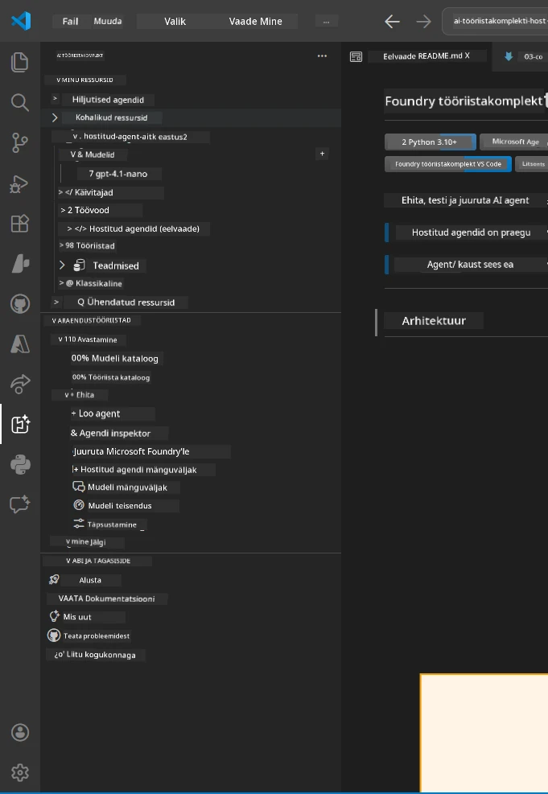
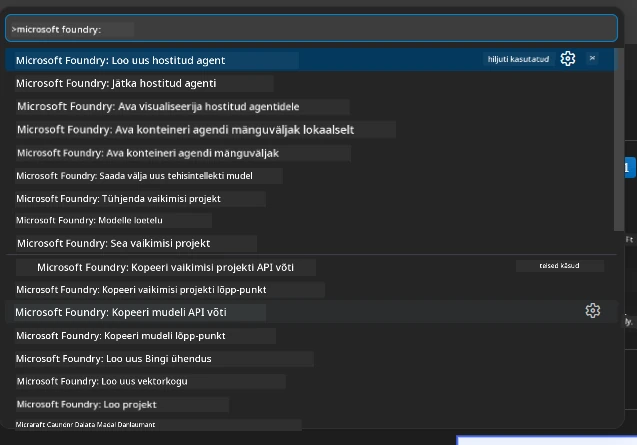

# Moodul 1 - Foundry tööriistakomplekti ja Foundry laienduse installimine

See moodul juhendab sind kahe keskse VS Code laienduse installimisel ja kontrollimisel selle töötoa jaoks. Kui installisid need juba [Moodulis 0](00-prerequisites.md), kasuta seda moodulit, et kontrollida, kas need töötavad korralikult.

---

## Samm 1: Installi Microsoft Foundry laiendus

**Microsoft Foundry for VS Code** laiendus on sinu peamine tööriist Foundry projektide loomiseks, mudelite juurutamiseks, majutatud agentide genereerimiseks ja otse VS Code’ist juurutamiseks.

1. Ava VS Code.
2. Vajuta `Ctrl+Shift+X`, et avada **Laiendused** paneel.
3. Otsi ülaosas olevasse otsingukasti: **Microsoft Foundry**
4. Leia tulemus nimega **Microsoft Foundry for Visual Studio Code**.
   - Avaldaja: **Microsoft**
   - Laienduse ID: `TeamsDevApp.vscode-ai-foundry`
5. Klõpsa **Installi** nuppu.
6. Oota paigalduse lõpetamist (näed väikest edenemisriba).
7. Pärast paigaldamist vaata **Tegevusriba** (vertikaalne ikooniriba VS Code’i vasakul küljel). Seal peaks olema uus **Microsoft Foundry** ikoon (näeb välja nagu teemant/AI ikoon).
8. Klõpsa **Microsoft Foundry** ikooni, et avada selle külgriba vaade. Peaksid nägema järgmisi sektsioone:
   - **Ressursid** (või projektid)
   - **Agendid**
   - **Mudelid**

> **Kui ikoon ei ilmu:** Proovi VS Code'i taaskäivitada (`Ctrl+Shift+P` → `Developer: Reload Window`).

---

## Samm 2: Installi Foundry Toolkit laiendus

**Foundry Toolkit** laiendus pakub [**Agent Inspectorit**](https://learn.microsoft.com/azure/foundry/agents/how-to/vs-code-agents-workflow-pro-code) – visuaalset liidest agentide kohalikuks testimiseks ja silumiseks – pluss liivakasti, mudelite haldust ja hindamistööriistu.

1. Laienduste paneelis (`Ctrl+Shift+X`) tühjenda otsing ja trüüki: **Foundry Toolkit**
2. Leia nimekirjast **Foundry Toolkit**.
   - Avaldaja: **Microsoft**
   - Laienduse ID: `ms-windows-ai-studio.windows-ai-studio`
3. Klõpsa **Installi**.
4. Pärast installi ilmub **Foundry Toolkit** ikoon tegevusribale (näeb välja nagu robot/ säde ikoon).
5. Klõpsa **Foundry Toolkit** ikooni, et avada selle külgriba vaade. Peaksid nägema Foundry Toolkiti tervitusekraani valikutega:
   - **Mudelid**
   - **Liivakast**
   - **Agendid**

---

## Samm 3: Kinnita, et mõlemad laiendused töötavad

### 3.1 Kontrolli Microsoft Foundry laiendust

1. Klõpsa tegevusribal **Microsoft Foundry** ikooni.
2. Kui oled sisse logitud Azure’i (Moodulist 0), peaksid nägema oma projekte allosas **Ressursid**.
3. Kui küsitakse, logi sisse, klõpsates **Sign in** ja järgi autentimise juhiseid.
4. Veendu, et külgriba avaneb veateateta.

### 3.2 Kontrolli Foundry Toolkit laiendust

1. Klõpsa tegevusribal **Foundry Toolkit** ikooni.
2. Veendu, et tervitusvaade või peamine paneel avaneb veateateta.
3. Sa ei pea veel midagi seadistama – Agent Inspectori kasutame [Moodulis 5](05-test-locally.md).

### 3.3 Kontrolli käsupaletiga

1. Vajuta `Ctrl+Shift+P`, et avada käsupalett.
2. Trüüki **"Microsoft Foundry"** – sa peaksid nägema käske nagu:
   - `Microsoft Foundry: Create a New Hosted Agent`
   - `Microsoft Foundry: Deploy Hosted Agent`
   - `Microsoft Foundry: Open Model Catalog`
3. Vajuta `Escape`, et käsupalett sulgeda.
4. Ava käsupalett uuesti ja trüüki **"Foundry Toolkit"** – peaksid nägema käske nagu:
   - `Foundry Toolkit: Open Agent Inspector`

> Kui sa neid käske ei näe, ei pruugi laiendused olla õigesti paigaldatud. Proovi need eemaldada ja uuesti installida.

---

## Mida need laiendused selles töötoas teevad

| Laiendus | Mida see teeb | Millal seda kasutad |
|-----------|---------------|---------------------|
| **Microsoft Foundry for VS Code** | Loo Foundry projekte, juuruta mudeleid, **genereeri [hostitud agendid](https://learn.microsoft.com/azure/foundry/agents/concepts/hosted-agents)** (automaatselt genereeritakse `agent.yaml`, `main.py`, `Dockerfile`, `requirements.txt`), juuruta [Foundry Agent Service’i](https://learn.microsoft.com/azure/foundry/agents/overview) | Moodulid 2, 3, 6, 7 |
| **Foundry Toolkit** | Agent Inspector kohaliku testimise ja silumise jaoks, liivakasti kasutajaliides, mudelite haldus | Moodulid 5, 7 |

> **Foundry laiendus on selles töötoas kõige olulisem tööriist.** See haldab kogu elutsüklit: genereerimine → seadistamine → juurutamine → kontroll. Foundry Toolkit täiendab seda visuaalse Agent Inspectoriga kohalikuks testimiseks.

---

### Kontrollpunkt

- [ ] Microsoft Foundry ikoon on nähtav tegevusribal
- [ ] Klõpsamisel avaneb külgriba veateateta
- [ ] Foundry Toolkit ikoon on nähtav tegevusribal
- [ ] Klõpsamisel avaneb külgriba veateateta
- [ ] `Ctrl+Shift+P` → "Microsoft Foundry" trükkides kuvatakse käsud
- [ ] `Ctrl+Shift+P` → "Foundry Toolkit" trükkides kuvatakse käsud

---

**Eelmine:** [00 - Nõuded](00-prerequisites.md) · **Järgmine:** [02 - Loo Foundry projekt →](02-create-foundry-project.md)

---

<!-- CO-OP TRANSLATOR DISCLAIMER START -->
**Tähelepanek**:  
See dokument on tõlgitud AI tõlkimisteenuse [Co-op Translator](https://github.com/Azure/co-op-translator) abil. Kuigi püüame täpsust, tuleb arvestada, et automaatsed tõlked võivad sisaldada vigu või ebatäpsusi. Originaaldokument oma emakeeles tuleks käsitada autoriteetse allikana. Tähtsa info puhul soovitatakse kasutada professionaalset inimtõlget. Me ei vastuta selle tõlke kasutamisest tekkida võivate arusaamatuste või valesti mõistmiste eest.
<!-- CO-OP TRANSLATOR DISCLAIMER END -->