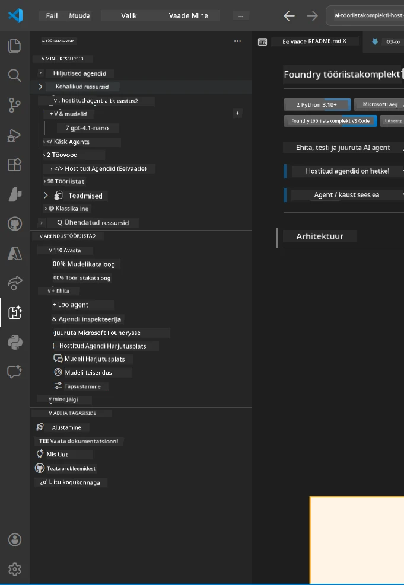
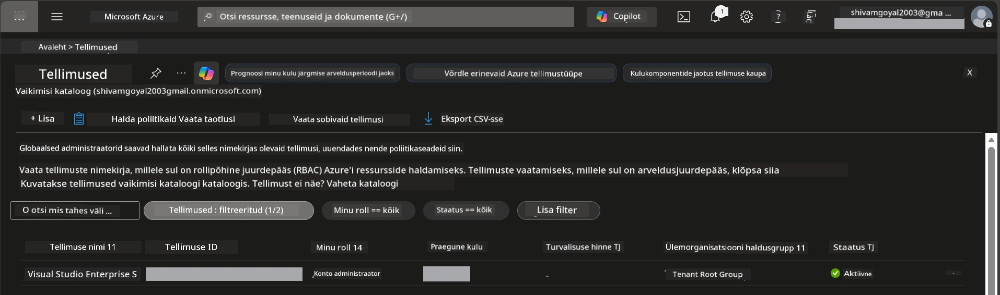
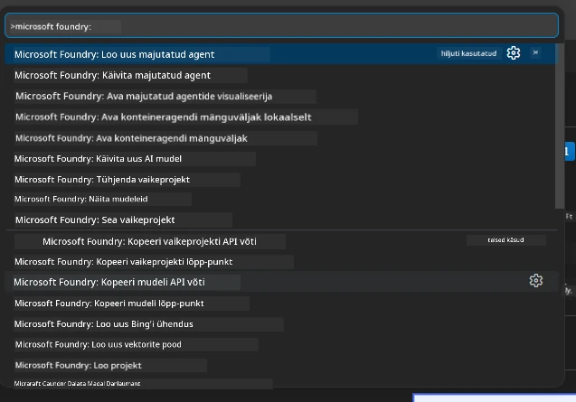
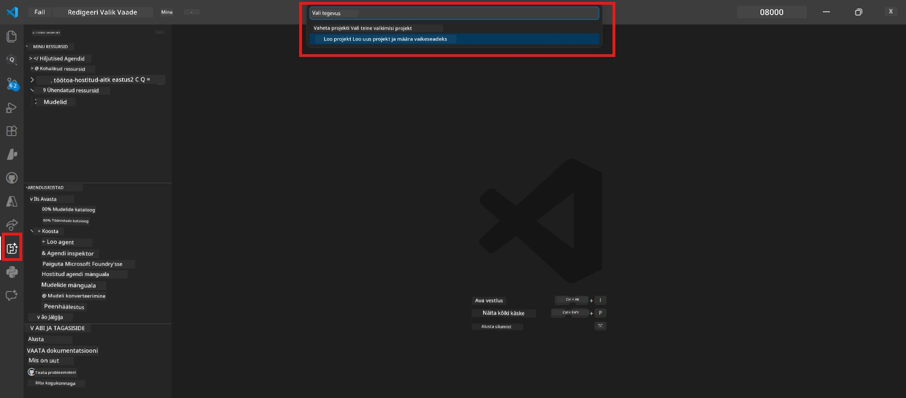
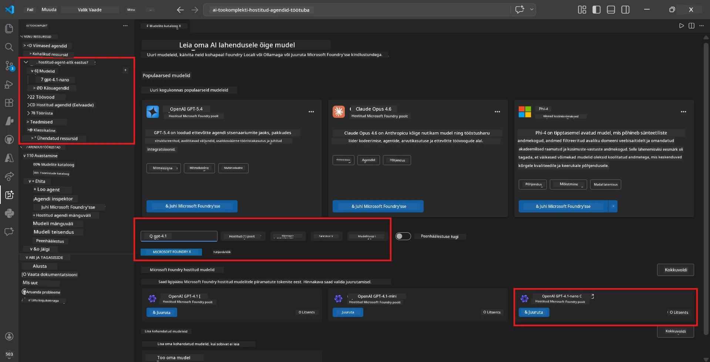
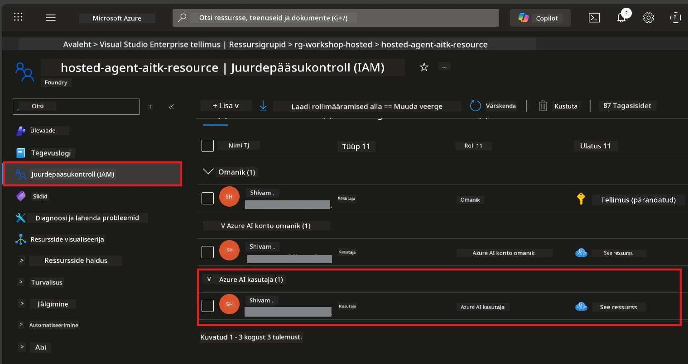

# Seadistamine: laiendus, projekt ja mudel

⏱️ ~15 minutit

Selles moodulis paigaldate ja kontrollite Foundry Toolkit laiendust, loote (või ühendate) Foundry projekti ja kasutusele võtate mudeli, mida teie agent kasutab.

## Samm 1: Paigalda Foundry Toolkit

**Foundry Toolkit for VS Code** on selle töötuba peamine laiendus. See pakub projekti loomist, mudeli juurutamist, agendi alustamist, kohalikku testimist (Agent Inspector) ja pilve juurutamist – kõik VS Code’is.

1. Ava VS Code ja vajuta `Ctrl+Shift+X`, et avada **Laienduste** paneel.
2. Otsi **Foundry Toolkit**.
3. Paigalda **Foundry Toolkit for VS Code** (väljaandja: Microsoft, ID: `ms-windows-ai-studio.windows-ai-studio`).
4. Pärast paigaldamist ilmub **Foundry Toolkit** ikoon tegevusribale (vasak küljeriba).

> *Märkus: Vanemates laiendusversioonides võib tegevusribal olla tekst "AI TOOLKIT". Funktsionaalsus on identne.*



## Samm 2: Seadista vastavalt oma juurdepääsule

> **Vali oma tee:** Laienda allolevat jaotist, mis vastab sinu seadistusele. Vaja on täita vaid **üks** tee.

<details>
<summary><strong>🅰️ Tee A - Azure pilv (nõuab Azure tellimust)</strong></summary>

### Azure CLI

1. Paigalda aadressilt [learn.microsoft.com/cli/azure/install-azure-cli](https://learn.microsoft.com/cli/azure/install-azure-cli).
2. Kontrolli: `az --version` (ootuspäraselt 2.80.0+).
3. Logi sisse: `az login`

### Autentimisvalikud

[Microsoft Agent Framework](https://learn.microsoft.com/agent-framework/overview/) kasutab [`DefaultAzureCredential`](https://learn.microsoft.com/azure/developer/python/sdk/authentication/credential-chains#defaultazurecredential-overview), mis proovib järjest mitut autentimismeetodit. Vali endale sobiv:

#### Variant 1: VS Code kontod (soovitatav töötubade puhul)
1. Klõpsa VS Code vasakpoolses alumises nurgas ikoonil **Accounts** (isikute siluett).
2. Vali **Sign in to use Microsoft Foundry** (või **Sign in with Azure**).
3. Avaneb brauser – logi sisse Azure kontoga, millel on juurdepääs tellimusele.
4. Naase VS Code’i. Nurgas peaks nägema oma kontonime.

#### Variant 2: Azure CLI
```bash
az login
az account set --subscription "<your-subscription-id>"
```

#### Variant 3: Teenusepõhine isik (Enterprise/CI)
Tugevalt piiratud keskkondades või CI/CD torudeks määra need keskkonnamuutujad oma `.env` failis:
```env
AZURE_TENANT_ID=<your-tenant-id>
AZURE_CLIENT_ID=<your-client-id>
AZURE_CLIENT_SECRET=<your-client-secret>
```

> **Kuidas `DefaultAzureCredential` töötab:** Esmalt kontrollib keskkonnamuutujaid, siis hallatud identiteeti, siis VS Code sisselogimist, siis Azure CLI’d – ja kasutab esimest edukat meetodit. Vaata [autentimisahela dokumentatsiooni](https://learn.microsoft.com/azure/developer/python/sdk/authentication/credential-chains#defaultazurecredential-overview).

### Azure arendaja CLI (azd)

1. Paigalda: `winget install microsoft.azd` (Windows) või vaata [paigaldusdokumente](https://learn.microsoft.com/azure/developer/azure-developer-cli/install-azd).
2. Kontrolli: `azd version`
3. Logi sisse: `azd auth login`

### Docker Desktop (vabatahtlik)

Dockerit vajad ainult siis, kui tahad lokaalselt konteineid ehitada. Foundry laiendus teeb ehitused automaatselt juurutamise ajal.

1. Paigalda aadressilt [docs.docker.com/get-docker](https://docs.docker.com/get-docker/).
2. Kontrolli: `docker info`

### Azure tellimus & RBAC

1. Logi sisse aadressil [portal.azure.com](https://portal.azure.com).
2. Liigu menüüsse **Subscriptions** ja kontrolli, et vähemalt üks on **Aktiivne**.
3. Märgi üles oma **Subscription ID** – seda vajad moodulis 01.



#### RBAC stsenaariumitabel

[Hostitud agendi](https://learn.microsoft.com/azure/foundry/agents/concepts/hosted-agents) juurutamiseks on vajalikud **andmetöötluse** õigused, mida tavalised Azure `Owner` ja `Contributor` rollid ei hõlma. Kasuta allolevat tabelit, et määrata vajalikud rollid:

| Stsenaarium | Vajalikud rollid | Kus määrata |
|------------|-----------------|-------------|
| Uue Foundry projekti loomine | **Azure AI Owner** Foundry ressursil | Foundry ressurss Azure portaali sees |
| Juurutamine olemasolevale projektile (uued ressursid) | **Azure AI Owner** + **Contributor** tellimusel | Tellimus + Foundry ressurss |
| Täielikult seadistatud projekti juurutamine | **Reader** kontol + **Azure AI User** projektis | Konto + Projekt Azure portaali sees |
| Ainult kohalik testimine (ilma juurutamiseta) | **Azure AI User** projektis | Projekt Azure portaali sees |

> **Oluline:** Azure `Owner` ja `Contributor` rollid hõlmavad ainult *haldusõigusi* (ARM toimingud). Andmetöötluse jaoks on vaja [**Azure AI User**](https://learn.microsoft.com/azure/foundry/concepts/rbac-foundry#built-in-roles) (või kõrgemat rolli), näiteks `agents/write`, mis on vajalik agentide loomiseks ja juurutamiseks.

## Ühenda või loo Foundry projekt



1. Vajuta `Ctrl+Shift+P` → kirjuta **Foundry Toolkit: Create Project** → vali see.
2. Vali rippmenüüst oma **Azure tellimus**.
3. Vali või loo **ressursigrupp** (nt `rg-hosted-agents-workshop`).
4. Vali **regioon**, mis toetab hostitud agente: `East US`, `West US 2` või `Sweden Central`. Vaata [regiooni saadavust](https://learn.microsoft.com/azure/foundry/agents/concepts/hosted-agents#region-availability).
5. Sisesta projekti nimi (nt `workshop-agents`).
6. Oota 2–5 minutit, kuni ülesehitus toimub. VS Code’is ilmub edenemisinfo.
7. Kui valmib, kuvatakse su projekt **Foundry Toolkit** küljeribal **MINU RESSURSID** all.



## Juuruta mudel ja määra RBAC

Su hostitud agent vajab AI mudelit vastuste genereerimiseks.

#### Mudelite valiku maatriks
Vajalike omaduste põhjal saad valida erinevate mudelitasemete vahel:

| Mudel | Sobib kõige paremini | Hind | Märkused |
|-------|---------------------|------|----------|
| `gpt-4.1` | Kvaliteetsed ja nüansirohked vastused | Kõrgem | Parim tulemused, soovitatav lõplikuks testimiseks |
| `gpt-4.1-mini/gpt-5-mini` | Kiired iteratsioonid, madalam hind | Madalam | Hea töötuba arendamiseks ja kiireks testimiseks |
| `gpt-4.1-nano` | Kerged ülesanded | Kõige madalam | Kõige kulutõhusam, kuid lihtsamad vastused |

1. Vajuta `Ctrl+Shift+P` → **Foundry Toolkit: Open Model Catalog** (või klõpsa küljeribal DEVELOPER TOOLS all **Model Catalog** → Discover).
2. Otsi kataloogist **gpt-4.1**.
3. Leia **OpenAI GPT-4.1-mini** (või `gpt-5-mini` parema kvaliteedi saamiseks) ja klõpsa **Deploy**.



4. Juurutuse konfiguratsioonis:
   - **Juurutuse nimi:** Kasuta vaikimisi nime või sisesta enda valitud nimi. **Jäta see nimi meelde.**
   - **Siht:** Vali **Deploy to Foundry Toolkit** → vali oma projekt.
5. Klõpsa **Deploy** ja oota 1–3 minutit.

> **Soovitus:** Kasuta töötuba jaoks mudelit `gpt-4.1-mini/gpt-5-mini` – see on kiire, taskukohane ja annab häid tulemusi.

### Märgi oma väärtused üles

Pärast juurutust märgi üles need kaks väärtust (vajad neid moodulis 03):

| Väärtus | Kus seda leida |
|---------|----------------|
| **Projekti lõpp-punkt** | Klõpsa projektil küljeribal → detailvaates kuvatakse URL (nt `https://<account>.services.ai.azure.com/api/projects/<project>`) |
| **Mudeli juurutuse nimi** | Ava projekt → **Models** → nimi koos juurutatud mudeliga (nt `gpt-4.1-mini/gpt-5-mini`) |

### Määra RBAC roll

> ⚠️ **See on kõige sagedamini tähelepanuta jäetud samm.** Ilma õige rollita ebaõnnestub juurutus moodulis 05.

#### Millist rolli ma vajan?
Sõltuvalt olukorrast vajad järgmisi rollide kombinatsioone:

| Stsenaarium | Vajalikud rollid | Kus määrata |
|------------|-----------------|-------------|
| Uue Foundry projekti loomine | **Azure AI Owner** Foundry ressursil | Foundry ressurss Azure portaali sees |
| Juurutamine olemasolevale projektile (uued ressursid) | **Azure AI Owner** + **Contributor** tellimusel | Tellimus + Foundry ressurss |
| Täielikult seadistatud projekti juurutamine | **Reader** kontol + **Azure AI User** projektis | Konto + Projekt Azure portaali sees |

**Oluline:** Azure `Owner` ja `Contributor` rollid hõlmavad ainult haldusõigusi. Andmetöötluse jaoks vajad **Azure AI User** rolli (või kõrgemat), näiteks `agents/write`, mis on vajalik agentide loomiseks ja juurutamiseks.

1. Ava [portal.azure.com](https://portal.azure.com).
2. Otsi oma **Foundry projekti** nime → klõpsa tulemusele tüübiga **"Foundry Toolkit project"** (MITTE vanemkonto).
3. Klikka vasakul navigeerimises **Access control (IAM)**.
4. Klõpsa **+ Add** → **Add role assignment**.
5. **Rolli sakk:** Otsi **Azure AI User**, vali see, klõpsa **Next**.
6. **Liikmete sakk:** Vali **User, group, or service principal** → klõpsa **+ Select members** → leia ja vali end → klõpsa **Select**.
7. Klõpsa **Review + assign** → uuesti **Review + assign**.
8. **Oota 1–2 minutit**, et muudatused jõustuksid.

> **Miks see roll?** Azure `Owner`/`Contributor` annavad ainult haldusõigused. **Azure AI User** roll annab `agents/write` andmetöötluse õiguse, mis on vajalik agentide loomiseks ja juurutamiseks. Vaata [Foundry RBAC dokumentatsiooni](https://learn.microsoft.com/azure/foundry/concepts/rbac-foundry#built-in-roles).



</details>

<details>
<summary><strong>🅱️ Tee B - Kohalik / tasuta kava (pole vaja Azure tellimust)</strong></summary>

### Foundry Local

Foundry Local võimaldab sul jooksutada AI mudeleid oma arvutis – pilvekontot pole vaja. Saad Foundry Local mudeleid kasutada Foundry Toolkit’i kaudu, mudelikataloogi vahendusel järgmiselt:

1. Mine Foundry Toolkit laiendusse.
2. Navigeeri Foundry Toolkitis **Developer Tools** > ja vali **Model Catalog**
3. Uues aknas vali navigeerimisribal **local**.
4. Kerige alla **Phi 4 Mini** juurde ja klõpsake **lisamise nuppu**; ilmub hüpik, mis näitab, et mudelit alla laaditakse.
5. Kui mudel on alla laaditud, saad jätkata järgmise sammuga.

</details>

### ✅ Kontrollpunkt


- [ ] `Ctrl+Shift+P` → "Foundry Toolkit" kuvab saadaolevad käsud
- [ ] Foundry Toolkit laiendus on paigaldatud ja küljeriba laeb ilma vigadeta
- [ ] VS Code avaneb ja töötab korrektselt
- [ ] `python --version` näitab 3.10+
- [ ] Foundry Toolkit ikoon on nähtav VS Code tegevusribal
- [ ] **Tee A:** `az login` õnnestub, tellimus on aktiivne
- [ ] **Tee B:** Foundry Local töötab (`foundry local status`)
- [ ] **Tee A:** Foundry projekt nähtav küljeribal, mudel juurutatud, Azure AI User roll määratud
- [ ] **Tee B:** Foundry Local töötab mudeliga
- [ ] Oled märkinud üles oma **lõpp-punkti** ja **mudeli juurutuse nime**


**Eelmine:** [00 - Nõuded](00-prerequisites.md) · **Järgmine:** [02 - Loo hostitud agent →](02-create-hosted-agent.md)

---

<!-- CO-OP TRANSLATOR DISCLAIMER START -->
**Lahtiütlus**:
See dokument on tõlgitud kasutades AI tõlketeenust [Co-op Translator](https://github.com/Azure/co-op-translator). Kuigi me püüdleme täpsuse poole, palun pange tähele, et automatiseeritud tõlgetes võib esineda vigu või ebatäpsusi. Originaaldokument selle emakeeles tuleks pidada autoriteetseks allikaks. Olulise teabe puhul soovitatakse kasutada professionaalset inimtõlget. Me ei vastuta selle tõlkega seotud eksimustest või valesti mõistmistest.
<!-- CO-OP TRANSLATOR DISCLAIMER END -->