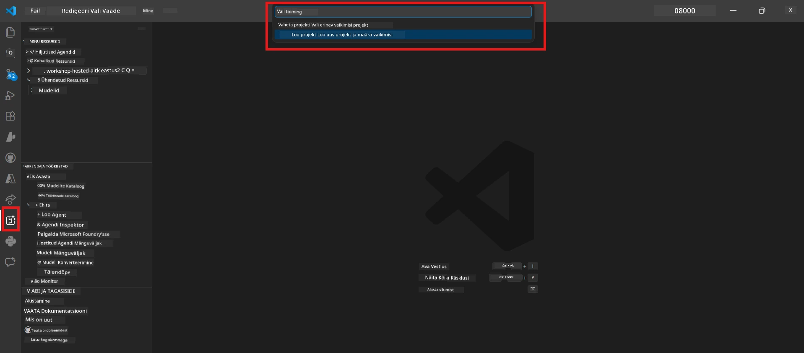
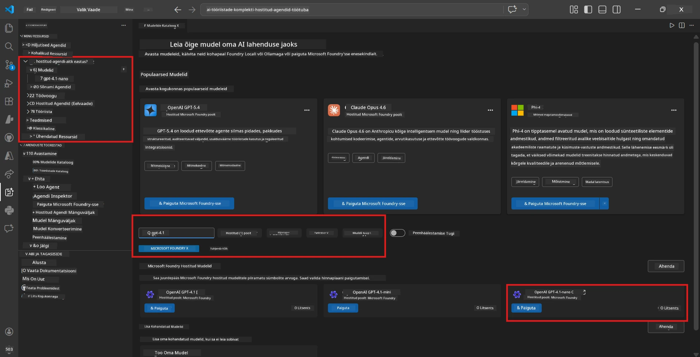
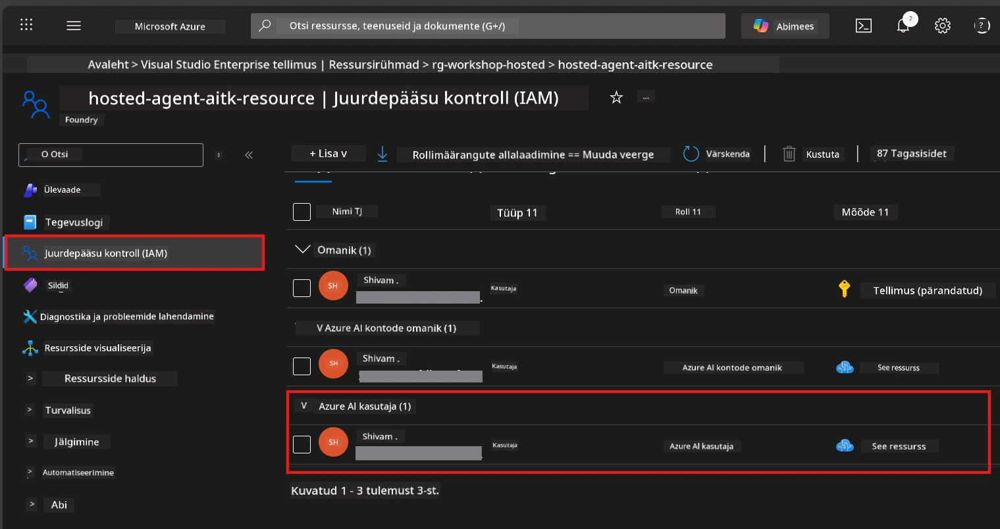

# Moodul 2 - Loo Foundry projekt ja juuruta mudel

Selles moodulis lood (või valid) Microsoft Foundry projekti ja juurutad mudeli, mida sinu agent kasutab. Iga samm on selgelt kirjeldatud – järgi neid järjekorras.

> Kui sul juba on Foundry projekt koos juurutatud mudeliga, mine otse üle [Moodulisse 3](03-create-hosted-agent.md).

---

## Samm 1: Loo Foundry projekt VS Code'is

Kasutad Microsoft Foundry laiendust projekti loomiseks ilma VS Code'i lahkumata.

1. Vajuta `Ctrl+Shift+P`, et avada **Käskude palett**.
2. Kirjuta: **Microsoft Foundry: Create Project** ja vali see.
3. Avaneb rippmenüü – vali oma **Azure'i tellimus** nimekirjast.
4. Palutakse valida või luua **ressursirühm**:
   - Uue loomiseks: kirjuta nimi (nt `rg-hosted-agents-workshop`) ja vajuta Enter.
   - Olemasoleva kasutamiseks: vali see rippmenüüst.
5. Vali **regioon**. **Tähtis:** Vali regioon, mis toetab hostitud agente. Vaata [regiooni saadavust](https://learn.microsoft.com/azure/foundry/agents/concepts/hosted-agents#region-availability) – tavalised valikud on `East US`, `West US 2` või `Sweden Central`.
6. Sisesta Foundry projekti **nimi** (nt `workshop-agents`).
7. Vajuta Enter ja oota, kuni töötlus lõpetatakse.

> **Töötlus võtab 2-5 minutit.** Saad VS Code'i all paremas nurgas edenemisest teavituse. Ära sulge VS Code'i töötluse ajal.

8. Kui valmis, näitab **Microsoft Foundry** külgriba sinu uut projekti all **Resources**.
9. Klõpsa projekti nimel, et see laiendada ja veendu, et kuvatakse sektsioonid nagu **Models + endpoints** ja **Agents**.



### Alternatiiv: Loo Foundry portaalis

Kui eelistad brauserit:

1. Ava [https://ai.azure.com](https://ai.azure.com) ja logi sisse.
2. Avalehel klõpsa **Create project**.
3. Sisesta projekti nimi, vali tellimus, ressursirühm ja regioon.
4. Klõpsa **Create** ja oota töötlust.
5. Kui projekt on loodud, mine tagasi VS Code'i – pärast värskendust peaks projekt Foundry külgribas nähtavale tulema (klõpsa värskenduse ikooni).

---

## Samm 2: Juuruta mudel

Sinu [hostitud agendil](https://learn.microsoft.com/azure/foundry/agents/concepts/hosted-agents) on vaja Azure OpenAI mudelit vastuste genereerimiseks. Sa [juurutad ühe nüüd](https://learn.microsoft.com/azure/ai-foundry/openai/how-to/create-resource#deploy-a-model).

1. Vajuta `Ctrl+Shift+P`, et avada **Käskude palett**.
2. Kirjuta: **Microsoft Foundry: Open [Model Catalog](https://learn.microsoft.com/azure/ai-foundry/openai/concepts/models)** ja vali see.
3. Mudelikataloog avaneb VS Code'is. Sirvi või kasuta otsingut, et leida **gpt-4.1**.
4. Klõpsa **gpt-4.1** mudelikaardil (või `gpt-4.1-mini`, kui eelistad madalamat hinda).
5. Klõpsa **Deploy**.



6. Juurutuskonfiguratsioonis:
   - **Deployment name**: jäta vaikimisi (nt `gpt-4.1`) või sisesta oma nimi. **Mäleta seda nime** – vajad seda moodulis 4.
   - **Target**: vali **Deploy to Microsoft Foundry** ja seejärel projekti, mille just lõid.
7. Klõpsa **Deploy** ja oota juurutuse lõpule jõudmist (1-3 minutit).

### Mudeli valimine

| Mudel | Parim kasutus | Hind | Märkused |
|-------|---------------|------|----------|
| `gpt-4.1` | Kõrge kvaliteediga, nüansirikkad vastused | Kõrgem | Parimad tulemused, soovitatav lõplikuks testimiseks |
| `gpt-4.1-mini` | Kiire iteratsioon, madalam hind | Madalam | Sobib töötoa arenduseks ja kiireks testimiseks |
| `gpt-4.1-nano` | Kerged ülesanded | Kõige madalam | Kõige kulutõhusam, lihtsamad vastused |

> **Selle töötoa soovitus:** Kasuta arenduseks ja testimiseks `gpt-4.1-mini` mudelit. See on kiire, odav ja annab harjutuste jaoks häid tulemusi.

### Kontrolli mudeli juurutust

1. Laienda **Microsoft Foundry** külgribal oma projekt.
2. Otsi jaotist **Models + endpoints** (või sarnast).
3. Pead nägema juurutatud mudelit (nt `gpt-4.1-mini`), mille olek on **Succeeded** või **Active**.
4. Klõpsa mudeli juurutusel, et näha detaile.
5. **Märgi üles** need kaks väärtust – vajad neid moodulis 4:

   | Seadistus | Kust leida | Näide |
   |-----------|------------|-------|
   | **Project endpoint** | Klõpsa projekti nimel Foundry külgribas. Lõpp-punkti URL on detailide vaates. | `https://<account>.services.ai.azure.com/api/projects/<project>` |
   | **Model deployment name** | Nimi, mis kuvatakse juurutatud mudeli kõrval. | `gpt-4.1-mini` |

---

## Samm 3: Määra vajalikud RBAC rollid

See on **sagedamini vahelejäänud samm**. Ilma õige rollita ebaõnnestub moodulis 6 juurutus õiguste vea tõttu.

### 3.1 Määra endale Azure AI User roll

1. Ava brauser ja mine aadressile [https://portal.azure.com](https://portal.azure.com).
2. Ülemises otsinguribas kirjuta oma **Foundry projekti nimi** ja vali see tulemustest.
   - **Tähtis:** Mine **projekti** ressurssi (tüüp: "Microsoft Foundry project"), mitte konto/ keskuse ressurssi.
3. Projekti vasakult navigeerimiselt vali **Access control (IAM)**.
4. Klõpsa üleval **+ Add** → vali **Add role assignment**.
5. **Role** vahekaardil otsi [**Azure AI User**](https://learn.microsoft.com/azure/foundry/concepts/rbac-foundry#built-in-roles) ja vali see. Klõpsa **Next**.
6. **Members** vahekaardil:
   - Vali **User, group, or service principal**.
   - Klõpsa **+ Select members**.
   - Otsi enda nime või e-posti, vali end ja klõpsa **Select**.
7. Klõpsa **Review + assign** → kinnita uuesti **Review + assign**.



### 3.2 (Valikuline) Määra Azure AI Developer roll

Kui vajad täiendavate ressursside loomist projektis või juurutuste haldamist programmeeritult:

1. Korda eelnevaid samme, kuid vali rolliks **Azure AI Developer**.
2. Määra see Foundry ressursi (konto) tasandil, mitte ainult projektitasandil.

### 3.3 Kontrolli oma rollimääranguid

1. Projekti **Access control (IAM)** lehel ava **Role assignments** vahekaart.
2. Otsi oma nime.
3. Peaksid nägema vähemalt **Azure AI User** rolli, mis on määratud projekti tasandil.

> **Miks see oluline on:** [`Azure AI User`](https://learn.microsoft.com/azure/foundry/concepts/rbac-foundry#built-in-roles) roll annab `Microsoft.CognitiveServices/accounts/AIServices/agents/write` andmete tegevuse. Ilma selleta näed juurutamisel järgmist viga:
>
> ```
> Error: lacks the required data action 
> Microsoft.CognitiveServices/accounts/AIServices/agents/write 
> to perform POST /api/projects/{projectName}/assistants operation.
> ```
>
> Rohkem infot leiad [Moodulist 8 - Tõrkeotsing](08-troubleshooting.md).

---

### Kontrollpunkt

- [ ] Foundry projekt eksisteerib ja on nähtav Microsoft Foundry külgribas VS Code'is
- [ ] Vähemalt üks mudel on juurutatud (nt `gpt-4.1-mini`) staatuses **Succeeded**
- [ ] Sa märkusid üles **projekti lõpp-punkti** URL-i ja **mudeli juurutuse nime**
- [ ] Sul on määratud **Azure AI User** roll **projekti** tasandil (kontrolli Azure Portal → IAM → Rollide määrangud)
- [ ] Projekt on [toetatavas regioonis](https://learn.microsoft.com/azure/foundry/agents/concepts/hosted-agents#region-availability) hostitud agentide jaoks

---

**Eelmine:** [01 - Installi Foundry Toolkit](01-install-foundry-toolkit.md) · **Järgmine:** [03 - Loo hostitud agent →](03-create-hosted-agent.md)

---

<!-- CO-OP TRANSLATOR DISCLAIMER START -->
**Vastutusest loobumine**:
See dokument on tõlgitud kasutades tehisintellekti tõlke teenust [Co-op Translator](https://github.com/Azure/co-op-translator). Kuigi püüame täpsust, palun pange tähele, et automaatsed tõlked võivad sisaldada vigu või ebatäpsusi. Originaaldokument selle emakeeles tuleks pidada autoriteetseks allikaks. Kriitilise teabe puhul soovitatakse professionaalset inimtõlget. Me ei vastuta ühegi arusaamatuse või valesti mõistmise eest, mis tuleneb selle tõlke kasutamisest.
<!-- CO-OP TRANSLATOR DISCLAIMER END -->