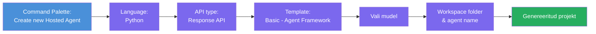
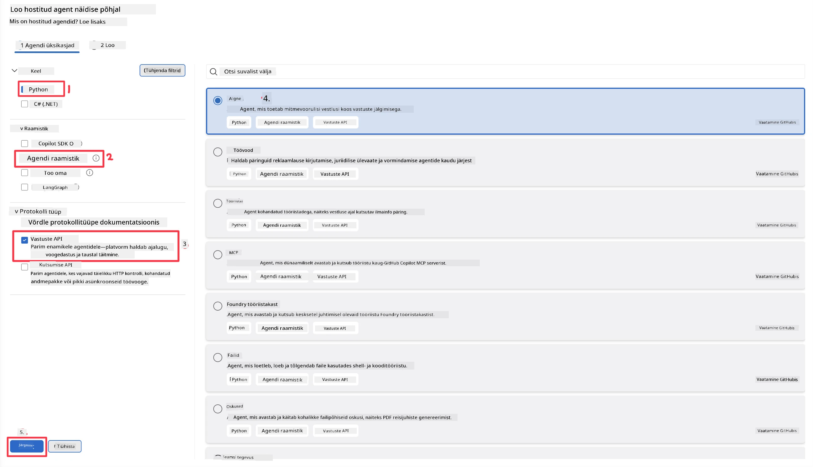
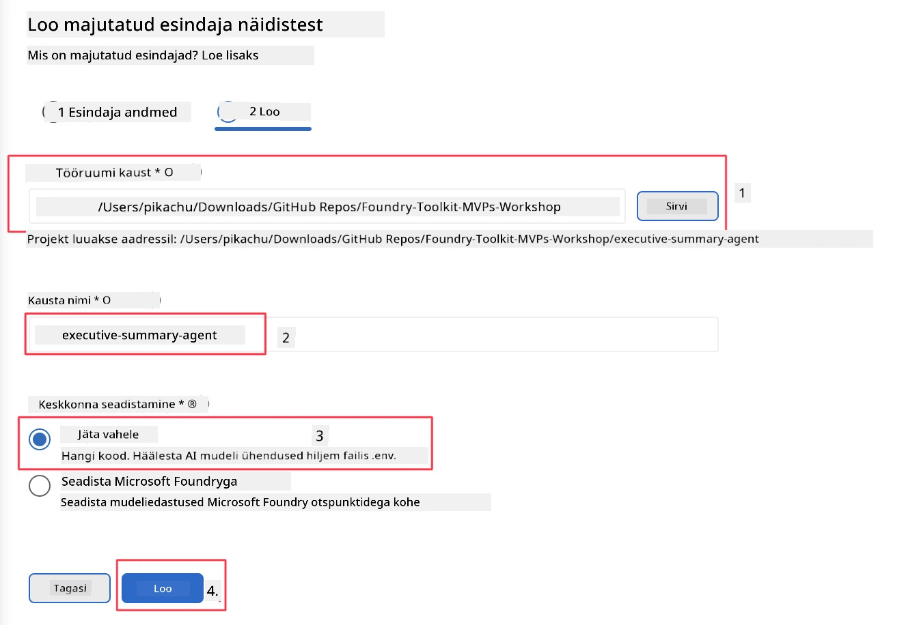

# Moodul 2 - Loo uus hallatav agent

⏱️ ~5 min

Selles moodulis kasutad Foundry Toolkitit, et **luua hallatava agendi projekt**. Skafold genereerib kogu projekti struktuuri — `agent.yaml`, `main.py`, `Dockerfile`, `requirements.txt` ja VS Code silumise konfiguratsiooni — nii et saad keskenduda agendi käitumise kohandamisele.

> **Oluline mõiste:** Selle labori `agent/` kaust on näide sellest, mida Foundry Toolkit genereerib. Sa ei kirjuta neid faile nullist.

### Skafoldimise viisardi voog



---

## Samm 1: Ava „Loo hallatav agent“ viisard

1. Vajuta `Ctrl+Shift+P`, et avada **Käsuvalik**.
2. Kirjuta: **Foundry Toolkit: Create new Hosted Agent** ja vali see.

> **Alternatiiv: Loo Foundry portaalis**
> Kui eelistad brauserit, saad oma projekti luua aadressil [https://ai.azure.com](https://ai.azure.com). Kui projekt on loodud, naase VS Code'i ja kasuta **Foundry Toolkit** külgriba, et sellega ühendada.

> **Alternatiiv:** Klõpsa ikoonil **+** kõrval **Hosted Agents (Preview)** Foundry Toolkit külgribal.

## Samm 2: Vali seaded



1. Vasakpoolses navigeerimis-/valikualas vali järgnevad:

| Menüü | Valik | Märkused |
|--------|-----------|-------|
| **Keel** | Python | Toetatakse ka C# |
| **Raamistik** | Agent Framework | Lihtne alguspunkt Agent Framework SDK-ga |
| **API tüüp** | Response API | `POST /responses` - vestlusetaoline, platvormi hallatava ajaloo funktsiooniga |
| **Mall** | Basic | Lihtne alguspunkt Agent Framework SDK-ga |

2. Kui valikud tehtud, klõpsa **Next**



3. Järgmises aknas vali järgnev:

| Menüü | Valik | Märkused |
|--------|-----------|-------|
| **Tööruumi kaust** | Vali sihtkaust | nt `/workspace/Foundry_Toolkit_for_VSCode_Lab/` või selle repo alamkaust |
| **Agendi nimi** | Sisesta nimi | nt `executive-summary-agent` |
| **Keskkonna seadistus** | jäta seadistamine praegu vahele |  |

Klõpsa **create**, et agent luua. Tekib uus kaust hallatava agendi nimega.

## Samm 3: Kontrolli loodud projekti

Pärast skafoldimise lõpetamist veendu, et need failid oleksid Exploreris nähtavad (`Ctrl+Shift+E`):

```
📂 my-agent/
├── .env                ← Environment variables (placeholders)
├── .vscode/
│   ├── launch.json     ← Debug config (F5 → run + Agent Inspector)
│   └── tasks.json      ← VS Code task definitions
├── agent.yaml          ← Agent definition (kind: hosted)
├── Dockerfile          ← Container config for deployment
├── main.py             ← Agent entry point (your main code)
└── requirements.txt    ← Python dependencies
```

### Peamised failid selgitatud

| Fail | Eesmärk |
|------|---------|
| `agent.yaml` | Deklareerib agendi `kind: hosted`, kaardistab keskkonnamuutujad, määrab `/responses` protokolli |
| `main.py` | Loob `FoundryChatClient` → mähib selle `Agent`i juhistega → teenindab `ResponsesHostServer` kaudu pordil 8088 |
| `Dockerfile` | Kasutab `python:3.12-slim`, installeerib sõltuvused, avab pordi 8088, käivitab `main.py` |
| `requirements.txt` | `agent-framework-foundry`, `agent-framework-foundry-hosting`, `mcp`, `debugpy` |

> **Oluline:** Ava skafolditud agendi kaust otse VS Code'is (`agent/` kaust ise), et `.vscode/launch.json` ja `tasks.json` töötaksid F5 silumise puhul korrektselt.

---

### ✅ Kontrollpunkt

- [ ] Skafolditud projekt loodud koos kõigi oodatud failidega
- [ ] `agent.yaml` näitab `kind: hosted` ja `protocol: responses`
- [ ] `main.py` impordib `Agent`, `FoundryChatClient`, `ResponsesHostServer`
- [ ] Agendi kaust on VS Code'is tööruumi juurkaustana avatud

---

**Eelmine:** [01 - Setup](01-setup.md) · **Järgmine:** [03 - Konfigureeri & kodeeri →](03-configure-and-code.md)

---

<!-- CO-OP TRANSLATOR DISCLAIMER START -->
**Lahtiütlus**:
See dokument on tõlgitud kasutades AI tõlketeenust [Co-op Translator](https://github.com/Azure/co-op-translator). Kuigi me püüdleme täpsuse poole, palun pange tähele, et automatiseeritud tõlgetes võib esineda vigu või ebatäpsusi. Originaaldokument selle emakeeles tuleks pidada autoriteetseks allikaks. Olulise teabe puhul soovitatakse kasutada professionaalset inimtõlget. Me ei vastuta selle tõlkega seotud eksimustest või valesti mõistmistest.
<!-- CO-OP TRANSLATOR DISCLAIMER END -->