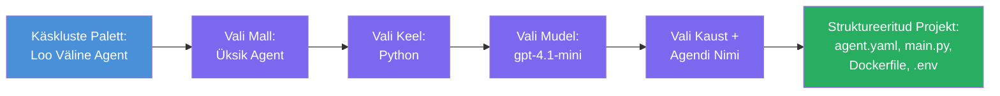

# Moodul 3 - Uue majutatava agendi loomine (Microsoft Foundry laiendusega automaatselt loodud)

Selles moodulis kasutad Microsoft Foundry laiendust, et **genereerida uus [majutatava agendi](https://learn.microsoft.com/azure/foundry/agents/concepts/hosted-agents) projekt**. Laiendus loob kogu projekti struktuuri – kaasa arvatud `agent.yaml`, `main.py`, `Dockerfile`, `requirements.txt`, `.env` faili ja VS Code silumisconfiguratsiooni. Pärast genereerimist kohandad neid faile oma agendi juhiste, tööriistade ja konfiguratsiooniga.

> **Oluline mõiste:** Selle labori `agent/` kaust on näide sellest, mida Foundry laiendus genereerib, kui käivitad selle skaffoldimise käsu. Sa ei kirjuta neid faile nullist – laiendus loob need ning siis sa muudad neid.

### Skaffoldimise viisardi töövoog


---

## Samm 1: Ava Create Hosted Agent viisard

1. Vajuta `Ctrl+Shift+P`, et avada **Käskude palett**.
2. Kirjuta: **Microsoft Foundry: Create a New Hosted Agent** ja vali see.
3. Avaneb majutatava agendi loomise viisard.

> **Alternatiivne tee:** Sa saad viisardi avada ka Microsoft Foundry küljeribal → klõpsates **+** ikooni **Agents** kõrval või paremklõpsates ning valides **Create New Hosted Agent**.

---

## Samm 2: Vali mudel

Viisard küsib sind mallivaliku osas. Näed valikuid nagu:

| Mall | Kirjeldus | Millal kasutada |
|----------|-------------|-------------|
| **Üksik agent** | Üks agent oma mudeli, juhiste ja valikuliste tööriistadega | See töötoas (Labor 01) |
| **Mitmeagendiline töövoog** | Mitmed agendid, kes töötavad järjest kõrvuti | Labor 02 |

1. Vali **Üksik agent**.
2. Klõpsa **Next** (või valik liigub automaatselt edasi).

---

## Samm 3: Vali programmeerimiskeel

1. Vali **Python** (soovitatav selle töötoa jaoks).
2. Klõpsa **Next**.

> **C# on samuti toetatud**, kui eelistad .NET-i. Skaffoldi struktuur on sarnane (kasutab `Program.cs` asemel `main.py`).

---

## Samm 4: Vali mudel

1. Viisard näitab Foundry projektis (moodul 2-st) juurutatud mudeleid.
2. Vali mudel, mille oled juurutanud – nt **gpt-4.1-mini**.
3. Klõpsa **Next**.

> Kui mudeleid ei kuvata, mine tagasi [Moodul 2](02-create-foundry-project.md) ja juuruta esmalt üks mudel.

---

## Samm 5: Vali kausta asukoht ja agendi nimi

1. Avaneb faili dialoog – vali **sihtkaust**, kuhu projekt luuakse. Selle töötoa jaoks:
   - Kui alustad nullist: vali ükskõik milline kaust (nt `C:\Projects\my-agent`)
   - Kui töötad töötoa repo sees: loo uus alamkaust `workshop/lab01-single-agent/agent/` all
2. Sisesta majutatava agendi **nimi** (nt `executive-summary-agent` või `my-first-agent`).
3. Klõpsa **Create** (või vajuta Enter).

---

## Samm 6: Oota skaffoldimise lõpetamist

1. VS Code avab **uue akna** skaffolditud projektiga.
2. Oota paar sekundit, kuni projekt täielikult laeb.
3. Sa peaksid nägema Explorer paneelis (`Ctrl+Shift+E`) järgmisi faile:

```
📂 my-first-agent/
├── .env                ← Environment variables (auto-generated with placeholders)
├── .vscode/
│   └── launch.json     ← Debug configuration (F5 to run + Agent Inspector)
├── agent.yaml          ← Agent definition (kind: hosted)
├── Dockerfile          ← Container configuration for deployment
├── main.py             ← Agent entry point (your main code file)
└── requirements.txt    ← Python dependencies
```

> **See on sama struktuur, mis on selle töötoa `agent/` kaustas.** Foundry laiendus genereerib need failid automaatselt – sul ei ole vaja neid käsitsi luua.

> **Töötoa märkus:** Selle töötoa repositooriumis asub `.vscode/` kaust **tööruumi juures** (mitte iga projekti sees). See sisaldab jagatud `launch.json` ja `tasks.json` koos kahe silumiskonfiguratsiooniga – **"Lab01 - Single Agent"** ja **"Lab02 - Multi-Agent"** – mõlemad viitavad vastava labori õigele `cwd` kaustale. Kui vajutad F5, vali rippmenüüst töötoa vastav konfiguratsioon.

---

## Samm 7: Mõista iga genereeritud faili

Võta hetk ja vaata üle iga faili, mille viisard lõi. Nende mõistmine on oluline Moodulis 4 (kohandamine).

### 7.1 `agent.yaml` - Agendi määratlus

Ava `agent.yaml`. See võib välja näha nii:

```yaml
# yaml-language-server: $schema=https://raw.githubusercontent.com/microsoft/AgentSchema/refs/heads/main/schemas/v1.0/ContainerAgent.yaml

kind: hosted
name: my-first-agent
description: >
  A hosted agent deployed to Microsoft Foundry Agent Service.
metadata:
  authors:
    - Microsoft
  tags:
    - Azure AI AgentServer
    - Microsoft Agent Framework
    - Hosted Agent
protocols:
  - protocol: responses
    version: v1
environment_variables:
  - name: AZURE_AI_PROJECT_ENDPOINT
    value: ${PROJECT_ENDPOINT}
  - name: AZURE_AI_MODEL_DEPLOYMENT_NAME
    value: ${MODEL_DEPLOYMENT_NAME}
dockerfile_path: Dockerfile
resources:
  cpu: '0.25'
  memory: 0.5Gi
```

**Olulised väljad:**

| Väli | Eesmärk |
|-------|---------|
| `kind: hosted` | Määrab, et tegemist on majutatava agendiga (konteineripõhine, juurutatud [Foundry Agent Service'i](https://learn.microsoft.com/azure/foundry/agents/overview)) |
| `protocols: responses v1` | Agent avaldab OpenAI ühilduva `/responses` HTTP lõpp-punkti |
| `environment_variables` | Seob `.env` väärtused konteineri keskkonnamuutujatega juurutusajal |
| `dockerfile_path` | Osutab Dockerfile-le konteineripildi ehitamiseks |
| `resources` | CPU ja mälumahuga piiramine konteinerile (0.25 CPU, 0.5Gi mälu) |

### 7.2 `main.py` - Agendi sisenemispunkt

Ava `main.py`. See on peamine Python fail, kus sinu agendi loogika elab. Skaffold sisaldab:

```python
from agent_framework.azure import AzureAIAgentClient
from azure.ai.agentserver.agentframework import from_agent_framework
from azure.identity.aio import DefaultAzureCredential
```

**Olulised import-id:**

| Import | Eesmärk |
|--------|--------|
| `AzureAIAgentClient` | Loob ühenduse sinu Foundry projektiga ja loob agente `.as_agent()` kaudu |
| [`DefaultAzureCredential`](https://learn.microsoft.com/azure/developer/python/sdk/authentication/credential-chains#defaultazurecredential-overview) | Haldab autentimist (Azure CLI, VS Code sisselogimine, haldatud identiteet või teenusepõhine konto) |
| `from_agent_framework` | Mähkib agendi HTTP serveriks, mis avaldab `/responses` lõpp-punkti |

Põhivoog on:
1. Loo volitused → loo klient → kutsu `.as_agent()` agendi saamiseks (asünkroonne kontekstihaldur) → mähkige see serveriks → käivita

### 7.3 `Dockerfile` - Konteineripilt

```dockerfile
FROM python:3.14-slim

WORKDIR /app

COPY ./ .

RUN pip install --upgrade pip && \
    if [ -f requirements.txt ]; then \
        pip install -r requirements.txt; \
    else \
        echo "No requirements.txt found" >&2; exit 1; \
    fi

EXPOSE 8088

CMD ["python", "main.py"]
```

**Olulised detailid:**
- Kasutab baaspildina `python:3.14-slim`.
- Kopeerib kõik projekti failid kausta `/app`.
- Uuendab `pip`i, installib `requirements.txt` põhised sõltuvused ja katkestab installi, kui see fail puudub.
- **Avaldab pordi 8088** - see on kohustuslik port majutatavatele agentidele. Ära muuda seda.
- Käivitab agendi käsuga `python main.py`.

### 7.4 `requirements.txt` - Sõltuvused

```
agent-framework-azure-ai==1.0.0rc3
agent-framework-core==1.0.0rc3
azure-ai-agentserver-agentframework==1.0.0b16
azure-ai-agentserver-core==1.0.0b16
debugpy
agent-dev-cli
```

| Pakett | Eesmärk |
|---------|---------|
| `agent-framework-azure-ai` | Azure AI integratsioon Microsoft Agent Frameworkiga |
| `agent-framework-core` | Basisaeg agentide loomiseks (sisaldab `python-dotenv`) |
| `azure-ai-agentserver-agentframework` | Majutatava agendi serveri runtime Foundry Agent Service’ile |
| `azure-ai-agentserver-core` | Agentserveri põhikomponendid |
| `debugpy` | Pythoni silumise tugi (võimaldab VS Code F5 silumist) |
| `agent-dev-cli` | Kohalik arendustööriist agentide testimiseks (kasutatud silumise/käivitamise konfiguratsioonis) |

---

## Agendi protokolli mõistmine

Majutatavad agendid suhtlevad **OpenAI Responses API** protokolli kaudu. Pärast käivitamist (kohalikus masinas või pilves) avaldab agent ühe HTTP lõpp-punkti:

```
POST http://localhost:8088/responses
Content-Type: application/json

{
  "input": "Your prompt here",
  "stream": false
}
```

Foundry Agent Service kutsub seda lõpp-punkti kasutajate promptide saatmiseks ja agendi vastuste saamiseks. See on sama protokoll, mida kasutab OpenAI API, seega on su agent ühilduv kõigi klientidega, mis toetavad OpenAI Responses formaati.

---

### Kontrollpunkt

- [ ] Skaffoldimise viisard lõpetas edukalt ja avas **uue VS Code akna**
- [ ] Näed kõiki 5 faili: `agent.yaml`, `main.py`, `Dockerfile`, `requirements.txt`, `.env`
- [ ] `.vscode/launch.json` fail on olemas (lubab F5 silumist - selles töötoas asub see tööruumi juures koos laborispetsiifiliste konfiguratsioonidega)
- [ ] Oled iga faili loonud ja mõistad nende eesmärki
- [ ] Oled teadlik, et port `8088` on kohustuslik ja `/responses` lõpp-punkt on protokoll

---

**Eelmine:** [02 - Create Foundry Project](02-create-foundry-project.md) · **Järgmine:** [04 - Configure & Code →](04-configure-and-code.md)

---

<!-- CO-OP TRANSLATOR DISCLAIMER START -->
**Vastutusest loobumine**:  
See dokument on tõlgitud tehisintellekti tõlketeenuse [Co-op Translator](https://github.com/Azure/co-op-translator) abil. Kuigi me püüame tagada täpsust, palun arvestage, et automatiseeritud tõlked võivad sisaldada vigu või ebatäpsusi. Originaaldokument oma emakeeles tuleks pidada autoriteetseks allikaks. Olulise teabe puhul soovitatakse kasutada professionaalset inimtõlget. Me ei vastuta ühegi arusaamatuse või valesti mõistmise eest, mis võivad sellest tõlkest tuleneda.
<!-- CO-OP TRANSLATOR DISCLAIMER END -->