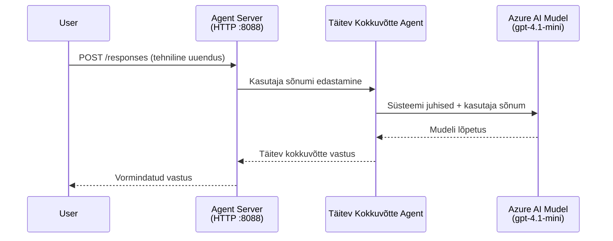
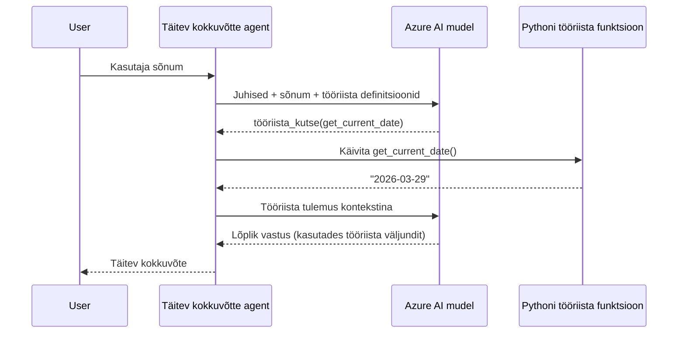

# Moodul 4 - Konfigureeri juhised, keskkond ja paigalda sõltuvused

Selles moodulis kohandad moodulis 3 automaatselt loodud agendi faile. Siin muudate üldise malli **oma** agendiks – kirjutades juhised, seadistades keskkonnamuutujaid, lisades vabatahtlikult tööriistu ja paigaldades sõltuvusi.

> **Meeldetuletus:** Foundry laiend tõi su projekti failid automaatselt. Nüüd muudate neid. Täieliku töötava kohandatud agendi näite leiad kaustast [`agent/`](../../../../../workshop/lab01-single-agent/agent).

---

## Kuidas komponendid üksteisega sobituvad

### Päringu elutsükkel (üks agent)


> **Tööriistadega:** Kui agendil on registreeritud tööriistad, võib mudel tagastada tööriista-kutse otsese vaste asemel. Raamistiku täidab tööriista lokaalselt, tagastab tulemuse mudelile ja mudel genereerib lõpliku vastuse.


---

## Samm 1: Seadista keskkonnamuutujad

Mall lõi `.env` faili, kus on kohatäitja väärtused. Sul tuleb täita reaalsed väärtused moodulis 2.

1. Avage oma malliga projektis **`.env`** fail (asub projekti juurkaustas).
2. Asenda kohatäitja väärtused oma tegelike Foundry projekti detailidega:

   ```env
   PROJECT_ENDPOINT=https://<your-account>.services.ai.azure.com/api/projects/<your-project>
   MODEL_DEPLOYMENT_NAME=gpt-4.1-mini
   ```

3. Salvesta fail.

### Kus neid väärtusi leida

| Väärtus | Kuidas leida |
|---------|--------------|
| **Projekti lõpp-punkt** | Ava VS Code’is **Microsoft Foundry** külgriba → klõpsa oma projekti peal → lõpp-punkti URL on detailide vaates. Näeb välja nagu `https://<konto-nimi>.services.ai.azure.com/api/projects/<project-name>` |
| **Mudeli juurutuse nimi** | Foundry külgribas laienda oma projekt → vaata all **Models + endpoints** → nimi on kirjas juurutatud mudeli kõrval (nt `gpt-4.1-mini`) |

> **Turvalisus:** Ära kunagi pane `.env` faili versioonihaldusse. See on vaikimisi lisatud `.gitignore`-i. Kui pole, lisa see sinna:
> ```
> .env
> ```

### Kuidas keskkonnamuutujad voolavad

Andmete voog on: `.env` → `main.py` (loeb `os.getenv` kaudu) → `agent.yaml` (kaardistab konteineri keskkonnamuutujatele juurutamise ajal).

`main.py`-s loeb mall neid väärtusi selliselt:

```python
PROJECT_ENDPOINT = os.getenv("AZURE_AI_PROJECT_ENDPOINT") or os.getenv("PROJECT_ENDPOINT")
MODEL_DEPLOYMENT_NAME = os.getenv("AZURE_AI_MODEL_DEPLOYMENT_NAME", os.getenv("MODEL_DEPLOYMENT_NAME", "gpt-4.1-mini"))
```

Mõlemad `AZURE_AI_PROJECT_ENDPOINT` ja `PROJECT_ENDPOINT` on aktsepteeritud (aga `agent.yaml` kasutab `AZURE_AI_*` prefiksit).

---

## Samm 2: Kirjuta agendi juhised

See on kõige olulisem kohandamisetapp. Juhised määravad agendi isiksuse, käitumise, väljundi formaadi ja turvapiirangud.

1. Ava `main.py` oma projektis.
2. Leia juhiste string (mallis on vaikeversioon/generic).
3. Asenda see üksikasjalike, struktureeritud juhistega.

### Mida head juhised sisaldavad

| Komponent | Eesmärk | Näide |
|-----------|---------|-------|
| **Roll** | Kes agent on ja mida teeb | "Sa oled tegevjuhtide kokkuvõtteagent" |
| **Sihtgrupp** | Kellele vastused on mõeldud | "Juhtkond piiratud tehnilise taustaga" |
| **Sisendi definitsioon** | Milliseid sisendkäske hakkleb | "Tehnilised intsidentide aruanded, tegevusuuendused" |
| **Väljundi formaat** | Täpne vastuse struktuur | "Juhtkonna kokkuvõte: - Mis juhtus: ... - Äriline mõju: ... - Järgmine samm: ..." |
| **Reeglid** | Piirangud ja keeldumistingimused | "Ära lisa teavet, mis pole antud" |
| **Turvalisus** | Kasutamise piiramine ja hallutsinatsioonide vältimine | "Kui sisend on ebaselge, küsi täpsustust" |
| **Näited** | Sisendi/väljundi paarid käitumise juhendamiseks | Lisa 2-3 näidet erinevate sisenditega |

### Näide: Tegevjuhi kokkuvõtte agendi juhised

Töötuba kasutab järgmisi juhiseid faili [`agent/main.py`](../../../../../workshop/lab01-single-agent/agent/main.py) näites:

```python
AGENT_INSTRUCTIONS = """You are an "Explain Like I'm an Executive" agent.

Purpose:
Your job is to translate complex technical or operational information into
clear, concise, and outcome-focused summaries that can be easily understood
by non-technical executives.

Audience:
Senior leaders with limited technical background who care about impact,
risk, and what happens next.

What you must do:
- Rephrase the input so it is understandable to a non-technical audience
- Prioritize clarity, brevity, and outcomes over technical accuracy
- Remove technical jargon, logs, metrics, stack traces, and deep root-cause details
- Translate technical causes into simple cause-and-effect statements
- Explicitly call out business impact
- Always include a clear next step or action
- Maintain a neutral, factual, and calm executive tone
- Do NOT add new facts or speculate beyond the input

Standard Output Structure (always use this wording):

Executive Summary:
- What happened: <plain-language description>
- Business impact: <clear, non-technical impact>
- Next step: <clear action or mitigation>

Rules:
- Keep responses under 100 words
- Do NOT add facts beyond the input
- If input is unclear, ask for clarification
"""
```

4. Asenda olemasolev juhiste string failis `main.py` oma kohandatud juhistega.
5. Salvesta fail.

---

## Samm 3: (Valikuline) Lisa kohandatud tööriistad

Majutatud agendid saavad täita **kohalikke Python funktsioone** kui [tööriistu](https://learn.microsoft.com/azure/foundry/agents/concepts/tool-catalog). See on koodipõhiste majutatud agentide võtme-eelis võrreldes ainult prompt-agendiga – su agent saab käivitada mistahes serveripoolset loogikat.

### 3.1 Määra tööriista funktsioon

Lisa `main.py` tööriista funktsioon:

```python
from agent_framework import tool

@tool
def get_current_date() -> str:
    """Returns the current date in YYYY-MM-DD format."""
    from datetime import date
    return str(date.today())
```

`@tool` dekoratsioon muudab tavalise Python funktsiooni agendi tööriistaks. Docstring on tööriista kirjeldus, mida mudel näeb.

### 3.2 Registreeri tööriist agendi juures

Agendi loomisel `.as_agent()` kontekstihalduri abil, edasta tööriist `tools` parameetris:

```python
async with AzureAIAgentClient(
    project_endpoint=PROJECT_ENDPOINT,
    model_deployment_name=MODEL_DEPLOYMENT_NAME,
    credential=credential,
).as_agent(
    name="my-agent",
    instructions=AGENT_INSTRUCTIONS,
    tools=[get_current_date],
) as agent:
    server = from_agent_framework(agent)
    await server.run_async()
```

### 3.3 Kuidas tööriistakutsed toimivad

1. Kasutaja saadab prompti.
2. Mudel otsustab, kas tööriist on vajalik (põhinedes promptidel, juhistel ja tööriistakirjeldustel).
3. Kui tööriist on vajalik, raamistiku kutsub Python funktsiooni lokaalselt (konteineri sees).
4. Tööriista tagastuse väärtus saadetakse mudelile kontekstina.
5. Mudel genereerib lõpliku vastuse.

> **Tööriistad käitatakse serveripoolselt** - need töötavad konteineri sees, mitte kasutaja brauseris ega mudelis. See tähendab, et saad kasutada andmebaase, API-sid, failisüsteeme või ükskõik millist Python teeki.

---

## Samm 4: Loo ja aktiveeri virtuaalne keskkond

Enne sõltuvuste paigaldamist loo isoleeritud Python keskkond.

### 4.1 Loo virtuaalne keskkond

Ava terminal VS Code’is (`` Ctrl+` ``) ja käivita:

```powershell
python -m venv .venv
```

See loob sinu projektikataloogi `.venv` kausta.

### 4.2 Aktiveeri virtuaalne keskkond

**PowerShell (Windows):**

```powershell
.\.venv\Scripts\Activate.ps1
```

**Käsurea (Windows):**

```cmd
.venv\Scripts\activate.bat
```

**macOS/Linux (Bash):**

```bash
source .venv/bin/activate
```

Terminali prompti alguses peaks nägema `(.venv)`, mis näitab, et virtuaalne keskkond on aktiivne.

### 4.3 Paigalda sõltuvused

Kasutades aktiivset virtuaalset keskkonda, paigalda vajalikud paketid:

```powershell
pip install -r requirements.txt
```

See paigaldab:

| Pakett | Eesmärk |
|--------|---------|
| `agent-framework-azure-ai==1.0.0rc3` | Azure AI integratsioon [Microsoft Agent Frameworki](https://learn.microsoft.com/agent-framework/overview/) jaoks |
| `agent-framework-core==1.0.0rc3` | Agentide põhiraamistiku käitus (sisaldab `python-dotenv`) |
| `azure-ai-agentserver-agentframework==1.0.0b16` | Majutatud agendi serveri käitus [Foundry Agent Service’ile](https://learn.microsoft.com/azure/foundry/agents/overview) |
| `azure-ai-agentserver-core==1.0.0b16` | Agendi serveri põhiklassid |
| `debugpy` | Python silumine (lubab F5 silumise VS Code’is) |
| `agent-dev-cli` | Kohalik arendus CLI agentide testimiseks |

### 4.4 Kontrolli paigaldust

```powershell
pip list | Select-String "agent-framework|agentserver"
```

Oodatud väljund:
```
agent-framework-azure-ai   1.0.0rc3
agent-framework-core       1.0.0rc3
azure-ai-agentserver-agentframework 1.0.0b16
azure-ai-agentserver-core  1.0.0b16
```

---

## Samm 5: Kontrolli autentimist

Agent kasutab [`DefaultAzureCredential`](https://learn.microsoft.com/azure/developer/python/sdk/authentication/credential-chains#defaultazurecredential-overview), mis proovib mitut autentimisviisi järgmises järjekorras:

1. **Keskkonnamuutujad** - `AZURE_CLIENT_ID`, `AZURE_TENANT_ID`, `AZURE_CLIENT_SECRET` (teenuse põhi)
2. **Azure CLI** - kasutab sinu `az login` sessiooni
3. **VS Code** - kasutab kontot, millega said VS Code’i sisse
4. **Haldatav identiteet** - kasutatakse Azure’is töötamisel (juurutamise ajal)

### 5.1 Kontroll kohalikuks arenduseks

Vähemalt üks neist peab töötama:

**Variant A: Azure CLI (soovitatav)**

```powershell
az account show --query "{name:name, id:id}" --output table
```

Oodatud: Kuvab sinu tellimuse nime ja ID.

**Variant B: VS Code sisse-logimine**

1. Vaata VS Code’i vasakus allnurgas **Accounts** ikooni.
2. Kui näed oma kontonime, oled autentitud.
3. Kui ei, klõpsa ikoonile → **Sign in to use Microsoft Foundry**.

**Variant C: Teenuse põhi (CI/CD jaoks)**

```powershell
$env:AZURE_TENANT_ID = "<your-tenant-id>"
$env:AZURE_CLIENT_ID = "<your-client-id>"
$env:AZURE_CLIENT_SECRET = "<your-client-secret>"
```

### 5.2 Levinud autentimisprobleem

Kui oled sisseloginud mitmesse Azure kontosse, veendu et õige tellimus on valitud:

```powershell
az account set --subscription "<your-subscription-id>"
```

---

### Kontrollnimekiri

- [ ] `.env` failis on kehtivad `PROJECT_ENDPOINT` ja `MODEL_DEPLOYMENT_NAME` (mitte kohatäited)
- [ ] Agendi juhised on kohandatud failis `main.py` - määratletud roll, sihtgrupp, väljundi formaat, reeglid ja turvapiirangud
- [ ] (Valikuline) Kohandatud tööriistad on defineeritud ja registreeritud
- [ ] Virtuaalne keskkond on loodud ja aktiveeritud (`(.venv)` nähtav terminali promptis)
- [ ] `pip install -r requirements.txt` lõpetab edukalt ilma vigadeta
- [ ] `pip list | Select-String "azure-ai-agentserver"` näitab paigaldatud paketti
- [ ] Autentimine on kehtiv - `az account show` tagastab tellimuse VÕI oled VS Code’i sisse logitud

---

**Eelmine:** [03 - Create Hosted Agent](03-create-hosted-agent.md) · **Järgmine:** [05 - Test Locally →](05-test-locally.md)

---

<!-- CO-OP TRANSLATOR DISCLAIMER START -->
**Vastutusest loobumine**:  
Seda dokumenti on tõlgitud kasutades tehisintellekti tõlketeenust [Co-op Translator](https://github.com/Azure/co-op-translator). Kuigi püüame täpsust, tuleb arvestada, et automatiseeritud tõlked võivad sisaldada vigu või ebatäpsusi. Originaaldokument selle emakeeles tuleks lugeda autoriteetseks allikaks. Olulise teabe puhul soovitatakse kasutada professionaalset inimtõlget. Me ei vastuta selle tõlke kasutamisest tulenevate arusaamatuste või valesti mõistmiste eest.
<!-- CO-OP TRANSLATOR DISCLAIMER END -->