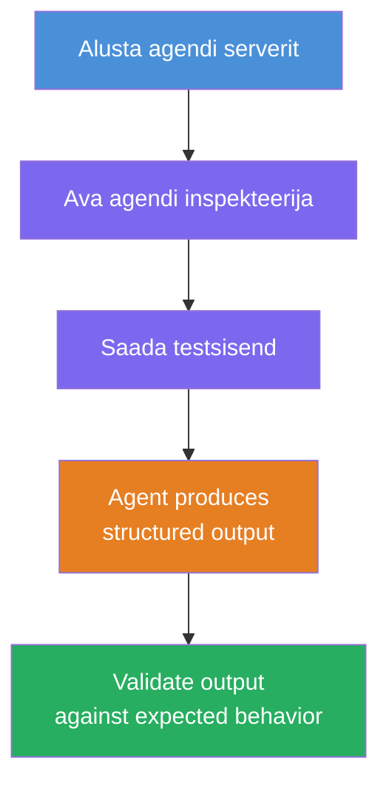
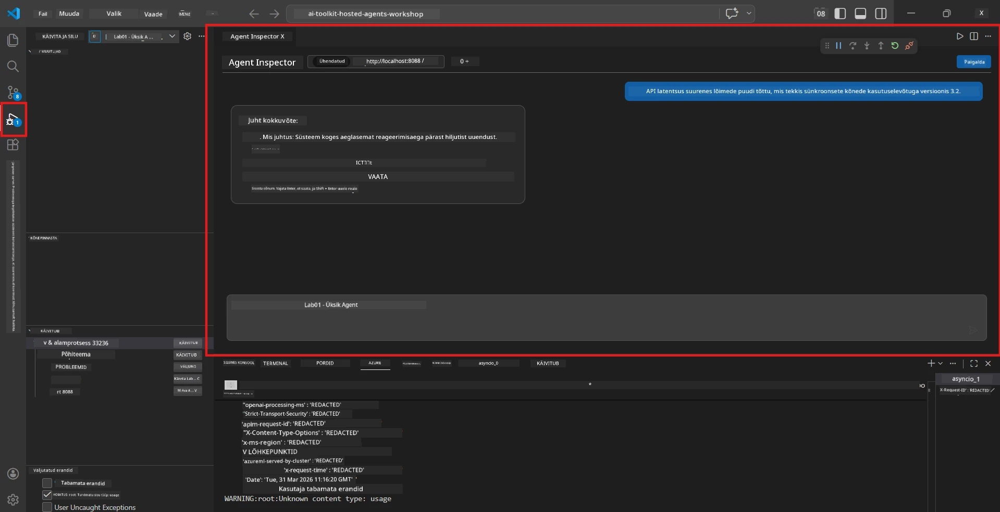
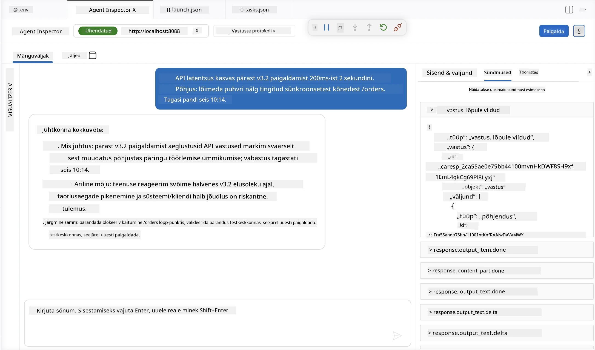

# Moodul 4 - Testi kohapeal

⏱️ ~10 min

Selles moodulis käivitad oma agendi kohapeal ja kontrollid, kas see töötab õigesti, kasutades **õnneliku tee funktsionaalseid teste**. Kasutad selleks Agent Inspectorit (visuaalne kasutajaliides) või otse HTTP-päringuid, et kinnitada, et agent annab struktureeritud ja täpseid vastuseid.

### Kohalik testimisvoog



---

## Variant 1: Vajuta F5 - silumine Agent Inspectoriga (soovitatav)

### Käivita silur

1. Ava VS Code'is otse kaust **executive-summary-agent/** (`File → Open Folder`).
2. Ava paneel **Run and Debug** (`Ctrl+Shift+D`).
3. Vali ripploendist **Debug Local Agent Server**.
4. Vajuta **F5** (või klõpsa ▶ Start Debugging).

> ⚠️ **Oluline: vali oma Python interpreteerija**
> Kui saad vea "ModuleNotFoundError" või silur ei käivitu, pead ütlema VS Code'ile, et kasutaks virtuaalset keskkonda:
  > 1. Vajuta `Ctrl+Shift+P` $\rightarrow$ tüüpi **Python: Select Interpreter**.
  > 2. Vali interpreteerija, mis asub sinu projekti `.venv` kaustas (nt `.\.venv\Scripts\python.exe` Windowsis).
  > 3. Taaskäivita silumise sessioon.
> Kui vead jätkuvad, uuenda käsitsi oma faili `tasks.json` järgmiselt:
  > 1. Mine faili `.vscode/tasks.json`
  > 2. Leia käsk `Run Agent/Workflow HTTP Server`
  > 3. Muuda käsu väärtus järgmiselt: `"value": "${workspaceFolder}/.venv/bin/python",`

### Mis toimub

1. HTTP-server käivitub aadressil `http://localhost:8088/responses`.
2. Paneel **Agent Inspector** avaneb automaatselt - visuaalne vestluskeskkond testimiseks.
3. Murdepunktid on lubatud failis `main.py`.

Jälgi Terminali:
```
Starting executive summary hosted agent
Executive agent server running on http://localhost:8088
```

> **Kui Agent Inspector ei avane:** Vajuta `Ctrl+Shift+P` → **Foundry Toolkit: Open Agent Inspector**.



> *Ekraanipilt võib kuvada varasemat 'AI TOOLKIT' brändingut vanemast laiendusversioonist.*

---

## Variant 2: Testi Terminali kaudu (alternatiiv)

Käivita agent ühes terminalis, saada päringud teisest:

```bash
# Terminal 1: Käivita agent
cd executive-summary-agent/
source .venv/bin/activate
python main.py
```

```bash
# Terminal 2: Saada test (curl)
curl -sS -X POST http://localhost:8088/responses \
  -H "Content-Type: application/json" \
  -d '{"input": "The API latency increased due to thread pool exhaustion caused by sync calls in v3.2.", "stream": false}'
```

---

## Stsenaariumitestid: Õnneliku tee funktsionaalne valideerimine

Käivita **kõik kolm** allolevat stsenaariumi. Need kontrollivad, et su agent toodab õiged ja struktureeritud väljundid realistlike sisendite korral.



### Stsenaarium 1: IT intsident - API latentsuse tõus

**Sisend:**
```
The API latency increased from 200ms to 2s after deploying v3.2.
Root cause: thread pool starvation from synchronous calls in /orders.
Rolled back at 10:14.
```

**Oodatud käitumine:**
- ✅ Järgib "Executive Summary" struktuuri (Mis juhtus / Äriline mõju / Järgmine samm)
- ✅ Ei kasuta tehnilist žargooni (pole "thread pool", pole "/orders", pole "v3.2")
- ✅ Selgesti mainib ärilist mõju (nt kasutajad kogesid viivitusi)
- ✅ Sisaldab järgmist sammu (nt paranduse rakendamine, järelevalve olemasolu)

---

### Stsenaarium 2: Andmetöötluskanal - ETL tõrge

**Sisend:**
```
The nightly ETL job failed because the upstream schema changed. APAC dashboards show missing data.
```

**Oodatud käitumine:**
- ✅ Kokkuvõte andmete värskenduse tõrkest lihtsas keeles
- ✅ Mainib APAC juhtpaneeli mõju
- ✅ Sisaldab parandustoimingut
- ✅ EI maini "ETL", "skeemi" ega muid tehnilisi termineid

---

### Stsenaarium 3: Turvalisus - Avalikuks jäänud kasutajatunnus

**Sisend:**
```
Static analysis flagged a hardcoded secret in the repository.
The secret may have been exposed in commit history.
```

**Oodatud käitumine:**
- ✅ Kirjeldab kasutajatunnuse/turvariski probleemi juhi sõbralikus keeles
- ✅ Tõstab esile võimaliku riski (luba saamata ligipääs)
- ✅ Märgib parandustoimingu (kasutatunnuse vahetus, audit)
- ✅ EI kasuta termineid nagu "staattiline analüüs", "commit history" ega "hardcoded"

---

## Valideerimiskriteeriumid

Iga stsenaariumi puhul kontrolli:

| # | Kriteerium | Läbinõude tingimus |
|---|----------|---------------|
| 1 | **Struktuur** | Vastus kasutab "Executive Summary" vormingut kõigi kolme punktiga |
| 2 | **Lihtne keel** | Ei ole tehnilist žargooni, mida juht ei mõistaks |
| 3 | **Täpsus** | Kokkuvõte peegeldab sisendit - ei ole väljamõeldud detaile |
| 4 | **Lühidus** | Vastus on vähem kui 100 sõna |
| 5 | **Järgmine samm** | Selgelt määratud tegevus või leevendus |

---

## Silumisoovitused

| Probleem | Lahendus |
|-------|-----|
| Agent ei käivitu | Kontrolli `.env` väärtusi, veendu, et venv on aktiveeritud, jookse `pip install -r requirements.txt` |
| Vastus on tühi või üldine | Vaata juhiseid failis `main.py` - veendu, et väljundvorming on määratud |
| Vastus sisaldab žargooni | Tugevda juhistes reegleid "eemalda tehnilised terminid" |
| Agent Inspector ei avane | `Ctrl+Shift+P` → **Foundry Toolkit: Open Agent Inspector** |
| Mudelivead Terminalis | Kontrolli, kas `AZURE_AI_MODEL_DEPLOYMENT_NAME` vastab täpselt (kaasaarvatud tähed) |

---

### ✅ Kontrollpunkt

- [ ] Agent käivitub kohapeal ilma vigadeta
- [ ] Agent Inspector avaneb ja kuvab vestluskeskkonna (kui kasutatakse F5)
- [ ] **Stsenaarium 1** (IT intsident) - struktureeritud Executive Summary, ilma žargoonita
- [ ] **Stsenaarium 2** (andmetöötluskanal) - asjakohane kokkuvõte ärilise mõjuga
- [ ] **Stsenaarium 3** (turvahoiatus) - sobiv riskide kommunikatsioon
- [ ] Kõik vastused järgivad määratletud väljundstruktuuri

> **Salvesta oma vastused** (kopeeeri või tee ekraanipilt) - võrreldakse pilve tulemustega Moodulis 06.

---

**Eelmine:** [03 - Configure & Code](03-configure-and-code.md) · **Järgmine:** [05 - Deploy to Foundry →](05-deploy-to-foundry.md)

---

<!-- CO-OP TRANSLATOR DISCLAIMER START -->
**Lahtiütlus**:
See dokument on tõlgitud kasutades AI tõlketeenust [Co-op Translator](https://github.com/Azure/co-op-translator). Kuigi me püüdleme täpsuse poole, palun pange tähele, et automatiseeritud tõlgetes võib esineda vigu või ebatäpsusi. Originaaldokument selle emakeeles tuleks pidada autoriteetseks allikaks. Olulise teabe puhul soovitatakse kasutada professionaalset inimtõlget. Me ei vastuta selle tõlkega seotud eksimustest või valesti mõistmistest.
<!-- CO-OP TRANSLATOR DISCLAIMER END -->