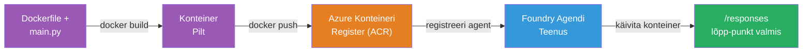
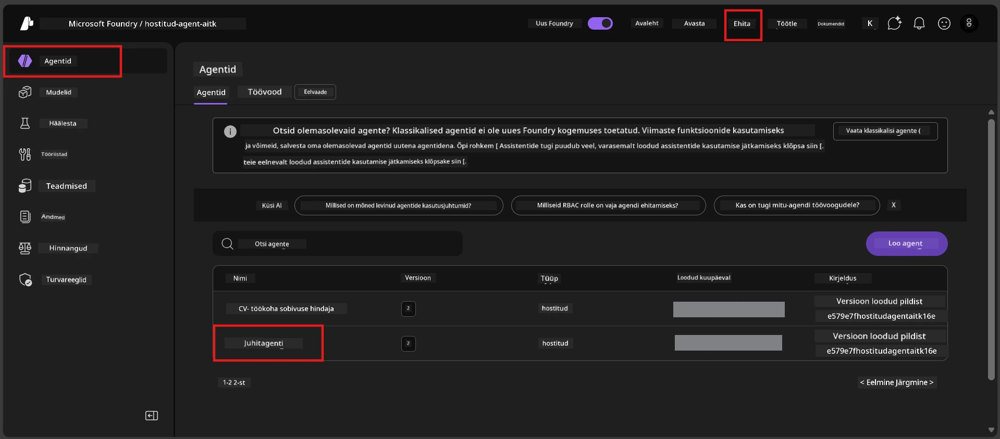

# Moodul 6 - Deploy Foundry Agendi Teenusesse

Selles moodulis paigaldad oma lokaalselt testitud agendi Microsoft Foundry'sse kui [**hostitud agendi**](https://learn.microsoft.com/azure/foundry/agents/concepts/hosted-agents). Paigaldusprotsess loob Docker konteineri pildi sinu projektist, saadab selle [Azure Container Registry (ACR)](https://learn.microsoft.com/azure/container-registry/container-registry-intro) ja loob hostitud agendi versiooni [Foundry Agent Service'is](https://learn.microsoft.com/azure/foundry/agents/overview).

### Paigaldustoru


---

## Eeltingimuste kontroll

Enne paigaldamist veendu kõigis alljärgnevates punktides. Nende vahele jätmine on kõige sagedasem paigaldusvigade põhjus.

1. **Agent läbinud lokaalsed suitsutestid:**
   - Sa lõpetasid kõik 4 testi [Moodulis 5](05-test-locally.md) ja agent vastas korrektselt.

2. **Sul on [Azure AI User](https://learn.microsoft.com/azure/foundry/concepts/rbac-foundry#built-in-roles) roll:**
   - See omistati [Moodulis 2, Samm 3](02-create-foundry-project.md). Kui sa pole kindel, kontrolli nüüd:
   - Azure Portaal → sinu Foundry **projekti** ressurss → **Juurdepääsu kontroll (IAM)** → **Rolli määramised** vahekaart → otsi oma nime → kinnita, et **Azure AI User** on nimekirjas.

3. **Oled Azure'sse VS Code'is sisse loginud:**
   - Kontrolli VS Code'i vasakus alanurgas Konto ikooni. Sinu kontonimi peaks olema nähtav.

4. **(Valikuline) Docker Desktop töötab:**
   - Dockeri on vaja ainult siis, kui Foundry laiendus palub sul teha kohalik build. Enamasti haldab laiendus konteinerite ehitamist paigalduse ajal automaatselt.
   - Kui sul on Docker installitud, kontrolli, et see töötab: `docker info`

---

## Samm 1: Alusta paigaldust

Sul on kaks võimalust paigaldamiseks – mõlemad viivad samale tulemusele.

### Variant A: Paigalda Agent Inspectorist (soovitatav)

Kui jooksutad agenti siluriga (F5) ja Agent Inspector on avatud:

1. Vaatle Agent Inspectori **paremas ülanurgas**.
2. Kliki **Deploy** nupul (pilveikoon koos ülesnoolega ↑).
3. Avaneb paigaldusviisard.

### Variant B: Paigalda Command Palette'i kaudu

1. Vajuta `Ctrl+Shift+P`, et avada **Command Palette**.
2. Kirjuta: **Microsoft Foundry: Deploy Hosted Agent** ja vali see.
3. Avaneb paigaldusviisard.

---

## Samm 2: Pane paigaldus paika

Paigaldusviisard juhendab sind konfiguratsiooni täitmisel. Täida iga küsitlus:

### 2.1 Vali sihtprojekt

1. Rippmenüüst näed oma Foundry projekte.
2. Vali projekt, mille lõid Moodulis 2 (nt `workshop-agents`).

### 2.2 Vali konteineri agentfail

1. Sind palutakse valida agendi sisendpunkt.
2. Vali **`main.py`** (Python) – see on fail, mida viisard kasutab agendi projekti tuvastamiseks.

### 2.3 Pane ressursid paika

| Seade | Soovitatav väärtus | Märkused |
|--------|--------------------|----------|
| **CPU** | `0.25` | Vaikeväärtus, piisav töötoaks. Suurenda tootmiskoormuseks |
| **Mälu** | `0.5Gi` | Vaikeväärtus, piisab töötuba jaoks |

Need vastavad väärtustele failis `agent.yaml`. Võid vastuvõtta vaikeväärtused.

---

## Samm 3: Kinnita ja paigalda

1. Viisard kuvab paigaldamise kokkuvõtte:
   - Sihtprojekti nimi
   - Agendi nimi (failist `agent.yaml`)
   - Konteinerifail ja ressursid
2. Läbivaata kokkuvõte ja kliki **Confirm and Deploy** (või **Deploy**).
3. Jälgi edenemist VS Code'is.

### Mis juhtub paigalduse ajal (samm-sammult)

Paigaldusprotsess koosneb mitmest etapist. Jälgi VS Code'i **Output** paneeli (vali rippmenüüst "Microsoft Foundry"):

1. **Docker build** - VS Code ehitab Docker konteinerpildi sinu `Dockerfile` põhjal. Näed Docker kihtide sõnumeid:
   ```
   Step 1/6 : FROM python:<version>-slim
   Step 2/6 : WORKDIR /app
   ...
   Successfully built abc123def456
   ```

2. **Docker push** - Kujutis saadetakse sinu Foundry projektiga seotud **Azure Container Registry (ACR)**-i. Esimesel korral võib võtta 1-3 minutit (baaspilt on >100MB).

3. **Agendi registreerimine** - Foundry Agent Service loob uue hostitud agendi või uue versiooni, kui agent juba olemas on. Kasutatakse `agent.yaml` metainfot.

4. **Konteiner käivitamine** - Konteiner käivitub Foundry hallatavas infrastruktuuris. Platvorm määrab [süsteem-haldatava identiteedi](https://learn.microsoft.com/azure/foundry/agents/concepts/agent-identity) ja avab `/responses` lõpp-punkti.

> **Esimene paigaldus on aeglasem** (Docker peab kõik kihid üles laadima). Järgnevad paigaldused on kiirem, sest Docker kasutab vahemällu salvestatud kihte.

---

## Samm 4: Kontrolli paigaldamise olekut

Pärast paigaldus käsu lõpetamist:

1. Ava **Microsoft Foundry** külgriba, klõpsates Foundry ikooni tegevusribal.
2. Laienda oma projekti alt **Hosted Agents (Preview)** sektsioon.
3. Näed oma agendi nime (nt `ExecutiveAgent` või nime `agent.yaml`-st).
4. **Klõpsa agendi nimele**, et selle sisu näha.
5. Näed üht või mitut **versiooni** (nt `v1`).
6. Klõpsa versioonil, et näha **Konteineri andmeid**.
7. Vaata välja **Status** väärtust:

   | Staatus | Tähendus |
   |---------|----------|
   | **Started** või **Running** | Konteiner jookseb ja agent on valmis |
   | **Pending** | Konteinerit käivitatakse (oota 30-60 sekundit) |
   | **Failed** | Konteineri käivitamine ebaõnnestus (kontrolli logisid - vt allpool tõrkeotsingut) |



> **Kui näed "Pending" üle 2 minuti:** Konteiner võib olla baaspilti tõmbamas. Oota veidi kauem. Kui jääb keskkonna seisundi alla, kontrolli konteinerilogisid.

---

## Levinud paigalduse vead ja lahendused

### Viga 1: Luba keelatud - `agents/write`

```
Error: lacks the required data action 
Microsoft.CognitiveServices/accounts/AIServices/agents/write 
to perform POST /api/projects/{projectName}/assistants operation.
```

**Põhjus:** Sul puudub `Azure AI User` roll **projekti** tasemel.

**Parandus samm-sammult:**

1. Ava [https://portal.azure.com](https://portal.azure.com).
2. Otsi otsinguribalt oma Foundry **projekti** nimele ja klõpsa sellel.
   - **Oluline:** Veendu, et oled liikunud **projekti** ressursile (tüüp: "Microsoft Foundry project"), MITTE konto või hubi ressurssile.
3. Vasakul menüüs vali **Juurdepääsu kontroll (IAM)**.
4. Klõpsa **+ Lisa** → **Lisa rolli määramine**.
5. Rolli vahekaardil otsi ja vali [**Azure AI User**](https://learn.microsoft.com/azure/foundry/concepts/rbac-foundry#built-in-roles). Klõpsa **Next**.
6. Liikmete vahekaardil vali **Kasutaja, grupp või teenuskontroll**.
7. Klõpsa **+ Vali liikmed**, otsi enda nime/e-posti, vali end, klõpsa **Vali**.
8. Klõpsa **Kontrolli + määra** → uuesti **Kontrolli + määra**.
9. Oota 1-2 minutit rolli määramise levikuks.
10. **Proovi uuesti paigaldust** Sammast 1 alates.

> Roll peab olema määratud **projekti** tasandil, mitte ainult konto tasandil. See on kõige tavalisem põhjustaja paigaldusvigadele.

### Viga 2: Docker ei tööta

```
Error: Docker build failed / Cannot connect to Docker daemon
```

**Parandus:**
1. Käivita Docker Desktop (leiad selle Start menüüst või teavitusalalt).
2. Oota, kuni kuvatakse "Docker Desktop is running" (30-60 sekundit).
3. Kontrolli: terminalis `docker info`.
4. **Windowsi puhul:** veendu, et Docker Desktop seadetess on lubatud WSL 2 mootor → **General** → **Use the WSL 2 based engine**.
5. Proovi paigaldus uuesti.

### Viga 3: ACR autoriseerimise viga - `AcrPullUnauthorized`

```
Error: AcrPullUnauthorized
```

**Põhjus:** Foundry projekti hallatav identiteet ei oma tõmbamisõigust konteineriregistrisse.

**Parandus:**
1. Ava Azure Portaalis oma **[Container Registry](https://learn.microsoft.com/azure/container-registry/container-registry-intro)** (see on samas ressursigrupis kui Foundry projekt).
2. Mine **Juurdepääsu kontroll (IAM)** → **Lisa** → **Lisa rolli määramine**.
3. Vali rolliks **[AcrPull](https://learn.microsoft.com/azure/container-registry/container-registry-roles)**.
4. Liikmete alt vali **Haldatud identiteet** → otsi Foundry projekti hallatav identiteet.
5. **Kontrolli + määra**.

> See seadistatakse tavaliselt automaatselt Foundry laienduse poolt. Kui näed seda viga, võib automaatne seadistamine ebaõnnestuda.

### Viga 4: Konteineri platvormi ebasobivus (Apple Silicon)

Kui paigaldad Apple Silicon (M1/M2/M3) Macilt, peab konteiner olema ehitatud platvormile `linux/amd64`:

```bash
docker build --platform linux/amd64 -t myagent:v1 .
```

> Foundry laiendus haldab seda enamikul juhtudel automaatselt.

---

### Kontrollpunkt

- [ ] Paigalduskäsklus lõpetati VS Code'is veatult
- [ ] Agent on nähtav **Hosted Agents (Preview)** pealkirja all Foundry külgribas
- [ ] Klõpsasid agendil → valisid versiooni → nägid **Konteineri andmeid**
- [ ] Konteineri olek näitab **Started** või **Running**
- [ ] (Kui esines vead) Peale vea tuvastamist ja parandamist edukalt paigaldasid uuesti

---

**Eelmine:** [05 - Testi lokaalselt](05-test-locally.md) · **Järgmine:** [07 - Kontrolli mänguväljakus →](07-verify-in-playground.md)

---

<!-- CO-OP TRANSLATOR DISCLAIMER START -->
**Vastutusest loobumine**:  
See dokument on tõlgitud kasutades tehisintellektil põhinevat tõlketeenust [Co-op Translator](https://github.com/Azure/co-op-translator). Kuigi püüame tagada täpsust, tuleb arvestada, et automaatsed tõlked võivad sisaldada vigu või ebatäpsusi. Originaaldokument selle algkeeles tuleks pidada autoriteetseks allikaks. Olulise teabe puhul soovitatakse professionaalset inimtõlget. Me ei vastuta käesoleva tõlke kasutamisest tulenevate arusaamatuste või valesti mõistmiste eest.
<!-- CO-OP TRANSLATOR DISCLAIMER END -->