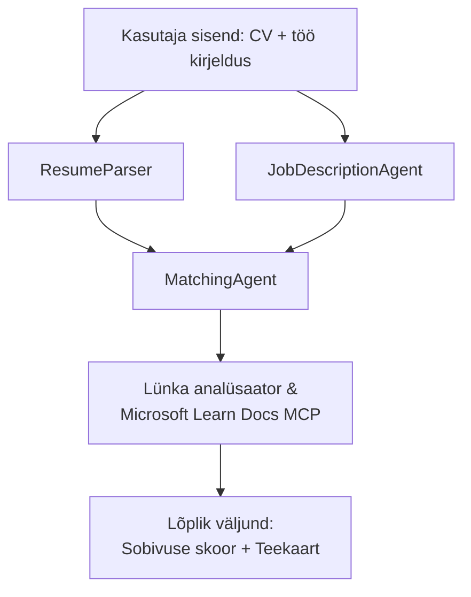

# PersonalCareerCopilot - CV → Töö sobivuse hindaja

Mitmeagentne töövoog, mis hindab, kui hästi CV vastab töökuulutusele, seejärel genereerib isikupärastatud õppeteekonna puudujääkide täitmiseks.

---

## Agendid

| Agent | Roll | Tööriistad |
|-------|------|------------|
| **ResumeParser** | Eristab struktureeritud oskusi, kogemusi, sertifikaate CV tekstist | - |
| **JobDescriptionAgent** | Eristab nõutud/eelistatud oskusi, kogemusi, sertifikaate töökuulutusest | - |
| **MatchingAgent** | Võrdleb profiili nõuetega → sobivuse skoor (0-100) + sobivad/puuduvad oskused | - |
| **GapAnalyzer** | Koostab isikupärastatud õppeteekonna Microsoft Learn ressurssidega | `search_microsoft_learn_for_plan` (MCP) |

## Töövoog


---

## Kiire alustamine

### 1. Keskkonna seadistamine

```powershell
cd workshop\lab02-multi-agent\PersonalCareerCopilot
python -m venv .venv
.\.venv\Scripts\Activate.ps1          # Windows PowerShell
# source .venv/bin/activate            # macOS / Linux
pip install -r requirements.txt
```

### 2. Mandaatide konfigureerimine

Kopeeri näidis .env fail ja täida oma Foundry projekti detailid:

```powershell
cp .env.example .env
```

Muuda `.env` faili:

```env
PROJECT_ENDPOINT=https://<your-account>.services.ai.azure.com/api/projects/<your-project>
MODEL_DEPLOYMENT_NAME=gpt-4.1-mini
```

| Väärtus | Kus leida |
|---------|-----------|
| `PROJECT_ENDPOINT` | Microsoft Foundry külgriba VS Code's → paremklõps projektil → **Copy Project Endpoint** |
| `MODEL_DEPLOYMENT_NAME` | Foundry külgriba → ava projekt → **Models + endpoints** → juurutuse nimi |

### 3. Käivita lokaalselt

```powershell
python -m debugpy --listen 127.0.0.1:5679 -m agentdev run main.py --verbose --port 8088
```

Või kasuta VS Code ülesannet: `Ctrl+Shift+P` → **Tasks: Run Task** → **Run Lab02 HTTP Server**.

### 4. Testimine Agent Inspectoriga

Ava Agent Inspector: `Ctrl+Shift+P` → **Foundry Toolkit: Open Agent Inspector**.

Kleebi see testpäring:

```
Resume:
Jane Doe
Senior Software Engineer with 5 years of experience in Python, Django, and AWS.
Built microservices handling 10K+ requests/second. Led a team of 4 developers.
Certifications: AWS Solutions Architect Associate.
Education: B.S. Computer Science, State University.

Job Description:
Senior Cloud Engineer at Contoso Ltd.
Required: Python, Azure, Kubernetes, Terraform, CI/CD pipelines.
Preferred: Go, monitoring (Prometheus/Grafana), cost optimization.
Experience: 5+ years in cloud infrastructure.
Certifications: Azure Solutions Architect Expert preferred.
```

**Oodatud:** Sobivuse skoor (0-100), sobivad/puuduvad oskused ning isikupärastatud õppeteekond Microsoft Learn URLidega.

### 5. Juuruta Foundrysse

`Ctrl+Shift+P` → **Microsoft Foundry: Deploy Hosted Agent** → vali oma projekt → kinnita.

---

## Projekti struktuur

```
PersonalCareerCopilot/
├── .env.example        ← Template for environment variables
├── .env                ← Your credentials (git-ignored)
├── agent.yaml          ← Hosted agent definition (name, resources, env vars)
├── Dockerfile          ← Container image for Foundry deployment
├── main.py             ← 4-agent workflow (instructions, MCP tool, WorkflowBuilder)
└── requirements.txt    ← Python dependencies
```

## Peamised failid

### `agent.yaml`

Määrab Foundry Agent Service jaoks majutatava agendi:
- `kind: hosted` - töötab hallatud konteineris
- `protocols: [responses v1]` - eksponeerib `/responses` HTTP lõpp-punkti
- `environment_variables` - `PROJECT_ENDPOINT` ja `MODEL_DEPLOYMENT_NAME` süstitakse juurutamisel

### `main.py`

Sisaldab:
- **Agendi juhised** - neli `*_INSTRUCTIONS` konstanti, igaühele agent
- **MCP tööriist** - `search_microsoft_learn_for_plan()` kutsub `https://learn.microsoft.com/api/mcp` kaudu Streamable HTTP-d
- **Agentide loomine** - `create_agents()` kontekstihaldur kasutades `AzureAIAgentClient.as_agent()`
- **Töövoo graafik** - `create_workflow()` kasutab `WorkflowBuilder`-it agentide sidumiseks fan-out/fan-in/järjestikuse mustriga
- **Serveri käivitamine** - `from_agent_framework(agent).run_async()` pordil 8088

### `requirements.txt`

| Pakett | Versioon | Eesmärk |
|--------|----------|---------|
| `agent-framework-azure-ai` | `1.0.0rc3` | Azure AI integratsioon Microsoft Agent Frameworkile |
| `agent-framework-core` | `1.0.0rc3` | Core runtime (sh WorkflowBuilder) |
| `azure-ai-agentserver-agentframework` | `1.0.0b16` | Majutatava agendi serveri runtime |
| `azure-ai-agentserver-core` | `1.0.0b16` | Core agentserveri abstraktsioonid |
| `debugpy` | viimane | Pythoni silur (F5 VS Code's) |
| `agent-dev-cli` | `--pre` | Kohalik arenduse CLI + Agent Inspectori tagaplaan |

---

## Tõrkeotsing

| Probleem | Lahendus |
|----------|----------|
| `RuntimeError: Missing required environment variable(s)` | Loo `.env` koos `PROJECT_ENDPOINT` ja `MODEL_DEPLOYMENT_NAME`-ga |
| `ModuleNotFoundError: No module named 'agent_framework'` | Aktiviseeri virtuaalenv ja käivita `pip install -r requirements.txt` |
| Microsoft Learn URL-e väljundis pole | Kontrolli internetiühendust `https://learn.microsoft.com/api/mcp`-ga |
| Ainult 1 puudujäägi kaart (lõigatud) | Kontrolli, et `GAP_ANALYZER_INSTRUCTIONS` sisaldaks `CRITICAL:` plokki |
| Port 8088 on kasutuses | Peata teised serverid: `netstat -ano \| findstr :8088` |

Põhjalikuks tõrkeotsinguks, vaata [Moodul 8 - Tõrkeotsing](../docs/08-troubleshooting.md).

---

**Täielik juhend:** [Lab 02 Docs](../docs/README.md) · **Tagasi:** [Lab 02 README](../README.md) · [Töötoa avaleht](../../../README.md)

---

<!-- CO-OP TRANSLATOR DISCLAIMER START -->
**Vastutusest loobumine**:  
See dokument on tõlgitud kasutades AI tõlketeenust [Co-op Translator](https://github.com/Azure/co-op-translator). Kuigi püüame täpsust, palun arvestage, et automaatsed tõlked võivad sisaldada vigu või ebatäpsusi. Originaaldokument selle emakeeles tuleks pidada autoriteetseks allikaks. Olulise teabe puhul soovitatakse kasutada professionaalset inimtõlget. Me ei vastuta selles tõlkes sisalduvate arusaamatuste või valesti mõistmiste eest.
<!-- CO-OP TRANSLATOR DISCLAIMER END -->