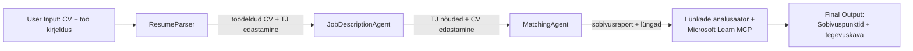

# PersonalCareerCopilot - CV → Töö sobivuse hindaja

Töövoogu esikohale seadnud mitmeagendi rakendus, mis hindab, kui hästi CV vastab töökuulutusele, ning seejärel genereerib isikupärastatud õppeteekonna puudujääkide täitmiseks.

---

## Agendid

| Agent | Roll | Tööriistad |
|-------|------|-------|
| **ResumeParser** | Eristab struktuursed oskused, kogemused ja sertifikaadid CV tekstist | - |
| **JobDescriptionAgent** | Eristab nõutud/eelistatud oskused, kogemused ja sertifikaadid töökuulutusest | - |
| **MatchingAgent** | Võrdleb profiili ja nõudeid → sobivuse skoor (0-100) + sobitatud/puuduvad oskused | - |
| **GapAnalyzer** | Koostab isikupärastatud õppeteekonna Microsoft Learn ressurssidega | `search_microsoft_learn_for_plan` (MCP) |

## Töövoog


```mermaid
flowchart LR
    UserInput["User Input: CV + töö kirjeldus"] --> ResumeParser
    ResumeParser -- "töödeldud CV + TJ edastamine" --> JobDescriptionAgent
    JobDescriptionAgent -- "TJ nõuded + CV edastamine" --> MatchingAgent
    MatchingAgent -- "sobivusraport + lüngad" --> GapAnalyzerMCP["Lünkade analüsaator +\nMicrosoft Learn MCP"]
    GapAnalyzerMCP --> FinalOutput["Final Output:\nSobivuspunktid + tegevuskava"]
```

---

## Kiirkäivitamine

### 1. Keskkonna seadistamine

See kaust on töövoo-põhise Lab 02 raamistiku viiterealisatsioon. Selle `main.py` kasutab olemasolevaid promptiplokke pluss `WorkflowBuilder` nelja agendi ühendamiseks.

```powershell
cd workshop\lab02-multi-agent\PersonalCareerCopilot
python -m venv .venv
.\.venv\Scripts\Activate.ps1          # Windows PowerShell
# source .venv/bin/activate            # macOS / Linux
pip install -r requirements.txt
```

### 2. Volituste seadistamine

Loo selles kaustas `.env` fail:

```powershell
copy .env .env.bak 2>$null; echo $null > .env
```

Muuda `.env`:

```env
FOUNDRY_PROJECT_ENDPOINT=https://<your-account>.services.ai.azure.com/api/projects/<your-project>
AZURE_AI_MODEL_DEPLOYMENT_NAME=gpt-4.1-mini
```

| Väärtus | Kust leida |
|-------|------------|
| `FOUNDRY_PROJECT_ENDPOINT` | Foundry tööriistariba → paremklõps projektil → **Copy Project Endpoint** |
| `AZURE_AI_MODEL_DEPLOYMENT_NAME` | Foundry tööriistariba → laienda projekt → **Models + endpoints** → juurutuse nimi |

### 3. Käivita kohalikes tingimustes

```powershell
python -m debugpy --listen 127.0.0.1:5679 main.py --port 8088
```

Või kasuta VS Code ülesannet: `Ctrl+Shift+P` → **Tasks: Run Task** → **Run Agent HTTP Server**.

F5 silurdamiseks kasuta **Debug Local Agent HTTP Server**.

### 4. Testi Agent Inspectori abil

Ava Agent Inspector: `Ctrl+Shift+P` → **Foundry Toolkit: Open Agent Inspector**.

Kleebi see testimise prompt:

```
Resume:
Jane Doe
Senior Software Engineer with 5 years of experience in Python, Django, and AWS.
Built microservices handling 10K+ requests/second. Led a team of 4 developers.
Certifications: AWS Solutions Architect Associate.
Education: B.S. Computer Science, State University.

Job Description:
Senior Cloud Engineer at Contoso Ltd.
Required: Python, Azure, Kubernetes, Terraform, CI/CD pipelines.
Preferred: Go, monitoring (Prometheus/Grafana), cost optimization.
Experience: 5+ years in cloud infrastructure.
Certifications: Azure Solutions Architect Expert preferred.
```

**Oodatav:** Sobivuse skoor (0-100), sobitatud/puuduvad oskused ja isikupärastatud õppeteekond Microsoft Leani URLidega.

### 5. Juuruta Foundrysse

`Ctrl+Shift+P` → **Foundry Toolkit: Deploy Hosted Agent** → vali oma projekt → kinnita.

---

## Projekti struktuur

```
PersonalCareerCopilot/
├── .env                ← Your credentials (git-ignored)
├── agent.yaml          ← Hosted agent definition (name, resources, env vars)
├── Dockerfile          ← Container image for Foundry deployment
├── main.py             ← 4-agent workflow (instructions, MCP tool, WorkflowBuilder)
└── requirements.txt    ← Python dependencies
```

## Peamised failid

### `agent.yaml`

Määrab Foundry Agent Service’i majutatud agendi:
- `kind: hosted` - jookseb kui hallatav konteiner
- `protocols` - `responses` protokoll koos `version: 1.0.0`, eksponeerib `/responses` HTTP lõpp-punkti
- `environment_variables` - siin on deklareeritud `AZURE_AI_MODEL_DEPLOYMENT_NAME`; `FOUNDRY_PROJECT_ENDPOINT` süstitakse automaatselt juurutamise ajal

### `main.py`

Sisaldab:
- **Agendi juhised** - neli `*_INSTRUCTIONS` konstantset, üks iga agendi jaoks
- **MCP tööriist** - `search_microsoft_learn_for_plan()` teeb päringu aadressile `https://learn.microsoft.com/api/mcp` Streamable HTTP kaudu
- **Agendi loomine** - neli `Agent()` + `AgentExecutor()` eksemplari, mis jagavad üht `FoundryChatClient` klienti
- **Töövoogude graafik** - `WorkflowBuilder` ühendab agendid järjestatud torujuhtmeks: ResumeParser → JD Agent → MatchingAgent → GapAnalyzer
- **Serveri käivitamine** - `ResponsesHostServer` töötab pordil 8088

### `requirements.txt`

| Pakett | Eesmärk |
|---------|----------|
| `agent-framework-foundry` | Põhitööaeg: `Agent`, `AgentExecutor`, `WorkflowBuilder`, `@tool`, `FoundryChatClient` |
| `agent-framework-foundry-hosting` | `ResponsesHostServer` + Foundry majutuse integratsioon |
| `mcp<2,>=1.24.0` | MCP klient GapAnalyzer jaoks (`streamable_http_client`) |
| `debugpy` | Pythoni silur (F5 VS Codes) |

---

## Tõrkeotsing

| Probleem | Lahendus |
|-------|---------|
| `KeyError: 'FOUNDRY_PROJECT_ENDPOINT'` või `KeyError: 'AZURE_AI_MODEL_DEPLOYMENT_NAME'` | Loo `.env` fail, kus on mõlemad `FOUNDRY_PROJECT_ENDPOINT` ja `AZURE_AI_MODEL_DEPLOYMENT_NAME` |
| `ModuleNotFoundError: No module named 'agent_framework'` | Aktiveeri virtuaalne keskkond ja pane paika `pip install -r requirements.txt` |
| Microsoft Leani URL-e väljundis ei ole | Kontrolli internetiühendust aadressile `https://learn.microsoft.com/api/mcp` |
| Ainult 1 puudujäägi kaart (lühendatud) | Veendu, et `GAP_ANALYZER_INSTRUCTIONS` sisaldab `CRITICAL:` plokki |
| Port 8088 on hõivatud | Peata teised serverid käsuga: `netstat -ano \| findstr :8088` |

Üksikasjaliku tõrkeotsingu jaoks vaata [Module 8 - Troubleshooting](../docs/08-troubleshooting.md).

---

**Täielik juhend:** [Lab 02 Docs](../docs/README.md) · **Tagasi:** [Lab 02 README](../README.md) · [Töötoa avaleht](../../../README.md)

---

<!-- CO-OP TRANSLATOR DISCLAIMER START -->
**Lahtiütlus**:
See dokument on tõlgitud kasutades AI tõlketeenust [Co-op Translator](https://github.com/Azure/co-op-translator). Kuigi me püüdleme täpsuse poole, palun pange tähele, et automatiseeritud tõlgetes võib esineda vigu või ebatäpsusi. Originaaldokument selle emakeeles tuleks pidada autoriteetseks allikaks. Olulise teabe puhul soovitatakse kasutada professionaalset inimtõlget. Me ei vastuta selle tõlkega seotud eksimustest või valesti mõistmistest.
<!-- CO-OP TRANSLATOR DISCLAIMER END -->