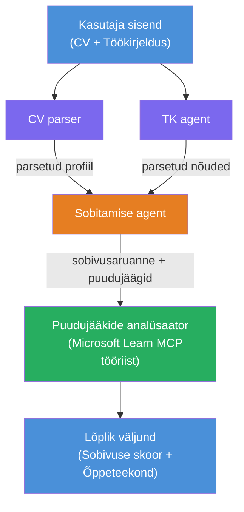

# Labor 02 - Mitmeagendi töövoog: CV → Töö sobivuse hindaja

---

## Mida sa ehitad

**CV → Töö sobivuse hindaja** - mitmeagendi töövoog, kus neli spetsialiseerunud agenti teevad koostööd, et hinnata, kui hästi kandidaadi CV vastab töökirjeldusele, ning seejärel genereerida isikupärastatud õppimisplaan, et täita puudujäägid.

### Agentide rollid

| Agent | Roll |
|-------|------|
| **CV parser** | Ekstraheerib struktureeritud oskused, kogemused, sertifikaadid CV tekstist |
| **Töökirjelduse agent** | Ekstraheerib nõutud/eelistatud oskused, kogemused, sertifikaadid töökirjeldusest |
| **Sobitamise agent** | Võrdleb profiili nõuetega → sobivuse hinnang (0-100) + sobitatud/puuduvad oskused |
| **Puudujääkide analüüsija** | Koostab isikupärastatud õppimisplaani koos ressursside, ajakava ja kiire võidu projektidega |

### Demo voog

Laadi üles **CV + töö kirjeldus** → saa **sobivuse hinnang + puuduvad oskused** → saa **isikupärastatud õppimisplaan**.

### Töövoo arhitektuur

> Lilla = paralleelsed agendid | Oranž = koondamispunkt | Roheline = lõplik agent tööriistadega. Vaata [Moodul 1 - Arhitektuuri mõistmine](docs/01-understand-multi-agent.md) ja [Moodul 4 - Orkestreerimise mustrid](docs/04-orchestration-patterns.md) detailsete diagrammide ja andmevoo kohta.

### Kaetud teemad

- Mitmeagendi töövoo loomine kasutades **WorkflowBuilder**-it
- Agentide rollide ja orkestreerimisvoo määratlemine (paralleelne + järjestikune)
- Agentidevahelised suhtlusmustrid
- Kohalik testimine Agent Inspectoriga
- Mitmeagendi töövoogude juurutamine Foundry Agent Service’i kaudu

---

## Eeltingimused

Täida esmalt Labor 01:

- [Labor 01 - Üks agent](../lab01-single-agent/README.md)

---

## Alustamine

Vaata täielikke seadistamisjuhiseid, koodi läbivaatust ja testkäsklusi:

- [Labor 2 dokumendid - eeltingimused](docs/00-prerequisites.md)
- [Labor 2 dokumendid - täielik õpitee](docs/README.md)
- [PersonalCareerCopiloti kasutusjuhend](PersonalCareerCopilot/README.md)

## Orkestreerimise mustrid (agentipõhised alternatiivid)

Labor 2 sisaldab vaikimisi **paralleelne → koondaja → planeerija** voogu ning dokumentatsioon kirjeldab ka alternatiivseid mustreid, et demonstreerida tugevamat agentide käitumist:

- **Fänn-välja/Fänn-sisse kaalutud konsensusega**
- **Ülevaataja/kriitik enne lõplikku plaani**
- **Tingimuslik marsruutija** (tee valik sobivuse hinnangu ja puuduvate oskuste põhjal)

Vaata [docs/04-orchestration-patterns.md](docs/04-orchestration-patterns.md).

---

**Eelmine:** [Labor 01 - Üks agent](../lab01-single-agent/README.md) · **Tagasi:** [Töötoa avaleht](../../README.md)

---

<!-- CO-OP TRANSLATOR DISCLAIMER START -->
**Vastutusest loobumine**:  
See dokument on tõlgitud kasutades AI tõlketeenust [Co-op Translator](https://github.com/Azure/co-op-translator). Kuigi püüame tagada täpsust, palun arvestage, et automatiseeritud tõlked võivad sisaldada vigu või ebatäpsusi. Algne dokument oma emakeeles tuleks pidada autoriteetseks allikaks. Olulise teabe korral soovitatakse kasutada professionaalset inimtõlget. Me ei vastuta selle tõlke kasutamisest tekkivate arusaamatuste või valesti mõistmiste eest.
<!-- CO-OP TRANSLATOR DISCLAIMER END -->