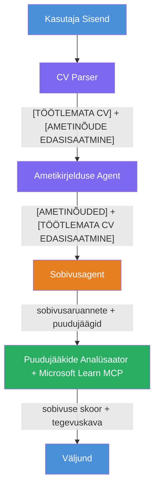

# Labor 02 - Mitmeagendi töövoog: CV → Tööpakkumise sobivuse hindaja

## Ülevaade

Selles praktilises laboris ehitad **töövoogupõhise mitmeagendi rakenduse** Foundry Toolkitiga VS Code'is ja kasutad seda Microsoft Foundry Agent Service’isse juurutamiseks.

**Mida ehitad:** CV → Tööpakkumise sobivuse hindaja, mis analüüsib CV ja töökuulutuse, hindab sobivust ning loob isikupärastatud õppeteekonna Microsoft Learn ressursside põhjal.

---

## Arhitektuur

```mermaid
flowchart TD
    A["Kasutaja Sisend"] --> B["CV Parser"]
    B -->|"[TÖÖTLEMATA CV] + [AMETINÕUDE EDASISAATMINE]"| C["Ametikirjelduse Agent"]
    C -->|"[AMETINÕUDED] + [TÖÖTLEMATA CV EDASISAATMINE]"| D["Sobivusagent"]
    D -->|sobivusaruannete + puudujäägid| E["Puudujääkide Analüsaator + Microsoft Learn MCP"]
    E -->|sobivuse skoor + tegevuskava| F["Väljund"]

    style A fill:#4A90D9,color:#fff
    style B fill:#7B68EE,color:#fff
    style C fill:#7B68EE,color:#fff
    style D fill:#E67E22,color:#fff
    style E fill:#27AE60,color:#fff
    style F fill:#4A90D9,color:#fff
```

**Kuidas see töötab:**
1. Kasutaja kopeerib ja kleebib CV ja töökuulutuse.
2. **ResumeParser** analüüsib CV ja kopeerib töökuulutuse täpselt `[JOB DESCRIPTION PASS-THROUGH]` sektsiooni.
3. **JD Agent** eraldab struktureeritud nõuded läbipääsust ja edastab seejärel `[PARSED RESUME]` edasi kui `[PARSED RESUME PASS-THROUGH]`.
4. **MatchingAgent** võrdleb `[PARSED RESUME PASS-THROUGH]` ja `[JD REQUIREMENTS]` ning annab sobivuse hinde.
5. **GapAnalyzer** muudab lüngad praktiliseks teekonnaks ja hangib Microsoft Learning’i lingid MCP kaudu.

---

## Eeltingimused

Lõpeta esmalt Labor 01:

- [Labor 01 - Üksikagent](../lab01-single-agent/README.md)

---

## Osa 1: Lugege moodulid järjestatult läbi

Vaata kogu õpitud teekonda aadressil:

- [Labor 2 Dokumendid - Eeltingimused](docs/00-prerequisites.md)
- [Labor 2 Dokumendid - Täielik õpituteekond](docs/README.md)
- [PersonalCareerCopilot jooksutamisjuhend](PersonalCareerCopilot/README.md)

---

## Osa 2: Ehita ja testi töövoogu

1. Kasuta Foundry Toolkiti viisardit töövoogupõhise projekti raamitekstiks.
2. Kopeeri promptplokid ja töövoo graafik failist `PersonalCareerCopilot/main.py` oma tööruumi.
3. Käivita kohapeal Agent Inspectoriga ja kontrolli kõigi nelja agendi ning MCP tööriista tööd.
4. Juhi majutatud agent Foundry'sse, kui kohalik testimine õnnestub.

---

## Orkestreerimise mustrid

Labor 02 sisaldab vaikimisi **fan-out → fan-in → järjestikust** töövoogu ning dokumendid kirjeldavad ka alternatiivseid orkestreerimise mustreid katsetamiseks.

- **Fan-out/Fan-in kaalutud konsensusega**
- **Hindaja/kriitik kontroll enne lõplikku õpeteekonda**
- **Tingimuslik marsruutija** sobivuse hinde ja puuduvate oskuste põhjal

Vaata [docs/04-orchestration-patterns.md](docs/04-orchestration-patterns.md).

---

**Eelmine:** [Labor 01 - Üksikagent](../lab01-single-agent/README.md) · **Tagasi:** [Töötoa avaleht](../../README.md)

---

<!-- CO-OP TRANSLATOR DISCLAIMER START -->
**Lahtiütlus**:
See dokument on tõlgitud kasutades AI tõlketeenust [Co-op Translator](https://github.com/Azure/co-op-translator). Kuigi me püüdleme täpsuse poole, palun pange tähele, et automatiseeritud tõlgetes võib esineda vigu või ebatäpsusi. Originaaldokument selle emakeeles tuleks pidada autoriteetseks allikaks. Olulise teabe puhul soovitatakse kasutada professionaalset inimtõlget. Me ei vastuta selle tõlkega seotud eksimustest või valesti mõistmistest.
<!-- CO-OP TRANSLATOR DISCLAIMER END -->