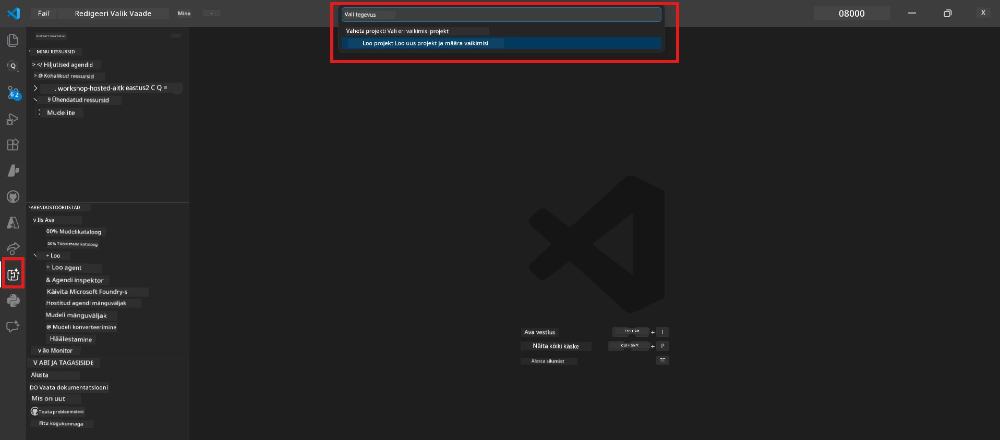

# Moodul 0 - Eeldused

Enne Lab 02 alustamist veendu, et oled järgneva lõpetanud. See labor ehitab otseselt Lab 01 peale – ära vahele jäta.

---

## 1. Lõpeta Lab 01

Lab 02 eeldab, et oled juba:

- [x] Läbinud kõik 8 moodulit [Lab 01 - Single Agent](../../lab01-single-agent/README.md) juures
- [x] Edukalt juurutanud ühe agendi Foundry Agent Service’i
- [x] Kontrollinud, et agent töötab nii kohalikus Agent Inspector’is kui ka Foundry Playgroundis

Kui sa pole Lab 01 lõpetanud, mine tagasi ja lõpeta see nüüd: [Lab 01 dokumentatsioon](../../lab01-single-agent/docs/00-prerequisites.md)

---

## 2. Kontrolli olemasolevat seadistust

Kõik Lab 01 tööriistad peaksid jätkuvalt olema paigaldatud ja töötamas. Käivita need kiired kontrollid:

### 2.1 Azure CLI

```powershell
az account show --query "{name:name, id:id}" --output table
```

Oodatud: Kuvab sinu tellimuse nime ja ID. Kui see ebaõnnestub, käivita [`az login`](https://learn.microsoft.com/cli/azure/authenticate-azure-cli-interactively).

### 2.2 VS Code laiendused

1. Vajuta `Ctrl+Shift+P` → kirjuta **"Microsoft Foundry"** → veendu, et näed käske (nt `Microsoft Foundry: Create a New Hosted Agent`).
2. Vajuta `Ctrl+Shift+P` → kirjuta **"Foundry Toolkit"** → veendu, et näed käske (nt `Foundry Toolkit: Open Agent Inspector`).

### 2.3 Foundry projekt ja mudel

1. Kliki VS Code Activity Baril oleval **Microsoft Foundry** ikoonil.
2. Veendu, et sinu projekt on nimekirjas (nt `workshop-agents`).
3. Ava projekt → kontrolli, et juurutatud mudel on olemas (nt `gpt-4.1-mini`) olekuga **Succeeded**.

> **Kui sinu mudeli juurutamise tähtaeg on möödas:** Mõned tasuta tasemega juurutused aeguvad automaatselt. Juuruta uuesti [Mudelite kataloogist](https://learn.microsoft.com/azure/foundry/foundry-models/concepts/models-sold-directly-by-azure) (`Ctrl+Shift+P` → **Microsoft Foundry: Open Model Catalog**).



### 2.4 RBAC rollid

Veendu, et sul on Foundry projektis roll **Azure AI User**:

1. [Azure portaali](https://portal.azure.com) → sinu Foundry **projekti** ressurss → **Access control (IAM)** → **[Role assignments](https://learn.microsoft.com/azure/foundry/concepts/rbac-foundry)** sakk.
2. Otsi oma nime → veendu, et **[Azure AI User](https://aka.ms/foundry-ext-project-role)** on nimekirjas.

---

## 3. Mõista multi-agent kontseptsioone (uus Lab 02 jaoks)

Lab 02 tutvustab teemasid, mida Lab 01 ei käsitlenud. Loe need läbi enne jätkamist:

### 3.1 Mis on multi-agent töövoog?

Ühe агенди asemel, kes kõike teeb, jagab **multi-agent töövoog** töö mitme spetsialiseerunud agendi vahel. Iga agentil on:

- Oma **juhised** (süsteemi prompt)
- Oma **roll** (mille eest ta vastutab)
- Vabatahtlikud **tööriistad** (funktsioonid, mida ta saab kutsuda)

Agendid suhtlevad üksteisega läbi **orkestreerimisgraafi**, mis määratleb andmevoogu nende vahel.

### 3.2 WorkflowBuilder

[`WorkflowBuilder`](https://learn.microsoft.com/agent-framework/workflows/agents-in-workflows) klass `agent_framework` raamatukogust on SDK komponent, mis ühendab agendid omavahel:

```python
from agent_framework import WorkflowBuilder

workflow = (
    WorkflowBuilder(
        name="MyWorkflow",
        start_executor=agent_a,
        output_executors=[agent_d],
    )
    .add_edge(agent_a, agent_b)
    .add_edge(agent_a, agent_c)
    .add_edge(agent_b, agent_d)
    .add_edge(agent_c, agent_d)
    .build()
)
```

- **`start_executor`** - Esimene agent, kes saab kasutaja sisendi
- **`output_executors`** - Agent(id), kelle väljundiks saab lõplik vastus
- **`add_edge(source, target)`** - Määratleb, et `target` saab `source` väljundi

### 3.3 MCP (Model Context Protocol) tööriistad

Lab 02 kasutab **MCP tööriista**, mis kutsub Microsoft Learn API'd õppematerjalide toomiseks. [MCP (Model Context Protocol)](https://modelcontextprotocol.io/introduction) on standardiseeritud protokoll, mis ühendab AI mudelid välistesse andmeallikatesse ja tööriistadesse.

| Termin | Määratlus |
|------|-----------|
| **MCP server** | Teenus, mis pakub tööriistu/resursse läbi [MCP protokolli](https://learn.microsoft.com/azure/foundry/agents/how-to/tools/model-context-protocol) |
| **MCP klient** | Su agendi kood, mis ühendub MCP serveriga ja kutsub selle tööriistu |
| **[Streamable HTTP](https://learn.microsoft.com/agent-framework/agents/tools/hosted-mcp-tools)** | Transportmeetod, mida kasutatakse MCP serveriga suhtlemiseks |

### 3.4 Kuidas Lab 02 erineb Lab 01-st

| Aspekt | Lab 01 (üks agent) | Lab 02 (mitu agenti) |
|--------|--------------------|----------------------|
| Agendid | 1 | 4 (spetsialiseerunud rollid) |
| Orkestreerimine | Puudub | WorkflowBuilder (paralleelne + järjestikune) |
| Tööriistad | Valikuline `@tool` funktsioon | MCP tööriist (väline API kõne) |
| Keerukus | Lihtne prompt → vastus | CV + töökuulutus → sobivusskoor → teekond |
| Konteksti voog | Otsene | Agentide vaheline üleandmine |

---

## 4. Labori 02 töötoa hoidla struktuur

Veendu, et tead, kus Lab 02 failid asuvad:

```
workshop/
└── lab02-multi-agent/
    ├── README.md                       ← Lab overview
    ├── docs/                           ← You are here
    │   ├── README.md                   ← Learning path index
    │   ├── 00-prerequisites.md         ← This file
    │   ├── 01-understand-multi-agent.md
    │   ├── ...
    │   └── 08-troubleshooting.md
    └── PersonalCareerCopilot/          ← The agent project
        ├── agent.yaml                  ← Agent definition
        ├── main.py                     ← 4-agent workflow code
        ├── Dockerfile                  ← Container configuration
        └── requirements.txt            ← Python dependencies
```

---

### Kontrollpunkt

- [ ] Lab 01 on täielikult lõpetatud (kõik 8 moodulit, agent juurutatud ja kontrollitud)
- [ ] `az account show` tagastab sinu tellimuse
- [ ] Microsoft Foundry ja Foundry Toolkit laiendused on paigaldatud ja vastavad käskudele
- [ ] Foundry projektis on juurutatud mudel (nt `gpt-4.1-mini`)
- [ ] Sul on projektil roll **Azure AI User**
- [ ] Sa oled lugenud ülaltoodud multi-agent kontseptsioonide osa ja mõistad WorkflowBuilder’i, MCP-d ja agentide orkestreerimist

---

**Järgmine:** [01 - Mõista multi-agent arhitektuuri →](01-understand-multi-agent.md)

---

<!-- CO-OP TRANSLATOR DISCLAIMER START -->
**Vastutusest loobumine**:
See dokument on tõlgitud kasutades tehisintellektil põhinevat tõlketeenust [Co-op Translator](https://github.com/Azure/co-op-translator). Kuigi püüame täpsust, tuleb arvestada, et automaatsed tõlked võivad sisaldada vigu või ebatäpsusi. Originaaldokument selle algkeeles on autoriteetne allikas. Tähtsa teabe puhul soovitatakse professionaalset inimtõlget. Me ei vastuta selle tõlke kasutamisest tulenevate arusaamatuste või valesti mõistmiste eest.
<!-- CO-OP TRANSLATOR DISCLAIMER END -->