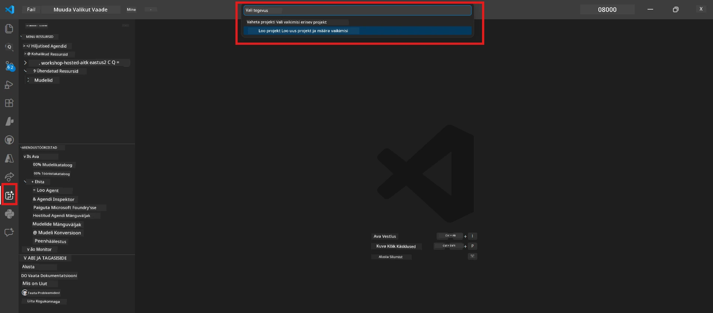

# Moodul 0 - Sissejuhatus

⏱️ ~10 min

> [!WARNING]
> **Eelvaade ja piirangud:** [Hostitud agendid](https://learn.microsoft.com/azure/foundry/agents/concepts/hosted-agents) on praegu **avalikus eelvaates** - ei soovitata tootmiskoormuste jaoks. Mõned selles töötoas näidatud funktsioonid võivad teenuse GA-sse liikumisel muutuda.

## Mida sa ehitad

Selles laboris laiendad ühe agendi oskusi Lab 01-st, et ehitada **mitme agendi töövoog** - CV → töö sobivuse hindaja.

Sa kleebid sisse **CV** ja **töö kirjelduse**. Neli spetsialiseerunud agenti töötlevad sisendi järjestikku, seejärel tagastavad:
- Sobivuse skoori (0–100 koos skoori jaotusega)
- Oskuste ja sertifikaatide puuduste nimekirja
- Isikupärastatud õpiraja koos tegelike Microsoft Learn linkidega iga puuduse kohta

**Töövoog kasutab:**
- **Microsoft Agent Framework** - `WorkflowBuilder` järjestikuseks torujuhtme orkestreerimiseks
- **Foundry tööriistakomplekti VS Code jaoks** - skafsolderimine, kohalik testimine, juurutamine
- **Tehisintellekti mudelit** (nt `gpt-4.1-mini`) - kasutavad kõik neli agenti
- **Microsoft Learn MCP serverit** - pakub tegelikke õppematerjalide linke iga oskuse puuduse jaoks

---

## Vali oma tee

> ⚠️ **Jätka samal teel, mida kasutasid laboris 01.**

<details open>
<summary><strong>🅰️ Tee A - Azure pilv (vajab Azure tellimust)</strong></summary>

| | Detailid |
|---|---|
| **Kellele mõeldud?** | Sa lõpetasid Lab 01 Azure tellimuse kasutades |
| **Mudeli tüüp** | Azure OpenAI kaudu Foundry (nt `gpt-4.1-mini`) |
| **Käsitletud moodulid** | Kõik moodulid (00–09) |
| **Kas pilve juurutada?** | ✅ Jah - täiemahuline lõpp-lõpuks juurutus |

</details>

<details open>
<summary><strong>🅱️ Tee B - Foundry lokaalne (Azure tellimust ei ole vaja)</strong></summary>

| | Detailid |
|---|---|
| **Kellele mõeldud?** | Sa lõpetasid Lab 01 Foundry lokal kasutades |
| **Mudeli tüüp** | Foundry lokaalne (tasuta, töötab su masinas) |
| **Käsitletud moodulid** | Moodulid 00–05 (vaata üle 06–07 - juurutus & pilve kontroll) |
| **Kas pilve juurutada?** | ❌ Ei - ainult kohalik testimine Agent Inspectoriga |

</details>

---

## Kontrolli Lab 01

Lab 02 tugineb otseselt Lab 01-le. Lõpeta Lab 01 enne siin alustamist.

Pole veel Lab 01 teinud? Alusta siit: [Lab 01 - Sissejuhatus](../../lab01-single-agent/docs/00-prerequisites.md)

<details open>
<summary><strong>🅰️ Tee A - Azure pilv</strong></summary>

```powershell
az account show --query "{name:name, id:id}" --output table
```

Kui see ebaõnnestub, käivita `az login`. Seejärel kontrolli VS Code:

1. `Ctrl+Shift+P` → kirjuta **Foundry Toolkit** → veendu, et käsud ilmuvad.
2. Klõpsa **Foundry Toolkit** ikoonile → su projekt ja juurutatud mudel näitavad **Õnnestus**.



> **RBAC:** Sa määrasid endale Lab 01-s **Foundry kasutaja** rolli. Kui vajad uuesti määramist, vaata [Lab 01, Moodul 1](../../lab01-single-agent/docs/01-setup.md#deploy-a-model--assign-rbac). See roll kandis varem nime **Azure AI User** - samad õigused.

</details>

<details open>
<summary><strong>🅱️ Tee B - Foundry lokaalne</strong></summary>

```powershell
Invoke-WebRequest -Uri "http://localhost:5273/v1/health" -UseBasicParsing | Select-Object StatusCode
```

Oodatav: `StatusCode: 200`. Kui ei, taaskäivita Foundry Local Foundry Toolkit külgribalt.

> Kõik tuletised töötavad su masinas. Ainuke väljuv päring on MCP tööriistale aadressil `https://learn.microsoft.com/api/mcp`.

</details>

---

## Mis on uut laboris 02

| | Lab 01 | Lab 02 |
|--|--------|--------|
| Agendid | 1 | 4 (järjestatud WorkflowBuilderiga) |
| Skafoldi mall | Põhiline - Agent Framework | Töövood - Agent Framework |
| Uus pakett | - | `mcp` |
| Orkestreerimine | Üks vestlusagent | Järjestikune torujuhe (WorkflowBuilder) |
| Uus tööriist | - | `search_microsoft_learn_for_plan` (MCP) |

---

**Järgmine:** [01 - Arhitektuuri mõistmine →](01-understand-multi-agent.md)

---

<!-- CO-OP TRANSLATOR DISCLAIMER START -->
**Lahtiütlus**:
See dokument on tõlgitud kasutades AI tõlketeenust [Co-op Translator](https://github.com/Azure/co-op-translator). Kuigi me püüdleme täpsuse poole, palun pange tähele, et automatiseeritud tõlgetes võib esineda vigu või ebatäpsusi. Originaaldokument selle emakeeles tuleks pidada autoriteetseks allikaks. Olulise teabe puhul soovitatakse kasutada professionaalset inimtõlget. Me ei vastuta selle tõlkega seotud eksimustest või valesti mõistmistest.
<!-- CO-OP TRANSLATOR DISCLAIMER END -->