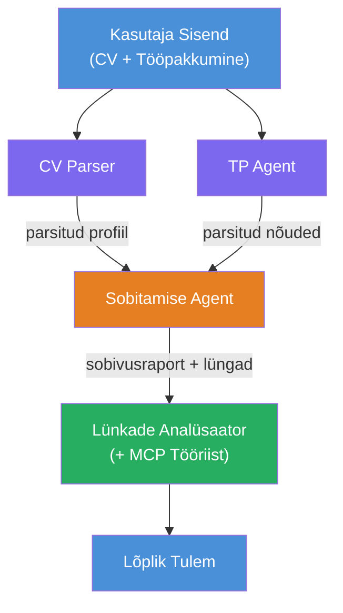
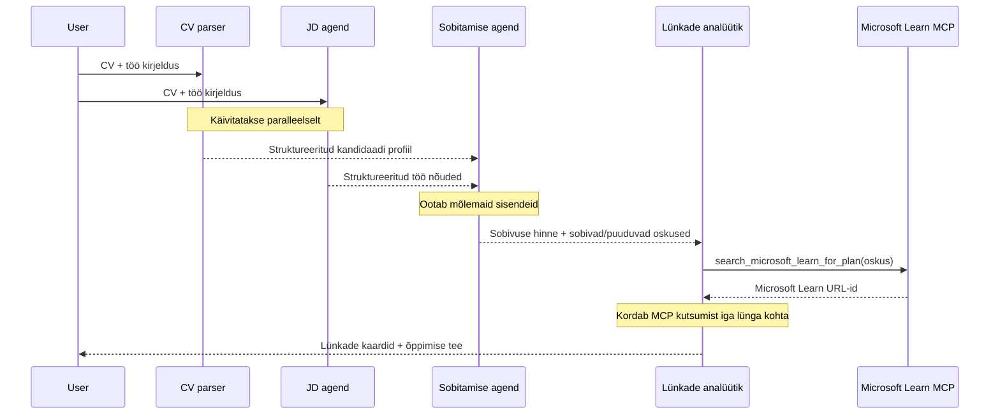
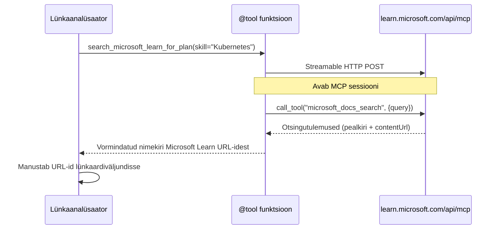

# Moodul 1 - Mõista mitme agendi arhitektuuri

Selles moodulis õpid tundma Resume → Job Fit Evaluatori arhitektuuri enne koodi kirjutamist. Orkestreerimisgraafi, agendi rollide ja andmevoo mõistmine on kriitiline mitmeagendiliste töövoogude [veatuvastuseks ja laiendamiseks](https://learn.microsoft.com/azure/architecture/ai-ml/idea/multiple-agent-workflow-automation).

---

## Probleem, mida see lahendab

CV vastendamine töökuulutusele hõlmab mitut erinevat oskust:

1. **Parsimine** - struktureeritud andmete eraldamine struktureerimata tekstist (CV)
2. **Analüüs** - nõuete väljavõtmine töökuulutusest
3. **Võrdlemine** - sobivuse skoori arvutamine kahe vahel
4. **Planeerimine** - õppemarsruudi koostamine puudujääkide katmiseks

Üks agent, kes teeb kõik neli ülesannet ühe prompti jooksul, toodab sageli:
- Ebapiisavat eraldust (ta tormab läbi parsimise, et jõuda skoorini)
- Pealiskaudset hindamist (puudub tõenduspõhine lagundus)
- Üldisi õppemarsruute (ei ole konkreetsetele puudujääkidele kohandatud)

Jagades selle **neljaks spetsialiseerunud agendiks**, keskendub igaüks oma ülesandele pühendatud juhistega, mis toob igas etapis kaasa kõrgema kvaliteedi väljundi.

---

## Neli agenti

Iga agent on täisväärtuslik [Microsoft Foundry](https://learn.microsoft.com/azure/foundry/agents/concepts/hosted-agents) agent, loodud `AzureAIAgentClient.as_agent()` kaudu. Need kasutavad sama mudeli juurutust, kuid erinevate juhiste ja (võimalusel) erinevate tööriistadega.

| # | Agendi nimi | Roll | Sisend | Väljund |
|---|-------------|------|--------|---------|
| 1 | **ResumeParser** | Eraldab struktureeritud profiili CV tekstist | Mittereeritud CV tekst (kasutajalt) | Kandidaadi profiil, tehnilised oskused, pehmed oskused, sertifikaadid, valdkonnakogemus, saavutused |
| 2 | **JobDescriptionAgent** | Eraldab struktureeritud nõuded töökuulutusest | Mittereeritud töökuulutuse tekst (kasutajalt, ResumeParseri kaudu edastatud) | Rolli ülevaade, vajalikud oskused, soovitud oskused, kogemus, sertifikaadid, haridus, vastutused |
| 3 | **MatchingAgent** | Arvutab tõenduspõhise sobivuse skoori | ResumeParseri ja JobDescriptionAgendi väljundid | Sobivuse skoor (0-100 koos lagundusega), vastavad oskused, puuduvad oskused, lüngad |
| 4 | **GapAnalyzer** | Koostab isikupärastatud õppemarsruudi | MatchingAgendi väljund | Lüngakaardid (oskuse lõikes), õppimise järjekord, ajakava, Microsoft Learni ressursid |

---

## Orkestreerimisgraafik

Töövoog kasutab **paralleelset lahtivoolu** ja sellele järgneb **järjestikune agregatsioon**:


> **Legenda:** Lilla = paralleelsed agendid, Oranž = agregatsioonipunkt, Roheline = lõplik agent tööriistadega

### Kuidas andmed voolavad


1. **Kasutaja saadab** sõnumi, mis sisaldab CV-d ja töökuulutust.
2. **ResumeParser** võtab vastu täieliku kasutajasisendi ja eraldab struktureeritud kandidaadi profiili.
3. **JobDescriptionAgent** võtab kasutajasisendi vastu paralleelselt ja eraldab struktureeritud nõuded.
4. **MatchingAgent** võtab vastu nii ResumeParseri kui ka JobDescriptionAgendi väljundid (raamistik ootab mõlema lõppemist enne MatchingAgendi käivitamist).
5. **GapAnalyzer** võtab vastu MatchingAgendi väljundi ja kutsub **Microsoft Learni MCP tööriista**, et hankida reaalsed õppematerjalid iga lünga jaoks.
6. **Lõplik väljund** on GapAnalyseri vastus, mis sisaldab sobivuse skoori, lüngakaardid ja täielikku õppemarsruuti.

### Miks paralleelne lahtivool on oluline

ResumeParser ja JobDescriptionAgent töötavad **paralleelselt**, sest kumbki ei sõltu teisest. See:
- Vähendab kogu latentsust (mõlemad töötavad samaaegselt, mitte järjestikku)
- On loomulik jaotus (CV parsimine vs töökuulutuse parsimine on sõltumatud ülesanded)
- Näitab levinud mitme agendi mustrit: **lahtivool → agregaat → tegutse**

---

## WorkflowBuilder koodis

Siin on, kuidas ülaltoodud graafik kaardub `WorkflowBuilder` API päringuteks `main.py` failis:

```python
from agent_framework import WorkflowBuilder

workflow = (
    WorkflowBuilder(
        name="ResumeJobFitEvaluator",
        start_executor=resume_parser,       # Esimene agent, kes saab kasutaja sisendi
        output_executors=[gap_analyzer],     # Viimane agent, kelle väljund tagastatakse
    )
    .add_edge(resume_parser, jd_agent)      # CV parser → töökuulutuse agent
    .add_edge(resume_parser, matching_agent) # CV parser → vastavuse agent
    .add_edge(jd_agent, matching_agent)      # töökuulutuse agent → vastavuse agent
    .add_edge(matching_agent, gap_analyzer)  # vastavuse agent → lõhe analüsaator
    .build()
)
```

**Servade mõistmine:**

| Serv | Mida tähendab |
|------|--------------|
| `resume_parser → jd_agent` | JD Agent saab ResumeParseri väljundi |
| `resume_parser → matching_agent` | MatchingAgent saab ResumeParseri väljundi |
| `jd_agent → matching_agent` | MatchingAgent saab lisaks JD Agendi väljundi (ootab mõlema lõppemist) |
| `matching_agent → gap_analyzer` | GapAnalyzer saab MatchingAgendi väljundi |

Kuna `matching_agentil` on **kaks sisendserva** (`resume_parser` ja `jd_agent`), ootab raamistik automaatselt mõlema lõppemist enne MatchingAgendi käivitamist.

---

## MCP tööriist

GapAnalyzeri agentil on üks tööriist: `search_microsoft_learn_for_plan`. See on **[MCP tööriist](https://learn.microsoft.com/agent-framework/agents/tools/hosted-mcp-tools)**, mis kutsub Microsoft Learni API-d, et hankida kureeritud õppematerjale.

### Kuidas see töötab

```python
@tool
async def search_microsoft_learn_for_plan(
    skill: str, role: str = "", max_results: int = 5
) -> str:
    """Search Microsoft Learn MCP and return curated official links."""
    # Ühendub aadressiga https://learn.microsoft.com/api/mcp abil Streamable HTTP
    # Kutsub MCP serveris välja tööriista 'microsoft_docs_search'
    # Tagastab vormindatud Microsoft Learn URL-ide nimekirja
```

### MCP kutse voog


1. GapAnalyzer otsustab, et vajab õppematerjale oskuse jaoks (nt "Kubernetes")
2. Raamistik kutsub `search_microsoft_learn_for_plan(skill="Kubernetes")`
3. Funktsioon avab [voogedastatava HTTP](https://learn.microsoft.com/agent-framework/agents/tools/hosted-mcp-tools) ühenduse aadressile `https://learn.microsoft.com/api/mcp`
4. Kutsub `microsoft_docs_search` tööriista [MCP serveris](https://learn.microsoft.com/azure/foundry/agents/how-to/tools/model-context-protocol)
5. MCP server tagastab otsingutulemused (pealkiri + URL)
6. Funktsioon vormindab tulemused ja tagastab need stringina
7. GapAnalyzer kasutab tagastatud URL-e oma lüngakaardi väljundis

### Oodatavad MCP logid

Kui tööriist töötab, näed logikirjeid sarnaseid:

```
GET https://learn.microsoft.com/api/mcp → 405 (Method Not Allowed)
POST https://learn.microsoft.com/api/mcp → 200
DELETE https://learn.microsoft.com/api/mcp → 405 (Method Not Allowed)
```

**Need on tavalised.** MCP klient teeb algkäivituse ajal GET ja DELETE päringuid - nende tagastamine 405 on ootuspärane käitumine. Tegelik tööriistakutse kasutab POST meetodit ja tagastab 200. Muretse ainult, kui POST ei õnnestu.

---

## Agendi loomise muster

Iga agent luuakse kasutades **[`AzureAIAgentClient.as_agent()`](https://learn.microsoft.com/python/api/overview/azure/ai-agents-readme) asünkroonset kontekstihaldurit**. See on Foundry SDK muster agentide loomiseks, mis automaatselt puhastatakse:

```python
async with (
    get_credential() as credential,
    AzureAIAgentClient(
        project_endpoint=PROJECT_ENDPOINT,
        model_deployment_name=MODEL_DEPLOYMENT_NAME,
        credential=credential,
    ).as_agent(
        name="ResumeParser",
        instructions=RESUME_PARSER_INSTRUCTIONS,
    ) as resume_parser,
    # ... korda iga agendi jaoks ...
):
    # Siin eksisteerivad kõik 4 agenti
    workflow = create_workflow(resume_parser, jd_agent, matching_agent, gap_analyzer)
```

**Olulised punktid:**
- Iga agent saab omaenda `AzureAIAgentClient` instantsi (SDK nõuab, et agendi nimi oleks kliendi piires)
- Kõik agendid kasutavad sama `credential`, `PROJECT_ENDPOINT` ja `MODEL_DEPLOYMENT_NAME`
- `async with` plokk tagab, et kõik agendid puhastatakse serveri sulgemisel
- GapAnalyzer saab lisaks `tools=[search_microsoft_learn_for_plan]`

---

## Serveri käivitamine

Pärast agentide loomist ja töövoo ehitamist käivitatakse server:

```python
from azure.ai.agentserver.agentframework import from_agent_framework

agent = create_workflow(resume_parser, jd_agent, matching_agent, gap_analyzer)
await from_agent_framework(agent).run_async()
```

`from_agent_framework()` kapseldab töövoo HTTP serverina, mis avab `/responses` lõpp-punkti pordil 8088. See on sama muster nagu Lab 01-s, kuid nüüd on "agent" kogu [töövoograafik](https://learn.microsoft.com/agent-framework/workflows/as-agents).

---

### Kontrollpunkt

- [ ] Sa mõistad 4-agendilise arhitektuuri ja iga agendi rolli
- [ ] Sa suudad jälgida andmevoogu: Kasutaja → ResumeParser → (paralleelselt) JD Agent + MatchingAgent → GapAnalyzer → väljund
- [ ] Sa mõistad, miks MatchingAgent ootab nii ResumeParseri kui ka JD Agenti (kaks sisendserva)
- [ ] Sa tead MCP tööriista: mida see teeb, kuidas seda kutsutakse ja et GET 405 logid on normaalsed
- [ ] Sa mõistad `AzureAIAgentClient.as_agent()` mustrit ja miks igal agendil on oma klient
- [ ] Sa saad lugeda `WorkflowBuilder` koodi ja siduda selle visuaalse graafikuga

---

**Eelmine:** [00 - Eeltingimused](00-prerequisites.md) · **Järgmine:** [02 - Mitme Agendi Projekti alustamine →](02-scaffold-multi-agent.md)

---

<!-- CO-OP TRANSLATOR DISCLAIMER START -->
**Vastutusest loobumine**:  
See dokument on tõlgitud kasutades tehisintellektil põhinevat tõlketeenust [Co-op Translator](https://github.com/Azure/co-op-translator). Kuigi me püüame tagada täpsuse, palun arvestage, et automaatsed tõlked võivad sisaldada vigu või ebatäpsusi. Originaaldokument oma emakeeles tuleks pidada autoriteetseks allikaks. Kriitilise teabe puhul soovitatakse kasutada professionaalset inimtõlget. Me ei vastuta selle tõlke kasutamisest tingitud arusaamatuste või valesti mõistmiste eest.
<!-- CO-OP TRANSLATOR DISCLAIMER END -->