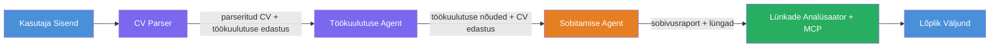

# Moodul 1 - Mõista arhitektuuri

⏱️ ~5 minutit

Enne koodi kirjutamist on siin kiire ülevaade sellest, mida sa ehitad ja kuidas see töötab.

---

## Mida sa ehitad

Sa kleebid siia **elulookirjelduse** ja **töökuulutuse**. Töövoog tagastab:

- Sobivuse skoori (0–100 koos jaotusega)
- Oskuste ja sertifitseeringute puudujääkide nimekirja
- Isikupärastatud õppekava Microsoft Learn linkidega iga puudujäägi kohta

---

## Neli agenti

Üks agent, kes üritab kõike korraga töödelda, hinnata ja planeerida, kipub kiirustama ja tekitama pealiskaudset väljundit. Töötükkide jagamine nelja spetsialiseeritud agendile annab paremaid tulemusi:

| Agent | Mida ta teeb |
|-------|-------------|
| **ResumeParser** | Töötleb elulookirjelduse; kopeerib töökuulutuse täpselt `[JOB DESCRIPTION PASS-THROUGH]` jaotisse edasiste agendide jaoks |
| **JobDescriptionAgent** | Võtab töökuulutuse nõuded pass-through-st; edastab `[PARSED RESUME]` edasi kui `[PARSED RESUME PASS-THROUGH]` |
| **MatchingAgent** | Võrdleb mõlemaid märgistatud osi; loob 0–100 sobivuse skoori ja puudujääkide nimekirja |
| **GapAnalyzer** | Koostab õppekava; otsib Microsoft Learn-ist iga puudujäägi kohta |

---

## Orkestratsiooni graafik

Töövoog on **järjestikune torujuhe** – iga agent annab oma väljundi järgmisele:


```mermaid
flowchart LR
    A["Kasutaja Sisend"] --> B["CV Parser"]
    B -- "parseritud CV + töökuulutuse edastus" --> C["Töökuulutuse Agent"]
    C -- "töökuulutuse nõuded + CV edastus" --> D["Sobitamise Agent"]
    D -- "sobivusraport + lüngad" --> E["Lünkade Analüsaator + MCP"]
    E --> F["Lõplik Väljund"]

    style A fill:#4A90D9,color:#fff
    style B fill:#7B68EE,color:#fff
    style C fill:#7B68EE,color:#fff
    style D fill:#E67E22,color:#fff
    style E fill:#27AE60,color:#fff
    style F fill:#4A90D9,color:#fff
```

1. **ResumeParser** võtab kasutaja sisendi, töötleb elulookirjelduse ja kopeerib töökuulutuse `[JOB DESCRIPTION PASS-THROUGH]`-isse.
2. **JD Agent** võtab struktureeritud nõuded ja edastab `[PARSED RESUME PASS-THROUGH]` edasi.
3. **MatchingAgent** võrdleb mõlemad osad ja toodab sobivuse skoori ning puudujääkide nimekirja.
4. **GapAnalyzer** koostab õppekava ja kutsub iga puudujäägi puhul Microsoft Learn MCP tööriista.

---

## Kuidas see koodi paigutub

Failis `main.py` kirjeldad seda graafikut `WorkflowBuilder` abil:

```python
workflow_agent = (
    WorkflowBuilder(
        start_executor=resume_executor,       # esimene agent kasutaja sisendi vastuvõtmiseks
        output_executors=[gap_executor],      # viimane agent - tema väljund on vastus
    )
    .add_edge(resume_executor, jd_executor)       # ResumeParser → JD agent
    .add_edge(jd_executor, matching_executor)     # JD agent → MatchingAgent
    .add_edge(matching_executor, gap_executor)    # MatchingAgent → GapAnalyzer
    .build()
    .as_agent()
)
```

Iga `Agent` on mähitud `AgentExecutor`-isse. `add_edge()` kutseid kasutatakse otseselt järjestikuse torujuhtme määratlemiseks – iga agent saab vaid eelkäija väljundi.

> `context_mode="last_agent"` tähendab, et iga täideviija näeb vaid oma otsese eelkäija väljundit. ResumeParser ja JD Agent edastavad andmeid märgistatud osades, nii et iga allavoolu agent saab täpselt seda, mida ta vajab.

---

## MCP tööriist

GapAnalyzeril on üks tööriist: `search_microsoft_learn_for_plan`. See ühendub aadressiga `https://learn.microsoft.com/api/mcp` ja tagastab iga oskusepuudujäägi kohta reaalsed Microsoft Learn lingid.

Kui tööriist tööle hakkab, näed järgmisi logisid - kõik on oodatud:

```
GET  https://learn.microsoft.com/api/mcp → 405   ← connection probe, normal
POST https://learn.microsoft.com/api/mcp → 200   ← actual tool call
DELETE https://learn.microsoft.com/api/mcp → 405 ← cleanup probe, normal
```

Muretse ainult siis, kui `POST` tagastab vea.

---

**Eelmine:** [00 - Eeldused](00-prerequisites.md) · **Järgmine:** [02 - Projekti alustamine →](02-scaffold-multi-agent.md)

---

<!-- CO-OP TRANSLATOR DISCLAIMER START -->
**Lahtiütlus**:
See dokument on tõlgitud kasutades AI tõlketeenust [Co-op Translator](https://github.com/Azure/co-op-translator). Kuigi me püüdleme täpsuse poole, palun pange tähele, et automatiseeritud tõlgetes võib esineda vigu või ebatäpsusi. Originaaldokument selle emakeeles tuleks pidada autoriteetseks allikaks. Olulise teabe puhul soovitatakse kasutada professionaalset inimtõlget. Me ei vastuta selle tõlkega seotud eksimustest või valesti mõistmistest.
<!-- CO-OP TRANSLATOR DISCLAIMER END -->