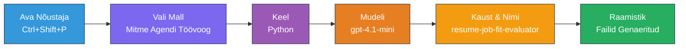
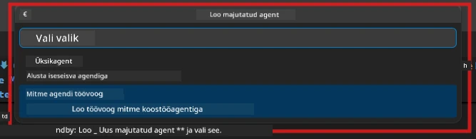

# Moodul 2 - Mitme-agendi projekti karkassi loomine

Selles moodulis kasutate [Microsoft Foundry laiendust](https://marketplace.visualstudio.com/items?itemName=TeamsDevApp.vscode-ai-foundry), et **luua mitme-agendi töövoo projekt**. Laiendus genereerib kogu projektistruktuuri - `agent.yaml`, `main.py`, `Dockerfile`, `requirements.txt`, `.env` ja silumisparameetrid. Seejärel kohandate neid faile moodulites 3 ja 4.

> **Märkus:** Kaust `PersonalCareerCopilot/` selles laboris on täielik, töötav näide kohandatud mitme-agendi projektist. Võite kas luua uue projekti (soovitatav õppimiseks) või uurida olemasolevat koodi otse.

---

## Samm 1: Ava Hosted Agenti loomise viisard


1. Vajutage `Ctrl+Shift+P`, et avada **Command Palette**.
2. Tippige: **Microsoft Foundry: Create a New Hosted Agent** ja valige see.
3. Avaneb hostitud agendi loomise viisard.

> **Alternatiiv:** Klõpsake Activity Baril **Microsoft Foundry** ikooni → klõpsake **+** ikooni **Agents** kõrval → **Create New Hosted Agent**.

---

## Samm 2: Valige Multi-Agent Workflow mall

Viisard küsib teilt malli valikut:

| Mall | Kirjeldus | Millal kasutada |
|----------|-------------|-------------|
| Üks agent | Üks agent juhiste ja valikuliste tööriistadega | Lab 01 |
| **Mitme-agendi töövoog** | Mitmed agendid, kes teevad koostööd WorkflowBuilderi kaudu | **See labor (Lab 02)** |

1. Valige **Mitme-agendi töövoog**.
2. Klõpsake **Next**.



---

## Samm 3: Valige programmeerimiskeel

1. Valige **Python**.
2. Klõpsake **Next**.

---

## Samm 4: Valige mudel

1. Viisard näitab teie Foundry projekti juurutatud mudeleid.
2. Valige sama mudel, mida kasutasite Lab 01-s (nt **gpt-4.1-mini**).
3. Klõpsake **Next**.

> **Vihje:** [`gpt-4.1-mini`](https://learn.microsoft.com/azure/foundry/foundry-models/concepts/models-sold-directly-by-azure#gpt-41-series) on soovitatav arenduseks – see on kiire, odav ja sobib hästi mitme-agendi töövoogude jaoks. Lõpliku tootmisjuurutuse jaoks kasutage kvaliteedilisemate tulemuste jaoks `gpt-4.1`.

---

## Samm 5: Valige kausta asukoht ja agenti nimi

1. Avaneb failidialoog. Valige sihtkaust:
   - Kui järgite tööktoa repo andmeid: navigeerige `workshop/lab02-multi-agent/` kausta ja looge uus alamkaust
   - Kui alustate puhtalt: valige ükskõik milline kaust
2. Sisestage hostitud agendi **nimi** (nt `resume-job-fit-evaluator`).
3. Klõpsake **Create**.

---

## Samm 6: Oodake karkassi loomise lõppu

1. VS Code avab uue akna (või uuendab olemasolevat) karkasseeritud projektiga.
2. Te peaksite nägema sellist failistruktuuri:

```
resume-job-fit-evaluator/
├── .env                ← Environment variables (placeholders)
├── .vscode/
│   └── launch.json     ← Debug configuration
├── agent.yaml          ← Agent definition (kind: hosted)
├── Dockerfile          ← Container configuration
├── main.py             ← Multi-agent workflow code (scaffold)
└── requirements.txt    ← Python dependencies
```

> **Töökoda märkus:** Töökoda hoidlas on `.vscode/` kaust asukohas **workspace root** koos jagatud `launch.json` ja `tasks.json` failidega. Silumisparameetrid nii Lab 01 kui ka Lab 02 jaoks on kaasatud. F5 vajutamisel valige rippmenüüst **"Lab02 - Multi-Agent"**.

---

## Samm 7: Mõistke karkasseeritud faile (mitme-agendi spetsiifika)

Mitme-agendi karkass erineb üheaegsest mitmel olulisel viisil:

### 7.1 `agent.yaml` - Agendi definitsioon

```yaml
kind: hosted
name: resume-job-fit-evaluator
description: >
  A multi-agent workflow that evaluates resume-to-job fit.
metadata:
  authors:
    - Microsoft
  tags:
    - Multi-Agent Workflow
    - Resume Evaluator
protocols:
  - protocol: responses
    version: v1
environment_variables:
  - name: PROJECT_ENDPOINT
    value: ${PROJECT_ENDPOINT}
  - name: MODEL_DEPLOYMENT_NAME
    value: ${MODEL_DEPLOYMENT_NAME}
```

**Peamine erinevus Lab 01-st:** `environment_variables` sektsioon võib sisaldada täiendavaid muutujad MCP lõpp-punktide või muude tööriistade konfiguratsiooni jaoks. `name` ja `description` kajastavad mitme-agendi kasutusjuhtu.

### 7.2 `main.py` - Mitme-agendi töövoo kood

Karkass sisaldab:
- **Mitme agendi juhiste stringid** (iga agendi jaoks eraldi konst)
- **Mitme [`AzureAIAgentClient.as_agent()`](https://learn.microsoft.com/python/api/overview/azure/ai-agents-readme) kontekstihalduri** (iga agendi jaoks eraldi)
- **[`WorkflowBuilder`](https://learn.microsoft.com/agent-framework/workflows/agents-in-workflows)** agentide ühendamiseks töövoogu
- **`from_agent_framework()`** töövoo teenindamiseks HTTP lõpp-punktina

```python
from agent_framework import WorkflowBuilder, tool
from agent_framework.azure import AzureAIAgentClient
from azure.ai.agentserver.agentframework import from_agent_framework
```

Lisaks imporditakse [`WorkflowBuilder`](https://learn.microsoft.com/agent-framework/workflows/agents-in-workflows), mis on uus võrreldes Lab 01-ga.

### 7.3 `requirements.txt` - Täiendavad sõltuvused

Mitme-agendi projekt kasutab samu baaspakette mis Lab 01, pluss kõik MCP-ga seotud paketid:

```
agent-framework-azure-ai==1.0.0rc3
agent-framework-core==1.0.0rc3
azure-ai-agentserver-agentframework==1.0.0b16
azure-ai-agentserver-core==1.0.0b16
debugpy
agent-dev-cli --pre
```

> **Oluline versiooni märkus:** `agent-dev-cli` paketil on vaja `--pre` lippu `requirements.txt` failis, et paigaldada uusim eelvaateversioon. See on vajalik Agent Inspectori ühilduvuseks `agent-framework-core==1.0.0rc3`. Vaata täpsemaid versioonide üksikasju [Moodulis 8 - Tõrkeotsing](08-troubleshooting.md).

| Pakett | Versioon | Eesmärk |
|---------|---------|---------|
| [`agent-framework-azure-ai`](https://learn.microsoft.com/agent-framework/overview/) | `1.0.0rc3` | Azure AI integratsioon Microsoft Agent Frameworkile |
| [`agent-framework-core`](https://learn.microsoft.com/agent-framework/overview/) | `1.0.0rc3` | Põhiruntime (sisaldab WorkflowBuilderit) |
| `azure-ai-agentserver-agentframework` | `1.0.0b16` | Hostitud agendi serveri runtime |
| `azure-ai-agentserver-core` | `1.0.0b16` | Agendi serveri põhikomponendid |
| `debugpy` | latest | Pythoni silumine (F5 VS Code’is) |
| `agent-dev-cli` | `--pre` | Kohalik dev CLI + Agent Inspector backend |

### 7.4 `Dockerfile` - Sama mis Lab 01-s

Dockerfile on identne Lab 01 omaga - kopeerib failid, paigaldab sõltuvused `requirements.txt`-st, avab pordi 8088 ja käivitab `python main.py`.

```dockerfile
FROM python:3.14-slim
WORKDIR /app
COPY ./ .
RUN pip install --upgrade pip && \
    if [ -f requirements.txt ]; then \
        pip install -r requirements.txt; \
    else \
      echo "No requirements.txt found" >&2; exit 1; \
    fi
EXPOSE 8088
CMD ["python", "main.py"]
```

---

### Kontrollpunkt

- [ ] Karkassi loomise viisard sai lõpetatud → uus projektistruktuur on nähtav
- [ ] Näete kõiki faile: `agent.yaml`, `main.py`, `Dockerfile`, `requirements.txt`, `.env`
- [ ] `main.py` sisaldab `WorkflowBuilder` importi (kindlustab, et valiti mitme-agendi mall)
- [ ] `requirements.txt` sisaldab nii `agent-framework-core` kui ka `agent-framework-azure-ai`
- [ ] Mõistate, kuidas mitme-agendi karkass erineb üheaegsest (mitmed agendid, WorkflowBuilder, MCP tööriistad)

---

**Eelmine:** [01 - Mitme-agendi arhitektuuri mõistmine](01-understand-multi-agent.md) · **Järgmine:** [03 - Agentide ja keskkonna seadistamine →](03-configure-agents.md)

---

<!-- CO-OP TRANSLATOR DISCLAIMER START -->
**Vastutusest loobumine**:
See dokument on tõlgitud tehisintellekti tõlketeenuse [Co-op Translator](https://github.com/Azure/co-op-translator) abil. Kuigi me püüame tagada täpsust, palun arvestage, et automaatsed tõlked võivad sisaldada vigu või ebatäpsusi. Originaaldokument selle algkeeles tuleb pidada autoriteetseks allikaks. Kriitilise teabe puhul soovitatakse professionaalset inimtõlget. Me ei vastuta selle tõlke kasutamisest tingitud väärarusaamade või valesti mõistmiste eest.
<!-- CO-OP TRANSLATOR DISCLAIMER END -->