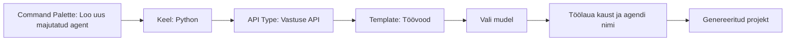
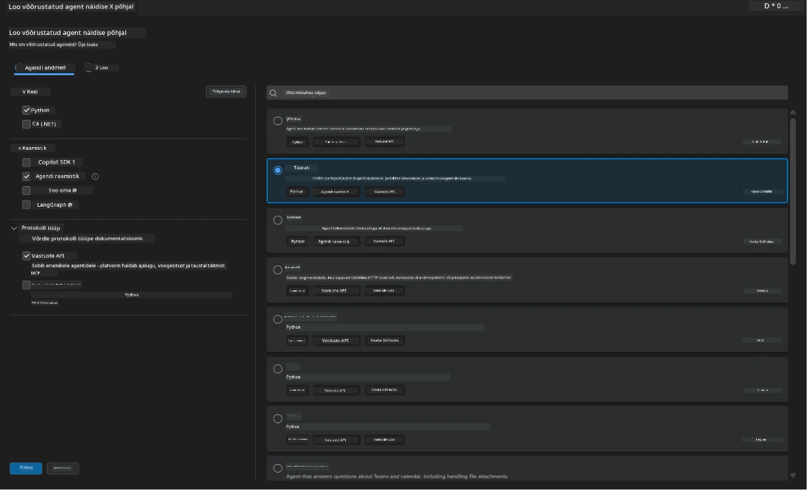
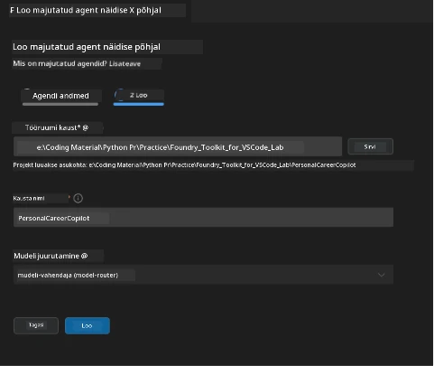

# Moodul 2 - Multi-agendiprojekti alusraamistiku valmista ette

⏱️ ~5 minutit

Selles moodulis kasutate [Foundry Toolkit for VS Code](https://aka.ms/foundrytk) et **anda alus multi-agendiprojektile**. Vahend genereerib failid `agent.yaml`, `main.py`, `Dockerfile`, `requirements.txt`, `.env` ja VS Code silumisettepaneku – nii saate keskenduda 4-agendi töövoo ühendamisele moodulis 3.

> **Põhimõte:** Alusraamistik on töötav mall ühe agendiga. Te asendate kohatäite loogika `WorkflowBuilder` graafikuga moodulis 3. Te ei kirjuta boilerplate’i algusest peale.

> **Võrdlusnäide:** [`PersonalCareerCopilot/`](../../../../../workshop/lab02-multi-agent/PersonalCareerCopilot) on täielik töötav näide. Kasutage seda oma töö võrdlemiseks.

### Alusraamistiku asistendi töövoog


```mermaid
flowchart LR
    A[Command Palette: Loo uus majutatud agent] --> B[Keel: Python]
    B --> C[API Type: Vastuse API]
    C --> D[Template: Töövood]
    D --> E[Vali mudel]
    E --> F[Töölaua kaust ja agendi nimi]
    F --> G[Genereeritud projekt]
```

---

## Samm 1: Ava loodava hostitud agendi assistent

1. Vajutage `Ctrl+Shift+P`, et avada **Käsupalett**.
2. Sisestage: **Foundry Toolkit: Create a New Hosted Agent** ja valige see.
3. Assistent avaneb vahekaardiga **Agent Details**.

> **Alternatiiv:** Klõpsake tegevusribas ikoonil **Foundry Toolkit** → klõpsake **+** ikoonil **Hosted Agents** kõrval → **Create New Hosted Agent**.

---

## Samm 2: Valige sätted



1. Vasakus navigeerimis-/valikualas valige järgnev:

| Menüü | Valik | Märkmed |
|--------|-----------|-------|
| **Language** | Python | Toetatud on ka C# (.NET) |
| **Framework** | Agent Framework | Pakub `Agent`, `AgentExecutor`, `WorkflowBuilder` |
| **API type** | Response API | `POST /responses` - platvormi hallatav ajalugu, voogedastuse tugi |
| **Template** | **Workflows** | Töötleb päringuid järjestikku läbi mitme agendi |

2. Kui valitud, klõpsake **Next**



3. Järgnevas aknas valige:

| Menüü | Valik | Märkmed |
|--------|-----------|-------|
| **Workspace folder** | Sirvige sihtkausta | nt `workshop/lab02-multi-agent/` selles repos |
| **Agent name** | `PersonalCareerCopilot` | Saab projekti kataloogi nimeks |
| **Model Deployment** | Valige oma juurutatud mudel | nt `gpt-4.1-mini` laborist 01 |

4. Klõpsake **Create**, et pöördraamistiku genereerida. VS Code loob failid ja avab kausta.

> **Vihje:** [`gpt-4.1-mini`](https://learn.microsoft.com/azure/foundry/foundry-models/concepts/models-sold-directly-by-azure#gpt-41-series) tasakaalustab hästi kiirust ja kvaliteeti multi-agendiarenduseks.

---

## Samm 3: Uurige genereeritud projekti

Pärast alusraamistiku valmimist kontrollige, et näeksite Exploreri aknas (`Ctrl+Shift+E`) järgmisi faile:

```
📂 <your-agent-name>/
├── .azdignore          ← Files excluded from Azure Developer CLI deployments
├── .dockerignore       ← Files excluded from Docker builds
├── .env                ← Environment variables (placeholders - fill in Module 3)
├── .vscode/
│   ├── launch.json     ← Debug config (F5 → run + Agent Inspector)
│   └── tasks.json      ← VS Code task definitions
├── agent.yaml          ← Agent definition (kind: hosted, protocol: responses)
├── Dockerfile          ← Container config for deployment
├── main.py             ← Stub agent entry point (replace with WorkflowBuilder in Module 3)
└── requirements.txt    ← Python dependencies
```

> **Oluline:** Avage see alusraamistikuga kaust otse VS Codes, et `.vscode/launch.json` ja `tasks.json` rakenduksid õigesti F5 silumiseks.

### Põhifailide selgitus

| Fail | Eesmärk |
|------|---------|
| `agent.yaml` | Määratleb `kind: hosted`, kaardistab keskkonnamuutujad, defineerib `/responses` protokolli |
| `main.py` | Mall: üks `FoundryChatClient` → `Agent` → `ResponsesHostServer`. Asendate selle 4 agendi + `WorkflowBuilder`ga moodulis 3 |
| `Dockerfile` | `python:3.12-slim`, paigaldab `requirements.txt`, avab pordi 8088, käivitab `python main.py` |
| `requirements.txt` | `agent-framework-foundry`, `agent-framework-foundry-hosting`, `mcp<2,>=1.24.0`, `debugpy` |

> **Viide:** Vaadake täielikku genereeritud sisu [`PersonalCareerCopilot/agent.yaml`](../../../../../workshop/lab02-multi-agent/PersonalCareerCopilot/agent.yaml) ja [`PersonalCareerCopilot/requirements.txt`](../../../../../workshop/lab02-multi-agent/PersonalCareerCopilot/requirements.txt).

---

### ✅ Kontrollpunkt

- [ ] Alusraamistiku assistent lõpetatud – uus projektikaust nähtav Exploreris
- [ ] Kõik oodatud failid olemas: `agent.yaml`, `main.py`, `Dockerfile`, `requirements.txt`, `.env`
- [ ] `agent.yaml` näitab `kind: hosted` ja `protocol: responses`
- [ ] `main.py` impordib `Agent`, `FoundryChatClient`, `ResponsesHostServer`
- [ ] Alusraamistiku kaust on avatud VS Code tööruumi juurena
- [ ] Mõistate, et `main.py` on mall – `WorkflowBuilder` lisatakse moodulis 3

---

**Eelmine:** [01 - Mõistke multi-agenti arhitektuuri](01-understand-multi-agent.md) · **Järgmine:** [03 - Konfigureerige agendid ja keskkond →](03-configure-agents.md)

---

<!-- CO-OP TRANSLATOR DISCLAIMER START -->
**Lahtiütlus**:
See dokument on tõlgitud kasutades AI tõlketeenust [Co-op Translator](https://github.com/Azure/co-op-translator). Kuigi me püüdleme täpsuse poole, palun pange tähele, et automatiseeritud tõlgetes võib esineda vigu või ebatäpsusi. Originaaldokument selle emakeeles tuleks pidada autoriteetseks allikaks. Olulise teabe puhul soovitatakse kasutada professionaalset inimtõlget. Me ei vastuta selle tõlkega seotud eksimustest või valesti mõistmistest.
<!-- CO-OP TRANSLATOR DISCLAIMER END -->