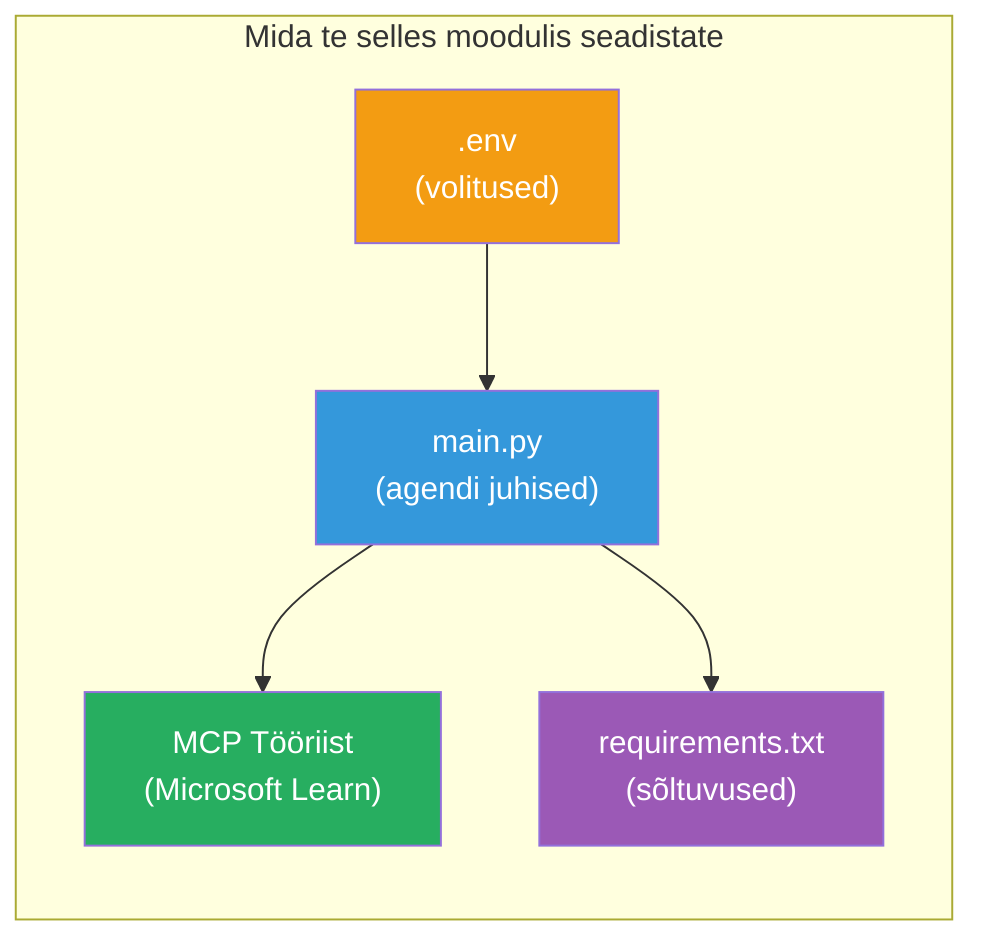

# Moodul 3 - Agentide, MCP tööriista ja keskkonna seadistamine

Selles moodulis kohandate ehitatud mitmeagendilist projekti. Kirjutate juhised kõigile neljale agendile, seadistate Microsoft Learni MCP tööriista, konfigureerite keskkonnamuutujad ja installite sõltuvused.


> **Viide:** Tööversioon on olemas failis [`PersonalCareerCopilot/main.py`](../../../../../workshop/lab02-multi-agent/PersonalCareerCopilot/main.py). Kasutage seda oma töö loomisel viitena.

---

## Samm 1: Keskkonnamuutujate seadistamine

1. Avage oma projekti juurkaustas fail **`.env`**.
2. Täitke oma Foundry projekti andmed:

   ```env
   PROJECT_ENDPOINT=https://<your-account>.services.ai.azure.com/api/projects/<your-project>
   MODEL_DEPLOYMENT_NAME=gpt-4.1-mini
   ```

3. Salvestage fail.

### Kus neid väärtusi leida

| Väärtus | Kuidas leida |
|---------|--------------|
| **Projekti lõpp-punkt** | Microsoft Foundry külgriba → klõpsake oma projektil → detailvaates lõpp-punkti URL |
| **Mudeli juurutamise nimi** | Foundry külgriba → laiendage projekti → **Models + endpoints** → nimi juurutatud mudeli kõrval |

> **Turvalisus:** Ärge kunagi pange `.env` faili versioonihaldusse. Lisage see `.gitignore` faili, kui see seal veel puudub.

### Keskkonnamuutujate vastavus

Mitmeagendiline `main.py` loeb nii standardsed kui ka töötoa-spetsiifilised keskkonnamuutujate nimed:

```python
PROJECT_ENDPOINT = os.getenv("AZURE_AI_PROJECT_ENDPOINT") or os.getenv("PROJECT_ENDPOINT")
MODEL_DEPLOYMENT_NAME = os.getenv(
    "AZURE_AI_MODEL_DEPLOYMENT_NAME",
    os.getenv("MODEL_DEPLOYMENT_NAME", "gpt-4.1-mini"),
)
MICROSOFT_LEARN_MCP_ENDPOINT = os.getenv(
    "MICROSOFT_LEARN_MCP_ENDPOINT", "https://learn.microsoft.com/api/mcp"
)
```

MCP lõpp-punktil on mõistlik vaikeseade – `.env` faili seda seadistama ei pea, kui te ei soovi seda üle kirjutada.

---

## Samm 2: Agentide juhiste kirjutamine

See on kõige olulisem samm. Iga agent vajab hoolikalt läbi mõeldud juhiseid, mis määratlevad tema rolli, väljundformaadi ja reeglid. Avage `main.py` ja looge (või muutke) juhiste konstantid.

### 2.1 CV parseri agent

```python
RESUME_PARSER_INSTRUCTIONS = """\
You are the Resume Parser.
Extract resume text into a compact, structured profile for downstream matching.

Output exactly these sections:
1) Candidate Profile
2) Technical Skills (grouped categories)
3) Soft Skills
4) Certifications & Awards
5) Domain Experience
6) Notable Achievements

Rules:
- Use only explicit or strongly implied evidence.
- Do not invent skills, titles, or experience.
- Keep concise bullets; no long paragraphs.
- If input is not a resume, return a short warning and request resume text.
"""
```

**Miks need jaotised?** MatchingAgent vajab struktureeritud andmeid hindamiseks. Järjepidevad jaotised teevad agentide omavahelise andmevahetuse usaldusväärseks.

### 2.2 Töökuulutuse agent

```python
JOB_DESCRIPTION_INSTRUCTIONS = """\
You are the Job Description Analyst.
Extract a structured requirement profile from a JD.

Output exactly these sections:
1) Role Overview
2) Required Skills
3) Preferred Skills
4) Experience Required
5) Certifications Required
6) Education
7) Domain / Industry
8) Key Responsibilities

Rules:
- Keep required vs preferred clearly separated.
- Only use what the JD states; do not invent hidden requirements.
- Flag vague requirements briefly.
- If input is not a JD, return a short warning and request JD text.
"""
```

**Miks eristada nõutud ja eelistatud?** MatchingAgent kasutab igaühe puhul erinevaid kaalutegureid (Nõutavad oskused = 40 punkti, Eelistatud oskused = 10 punkti).

### 2.3 Sobitamise agent

```python
MATCHING_AGENT_INSTRUCTIONS = """\
You are the Matching Agent.
Compare parsed resume output vs JD output and produce an evidence-based fit report.

Scoring (100 total):
- Required Skills 40
- Experience 25
- Certifications 15
- Preferred Skills 10
- Domain Alignment 10

Output exactly these sections:
1) Fit Score (with breakdown math)
2) Matched Skills
3) Missing Skills
4) Partially Matched
5) Experience Alignment
6) Certification Gaps
7) Overall Assessment

Rules:
- Be objective and evidence-only.
- Keep partial vs missing separate.
- Keep Missing Skills precise; it feeds roadmap planning.
"""
```

**Miks selge skoorimine?** Korduv skoorimine võimaldab võrrelda tulemusi ja vigade otsimist. 100-punktiline skaala on lõppkasutajale lihtsasti arusaadav.

### 2.4 Lünkade analüüsi agent

```python
GAP_ANALYZER_INSTRUCTIONS = """\
You are the Gap Analyzer and Roadmap Planner.
Create a practical upskilling plan from the matching report.

Microsoft Learn MCP usage (required):
- For EVERY High and Medium priority gap, call tool `search_microsoft_learn_for_plan`.
- Use returned Learn links in Suggested Resources.
- Prefer Microsoft Learn for free resources.

CRITICAL: You MUST produce a SEPARATE detailed gap card for EVERY skill listed in
the Missing Skills and Certification Gaps sections of the matching report. Do NOT
skip or combine gaps. Do NOT summarize multiple gaps into one card.

Output format:
1) Personalized Learning Roadmap for [Role Title]
2) One DETAILED card per gap (produce ALL cards, not just the first):
   - Skill
   - Priority (High/Medium/Low)
   - Current Level
   - Target Level
   - Suggested Resources (include Learn URL from tool results)
   - Estimated Time
   - Quick Win Project
3) Recommended Learning Order (numbered list)
4) Timeline Summary (week-by-week)
5) Motivational Note

Rules:
- Produce every gap card before writing the summary sections.
- Keep it specific, realistic, and actionable.
- Tailor to candidate's existing stack.
- If fit >= 80, focus on polish/interview readiness.
- If fit < 40, be honest and provide a staged path.
"""
```

**Miks rõhutada “KRIITILIST”?** Ilma selgete juhisteta tootma KÕIKI lünkakaardi punkte kipub mudel genereerima vaid 1-2 kaarti ja kokku võtma ülejäänud. “KRIITILINE” plokk takistab selle kärpimist.

---

## Samm 3: MCP tööriista loomine

GapAnalyzer kasutab tööriista, mis kutsub [Microsoft Learn MCP serverit](https://learn.microsoft.com/azure/foundry/agents/how-to/tools/model-context-protocol). Lisage see `main.py`:

```python
import json
from agent_framework import tool
from mcp.client.session import ClientSession
from mcp.client.streamable_http import streamable_http_client

@tool
async def search_microsoft_learn_for_plan(
    skill: str, role: str = "", max_results: int = 5
) -> str:
    """Search Microsoft Learn MCP and return curated official links for roadmap planning."""
    query = " ".join(part for part in [skill, role, "learning path module"] if part).strip()
    query = query or "job skills learning path"

    try:
        async with streamable_http_client(MICROSOFT_LEARN_MCP_ENDPOINT) as (
            read_stream, write_stream, _,
        ):
            async with ClientSession(read_stream, write_stream) as session:
                await session.initialize()
                result = await session.call_tool(
                    "microsoft_docs_search", {"query": query}
                )

        if not result.content:
            return (
                "No results returned from Microsoft Learn MCP. "
                "Fallback: https://learn.microsoft.com/training/support/catalog-api"
            )

        payload_text = getattr(result.content[0], "text", "")
        data = json.loads(payload_text) if payload_text else {}
        items = data.get("results", [])[:max(1, min(max_results, 10))]

        if not items:
            return f"No direct Microsoft Learn results found for '{skill}'."

        lines = [f"Microsoft Learn resources for '{skill}':"]
        for i, item in enumerate(items, start=1):
            title = item.get("title") or item.get("url") or "Microsoft Learn Resource"
            url = item.get("url") or item.get("link") or ""
            lines.append(f"{i}. {title} - {url}".rstrip(" -"))
        return "\n".join(lines)
    except Exception as ex:
        return (
            f"Microsoft Learn MCP lookup unavailable. Reason: {ex}. "
            "Fallbacks: https://learn.microsoft.com/api/mcp"
        )
```

### Kuidas tööriist töötab

| Samm | Mis juhtub |
|-------|------------|
| 1 | GapAnalyzer otsustab, et vajab oskuse jaoks ressursse (nt "Kubernetes") |
| 2 | Framework kutsub `search_microsoft_learn_for_plan(skill="Kubernetes")` |
| 3 | Funktsioon avab [Streamable HTTP](https://learn.microsoft.com/agent-framework/agents/tools/hosted-mcp-tools) ühenduse aadressile `https://learn.microsoft.com/api/mcp` |
| 4 | Kutsub [MCP serveris](https://learn.microsoft.com/azure/foundry/agents/how-to/tools/model-context-protocol) funktsiooni `microsoft_docs_search` |
| 5 | MCP server tagastab otsingutulemused (pealkiri + URL) |
| 6 | Funktsioon vormindab tulemused nummerdatud nimekirjana |
| 7 | GapAnalyzer lisab URLid lünkakaardile |

### MCP sõltuvused

MCP klienditeegid kaasatakse kaudselt läbi [`agent-framework-core`](https://learn.microsoft.com/agent-framework/overview/). Neid ei pea eraldi `requirements.txt` faili lisama. Kui tekib importimise vigu, kontrollige:

```powershell
pip list | Select-String "mcp"
```

Oodatud: `mcp` pakett on installitud (versioon 1.x või uuem).

---

## Samm 4: Agentide ja töövoo ühendamine

### 4.1 Looge agendid kontekstihalduritega

```python
from contextlib import asynccontextmanager

@asynccontextmanager
async def create_agents():
    async with (
        get_credential() as credential,
        AzureAIAgentClient(
            project_endpoint=PROJECT_ENDPOINT,
            model_deployment_name=MODEL_DEPLOYMENT_NAME,
            credential=credential,
        ).as_agent(
            name="ResumeParser",
            instructions=RESUME_PARSER_INSTRUCTIONS,
        ) as resume_parser,
        AzureAIAgentClient(
            project_endpoint=PROJECT_ENDPOINT,
            model_deployment_name=MODEL_DEPLOYMENT_NAME,
            credential=credential,
        ).as_agent(
            name="JobDescriptionAgent",
            instructions=JOB_DESCRIPTION_INSTRUCTIONS,
        ) as jd_agent,
        AzureAIAgentClient(
            project_endpoint=PROJECT_ENDPOINT,
            model_deployment_name=MODEL_DEPLOYMENT_NAME,
            credential=credential,
        ).as_agent(
            name="MatchingAgent",
            instructions=MATCHING_AGENT_INSTRUCTIONS,
        ) as matching_agent,
        AzureAIAgentClient(
            project_endpoint=PROJECT_ENDPOINT,
            model_deployment_name=MODEL_DEPLOYMENT_NAME,
            credential=credential,
        ).as_agent(
            name="GapAnalyzer",
            instructions=GAP_ANALYZER_INSTRUCTIONS,
            tools=[search_microsoft_learn_for_plan],
        ) as gap_analyzer,
    ):
        yield resume_parser, jd_agent, matching_agent, gap_analyzer
```

**Peamised punktid:**
- Igal agendil on **oma** `AzureAIAgentClient` eksemplar
- Ainult GapAnalyzer saab `tools=[search_microsoft_learn_for_plan]`
- `get_credential()` tagastab Azure'is [`ManagedIdentityCredential`](https://learn.microsoft.com/python/api/overview/azure/identity-readme#managed-identity-support), kohalikus keskkonnas [`DefaultAzureCredential`](https://learn.microsoft.com/azure/developer/python/sdk/authentication/credential-chains#defaultazurecredential-overview)

### 4.2 Looge töövoo graafik

```python
def create_workflow(resume_parser, jd_agent, matching_agent, gap_analyzer):
    workflow = (
        WorkflowBuilder(
            name="ResumeJobFitEvaluator",
            start_executor=resume_parser,
            output_executors=[gap_analyzer],
        )
        .add_edge(resume_parser, jd_agent)
        .add_edge(resume_parser, matching_agent)
        .add_edge(jd_agent, matching_agent)
        .add_edge(matching_agent, gap_analyzer)
        .build()
    )
    return workflow.as_agent()
```

> Tutvuge mustriga `.as_agent()`: [Workflows as Agents](https://learn.microsoft.com/agent-framework/workflows/as-agents).

### 4.3 Käivitage server

```python
async def main() -> None:
    validate_configuration()
    async with create_agents() as (resume_parser, jd_agent, matching_agent, gap_analyzer):
        agent = create_workflow(resume_parser, jd_agent, matching_agent, gap_analyzer)
        from azure.ai.agentserver.agentframework import from_agent_framework
        await from_agent_framework(agent).run_async()

if __name__ == "__main__":
    asyncio.run(main())
```

---

## Samm 5: Virtuaalkeskkonna loomine ja aktiveerimine

### 5.1 Looge keskkond

```powershell
cd workshop\lab02-multi-agent\PersonalCareerCopilot
python -m venv .venv
```

### 5.2 Aktiveerige see

**PowerShell (Windows):**
```powershell
.\.venv\Scripts\Activate.ps1
```

**macOS/Linux:**
```bash
source .venv/bin/activate
```

### 5.3 Installige sõltuvused

```powershell
pip install -r requirements.txt
```

> **Märkus:** `agent-dev-cli --pre` rida `requirements.txt` failis tagab, et installitakse uusim eelvaade. See on vajalik ühilduvuseks `agent-framework-core==1.0.0rc3` versiooniga.

### 5.4 Kontrollige installatsiooni

```powershell
pip list | Select-String "agent-framework|agentserver|agent-dev"
```

Oodatud väljund:
```
agent-dev-cli                  0.0.1b260316
agent-framework-azure-ai       1.0.0rc3
agent-framework-core            1.0.0rc3
azure-ai-agentserver-agentframework 1.0.0b16
azure-ai-agentserver-core      1.0.0b16
```

> **Kui `agent-dev-cli` kuvab vanemat versiooni** (nt `0.0.1b260119`), ei tööta Agent Inspector ja tekivad 403/404 vead. Täiendage käsuga: `pip install agent-dev-cli --pre --upgrade`

---

## Samm 6: Autentimise kontroll

Käivitage sama autentimise kontroll nagu Lab 01-s:

```powershell
az account show --query "{name:name, id:id}" --output table
```

Kui see ebaõnnestub, käivitage [`az login`](https://learn.microsoft.com/cli/azure/authenticate-azure-cli-interactively).

Mitmeagendiliste töövoogude korral jagavad kõik neli agenti sama volitust. Kui autentimine töötab ühe jaoks, töötab see kõigi jaoks.

---

### Kontrollpunkt

- [ ] `.env` sisaldab kehtivaid väärtusi `PROJECT_ENDPOINT` ja `MODEL_DEPLOYMENT_NAME`
- [ ] Kõik 4 agendi juhiste konstantid on määratletud `main.py` failis (ResumeParser, JD Agent, MatchingAgent, GapAnalyzer)
- [ ] MCP tööriist `search_microsoft_learn_for_plan` on määratletud ja registreeritud GapAnalyzeriga
- [ ] `create_agents()` loob kõik 4 agenti iseseisvate `AzureAIAgentClient` eksemplaridega
- [ ] `create_workflow()` ehitab õige graafi `WorkflowBuilder` abil
- [ ] Virtuaalkeskkond on loodud ja aktiveeritud (`(.venv)` kuvatakse)
- [ ] `pip install -r requirements.txt` lõpetab veatult
- [ ] `pip list` kuvab kõik oodatud paketid õiges versioonis (rc3 / b16)
- [ ] `az account show` tagastab teie tellimuse

---

**Eelmine:** [02 - Scaffold Multi-Agent Project](02-scaffold-multi-agent.md) · **Järgmine:** [04 - Orchestration Patterns →](04-orchestration-patterns.md)

---

<!-- CO-OP TRANSLATOR DISCLAIMER START -->
**Vastutusest loobumine**:  
See dokument on tõlgitud kasutades tehisintellektil põhinevat tõlketeenust [Co-op Translator](https://github.com/Azure/co-op-translator). Kuigi püüame täpsust, palun arvestage, et automaatsed tõlked võivad sisaldada vigu või ebatäpsusi. Originaaldokument oma emakeeles on autoriteetne allikas. Olulise info puhul soovitatakse kasutada professionaalset inimtõlget. Me ei vastuta selle tõlke kasutamisest tulenevate arusaamatuste või valesti mõistmiste eest.
<!-- CO-OP TRANSLATOR DISCLAIMER END -->