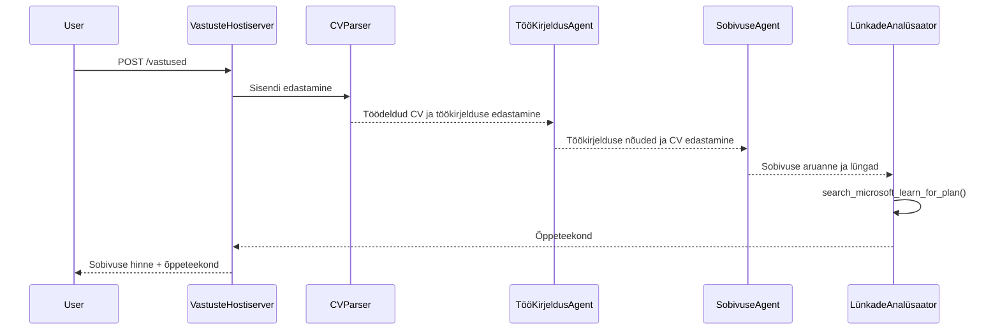

# Moodul 3 - Konfigureeri juhised, keskkond ja installi sõltuvused

⏱️ ~15 min

Selles moodulis muudate moodustatud mallitüki **oma** mitmeagendi töövooguks - seadistades keskkonnamuutujad, kirjutades agendi juhised, lisades MCP tööriista, ühendades töövoo graafiku ja paigaldades sõltuvused.

> **Viide:** Täielik töövalmis kood on failis [`PersonalCareerCopilot/main.py`](../../../../../workshop/lab02-multi-agent/PersonalCareerCopilot/main.py). Kasutage seda oma töövoo graafiku ja promptiplokkide koostamisel viitena.

---

## Kuidas neli agenti omavahel sobituvad


```mermaid
sequenceDiagram
    participant User
    participant Server as VastusteHostiserver
    participant RP as CVParser
    participant JD as TööKirjeldusAgent
    participant MA as SobivuseAgent
    participant GA as LünkadeAnalüsaator

    User->>Server: POST /vastused
    Server->>RP: Sisendi edastamine
    RP-->>JD: Töödeldud CV ja töökirjelduse edastamine
    JD-->>MA: Töökirjelduse nõuded ja CV edastamine
    MA-->>GA: Sobivuse aruanne ja lüngad
    GA->>GA: search_microsoft_learn_for_plan()
    GA-->>Server: Õppeteekond
    Server-->>User: Sobivuse hinne + õppeteekond
```

---

## Samm 1: Seadista keskkonnamuutujad

1. Ava oma projekti juurkaustas olev **`.env`** fail (moodustatud skafoldi meetodil).
2. Asenda kohatäited oma tegelike väärtustega Lab 01-st.

<details open>
<summary><strong>🅰️ Tee A - Foundry tellimus</strong></summary>

```env
FOUNDRY_PROJECT_ENDPOINT=https://<your-account>.services.ai.azure.com/api/projects/<your-project>
AZURE_AI_MODEL_DEPLOYMENT_NAME=gpt-4.1-mini
```

> **Kus väärtused asuvad:** Vaata [Lab 01, Moodul 1](../../lab01-single-agent/docs/01-setup.md#deploy-a-model--assign-rbac).

</details>

<details open>
<summary><strong>🅱️ Tee B - Foundry kohalik</strong></summary>

```env
FOUNDRY_PROJECT_ENDPOINT=http://localhost:5273/v1
AZURE_AI_MODEL_DEPLOYMENT_NAME=phi-4-mini
```

> Kogu tuletamine toimub sinu arvutis – andmeid ei väljutata. Kinnita täpne mudeli alias käsuga `foundry model list`. Ainus väljaminev päring on MCP tööriista kutse aadressile `https://learn.microsoft.com/api/mcp`.

> **Kus väärtused asuvad:** Vaata [Lab 01, Moodul 1 - kohalik tee](../../lab01-single-agent/docs/01-setup.md#step-2-set-up-based-on-your-access).

</details>

> **Turvalisus:** Ära kunagi lisa `.env` faili versioonikontrolli. Fail peaks juba olema `.gitignore` hulgas.

---

## Samm 2: Kirjuta agendi juhised

Juhised määravad iga agendi rolli, väljundi vormingu ja reeglid. Ava `main.py` ja määra (või asenda) neli juhiste konstanti – täielikud stringid on failis [`PersonalCareerCopilot/main.py`](../../../../../workshop/lab02-multi-agent/PersonalCareerCopilot/main.py).

### 2.1 `RESUME_PARSER_INSTRUCTIONS`
Töötleb CV struktureeritud kandidaadi profiiliks **ja** kopeerib töökuulutuse täpselt sõnasõnalt väljundisse `[JOB DESCRIPTION PASS-THROUGH]`. Mõlemad märgistatud sektsioonid peavad väljundis ilmuma.

> **Miks läbi edastada?** Valikuga `context_mode="last_agent"` on ResumeParser **ainus** agent, kes näeb esialgset kasutajateadet. Kui ta ei edasta töökuulutust edasi, ei näe järgmised agendid seda kunagi.

### 2.2 `JOB_DESCRIPTION_INSTRUCTIONS`
Loeb ResumeParseri väljundist `[PARSED RESUME]` ja `[JOB DESCRIPTION PASS-THROUGH]`. Väljundiks on `[JD REQUIREMENTS]` (struktureeritud nõuded) ja `[PARSED RESUME PASS-THROUGH]` (täpselt kopeeritud CV MatchingAgendi jaoks).

### 2.3 `MATCHING_AGENT_INSTRUCTIONS`
Loeb `[JD REQUIREMENTS]` ja `[PARSED RESUME PASS-THROUGH]`. Koostab hinnatud sobivusaruande (0–100) koos matemaatilise jaotuse, sobitatud oskuste, puuduvate oskuste ja kogemuste vastavuse kirjeldustega.

### 2.4 `GAP_ANALYZER_INSTRUCTIONS`
Loeb sobivusaruannet. Iga vajaliku oskuse puhul kutsub `search_microsoft_learn_for_plan` Microsoft Learn ressursse. Koostab iga oskuse kohta üksikasjaliku lünka kaardi ning nädalapõhise õppelehe.

---

## Samm 3: Lisa MCP tööriist

GapAnalyzer kutsub [Microsoft Learn MCP serverit](https://learn.microsoft.com/azure/foundry/agents/how-to/tools/model-context-protocol), et laadida iga oskuse lünga kohta reaalsed õpperessursid. Täielik `search_microsoft_learn_for_plan` funktsioon on failis [`PersonalCareerCopilot/main.py`](../../../../../workshop/lab02-multi-agent/PersonalCareerCopilot/main.py).

Registreeri tööriist GapAnalyseril agendi loomise ajal:

```python
gap_analyzer = Agent(
    client=client,
    instructions=GAP_ANALYZER_INSTRUCTIONS,
    name="GapAnalyzer",
    tools=[search_microsoft_learn_for_plan],
)
```

> Vaata täielikku `WorkflowBuilder` graafikut koos `FoundryChatClient`, `AgentExecutor` ja kõigi `add_edge()` kutsungitega failis [`PersonalCareerCopilot/main.py`](../../../../../workshop/lab02-multi-agent/PersonalCareerCopilot/main.py).

---

## Samm 4: Loo virtuaalkeskkond ja installi sõltuvused

> ⚠️ **Ära jäta seda sammu vahele.** Ilma sõltuvusi installeerimata ei tööta F5 silumine.

### 4.1 Loo virtuaalkeskkond

```powershell
python -m venv .venv
```

### 4.2 Aktiveeri see

| OS | Käsk |
|----|---------|
| **Windows (PowerShell)** | `.\.venv\Scripts\Activate.ps1` |
| **Windows (CMD)** | `.venv\Scripts\activate.bat` |
| **macOS / Linux** | `source .venv/bin/activate` |

Terminali käsureal peaks ilmuma `(.venv)`.

### 4.3 Installi sõltuvused

```powershell
pip install -r requirements.txt
```

### 4.4 Kontrolli

```powershell
pip list | Select-String "agent-framework|mcp|debugpy"
```

Oodatud: `agent-framework-foundry`, `agent-framework-foundry-hosting`, `mcp` ja `debugpy` on nimekirjas.

---

## Samm 5: Kontrolli autentimist

<details open>
<summary><strong>🅰️ Tee A - Azure volitused</strong></summary>

```powershell
az account show --query "{name:name, id:id}" --output table
```

Kui see ebaõnnestub, käivita [`az login`](https://learn.microsoft.com/cli/azure/authenticate-azure-cli-interactively).

Kõik neli agenti kasutavad sama `FoundryChatClient` ja `DefaultAzureCredential` objekti. Kui autentimine töötab ühe jaoks, töötab see kõigi jaoks.

</details>

<details open>
<summary><strong>🅱️ Tee B - Foundry kohalik</strong></summary>

Kohalikuks testimiseks autentimist ei nõuta.

</details>

---

### ✅ Kontrollpunkt

> Ära jätka mooduliga 04, kuni: **(1)** `(.venv)` on terminali promptis nähtav JA **(2)** `pip install -r requirements.txt` on edukalt lõpule viidud.

- [ ] `.env` failis on kehtivad lõpp-punkti ja mudeli välja- paigutuse nimed (mitte kohatäited)
- [ ] Kõik 4 agendi juhise konstantidest defineeritud `main.py` failis (ResumeParser, JD Agent, MatchingAgent, GapAnalyzer)
- [ ] `search_microsoft_learn_for_plan` MCP tööriist on defineeritud ja registreeritud GapAnalyzerile
- [ ] `FoundryChatClient` + 4 `Agent` + 4 `AgentExecutor` objekti loodud `main()` funktsioonis
- [ ] `WorkflowBuilder` ehitab õige järjestatud graafiku koos kõigi 3 `add_edge()` kutsungiga
- [ ] Virtuaalkeskkond loodud ja aktiveeritud (terminali promptis on nähtav `(.venv)`)
- [ ] `pip install -r requirements.txt` lõppes veatult
- [ ] **Tee A:** `az account show` õnnestub VÕI VS Code Accounts ikoonil on sisselogitud kontoga teade

---

**Eelmine:** [02 - Skafoldi mitme-agendi projekt](02-scaffold-multi-agent.md) · **Järgmine:** [04 - Orkestreerimise mustrid →](04-orchestration-patterns.md)

---

<!-- CO-OP TRANSLATOR DISCLAIMER START -->
**Lahtiütlus**:
See dokument on tõlgitud kasutades AI tõlketeenust [Co-op Translator](https://github.com/Azure/co-op-translator). Kuigi me püüdleme täpsuse poole, palun pange tähele, et automatiseeritud tõlgetes võib esineda vigu või ebatäpsusi. Originaaldokument selle emakeeles tuleks pidada autoriteetseks allikaks. Olulise teabe puhul soovitatakse kasutada professionaalset inimtõlget. Me ei vastuta selle tõlkega seotud eksimustest või valesti mõistmistest.
<!-- CO-OP TRANSLATOR DISCLAIMER END -->