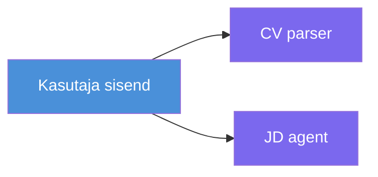
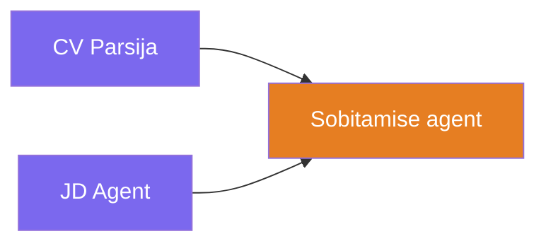
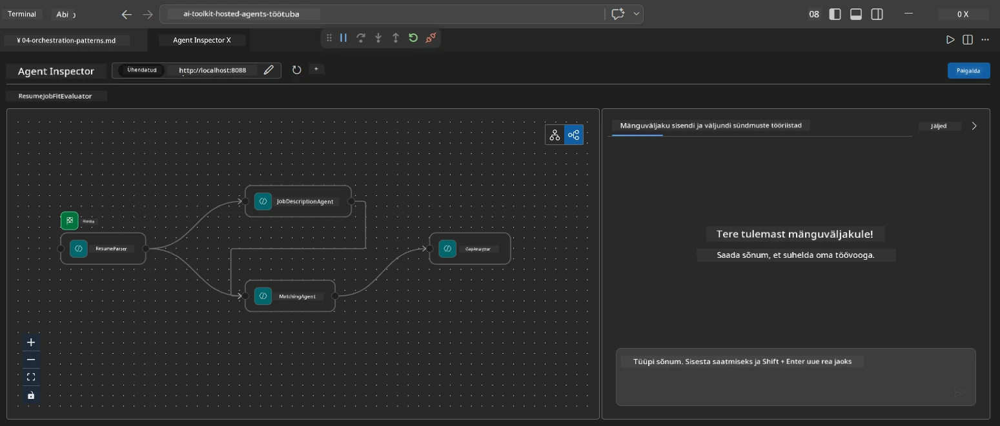
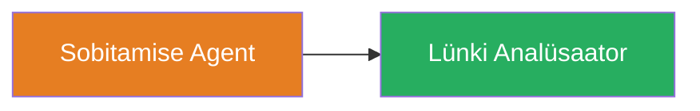
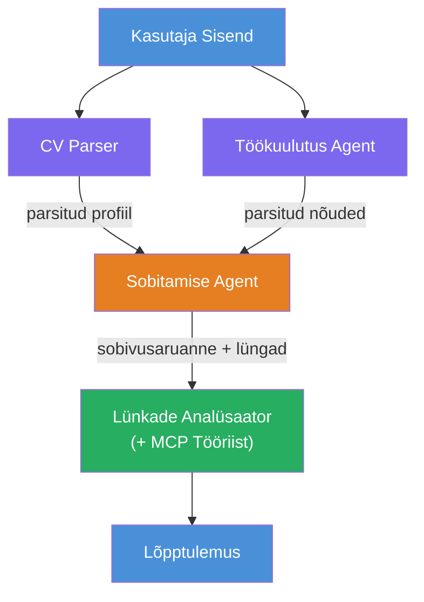
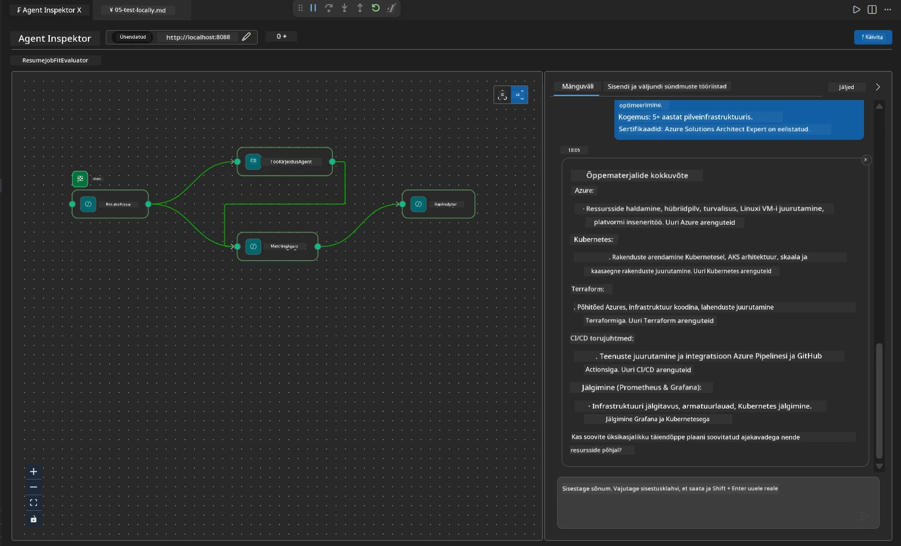

# Moodul 4 - Orkestreerimismustrid

Selles moodulis uurite orkestreerimismustreid, mida kasutatakse Resume Job Fit Evaluator'is, ning õpite, kuidas lugeda, muuta ja laiendada töövoo graafikut. Nende mustrite mõistmine on hädavajalik andmevoo probleemide silumiseks ja omaenda [multi-agentsete töövoogude](https://learn.microsoft.com/agent-framework/workflows/) loomiseks.

---

## Muster 1: Fan-out (paralleelne jagunemine)

Töövoo esimene muster on **fan-out** - üks sisend saadetakse samaaegselt mitmele agendile.


Koodis toimub see seetõttu, et `resume_parser` on `start_executor` - see saab esmalt kasutaja sõnumi. Seejärel, kuna nii `jd_agent` kui ka `matching_agent` on ühendatud `resume_parser`-ilt, suunab raamistik `resume_parser` väljundi mõlemale agendile:

```python
.add_edge(resume_parser, jd_agent)         # ResumeParser väljund → JD agent
.add_edge(resume_parser, matching_agent)   # ResumeParser väljund → MatchingAgent
```

**Miks see töötab:** ResumeParser ja JD Agent töötlevad sama sisendi erinevaid aspekte. Nende paralleelne käivitamine vähendab kogu latentsust võrreldes järjestikulise töötamisega.

### Millal fan-out'i kasutada

| Kasutusjuhtum | Näide |
|----------|---------|
| Sõltumatud alamülesanded | CV analüüs vs. töökuulutuse analüüs |
| Ülekate / hääletamine | Kaks agenti analüüsivad samu andmeid, kolmas valib parima vastuse |
| Mitme vormingu väljund | Üks agent genereerib teksti, teine struktureeritud JSON-i |

---

## Muster 2: Fan-in (agregatsioon)

Teine muster on **fan-in** - mitme agendi väljund kogutakse kokku ja saadetakse ühele allavoolu agendile.


Koodis:

```python
.add_edge(resume_parser, matching_agent)   # ResumeParser väljund → MatchingAgent
.add_edge(jd_agent, matching_agent)        # JD Agendi väljund → MatchingAgent
```

**Põhiline käitumine:** Kui agendil on **kaks või enam saabuvat serva**, ootab raamistik automaatselt **kõigi** ülemiste agentide lõpetamist enne allavoolu agendi käivitamist. MatchingAgent ei alusta, kuni nii ResumeParser kui ka JD Agent on lõpetanud.

### Mida MatchingAgent saab

Raamistik liidab kõigi ülemiste agentide väljundid. MatchingAgent'i sisend näeb välja nii:

```
[ResumeParser output]
---
Candidate Profile:
  Name: Jane Doe
  Technical Skills: Python, Azure, Kubernetes, ...
  ...

[JobDescriptionAgent output]
---
Role Overview: Senior Cloud Engineer
Required Skills: Python, Azure, Terraform, ...
...
```

> **Märkus:** Täpne liitmise vorm sõltub raamistikust. Agendi juhised peaksid olema koostatud nii, et nad töötlevad nii struktureeritud kui ka struktureerimata ülemiste agentide väljundeid.



---

## Muster 3: Järjestikune ahel

Kolmas muster on **järjestikune ahel** - ühe agendi väljund suunatakse otse järgmisele.


Koodis:

```python
.add_edge(matching_agent, gap_analyzer)    # MatchingAgendi väljund → LõheAnalüsaator
```

See on kõige lihtsam muster. GapAnalyzer saab MatchingAgent'i sobivusskoori, sobitatud/puuduvate oskuste ja lünkade nimekirja. Seejärel kutsub ta iga lünga puhul [MCP tööriista](https://learn.microsoft.com/azure/foundry/agents/how-to/tools/model-context-protocol) Microsoft Learn'i ressursside toomiseks.

---

## Täielik graaf

Kõigi kolme mustri kombineerimine annab täieliku töövoo:


### Täitmise ajajoon

```mermaid
gantt
    title Agendi Täitmise Ajakava
    dateFormat X
    axisFormat %s

    section Paralleelselt
    CV Parser          :rp, 0, 3
    JD Agent           :jd, 0, 2

    section Järgnev
    Sobitusagent       :ma, 3, 5
    Lünkaanalüsaator   :ga, 5, 9
```


> Kogu seinaaja kestus on ligikaudu `max(ResumeParser, JD Agent) + MatchingAgent + GapAnalyzer`. GapAnalyzer on tavaliselt aeglaseim, sest teeb mitu MCP tööriista kutset (üks iga lünga kohta).

---

## WorkflowBuilder koodi lugemine

Siin on täielik `create_workflow()` funktsioon failist `main.py`, kommenteeritud:

```python
def create_workflow(resume_parser, jd_agent, matching_agent, gap_analyzer):
    workflow = (
        WorkflowBuilder(
            name="ResumeJobFitEvaluator",

            # Esimene agent, kes saab kasutaja sisendi
            start_executor=resume_parser,

            # Agent(id), kelle väljundist saab lõplik vastus
            output_executors=[gap_analyzer],
        )
        # Hajutus: ResumeParser väljund läheb nii JD Agendile kui MatchingAgentile
        .add_edge(resume_parser, jd_agent)
        .add_edge(resume_parser, matching_agent)

        # Koondamine: MatchingAgent ootab nii ResumeParseri kui JD Agenti
        .add_edge(jd_agent, matching_agent)

        # Järjestikune: MatchingAgendi väljund läheb GapAnalyzerile
        .add_edge(matching_agent, gap_analyzer)

        .build()
    )
    return workflow.as_agent()
```

### Serva kokkuvõtte tabel

| # | Serv | Muster | Tähendus |
|---|------|---------|--------|
| 1 | `resume_parser → jd_agent` | Fan-out | JD Agent saab ResumeParser'i väljundi (pluss algse kasutaja sisendi) |
| 2 | `resume_parser → matching_agent` | Fan-out | MatchingAgent saab ResumeParser'i väljundi |
| 3 | `jd_agent → matching_agent` | Fan-in | MatchingAgent saab ka JD Agent'i väljundi (ootab mõlema lõpetamist) |
| 4 | `matching_agent → gap_analyzer` | Järjestikune | GapAnalyzer saab sobivuse raporti ja lünkade nimekirja |

---

## Graafiku muutmine

### Uue agendi lisamine

Et lisada viies agent (nt **InterviewPrepAgent**, mis genereerib intervjuuküsimusi lünga analüüsi põhjal):

```python
# 1. Määratle juhised
INTERVIEW_PREP_INSTRUCTIONS = """\
You are the Interview Prep Agent.
Given a gap analysis and fit report, generate 10 targeted interview questions
the candidate should prepare for.
"""

# 2. Loo agent (asünkroonse with-ploki sees)
AzureAIAgentClient(
    project_endpoint=PROJECT_ENDPOINT,
    model_deployment_name=MODEL_DEPLOYMENT_NAME,
    credential=credential,
).as_agent(
    name="InterviewPrepAgent",
    instructions=INTERVIEW_PREP_INSTRUCTIONS,
) as interview_prep,

# 3. Lisa servad funktsiooni create_workflow()
.add_edge(matching_agent, interview_prep)   # võtab vastu fit-aruande
.add_edge(gap_analyzer, interview_prep)     # võtab vastu ka tühikukaardid

# 4. Uuenda output_executors
output_executors=[interview_prep],  # nüüd lõplik agent
```

### Täitmise järjekorra muutmine

Et käivitada JD Agent **pärast** ResumeParser'it (järjestiku asemel paralleelne):

```python
# Eemalda: .add_edge(resume_parser, jd_agent)  ← juba olemas, hoia see
# Eemalda kaudne paralleelsus, jättes jd_agent mitte saama kasutaja sisendit otse
# start_executor saadab esmalt resume_parserile ning jd_agent saab
# resume_parseri väljundi läbi serva. See muudab need järjestikusteks.
```

> **Tähtis:** `start_executor` on ainus agent, kes saab algse kasutaja sisendi. Kõik teised agendid saavad väljundi oma ülemistelt servadelt. Kui soovid, et agent saaks ka algse kasutaja sisendi, peab talle olema ühendus `start_executor`-ilt.

---

## Levinud graafiku vead

| Viga | Sümptom | Parandus |
|---------|---------|-----|
| Puuduv serv `output_executors`-i | Agent töötab, aga väljund on tühi | Veendu, et `start_executor`-ist on tee iga agendini `output_executors`-is |
| Tsükliline sõltuvus | Lõputu tsükkel või ajalõpp | Kontrolli, et ükski agent ei süstiks ülemisse agendisse tagasi |
| Agent `output_executors`is ilma saabuvata servata | Tühi väljund | Lisa vähemalt üks `add_edge(source, that_agent)` |
| Mitmed `output_executors` ilma fan-in'ita | Väljund sisaldab ainult ühe agendi vastust | Kasuta üht väljundagenti, mis koondab, või võta vastu mitu väljundit |
| Puuduv `start_executor` | `ValueError` ehitusaegne viga | Määra alati `start_executor` `WorkflowBuilder()`-is |

---

## Graafiku silumine

### Agent Inspector'i kasutamine

1. Käivita agent lokaalselt (F5 või terminal - vt [Moodul 5](05-test-locally.md)).
2. Ava Agent Inspector (`Ctrl+Shift+P` → **Foundry Toolkit: Open Agent Inspector**).
3. Saada test-sõnum.
4. Inspectori vastuserakenduses otsi **voogedastuse väljundit** - seal näed iga agendi panust järjestuses.



### Logimise kasutamine

Lisa logimine `main.py` faili andmevoo jälgimiseks:

```python
import logging
logger = logging.getLogger("resume-job-fit")

# Funktsioonis create_workflow(), pärast ehitamist:
logger.info("Workflow graph built with edges: RP→JD, RP→MA, JD→MA, MA→GA")
```

Serveri logid näitavad agentide täitmise järjekorda ja MCP tööriista kutseid:

```
INFO:resume-job-fit:Starting Resume -> Job Fit Evaluator HTTP server...
INFO:resume-job-fit:Server running on http://localhost:8088
INFO:agent_framework:Executing agent: ResumeParser
INFO:agent_framework:Executing agent: JobDescriptionAgent
INFO:agent_framework:Waiting for upstream agents: ResumeParser, JobDescriptionAgent
INFO:agent_framework:Executing agent: MatchingAgent
INFO:agent_framework:Executing agent: GapAnalyzer
INFO:agent_framework:Tool call: search_microsoft_learn_for_plan(skill="Kubernetes")
POST https://learn.microsoft.com/api/mcp → 200
INFO:agent_framework:Tool call: search_microsoft_learn_for_plan(skill="Terraform")
POST https://learn.microsoft.com/api/mcp → 200
```

---

### Kontrollpunkt

- [ ] Sa tunned ära töövoos kolm orkestreerimismustrit: fan-out, fan-in ja järjestikune ahel
- [ ] Mõistad, et agendid mitme saabuvaga servaga ootavad kõigi ülemiste agentide lõpetamist
- [ ] Oskad lugeda `WorkflowBuilder` koodi ja siduda iga `add_edge()` kõne visuaalse graafikuga
- [ ] Mõistad täitmise ajajoont: kõigepealt paralleelsed agendid, siis agregatsioon, siis järjestikune täitmine
- [ ] Tead, kuidas lisada uut agenti graafikusse (defineeri juhised, loo agent, lisa servad, uuenda väljundit)
- [ ] Oskad tuvastada levinud graafiku vigu ja nende tunnuseid

---

**Eelmine:** [03 - Configure Agents & Environment](03-configure-agents.md) · **Järgmine:** [05 - Test Locally →](05-test-locally.md)

---

<!-- CO-OP TRANSLATOR DISCLAIMER START -->
**Vastutusest loobumine**:  
See dokument on tõlgitud kasutades tehisintellekti tõlketeenust [Co-op Translator](https://github.com/Azure/co-op-translator). Kuigi püüame täpsust, tuleb arvestada, et automaatsed tõlked võivad sisaldada vigu või ebatäpsusi. Originaaldokument selle algses keeles tuleks pidada autoriteetseks allikaks. Olulise teabe puhul soovitatakse kasutada professionaalset inimtõlget. Me ei vastuta selle tõlkega seotud arusaamatuste või valesti tõlgenduste eest.
<!-- CO-OP TRANSLATOR DISCLAIMER END -->