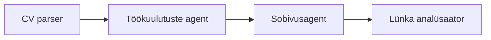
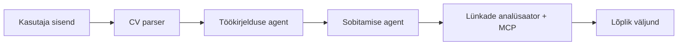

# Moodul 4 - Orkestreerimise mustrid

⏱️ ~10 minutit

Selles moodulis uurid Resume Job Fit Evaluatori orkestreerimismustreid ning õpid, kuidas lugeda, muuta ja laiendada töövoo graafikut. Nende mustrite mõistmine on oluline andmevoo probleemide silumiseks ja omaenda [mitmeagendiliste töövoogude](https://learn.microsoft.com/agent-framework/workflows/) loomise jaoks.

---

## Muster 1: Järjestikune ahel

Töövoo põhineb **järjestikus ahelal** – iga agendi väljund suunatakse otse järgmisele.


```mermaid
flowchart LR
    RP[CV parser] --> JD[Töökuulutuste agent]
    JD --> MA[Sobivusagent]
    MA --> GA[Lünka analüsaator]
```

Koodis loob iga `add_edge()` kutse ahelas ühe sammu:

```python
.add_edge(resume_executor, jd_executor)       # CV-parsija väljund → JD Agent
.add_edge(jd_executor, matching_executor)     # JD Agenti väljund → MatchingAgent
.add_edge(matching_executor, gap_executor)    # MatchingAgendi väljund → Lüngaanalüsaator
```

> **Miks järjestikune, mitte hargnemine/ühinemine?** `WorkflowBuilder` kasutab saabuvatele servadele **VÕI-semantikat**: allavoolu täideviija käivitub kohe, kui **ükskõik milline** eelkäija lõpetab. Kui `matching_executor`il oleks kaks saabuvat serva (nii `resume_executor`ilt kui `jd_executor`ilt), käivituks see kaks korda – korra kui ResumeParser lõpetab ja teist korda, kui JD Agent lõpetab – põhjustades GapAnalyzerile kahekordse jooksu ja väljund ilmuks kahekordselt. Järjestikune torujuhe väldib seda täielikult.

## Muster 2: Sisu vahendamine

Kuna `context_mode="last_agent"` tähendab, et iga täideviija näeb ainult oma **otse eelkäija väljundit**, peavad järjestikuse ahela agendid selgesõnaliselt edastama andmeid, mida allavoolu agendid vajavad.

Selles töövoos:
- **ResumeParser** kopeerib JD täpselt `[JOB DESCRIPTION PASS-THROUGH]`i (et JD Agent selle leiaks).
- **JD Agent** kopeerib `[PARSED RESUME]` täpselt `[PARSED RESUME PASS-THROUGH]`i (et MatchingAgent saaks mõlemaid profiile võrrelda).

```
ResumeParser output
└─ [PARSED RESUME]               ← extracted by JD Agent
└─ [JOB DESCRIPTION PASS-THROUGH] ← extracted by JD Agent

JD Agent output
└─ [JD REQUIREMENTS]             ← extracted by MatchingAgent
└─ [PARSED RESUME PASS-THROUGH]  ← extracted by MatchingAgent
```

Iga vahendamise osa peab olema kopeeritud **sõnasõnaliselt** – selle kokkuvõtmine või ümberütlemine rikub allavoolu agenti, mis sellest sõltub.

---

## Täielik graafik

Järjestikuse ahela ja sisu vahendamise mustrite kombineerimine loob kogu töövoo:


```mermaid
flowchart LR
    U[Kasutaja sisend] --> RP[CV parser]
    RP --> JD[Töökirjelduse agent]
    JD --> MA[Sobitamise agent]
    MA --> GA[Lünkade analüsaator + MCP]
    GA --> O[Lõplik väljund]
```

Agent Inspector kuvab sama graafiku struktuuri, kui agent töötab lokaalselt. Vaata ekraanipilte peatükist [Moodul 5 - Testi lokaalselt](05-test-locally.md).

---

## WorkflowBuilderi koodi lugemine

Täielik `create_workflow()` funktsioon on faili [`PersonalCareerCopilot/main.py`](../../../../../workshop/lab02-multi-agent/PersonalCareerCopilot/main.py) sees. Kolm `add_edge()` kutsungit ehitavad järjestikuse torujuhtme:

| # | Serv | Mõju |
|---|------|--------|
| 1 | `resume_executor → jd_executor` | JD Agent saab `[PARSED RESUME]` + `[JOB DESCRIPTION PASS-THROUGH]` |
| 2 | `jd_executor → matching_executor` | MatchingAgent saab `[JD REQUIREMENTS]` + `[PARSED RESUME PASS-THROUGH]` |
| 3 | `matching_executor → gap_executor` | GapAnalyzer saab sobivusaruanne + lünkade nimekirja |

---

## Graafiku muutmine

### Uue agendi lisamine

Viienda agendi lisamiseks (nt **InterviewPrepAgent** pärast GapAnalyzerit):

1. Määra `INTERVIEW_PREP_INSTRUCTIONS` konstant.
2. Loo `Agent` + `AgentExecutor` objektid (nagu olemasoleval neljal).
3. Lisa `.add_edge(gap_executor, interview_exec)` `WorkflowBuilder`isse.
4. Uuenda `output_executors=[interview_exec]`.

> **Oluline:** `start_executor` on ainus agent, kes saab otse kasutaja sisendi. Kõik teised agendid saavad väljundi oma ülemisest servast.

---

## Tavalised graafiku vead

| Viga | Sümptom | Parandus |
|---------|---------|-----|
| Puuduv serv `output_executors`ile | Agent töötab, aga väljund on tühi | Veendu, et `start_executor`ist juhitakse tee kõigi `output_executorsi` agentideni |
| Tsükliline sõltuvus | Lõputu tsükkel või ajapiirangu viga | Kontrolli, et ükski agent ei toidaks tagasi eelnevasse agendisse |
| Agent `output_executors`is ilma saabuvata servata | Tühi väljund | Lisa vähemalt üks `add_edge(allikas, see_agent)` |
| Mitmed `output_executors`id ilma hargnemiseta | Väljundis on ainult ühe agendi vastus | Kasuta ühte väljundi agenti, mis koondab, või aktsepteeri mitut väljundit |
| Puuduv `start_executor` | `ValueError` ehitusajal | Määra alati `start_executor` `WorkflowBuilder()` sees |

---

## Graafiku silumine

### Agent Inspectori kasutamine

1. Käivita agent kohalikus keskkonnas F5-ga.
2. Ava Agent Inspector (`Ctrl+Shift+P` → **Foundry Toolkit: Open Agent Inspector**).
3. Saada test-sõnum.
4. Inspectori vastuse paneelis vaata **voogesitatavat väljundit** – see kuvab iga agendi panuse järjest.


### Logimise kasutamine

Lisa logimine faili `main.py`, et jälgida andmevoogu:

```python
import logging
logger = logging.getLogger("resume-job-fit")

# Peaprogrammis peamise töövoo loomise järel:
logger.info("Workflow graph built with edges: RP→JD, JD→MA, MA→GA")
```

Serveri logid näitavad agendi täideviimise järjekorda ja MCP tööriistakutseid:

```
INFO:agent_framework:Executing agent: ResumeParser
INFO:agent_framework:Executing agent: JobDescriptionAgent
INFO:agent_framework:Executing agent: MatchingAgent
INFO:agent_framework:Executing agent: GapAnalyzer
INFO:agent_framework:Tool call: search_microsoft_learn_for_plan(skill="Kubernetes")
POST https://learn.microsoft.com/api/mcp → 200
INFO:agent_framework:Tool call: search_microsoft_learn_for_plan(skill="Terraform")
POST https://learn.microsoft.com/api/mcp → 200
```

---

### Kontrollpunkt

- [ ] Sa suudad tuvastada töövoos kaks orkestreerimismustrit: järjestikuse ahela ja sisu vahendamise
- [ ] Sa mõistad, miks `context_mode="last_agent"` nõuab agentide vahel selgesõnalist andmevahendust
- [ ] Sa suudad lugeda `WorkflowBuilder`i koodi ja siduda iga `add_edge()` kutse graafikuga
- [ ] Sa tead, kuidas lisada uus agent pipeline lõppu
- [ ] Sa suudad tuvastada levinud graafiku vigu ja nende sümptomeid

---

**Eelmine:** [03 - Kontrolli agente & keskkonda](03-configure-agents.md) · **Järgmine:** [05 - Testi lokaalselt →](05-test-locally.md)

---

<!-- CO-OP TRANSLATOR DISCLAIMER START -->
**Lahtiütlus**:
See dokument on tõlgitud kasutades AI tõlketeenust [Co-op Translator](https://github.com/Azure/co-op-translator). Kuigi me püüdleme täpsuse poole, palun pange tähele, et automatiseeritud tõlgetes võib esineda vigu või ebatäpsusi. Originaaldokument selle emakeeles tuleks pidada autoriteetseks allikaks. Olulise teabe puhul soovitatakse kasutada professionaalset inimtõlget. Me ei vastuta selle tõlkega seotud eksimustest või valesti mõistmistest.
<!-- CO-OP TRANSLATOR DISCLAIMER END -->