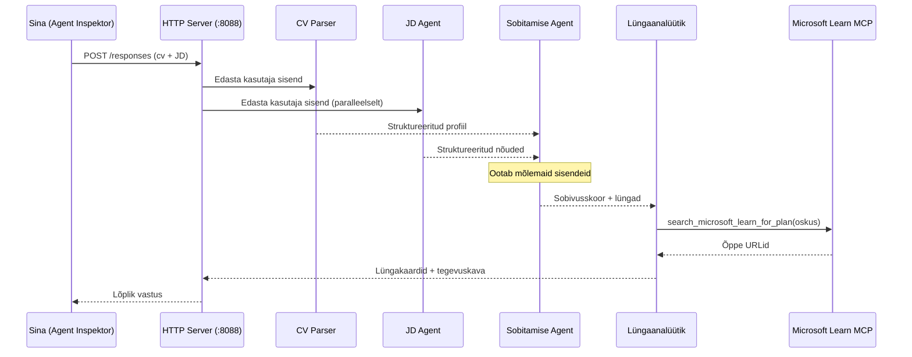
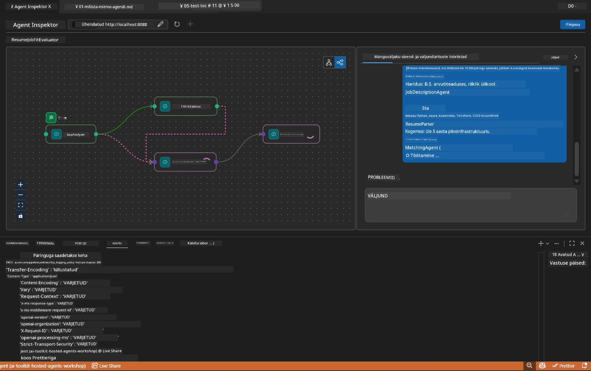

# Moodul 5 - Testi kohapeal (mitmeagendi)

Selles moodulis käivitad mitmeagendi töövoo kohapeal, testid seda Agent Inspectori abil ja kontrollid, et kõik neli agenti ja MCP tööriist töötavad õigesti enne juurutamist Foundrys.

### Mis juhtub kohalikus testis


---

## Samm 1: Käivita agendi server

### Valik A: Kasutades VS Code ülesannet (soovitatav)

1. Vajuta `Ctrl+Shift+P` → tipi **Tasks: Run Task** → vali **Run Lab02 HTTP Server**.
2. Ülesanne käivitab serveri koos debugpy-ga pordil `5679` ja agendi pordil `8088`.
3. Oota kuni väljundis kuvatakse:

```
INFO:resume-job-fit:Starting Resume -> Job Fit Evaluator HTTP server...
INFO:resume-job-fit:Server running on http://localhost:8088
```

### Valik B: Kasutades terminali käsitsi

```powershell
cd workshop\lab02-multi-agent\PersonalCareerCopilot
```

Aktiveeri virtuaalne keskkond:

**PowerShell (Windows):**
```powershell
.\.venv\Scripts\Activate.ps1
```

**macOS/Linux:**
```bash
source .venv/bin/activate
```

Käivita server:

```powershell
python -m debugpy --listen 127.0.0.1:5679 -m agentdev run main.py --verbose --port 8088
```

### Valik C: Kasutades F5 (silumisrežiim)

1. Vajuta `F5` või ava **Run and Debug** (`Ctrl+Shift+D`).
2. Vali rippmenüüst **Lab02 - Multi-Agent** käivituskonfiguratsioon.
3. Server käivitub täieliku silumispunkti toega.

> **Nõuanne:** Silumisrežiim laseb sul määrata murdepunkte funktsioonis `search_microsoft_learn_for_plan()`, et uurida MCP vastuseid, või agendi juhiste stringides, et näha, mida iga agent saab.

---

## Samm 2: Ava Agent Inspector

1. Vajuta `Ctrl+Shift+P` → tipi **Foundry Toolkit: Open Agent Inspector**.
2. Agent Inspector avaneb brauseri vahekaardil aadressil `http://localhost:5679`.
3. Sa peaksid nägema agendi liidest, mis on valmis sõnumeid vastu võtma.

> **Kui Agent Inspector ei avane:** Veendu, et server oleks täielikult käivitatud (näed logis "Server running"). Kui port 5679 on hõivatud, vaata [Moodul 8 - Tõrkeotsing](08-troubleshooting.md).

---

## Samm 3: Käivita suitsutestid

Käivita need kolm testi järjest. Igaüks testib järjest rohkem töövoogu.

### Test 1: Põhiline CV + töökuulutuse kirjeldus

Kleebi Agent Inspectori järgmine sisu:

```
Resume:
Jane Doe
Senior Software Engineer with 5 years of experience in Python, Django, and AWS.
Built microservices handling 10K+ requests/second. Led a team of 4 developers.
Certifications: AWS Solutions Architect Associate.
Education: B.S. Computer Science, State University.

Job Description:
Senior Cloud Engineer at Contoso Ltd.
Required: Python, Azure, Kubernetes, Terraform, CI/CD pipelines.
Preferred: Go, monitoring (Prometheus/Grafana), cost optimization.
Experience: 5+ years in cloud infrastructure.
Certifications: Azure Solutions Architect Expert preferred.
```

**Oodatud väljundi struktuur:**

Vastus peaks järjestuses sisaldama väljundit kõigilt neljalt agendilt:

1. **CV parseri väljund** - Struktureeritud kandidaadi profiil oskustega kategooriate kaupa
2. **JD agendi väljund** - Struktureeritud nõuded, eristatud nõutud ja soovitud oskused
3. **Sobitamise agendi väljund** - Sobivuse skoor (0-100) koos jaotusega, määratud oskused, puuduolevad oskused, lüngad
4. **Lünkade analüsaatori väljund** - Iga puuduva oskuse kohta üks lünga kaart, koos Microsoft Learni URL-idega



### Mida kontrollida Test 1 puhul

| Kontroll | Oodatud | Läbitud? |
|----------|---------|----------|
| Vastas on sobivuse skoor | Number vahemikus 0-100 koos jaotusega | |
| Loetletud on määratud oskused | Python, CI/CD (osaline), jms | |
| Loetletud on puuduolevad oskused | Azure, Kubernetes, Terraform, jms | |
| Iga puuduva oskuse kohta on lünga kaart | Üks kaart iga oskuse jaoks | |
| Microsoft Learni URLid esinevad | Tõelised `learn.microsoft.com` lingid | |
| Vastuses vigu ei ole | Puhas struktureeritud väljund | |

### Test 2: Kontrolli MCP tööriista täitmist

Test 1 käigus kontrolli **serveri terminalis** MCP logikirjeid:

```
GET https://learn.microsoft.com/api/mcp → 405 (Method Not Allowed)
POST https://learn.microsoft.com/api/mcp → 200
DELETE https://learn.microsoft.com/api/mcp → 405 (Method Not Allowed)
```

| Logikirje | Tähendus | Oodatud? |
|-----------|----------|----------|
| `GET ... → 405` | MCP klient kontrollib GET päringutega initsialiseerimisel | Jah - normaalne |
| `POST ... → 200` | Tegelik tööriista kõne Microsoft Learni MCP serverisse | Jah - see on päris kõne |
| `DELETE ... → 405` | MCP klient kontrollib DELETE päringutega koristamisel | Jah - normaalne |
| `POST ... → 4xx/5xx` | Tööriista kõne ebaõnnestus | Ei - vaata [Tõrkeotsing](08-troubleshooting.md) |

> **Oluline:** `GET 405` ja `DELETE 405` read on **ootuspärased**. Muretse ainult siis, kui `POST` kõned tagastavad mitte-200 staatuskoode.

### Test 3: Äärmuslik juhtum – kõrge sobivusega kandidaat

Kleebi CV, mis sobib töökirjeldusega hästi, et kontrollida, kuidas GapAnalyzer kõrge sobivuse korral töötab:

```
Resume:
Alex Chen
Senior Cloud Engineer with 7 years of experience.
Skills: Python, Azure (AKS, Functions, DevOps), Kubernetes, Terraform, CI/CD (GitHub Actions, Azure Pipelines), Go, Prometheus, Grafana, cost optimization.
Certifications: Azure Solutions Architect Expert, Azure DevOps Engineer Expert.
Led infrastructure migration to Azure for 3 enterprise clients.
Education: M.S. Computer Science, Tech University.

Job Description:
Senior Cloud Engineer at Contoso Ltd.
Required: Python, Azure, Kubernetes, Terraform, CI/CD pipelines.
Preferred: Go, monitoring (Prometheus/Grafana), cost optimization.
Experience: 5+ years in cloud infrastructure.
Certifications: Azure Solutions Architect Expert preferred.
```

**Oodatud käitumine:**
- Sobivuse skoor peaks olema **80+** (enamik oskusi sobivad)
- Lünga kaardid keskenduvad läikimisele/intervjuuks ettevalmistamisele, mitte põhilisele õppimisele
- GapAnalyzer juhises on öeldud: "Kui sobivus >=80, keskendu läikimisele/intervjuuks ettevalmistamisele"

---

## Samm 4: Kontrolli väljundi täielikkust

Pärast testide läbimist veendu, et väljund vastab järgmistele kriteeriumidele:

### Väljundi struktuuri kontrollnimekiri

| Jaotis | Agent | Olemas? |
|--------|-------|---------|
| Kandidaadi profiil | Resume Parser | |
| Tehnilised oskused (rühmitatult) | Resume Parser | |
| Rolli ülevaade | JD Agent | |
| Nõutud vs soovitud oskused | JD Agent | |
| Sobivuse skoor ja jaotus | Matching Agent | |
| Määratud / puuduolevad / osalised oskused | Matching Agent | |
| Lünga kaart iga puuduva oskuse kohta | Gap Analyzer | |
| Microsoft Learni URLid lünga kaartidel | Gap Analyzer (MCP) | |
| Õppimisjärjekord (numberdatud) | Gap Analyzer | |
| Ajakava kokkuvõte | Gap Analyzer | |

### Levinumad probleemid selles etapis

| Probleem | Põhjus | Parandus |
|----------|---------|----------|
| Ainult 1 lünga kaart (teised trunkeeritud) | GapAnalyzer juhised puuduvad KRIITILINE plokk | Lisa `CRITICAL:` lõik `GAP_ANALYZER_INSTRUCTIONS`-i – vaata [Moodul 3](03-configure-agents.md) |
| Microsoft Learni URLid puuduvad | MCP lõpp-punkt on kättesaamatu | Kontrolli internetiühendust. Veendu, et `.env` failis on `MICROSOFT_LEARN_MCP_ENDPOINT` väärtuseks `https://learn.microsoft.com/api/mcp` |
| Vastus on tühi | `PROJECT_ENDPOINT` või `MODEL_DEPLOYMENT_NAME` pole määratud | Kontrolli `.env` failis olevaid väärtusi. Käivita terminalis `echo $env:PROJECT_ENDPOINT` |
| Sobivuse skoor on 0 või puudub | MatchingAgent sai põhivoolust andmeid | Kontrolli, et `add_edge(resume_parser, matching_agent)` ja `add_edge(jd_agent, matching_agent)` on `create_workflow()` sees olemas |
| Agent käivitub, kuid kohe väljub | Importimise viga või sõltuvuse puudumine | Käivita uuesti `pip install -r requirements.txt`. Kontrolli terminalis virnade jälgi |
| `validate_configuration` viga | Keskkonnamuutujad puuduvad | Loo `.env` fail väärtustega `PROJECT_ENDPOINT=<sinu-endpoint>` ja `MODEL_DEPLOYMENT_NAME=<sinu-mudel>` |

---

## Samm 5: Testi oma andmetega (valikuline)

Proovi kleebitud oma CV ja tõelist töökuulutuse kirjeldust. See aitab kontrollida:

- Agendid töötlevad erinevaid CV formaate (kronoloogiline, funktsionaalne, hübriid)
- JD Agent töötleb erinevaid töökuulutuse stiile (punktid, lõigud, struktureeritud)
- MCP tööriist tagastab asjakohased ressursid reaalsetele oskustele
- Lünga kaardid on personaliseeritud vastavalt sinu konkreetsele taustale

> **Privaatsuse märkus:** Kohalikus testis jäävad sinu andmed sinu masinasse ja saadetakse vaid sinu Azure OpenAI juurutusse. Need ei logita ega salvestata töötoa infrastruktuuri poolt. Kasuta vajadusel asendusnimesid (nt "Jane Doe" tegeliku nime asemel).

---

### Kontrollnimekiri

- [ ] Server käivitati edukalt pordil `8088` (logis on "Server running")
- [ ] Agent Inspector avati ja ühendati agendiga
- [ ] Test 1: Täielik vastus koos sobivuse skoori, määratud/puuduolevate oskuste, lünga kaartide ja Microsoft Learni URLidega
- [ ] Test 2: MCP logid näitavad `POST ... → 200` (tööriistakõned õnnestusid)
- [ ] Test 3: Kõrge sobivusega kandidaat saab skoori 80+ läikimisele suunatud soovitustega
- [ ] Kõik lünga kaardid olemas (üks iga puuduva oskuse kohta, ei ole katkestatud)
- [ ] Serveri terminalis pole veateateid ega virnade jälgi

---

**Eelmine:** [04 - Orkestreerimise mustrid](04-orchestration-patterns.md) · **Järgmine:** [06 - Juuruta Foundrysse →](06-deploy-to-foundry.md)

---

<!-- CO-OP TRANSLATOR DISCLAIMER START -->
**Vastutusest loobumine**:
See dokument on tõlgitud AI tõlketeenuse [Co-op Translator](https://github.com/Azure/co-op-translator) abil. Kuigi püüdleme täpsuse poole, võib automatiseeritud tõlgetes esineda vigu või ebatäpsusi. Originaaldokument selle emakeeles tuleks pidada ametlikuks allikaks. Kriitilise teabe puhul soovitatakse kasutada professionaalset inimtõlget. Me ei vastuta käesoleva tõlke kasutamisest tingitud arusaamatuste ega väärarusaamade eest.
<!-- CO-OP TRANSLATOR DISCLAIMER END -->