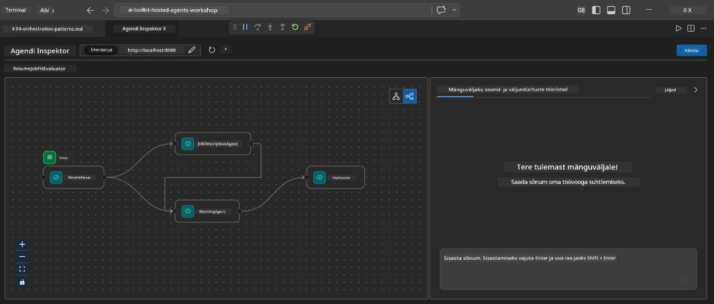
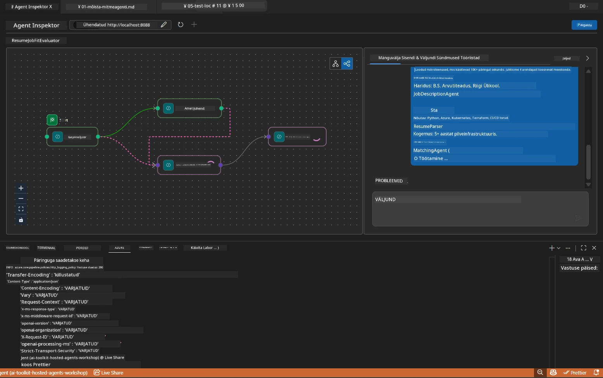
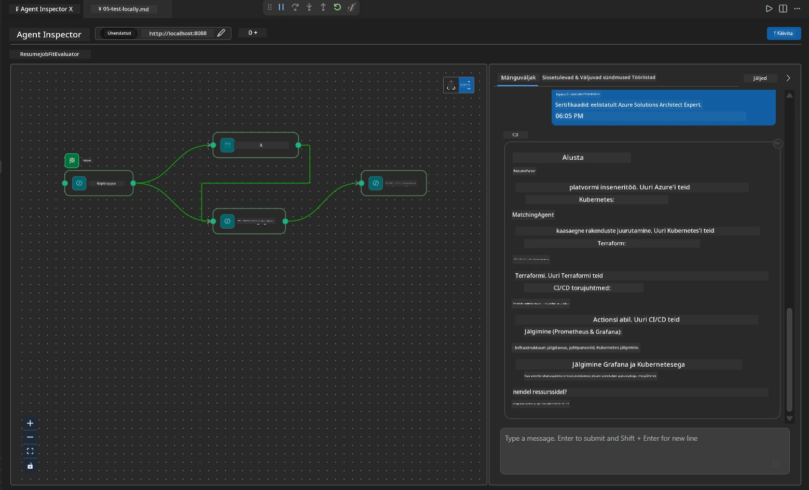

# Moodul 5 - Testi kohapeal

⏱️ ~15 min

Selles moodulis käivitate mitme agendiga töövoo kohapeal, testite seda Agent Inspectoriga ja kinnitate, et kõik neli agenti ja MCP tööriist töötavad õigesti enne juurutamist.

---

## Samm 1: Käivita agendi server

### Variant A: Kasutades VS Code ülesannet (soovitatav)

1. Ava `workshop/lab02-multi-agent/PersonalCareerCopilot/` oma VS Code kaustana.
2. Vajuta `Ctrl+Shift+P` → kirjuta **Tasks: Run Task** → vali **Run Agent HTTP Server**.
3. Ülesanne käivitab serveri debugpy-ga portul `5679` ja agendi portul `8088`.
4. Oota, kuni väljund näitab:

```
INFO:resume-job-fit:Starting Resume -> Job Fit Evaluator HTTP server...
INFO:resume-job-fit:Server running on http://localhost:8088
```

### Variant B: Kasutades F5 (silurirežiim)

1. Vajuta `F5` → vali **Debug Local Agent HTTP Server**.
2. Server käivitub täieliku silmuse tugega - kasulik MCP vastuste või agendi väljundite uurimiseks.

---

## Samm 2: Ava Agent Inspector

1. Vajuta `Ctrl+Shift+P` → kirjuta **Foundry Toolkit: Open Agent Inspector**.
2. Agent Inspector avaneb VS Code paneelina, mis on ühendatud aadressiga `http://localhost:8088`.
3. Peaksid nägema agendi liidest, mis on valmis sõnumeid vastu võtma.



> **Kui Agent Inspector ei avane:** Veendu, et server on täielikult käivitunud (näed "Server running" logi). Kui port 5679 on hõivatud, vaata [Moodul 8 - Tõrkeotsing](08-troubleshooting.md).

---

## Samm 2b: (Valikuline) Ava töövoo visualiseerija

Foundry Toolkit sisaldab reaalajas **Töövoo visualiseerijat**, mis näitab, kuidas agendid omavahel suhtlevad graafiku täitmisel. See on eriti kasulik mitme agendi siluriks.

1. Vajuta `Ctrl+Shift+P` → kirjuta **Foundry Toolkit: Open Visualizer for Hosted Agents**.
2. Avaneb uus VS Code vahekaart, mis kuvab jooksva täitmise graafiku.
3. Kui saadad sõnumeid Agent Inspectoris, uuendab visualiseerija automaatselt - rohelised sõlmed tähistavad täidetud agente ja animeeritud ühendused näitavad andmevoogu nende vahel.

> **Portide konflikti korral:** Kui visualiseerija port on juba kasutusel, muuda see VS Code seadetes → **Extensions** → **Microsoft Foundry Configuration** → **Hosted Agents: Visualizer Port**.

---

## Samm 3: Käivita suitsutestid

Käivita need kolm testi järjest. Iga test kontrollib üha rohkem töövoogu.

### Test 1: Lihtne CV + töökirjeldus

Kleebi järgmine Agent Inspectori:

```
Resume:
Jane Doe
Senior Software Engineer with 5 years of experience in Python, Django, and AWS.
Built microservices handling 10K+ requests/second. Led a team of 4 developers.
Certifications: AWS Solutions Architect Associate.
Education: B.S. Computer Science, State University.

Job Description:
Senior Cloud Engineer at Contoso Ltd.
Required: Python, Azure, Kubernetes, Terraform, CI/CD pipelines.
Preferred: Go, monitoring (Prometheus/Grafana), cost optimization.
Experience: 5+ years in cloud infrastructure.
Certifications: Azure Solutions Architect Expert preferred.
```

**Oodatav väljundstruktuur:**

Vastus peaks sisaldama kõigi nelja agendi väljundit järjest:

1. **CV parsimise väljund** - Kaks sildistatud sektsiooni: `[PARSED RESUME]` (kandidaadi profiil koos rühmitatud oskustega) ja `[JOB DESCRIPTION PASS-THROUGH]` (sõnasõnaline töökirjelduse tekst, mis suunatakse JD agendile)
2. **JD agendi väljund** - Struktureeritud nõuded, kus eristatud kohustuslikud ja eelistatud oskused
3. **Sobitamise agendi väljund** - Sobivuse skoor (0-100) koos jaotusega, sobitatud oskused, puuduolevad oskused, lõhed
4. **Lõhede analüsaatori väljund** - Iga puuduva oskuse kohta individuaalsed lõhekaardid koos Microsoft Learni URL-idega





### Mida kontrollida Test 1-s

| Kontrolli | Oodatav | Läbitud? |
|----------|----------|----------|
| Vastus sisaldab sobivuse skoori | Number vahemikus 0-100 koos jaotusega | |
| Sobitatud oskused on loetletud | Python, CI/CD (osaliselt), jne | |
| Puuduolevad oskused on loetletud | Azure, Kubernetes, Terraform, jne | |
| Iga puuduv oskus omab lõhekaarti | Üks kaart oskuse kohta | |
| Microsoft Learni URL-id on olemas | Reaalsed `learn.microsoft.com` lingid | |
| Vastuses ei ole vigasid | Puhtalt struktureeritud väljund | |

### Test 2: Erandjuhtum - kõrge sobivusega kandidaat

Kleebi CV, mis sobib töökirjeldusega hästi, et kinnitada, et LõhedeAnalüsaator käsitleb kõrge sobivusega olukordi:

```
Resume:
Alex Chen
Senior Cloud Engineer with 7 years of experience.
Skills: Python, Azure (AKS, Functions, DevOps), Kubernetes, Terraform, CI/CD (GitHub Actions, Azure Pipelines), Go, Prometheus, Grafana, cost optimization.
Certifications: Azure Solutions Architect Expert, Azure DevOps Engineer Expert.
Led infrastructure migration to Azure for 3 enterprise clients.
Education: M.S. Computer Science, Tech University.

Job Description:
Senior Cloud Engineer at Contoso Ltd.
Required: Python, Azure, Kubernetes, Terraform, CI/CD pipelines.
Preferred: Go, monitoring (Prometheus/Grafana), cost optimization.
Experience: 5+ years in cloud infrastructure.
Certifications: Azure Solutions Architect Expert preferred.
```

**Oodatud käitumine:**
- Sobivuse skoor peaks olema **80+** (enamus oskusi sobivad)
- Lõhekaardid keskenduvad poleerimisele/intervjuuks ettevalmistamisele, mitte põhioskustele
- LõhedeAnalüsaatori juhised ütlevad: "Kui sobivus >= 80, keskendu poleerimisele/intervjuuks ettevalmistamisele"

---

## Samm 4: Testi oma andmetega (valikuline)

Proovi kleebitud enda CV ja tõelist töökirjeldust. See aitab kinnitada:

- Agentid töötlevad erinevaid CV formaate (kronoloogiline, funktsionaalne, hübriid)
- JD agent suudab töökirjeldusi töödelda erinevates stiilides (punktid, lõigud, struktureeritud)
- MCP tööriist tagastab asjakohased ressursid reaalsete oskuste jaoks
- Lõhekaardid on isikupärastatud vastavalt sinu taustale

> **Privaatsus - Tee A (Foundry pilv):** CV ja töökirjelduse tekst saadetakse sinu Azure OpenAI juurutusse tuletamiseks. See ei ole logitud ega salvestatud töötoa infrastruktuuris. Kasuta vajadusel kohatäite nimesid (nt "Jane Doe").
>
> **Privaatsus - Tee B (Foundry kohalik):** Kõik neli agendi tuletist jooksevad täielikult sinu seadmes. Sinu CV ja töökirjelduse tekst **ei lahku kunagi sinu masinast**. Ainus väljaminev kõne on MCP tööriista päring ressursside järele aadressilt `https://learn.microsoft.com/api/mcp`; see päring sisaldab ainult oskuse nime, mitte sinu isikuandmeid.

---

### Kontrollpunkt

- [ ] Server käivitus edukalt portil `8088` (log näitab "Server running")
- [ ] Agent Inspector avatud ja agentiga ühendatud
- [ ] Test 1: Täielik vastus koos sobivuse skoori, sobitatud/puuduolevate oskuste, lõhekaartide ja Microsoft Learni URL-idega
- [ ] Test 2: Kõrge sobivusega kandidaat saab skoori 80+, keskendudes poleerimisele
- [ ] Kõik lõhekaardid kohal (üks iga puuduva oskuse kohta, täielik)
- [ ] Serveri terminalis ei ole vigu ega virnavigu

---

**Eelmine:** [04 - Orkestreerimismustrid](04-orchestration-patterns.md) · **Järgmine:** [06 - Juuruta Foundrysse →](06-deploy-to-foundry.md)

---

<!-- CO-OP TRANSLATOR DISCLAIMER START -->
**Lahtiütlus**:
See dokument on tõlgitud kasutades AI tõlketeenust [Co-op Translator](https://github.com/Azure/co-op-translator). Kuigi me püüdleme täpsuse poole, palun pange tähele, et automatiseeritud tõlgetes võib esineda vigu või ebatäpsusi. Originaaldokument selle emakeeles tuleks pidada autoriteetseks allikaks. Olulise teabe puhul soovitatakse kasutada professionaalset inimtõlget. Me ei vastuta selle tõlkega seotud eksimustest või valesti mõistmistest.
<!-- CO-OP TRANSLATOR DISCLAIMER END -->