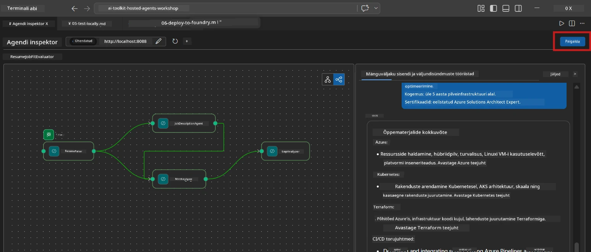
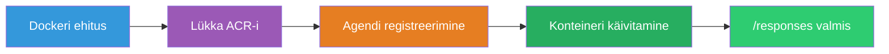
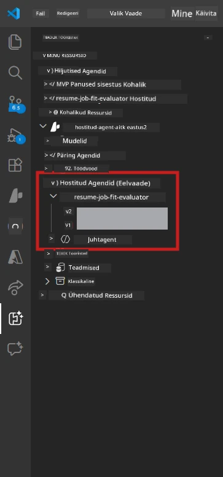

# Moodul 6 - Paigalda Foundry Agendi teenusesse

Selles moodulis paigaldate oma kohalikult testitud mitmeagendilise töövoo [Microsoft Foundry](https://learn.microsoft.com/azure/foundry/agents/concepts/hosted-agents) keskkonda kui **Hosted Agenti**. Paigaldusprotsess ehitab Docker konteinerpildi, lükkab selle [Azure Container Registry (ACR)](https://learn.microsoft.com/azure/container-registry/container-registry-intro) ja loob [Foundry Agendi teenuses](https://learn.microsoft.com/azure/foundry/agents/how-to/publish-agent) vastava hostitud agendi versiooni.

> **Põhiline erinevus laborist 01:** Paigaldusprotsess on identselt sama. Foundry käsitleb teie mitmeagendilist töövoogu ühe hostitud agendina – keerukus on konteineris sees, kuid paigalduspind on endiselt sama `/responses` lõpp-punkt.

---

## Eeltingimuste kontroll

Enne paigaldamist kontrollige alljärgnevaid punkte:

1. **Agent läbib kohalikud kiiretestid:**
   - Olete lõpetanud kõik 3 testi [Moodulis 5](05-test-locally.md) ja töövoog andis täieliku väljundi koos lüngakaartidega ja Microsoft Learn URL-idega.

2. **Teil on [Azure AI User](https://learn.microsoft.com/azure/foundry/concepts/rbac-foundry) roll:**
   - Määratud [Labis 01, Moodulis 2](../../lab01-single-agent/docs/02-create-foundry-project.md). Kontrollige:
   - [Azure Portaalis](https://portal.azure.com) → teie Foundry **projekti** ressurss → **Juurdepääsu kontroll (IAM)** → **Rolli määramised** → veenduge, et **[Azure AI User](https://aka.ms/foundry-ext-project-role)** on teie konto juures olemas.

3. **Olete Azure-sse sisse loginud VS Code'is:**
   - Kontrollige VS Code’i vasakus allnurgas asuvat Konto ikooni. Teie konto nimi peaks olema nähtav.

4. **`agent.yaml` sisaldab õigeid väärtusi:**
   - Avage `PersonalCareerCopilot/agent.yaml` ja kontrollige:
     ```yaml
     environment_variables:
       - name: PROJECT_ENDPOINT
         value: ${PROJECT_ENDPOINT}
       - name: MODEL_DEPLOYMENT_NAME
         value: ${MODEL_DEPLOYMENT_NAME}
     ```
   - Need peavad vastama teie `main.py` poolt loetud keskkonnamuutujatele.

5. **`requirements.txt` sisaldab õigeid versioone:**
   ```
   agent-framework-azure-ai==1.0.0rc3
   agent-framework-core==1.0.0rc3
   azure-ai-agentserver-agentframework==1.0.0b16
   azure-ai-agentserver-core==1.0.0b16
   debugpy
   agent-dev-cli --pre
   ```

---

## Samm 1: Käivitage paigaldus

### Variant A: Paigaldus Agent Inspectorist (soovitatav)

Kui agent töötab F5 abil ja Agent Inspector on avatud:

1. Vaadake Agent Inspectori paneeli **paremas ülanurgas**.
2. Klõpsake **Deploy** nupul (pilveikoon üles suunatud noolega ↑).
3. Avaneb paigaldusviisard.



### Variant B: Paigaldus käsurea paletilt

1. Vajutage `Ctrl+Shift+P`, et avada **Command Palette**.
2. Tippige: **Microsoft Foundry: Deploy Hosted Agent** ja valige see.
3. Avaneb paigaldusviisard.

---

## Samm 2: Konfigureerige paigaldus

### 2.1 Valige sihtprojekt

1. Rippmenüüst kuvatakse teie Foundry projektid.
2. Valige projekt, mida töötoa vältel kasutasite (nt `workshop-agents`).

### 2.2 Valige konteineri agent-fail

1. Teilt küsitakse agenti sisenemispunkti valimist.
2. Liikuge kataloogi `workshop/lab02-multi-agent/PersonalCareerCopilot/` ja valige **`main.py`**.

### 2.3 Ressursside seadistamine

| Seadistus | Soovitatav väärtus | Märkused |
|-----------|--------------------|----------|
| **CPU**  | `0.25`              | Vaikeväärtus. Mitmeagendilised töövood ei vaja rohkem CPU-d, sest mudeli kutsed on I/O-lähedased |
| **Mälu** | `0.5Gi`             | Vaikeväärtus. Suurendage `1Gi`-le, kui lisate mahukaid andmetöötluse tööriistu |

---

## Samm 3: Kinnitage ja paigaldage

1. Viisard kuvab paigalduse kokkuvõtte.
2. Vaadake üle ja klõpsake **Confirm and Deploy**.
3. Jälgige edenemist VS Code'is.

### Mida paigalduse ajal tehakse

Jälgige VS Code **Output** paneeli (valige rippmenüüst "Microsoft Foundry"):


1. **Docker build** - ehitab konteineri teie `Dockerfile`-st:
   ```
   Step 1/6 : FROM python:3.14-slim
   Step 2/6 : WORKDIR /app
   ...
   Successfully built abc123def456
   ```

2. **Docker push** - lükkab pildi ACR-i (alguses võtab 1-3 minutit).

3. **Agendi registreerimine** - Foundry loob hostitud agendi, kasutades `agent.yaml` metaandmeid. Agendi nimi on `resume-job-fit-evaluator`.

4. **Konteineri käivitamine** - Konteiner käivitub Foundry hallatavas infrastruktuuris süsteemiga hallatava identiteediga.

> **Esimene paigaldus on aeglasem** (Docker lükkab üles kõik kihid). Järgnevad paigaldused kasutavad vahemällu salvestatud kihte ja on kiirem.

### Mitmeagendilise spetsiifika märkused

- **Kõik neli agenti on ühes konteineris.** Foundry näeb seda ühe hostitud agendina. WorkflowBuilderi graafik jookseb konteineri sees.
- **MCP kõned on väljuvad.** Konteineril peab olema internetiühendus, et jõuda `https://learn.microsoft.com/api/mcp`. Foundry hallatav infrastruktuur tagab selle vaikimisi.
- **[Hallatav identiteet](https://learn.microsoft.com/python/api/overview/azure/identity-readme#managed-identity-support).** Hostitud keskkonnas tagastab `get_credential()` `main.py`-s `ManagedIdentityCredential()` (sest `MSI_ENDPOINT` on seatud). See on automaatne.

---

## Samm 4: Kontrollige paigaldusolekut

1. Avage **Microsoft Foundry** külgriba (klõpsake Activity Baril Foundry ikooni).
2. Laiendage teie projekti alt **Hosted Agents (Preview)**.
3. Leidke **resume-job-fit-evaluator** (või teie agendi nimi).
4. Klõpsake agendi nimel → laiendage versioonid (nt `v1`).
5. Klõpsake versioonil → vaadake **Container Details** → **Status**:



| Staatus     | Tähendus                                  |
|-------------|------------------------------------------|
| **Started** / **Running** | Konteiner töötab, agent on valmis          |
| **Pending**  | Konteiner käivitub (ootage 30–60 sekundit) |
| **Failed**   | Konteiner ei käivitu (vaadake logisid - vt allpool) |

> **Mitmeagendiline käivitumine võtab kauem aega** kui üheagendiline, sest konteiner loob käivitamisel 4 agendi eksemplari. "Pending" kuni 2 minutit on normaalne.

---

## Levinud paigaldusvead ja lahendused

### Viga 1: Luba keelatud - `agents/write`

```
Error: lacks the required data action 
Microsoft.CognitiveServices/accounts/AIServices/agents/write
```

**Lahendus:** Määrake **[Azure AI User](https://learn.microsoft.com/azure/foundry/concepts/rbac-foundry)** roll **projekti** tasemel. Vaadake [Moodul 8 - Tõrkeotsingut](08-troubleshooting.md), kus on samm-sammult juhised.

### Viga 2: Docker ei tööta

```
Error: Docker build failed / Cannot connect to Docker daemon
```

**Lahendus:**
1. Käivitage Docker Desktop.
2. Oodake, kuni kuvatakse "Docker Desktop is running".
3. Kontrollige: `docker info`
4. **Windows:** Veenduge, et Docker Desktop sätetes on lubatud WSL 2 taustsüsteem.
5. Proovige uuesti.

### Viga 3: `pip install` ebaõnnestub Docker build'i ajal

```
Error: Could not find a version that satisfies the requirement agent-dev-cli
```

**Lahendus:** `requirements.txt`-s oleva `--pre` lipp käitub Dockeris teisiti. Veenduge, et teie `requirements.txt` sisaldab:
```
agent-dev-cli --pre
```

Kui Docker ikkagi ebaõnnestub, looge `pip.conf` või kasutage build argumendina `--pre`. Vaadake [Moodulit 8](08-troubleshooting.md).

### Viga 4: MCP tööriist ebaõnnestub hostitud agendis

Kui Gap Analyzer lõpetab Microsoft Learn URL-ide tootmise pärast paigaldust:

**Põhjus:** Võrgupoliitika võib blokeerida konteineri väljuvad HTTPS-ühendused.

**Lahendus:**
1. See probleem pole tavaliselt Foundry vaikekonfiguratsioonis.
2. Kui probleem tekib, kontrollige, kas Foundry projekti virtuaalvõrgus on NSG, mis blokeerib väljuva HTTPS-i.
3. MCP tööriist sisaldab varuplaan URL-e, nii et agent suudab ikkagi väljundi toota (ilma live URL-ideta).

---

### Kontrollpunkt

- [ ] Paigalduskäsk VS Code'is õnnestus ilma vigadeta
- [ ] Agent ilmub Foundry külgribal **Hosted Agents (Preview)** alla
- [ ] Agendi nimi on `resume-job-fit-evaluator` (või teie valitud nimi)
- [ ] Konteineri staatus näitab **Started** või **Running**
- [ ] (Kui vigu) Te tuvastasite vea, rakendasite lahenduse ja paigaldasite uuesti edukalt

---

**Eelmine:** [05 - Testi kohalikult](05-test-locally.md) · **Järgmine:** [07 - Kontrolli Playground’is →](07-verify-in-playground.md)

---

<!-- CO-OP TRANSLATOR DISCLAIMER START -->
**Vastutusest loobumine**:  
See dokument on tõlgitud, kasutades tehisintellektil põhinevat tõlketeenust [Co-op Translator](https://github.com/Azure/co-op-translator). Kuigi püüame täpsust, võib automaatsetes tõlgetes esineda vigu või ebatäpsusi. Originaaldokument selle emakeeles tuleb pidada autoriteetseks allikaks. Tähtsa teabe puhul soovitatakse kasutada professionaalset inimtõlget. Me ei vastuta selle tõlke kasutamisest tulenevate arusaamatuste ega valesti mõistmiste eest.
<!-- CO-OP TRANSLATOR DISCLAIMER END -->