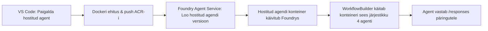
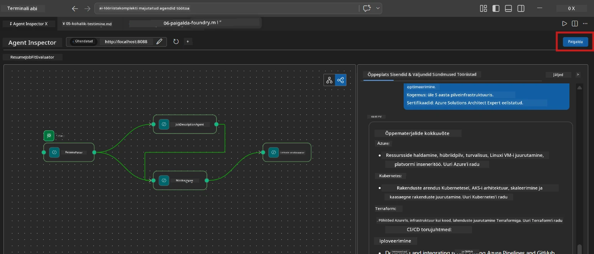

# Moodul 6 - Avaldamine Foundry agentideenusesse

⏱️ ~10 min

Selles moodulis avaldate oma kohapeal testitud mitme agendiga töövoo [Microsoft Foundrysse](https://learn.microsoft.com/azure/foundry/agents/concepts/hosted-agents) kui **hostitud agenti**. Avaldamisprotsess ehitab Docker konteineri kujutise, lükkab selle [Azure Container Registry (ACR)](https://learn.microsoft.com/azure/container-registry/container-registry-intro) ja loob versiooni hostitud agendist [Foundry agentiteenuses](https://learn.microsoft.com/azure/foundry/agents/how-to/publish-agent).

> **Põhiline erinevus Lab 01-st:** Avaldamisprotsess on identne. Foundry käsitleb teie mitmeagendilist töövoogu kui ühte hostitud agenti – keerukus on konteineri sees, kuid avaldamise peapunkt on sama `/responses` lõpp-punkt.

### Avaldamistoru


```mermaid
flowchart LR
    A[VS Code: Paigalda hostitud agent] --> B[Dockeri ehitus & push ACR-i]
    B --> C[Foundry Agent Service: Loo hostitud agendi versioon]
    C --> D[Hostitud agendi konteiner käivitub Foundrys]
    D --> E[WorkflowBuilder käitab konteineri sees järjestikku 4 agenti]
    E --> F[Agent vastab /responses päringutele]
```

---

## Eeltingimuste kontroll

Enne avaldamist kontrollige kõiki allolevaid punkte:

1. **Agent läbib kohapealsed suitsutestid:**
   - Olete sooritanud kõik 3 testi [moodulis 5](05-test-locally.md) ja töövoo väljund sisaldab täielikku infot koos tühikukaartide ja Microsoft Learn URL-idega.

2. **Teil on [Foundry kasutaja](https://learn.microsoft.com/azure/foundry/concepts/rbac-foundry) roll** (avalduseks vajate vähemalt **Foundry projekti halduri** rolli projekti ulatuses):

   > **Märkus:** Foundry RBAC rolle nimetati hiljuti ümber - **Foundry kasutaja**, **Foundry omanik** ja **Foundry projekti haldur** olid varem Azure AI kasutaja, Azure AI omanik ja Azure AI projekti halduri rollid. Rolli ID-d ja õigused on samad.

   - Kontrollige [Azure portaali](https://portal.azure.com) kaudu → oma Foundry **projekti** ressurss → **Juurdepääsu kontroll (IAM)** → **Rolli määrangud** → veenduge, et teie kontol kuvatakse **Foundry kasutaja** (või kõrgem) roll.

3. **Olete sisse logitud Azure i VS Code’is:**
   - Vaadake vasakus allnurgas asuvat Kontode ikooni. Teie kontonimi peaks seal olema nähtav.

4. **`agent.yaml` sisaldab õigeid väärtusi:**
   - Avage `PersonalCareerCopilot/agent.yaml` ja kontrollige:
     ```yaml
     environment_variables:
       - name: AZURE_AI_MODEL_DEPLOYMENT_NAME
         value: ${AZURE_AI_MODEL_DEPLOYMENT_NAME}
     ```
   - `FOUNDRY_PROJECT_ENDPOINT` ei ole siin loetletud - Foundry määrab selle jooksutamisel. Avaldama peab ainult `AZURE_AI_MODEL_DEPLOYMENT_NAME`.

5. **`requirements.txt` sisaldab õigeid versioone:**
   ```
   agent-framework-foundry
   agent-framework-foundry-hosting
   mcp<2,>=1.24.0
   debugpy
   ```

---

## 1. samm: Avaldamise alustamine

### Variant A: Avalda Agent Inspectorist (soovitatav)

Kui agent jookseb F5-ga ja Agent Inspectori aken on avatud:

1. Vaadake Agent Inspector-paneeli **paremas ülanurgas**.
2. Vajutage nuppu **Avalda** (pilveikoon ülesnoolega ↑).
3. Avaneb avaldamisviisard.



### Variant B: Avalda käsukomplektist

1. Vajutage `Ctrl+Shift+P`, et avada **Käsukomplekt**.
2. Tippige: **Foundry Toolkit: Deploy Hosted Agent** ja valige see.
3. Avaneb avaldamisviisard.

---

## 2. samm: Avaldamise seadistamine

### 2.1 Valige sihtprojekt

1. Rippmenüüs on päring teie Foundry projektidest.
2. Valige kogu töötoa jooksul kasutatud projekt (nt `workshop-agents`).

### 2.2 Valige konteineri agentfail

1. Teilt küsitakse agendi stardipunkti.
2. Minge kataloogi `workshop/lab02-multi-agent/PersonalCareerCopilot/` ja valige **`main.py`**.

### 2.3 Seadistage ressursid

| Seadistus | Soovitatav väärtus | Märkused |
|---------|------------------|-------|
| **Avaldamise meetod** | **Konteiner** (soovitatav) või **Kood** | Konteiner ehitab Docker-pildi; Kood laeb lähtekoodi ZIP-failina (eelvaade) üles |
| **Container Registry** | **Vaikimisi ACR** | Foundry loob ja haldab seda teie eest |
| **CPU** | `0.25` | Vaikimisi. Mitmeagendilised töövood ei vaja rohkem CPU-d, sest mudeli kutsed on I/O-lähedased |
| **Mälu** | `0.5Gi` | Vaikimisi. Suurte andmetöötlustööriistade lisamisel suureneda 1Gi-ni |

---

## 3. samm: Kinnitage ja avaldage

1. Viisard kuvab avaldamise kokkuvõtte.
2. Kontrollige ja klõpsake **Kinnita ja avalda**.
3. Jälgige edenemist VS Code’is.

### Mis avaldamise ajal juhtub

Jälgige VS Code **Output** paneeli (valige rippmenüüst "Microsoft Foundry"):

1. **Docker ehitus** - Ehitatakse konteiner teie `Dockerfile´st`
   ```
   Step 1/6 : FROM python:3.12-slim
   Step 2/6 : WORKDIR /app
   ...
   Successfully built abc123def456
   ```

2. **Docker lükkamine** - Lükatakse kujutis ACR-i (esimesel avaldamisel 1–3 minutit).

3. **Agendi registreerimine** - Foundry loob hostitud agendi, kasutades `agent.yaml` metaandmeid. Agendi nimeks on `resume-job-fit-evaluator`.

4. **Konteineri käivitamine** - Konteiner käivitatakse Foundry hallatud infrastruktuuris süsteemihaldatud identiteediga.

> **Esimene avaldamine on aeglasem** (Docker lükkab kõik kihid). Järgmistel avaldamistel taaskasutatakse vahemälustatud kihte ja need on kiirem.

### Mitme agendi spetsiifilised märkused

- **Kõik neli agenti on ühes konteineris.** Foundry näeb seda kui ühte hostitud agenti. WorkflowBuilderi graafik jookseb konteineri sees.
- **MCP kõned lähevad väljapoole.** Konteiner vajab internetiühendust aadressile `https://learn.microsoft.com/api/mcp`. Foundry hallatud infrastruktuur tagab selle vaikimisi.
- **[Hallatud identiteet](https://learn.microsoft.com/azure/foundry/agents/concepts/agent-identity).** Foundry loob automaatselt iga hostitud agendi jaoks spetsiaalse Entra identiteedi avaldamise ajal. Hostitud keskkonnas lahendab `DefaultAzureCredential` selle agendi identiteedi automaatselt – käsitsi hallatud identiteedi seadistust ei ole vaja.

---

## 4. samm: Kontrollige avaldamise olekut

1. Avage **Microsoft Foundry** külgriba (klõpsake Foundry ikooni tegevusribal).
2. Laiendage oma projekti all olevat **Hosted Agents (Preview)**.
3. Leidke **resume-job-fit-evaluator** (või oma agendi nimi).
4. Klõpsake agendi nimele → laiendage versioone (nt `v1`).
5. Klõpsake versioonil → vaadake **Konteineri andmeid** → **Oleku**t:


| Oleku | Tähendus |
|--------|---------|
| **aktiivne** | Agent töötab ja on valmis vastu võtma päringuid |
| **loomisel** | Konteiner käivitub (ootage 30–60 sekundit) |
| **midagi läks valesti** | Konteiner ei alustanud (kontrollige logisid - vt allpool) |

> **Märkus:** VS Code külgribal võib kujutada sildid nagu "Running" või "Started", samal ajal kui API olek on `active`/`creating`. Mõlemad tähistavad sama olekut.

> **Mitme agendi käivitamine võtab kauem aega** kui ühe agendi puhul, sest konteiner loob käivitamisel 4 agenti. `creating` olek kuni 2 minutit on normaalne.

---

## Levinumad avaldamisvead ja parandused

### Viga 1: Luba keelatud - `agents/write`

```
Error: lacks the required data action 
Microsoft.CognitiveServices/accounts/AIServices/agents/write
```

**Parandus:** Määrake **[Foundry kasutaja](https://learn.microsoft.com/azure/foundry/concepts/rbac-foundry)** roll (varem **Azure AI kasutaja**) projekti tasandil. Vaadake [moodulit 8 – tõrkeotsing](08-troubleshooting.md) samm-sammult juhiste saamiseks.

### Viga 2: Docker ei tööta

```
Error: Docker build failed / Cannot connect to Docker daemon
```

**Parandus:**
1. Käivitage Docker Desktop.
2. Oodake kuni kuvatakse “Docker Desktop is running”.
3. Kontrollige: `docker info`
4. **Windows:** Veenduge, et Docker Desktop seadetest on lubatud WSL 2.
5. Proovige uuesti.

### Viga 3: pip install ebaõnnestub Docker ehituse ajal

```
Error: Could not find a version that satisfies the requirement agent-framework-foundry
```

**Parandus:** Kontrollige, et `requirements.txt` vastab:
```
agent-framework-foundry
agent-framework-foundry-hosting
mcp<2,>=1.24.0
debugpy
```

Kui ehitus jätkuvalt ebaõnnestub, võib Docker'i võrk blokeerida PyPI. Kontrollige `docker info` kaudu, kas on seatud proksid.

### Viga 4: MCP tööriist ebaõnnestub hostitud agentis

Kui Gap Analyzer lõpetab Microsoft Learn URL-ide loomise pärast avaldamist:

**Põhjus:** Võrgupoliitika võib blokeerida konteineri väljaminevat HTTPS liiklust.

**Parandus:**
1. Tavaliselt pole see probleem Foundry vaikeseadistustega.
2. Kui see tekib, kontrollige, kas Foundry projekti virtuaalvõrgus on NSG, mis blokeerib väljamineva HTTPS.
3. MCP tööriist kasutab sisseehitatud varu-URL-e, nii et agent toodab ikkagi väljundeid (ilma reaalsete URL-ideta).

---

### Kontrollpunkt

- [ ] Avaldamiskäsk lõppes edukalt VS Code’is
- [ ] Agent on kuvatud **Hosted Agents (Preview)** jaotises Foundry külgribal
- [ ] Agendi nimi on `resume-job-fit-evaluator` (või soovitud nimi)
- [ ] Konteineri olek näitab **Started** või **Running**
- [ ] (Kui esines vigu) Te tuvastasite vea, rakendasite paranduse ja avaldasite uuesti edukalt

---

**Eelmine:** [05 - Kohapealne testimine](05-test-locally.md) · **Järgmine:** [07 - Kontroll Playground’is →](07-verify-in-playground.md)

---

<!-- CO-OP TRANSLATOR DISCLAIMER START -->
**Lahtiütlus**:
See dokument on tõlgitud kasutades AI tõlketeenust [Co-op Translator](https://github.com/Azure/co-op-translator). Kuigi me püüdleme täpsuse poole, palun pange tähele, et automatiseeritud tõlgetes võib esineda vigu või ebatäpsusi. Originaaldokument selle emakeeles tuleks pidada autoriteetseks allikaks. Olulise teabe puhul soovitatakse kasutada professionaalset inimtõlget. Me ei vastuta selle tõlkega seotud eksimustest või valesti mõistmistest.
<!-- CO-OP TRANSLATOR DISCLAIMER END -->