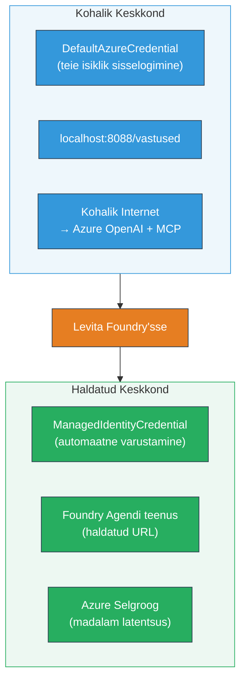

# Moodul 7 - Kontrolli mänguväljakul

Selles moodulis testid oma paigaldatud mitmeagendi töövoogu nii **VS Code’is** kui ka **[Foundry portaali](https://ai.azure.com)** kaudu, kinnitades, et agent käitub täpselt samamoodi nagu lokaalsel testimisel.

---

## Miks kontrollida pärast paigaldust?

Sinu mitmeagendi töövoog töötas kohapeal ideaalselt, miks siis uuesti testida? Hostitud keskkond erineb mitmeti:


| Erinevus | Kohalik | Hostitud |
|-----------|---------|----------|
| **Identiteet** | [`DefaultAzureCredential`](https://learn.microsoft.com/azure/developer/python/sdk/authentication/credential-chains#defaultazurecredential-overview) (sinu isiklik sisselogimine) | [`ManagedIdentityCredential`](https://learn.microsoft.com/python/api/overview/azure/identity-readme#managed-identity-support) (automaatselt hallatud) |
| **Lõpp-punkt** | `http://localhost:8088/responses` | [Foundry Agent Service](https://learn.microsoft.com/azure/foundry/agents/concepts/hosted-agents) lõpp-punkt (hallatud URL) |
| **Võrk** | Kohalik masin → Azure OpenAI + MCP väljaminev | Azure selgroog (madalam latents aeg teenuste vahel) |
| **MCP ühenduvus** | Kohalik internet → `learn.microsoft.com/api/mcp` | Kasti väljaminev → `learn.microsoft.com/api/mcp` |

Kui mõni keskkonnamuutuja on valesti seadistatud, RBAC erineb või MCP väljaminev on blokeeritud, avastad selle siin.

---

## Valik A: Testi VS Code Playgroundis (soovitatav esmalt)

[Foundry laiendus](https://marketplace.visualstudio.com/items?itemName=TeamsDevApp.vscode-ai-foundry) sisaldab integreeritud Playgroundi, mis võimaldab vestelda paigaldatud agendiga ilma VS Code’ist lahkumata.

### Samm 1: Navigeeri oma hostitud agendi juurde

1. Klõpsa VS Code **Activity Bar’il** (vasak külgriba) ikoonil **Microsoft Foundry**, et avada Foundry paneel.
2. Laienda oma ühendatud projekt (nt `workshop-agents`).
3. Laienda **Hosted Agents (Preview)**.
4. Peaksid nägema oma agendi nime (nt `resume-job-fit-evaluator`).

### Samm 2: Vali versioon

1. Klõpsa agendi nimele, et näha versioone.
2. Klõpsa paigaldatud versioonile (nt `v1`).
3. Avaneb **detailpaneel**, mis näitab Container Details.
4. Kinnita, et staatus on **Started** või **Running**.

### Samm 3: Ava Playground

1. Detailpaneelis klõpsa **Playground** nuppu (või tee paremklõps versioonil → **Open in Playground**).
2. Avaneb vestlusliides VS Code vahekaardil.

### Samm 4: Käivita suitsutestid

Kasuta samu 3 testi nagu [Moodulis 5](05-test-locally.md). Sisesta iga sõnum Playgroundi sisendkasti ja vajuta **Send** (või **Enter**).

#### Test 1 - Täielik CV + JD (standardvoog)

Kleebi Moodul 5, Test 1 (Jane Doe + Senior Cloud Engineer Contoso Ltd-s) täielik CV + JD prompt.

**Oodatud:**
- Sobivuskoor koos arvutustega (100-punktiline skaala)
- Sobitatud oskuste sektsioon
- Puuduvate oskuste sektsioon
- **Üks lünga kaart iga puuduva oskuse kohta** koos Microsoft Learn URLidega
- Õppimistee koos ajajooniga

#### Test 2 - Kiire lühitest (minimaalne sisend)

```
RESUME: 3 years Python developer, knows Django and PostgreSQL, no cloud experience.

JOB: Cloud DevOps Engineer requiring AWS, Kubernetes, Terraform, CI/CD. 5 years needed.
```

**Oodatud:**
- Madalam sobivuskoor (< 40)
- Aus hinnang koos etapilise õppeteega
- Mitmed lünga kaardid (AWS, Kubernetes, Terraform, CI/CD, kogemustepuudus)

#### Test 3 - Kõrge sobivusega kandidaat

```
RESUME:
10 years Azure Cloud Architect. AZ-305 certified. Expert in AKS, Terraform, Azure DevOps, 
Azure Functions, Helm, Prometheus, Grafana, Python, Go. Led platform team of 8.

JOB:
Senior Cloud Engineer. Required: AKS, Terraform, Azure DevOps, Python. Preferred: Helm, Go.
5+ years experience. AZ-305 preferred.
```

**Oodatud:**
- Kõrge sobivuskoor (≥ 80)
- Keskendub intervjuuks valmisolekule ja lihvimisele
- Vähe või üldse mitte lünga kaarte
- Lühike ajajoon, mis keskendub ettevalmistusele

### Samm 5: Võrdle kohalike tulemustega

Ava oma märkmed või brauseri vahekaart Moodul 5-st, kus olid salvestatud kohalikud vastused. Iga testi puhul:

- Kas vastusel on **sama struktuur** (sobivuskoor, lünga kaardid, õppekava)?
- Kas kasutatakse **sama hindamissüsteemi** (100-punktiline jaotus)?
- Kas lünga kaartidel on endiselt **Microsoft Learn URL’id**?
- Kas on **üks lünga kaart iga puuduva oskuse kohta** (ei ole kärbitud)?

> **Väikesed sõnastuse erinevused on normaalsed** – mudel on mittedeterministlik. Keskendu struktuurile, hindamisjärjepidevusele ja MCP tööriista kasutamisele.

---

## Valik B: Testi Foundry Portaalis

[Foundry Portaal](https://ai.azure.com) pakub veebipõhist playgroundi, mis sobib meeskonnaliikmetele või huvirühmadele jagamiseks.

### Samm 1: Ava Foundry Portaal

1. Ava brauser ja mine aadressile [https://ai.azure.com](https://ai.azure.com).
2. Logi sisse sama Azure kontoga, mida kasutasid kogu töötoa vältel.

### Samm 2: Navigeeri oma projekti

1. Avalehel otsi vasakult külgribalt **Viimased projektid**.
2. Klõpsa oma projekti nimele (nt `workshop-agents`).
3. Kui näha ei ole, klõpsa **Kõik projektid** ja otsi see üles.

### Samm 3: Leia oma paigaldatud agent

1. Projekti vasakust navigeerimisest vali **Build** → **Agents** (või otsi **Agents** sektsiooni).
2. Näed agendide nimekirja. Leia oma paigaldatud agent (nt `resume-job-fit-evaluator`).
3. Klõpsa agendi nimel, et avada selle detailleht.

### Samm 4: Ava Playground

1. Agendi detaillehe ülemises tööriistaribas klõpsa **Open in playground** (või **Try in playground**).
2. Avaneb vestlusliides.

### Samm 5: Käivita samad suitsutestid

Korda kõiki 3 testi nagu VS Code Playgroundi jaotises üleval. Võrdle iga vastust nii kohalike tulemustega (Moodul 5) kui ka VS Code Playgroundi tulemustega (Valik A ülal).

---

## Mitmeagendi spetsiifiline kontroll

Lisaks põhikorrektsele käitumisele kontrolli allpool kirjeldatud mitmeagendi spetsiifilisi omadusi:

### MCP tööriista täitmine

| Kontroll | Kuidas kontrollida | Läbitud tingimus |
|----------|--------------------|------------------|
| MCP kõned õnnestuvad | Lünga kaartidel on `learn.microsoft.com` URL’id | Tegelikud URL’id, mitte varuplaanisõnumid |
| Mitmed MCP kõned | Igal kõrge/keskmise prioriteediga lüngal on ressursid | Mitte ainult esimese lünga kaart |
| MCP varuplaan töötab | Kui URL’e ei ole, otsi varuplaani teksti | Agent toodab ikkagi lünga kaarte (URL-idega või ilma) |

### Agendi koordineerimine

| Kontroll | Kuidas kontrollida | Läbitud tingimus |
|----------|--------------------|------------------|
| Kõik 4 agenti töötasid | Väljund sisaldab sobivuskoori JA lünga kaarte | Skoor tuleb MatchingAgent’ilt, kaardid GapAnalyzer’ilt |
| Paralleelne hajutamine | Vastuse aeg on mõistlik (< 2 min) | Kui > 3 min, võib paralleeltöö mitte toimida |
| Andmevoo terviklikkus | Lünga kaartidel viited sobivusaruande oskustele | Puuduvad väljamõeldud oskused, mida JD ei sisaldanud |

---

## Kinnitusrubriik

Kasuta seda rubriiki, et hinnata oma mitmeagendi töövoo hostitud käitumist:

| # | Kriteerium | Läbitud tingimus | Läbitud? |
|---|------------|------------------|----------|
| 1 | **Funktsionaalne korrektsus** | Agent vastab CV+JD sobivuskoori ja lüngaanalüüsiga | |
| 2 | **Hindamise järjepidevus** | Sobivuskoor kasutab 100-punktilist skaalat koos arvutustega | |
| 3 | **Lünga kaartide täielikkus** | Üks kaart iga puuduva oskuse kohta (ei ole kärbitud ega kombineeritud) | |
| 4 | **MCP tööriista integreeritus** | Lünga kaartidel on õiged Microsoft Learn URL’id | |
| 5 | **Struktuurne järjepidevus** | Väljundi struktuur vastab kohalikule ja hostitud jooksule | |
| 6 | **Vastuse aeg** | Hostitud agent vastab täieliku hindamise puhul 2 minuti jooksul | |
| 7 | **Vigu ei esine** | Ei HTTP 500 vigu, aegumisi ega tühje vastuseid | |

> "Läbitud" tähendab, et kõik 7 kriteeriumi on täidetud kõigi 3 suitsutesti puhul vähemalt ühes playgroundis (VS Code või Portaal).

---

## Mänguväljakus esinevate probleemide lahendamine

| Sümptom | Võimalik põhjus | Lahendus |
|---------|-----------------|----------|
| Playground ei lae | Kasti staatus ei ole "Started" | Mine tagasi [Moodulisse 6](06-deploy-to-foundry.md), kontrolli paigalduse staatust. Oota, kui "Pending" |
| Agent tagastab tühja vastuse | Mudeli käivituse nime vaste puudub | Kontrolli `agent.yaml` → `environment_variables` → `MODEL_DEPLOYMENT_NAME` vastavust sinu paigaldatud mudelile |
| Agent tagastab veateate | Puudub [RBAC](https://learn.microsoft.com/azure/foundry/concepts/rbac-foundry) õigus | Määra **[Azure AI User](https://aka.ms/foundry-ext-project-role)** roll projekti tasandil |
| Lünga kaartidel puuduvad Microsoft Learn URL’id | MCP väljaminev blokeeritud või MCP server kättesaamatu | Kontrolli, kas konteiner pääseb `learn.microsoft.com` veebile. Vaata [Moodul 8](08-troubleshooting.md) |
| Ainult 1 lünga kaart (kärbitud) | GapAnalyzer juhised ei sisalda "CRITICAL" plokki | Vaata üle [Moodul 3, samm 2.4](03-configure-agents.md) |
| Sobivuskoor erineb suuresti kohalikust | Erinev mudel või juhised paigaldatud | Võrdle `agent.yaml` keskkonnamuutujaid kohaliku `.env`-iga. Paigalda uuesti vajadusel |
| "Agent not found" Portaalis | Paigaldus on veel levimas või ebaõnnestunud | Oota 2 minutit, värskenda. Kui ikka puudu, paigalda uuesti [Moodul 6](06-deploy-to-foundry.md) kaudu |

---

### Kontrollpunkt

- [ ] Testitud agent VS Code Playgroundis – kõik 3 suitsutesti läbitud
- [ ] Testitud agent [Foundry Portaalis](https://ai.azure.com) Playgroundis – kõik 3 suitsutesti läbitud
- [ ] Vastused on struktureeritult kooskõlas kohaliku testimisega (sobivuskoor, lünga kaardid, õppekava)
- [ ] Microsoft Learn URL’id on lünga kaartidel olemas (MCP tööriist töötab hostitud keskkonnas)
- [ ] Üks lünga kaart iga puuduva oskuse kohta (ei ole kärbitud)
- [ ] Testimise ajal ei esinenud vigu ega aegumisi
- [ ] Täidetud kinnitusrubriik (kõik 7 kriteeriumit läbitud)

---

**Eelmine:** [06 - Paigalda Foundry’sse](06-deploy-to-foundry.md) · **Järgmine:** [08 - Veaotsing →](08-troubleshooting.md)

---

<!-- CO-OP TRANSLATOR DISCLAIMER START -->
**Vastutusest loobumine**:  
See dokument on tõlgitud tehisintellekti tõlketeenuse [Co-op Translator](https://github.com/Azure/co-op-translator) abil. Kuigi me püüdleme täpsuse poole, palun arvestage, et automaatsed tõlked võivad sisaldada vigu või ebatäpsusi. Originaaldokument selle algkeeles tuleks pidada autoriteetseks allikaks. Olulise teabe puhul soovitatakse kasutada professionaalse inimtõlgi teenust. Me ei vastuta selle tõlke kasutamisest tulenevate arusaamatuste ega valesti mõistmiste eest.
<!-- CO-OP TRANSLATOR DISCLAIMER END -->