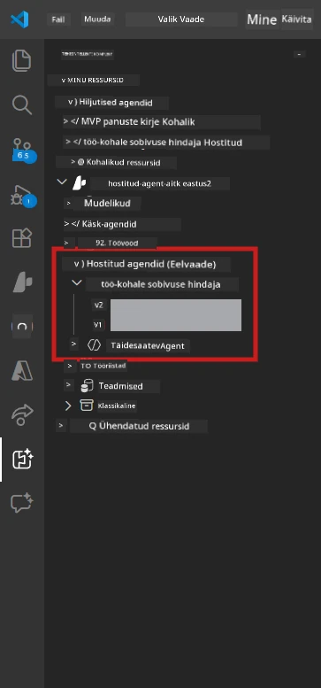

# Moodul 7 - Kontrollimine mänguväljal

⏱️ ~10 minutit

Selles moodulis testite oma juurutatud mitmeagendi töövoogu VS Code'is ja Foundry portaalis, kinnitades, et agent käitub samamoodi kui kohalikus testimises.

---

## Miks testida uuesti pärast juurutamist?

Majutatud keskkond erineb kohalikust mõnes olulises aspektis:

| | Kohalik | Majutatud |
|--|-------|--------|
| **Identiteet** | Teie isiklik sisselogimine (`DefaultAzureCredential`) | Põhine agentide-põhine Entra identiteet (juurutamisel automaatselt loodud) |
| **Lõpp-punkt** | `http://localhost:8088/responses` | Foundry agentide teenuse hallatav URL |
| **Võrk** | Teie arvuti → Azure OpenAI + MCP | Azure selgroog (madalam latentsus) |

Valesti konfigureeritud keskkonnamuutuja, RBAC probleem või blokeeritud MCP väljaminev kõne ilmneb siin esimesena.

---

## Valik A: Testi VS Code Playgroundis (soovitatav esmalt)

### Samm 1: Mine oma majutatud agendi juurde

1. Klõpsa tegevusribal **Foundry Toolkit** ikooni.
2. Ava oma projekt → **Majutatud agendid (eelvaade)** → leia oma agent.



### Samm 2: Vali versioon

1. Klõpsa agendil, et näha selle versioone.
2. Klõpsa `v1` → kontrolli, et olek on **aktiivne** (külgribal võib näha "Running" või "Started" – mõlemad näitavad sama valmisoleku olekut).

### Samm 3: Ava Playground

1. Klõpsa **Playground** (või parema hiireklõpsuga versioonil → **Ava playgroundis**).
2. Avaneb vestlusaken VS Code vahekaardil.

### Samm 4: Käivita oma sissõõmutestid

Kasuta samu 3 testi nagu [Moodulis 5](05-test-locally.md). Sisesta iga sõnum Playgroundi sisendkasti ja vajuta **Saada** (või **Enter**).

#### Test 1 - Täielik CV + töö kirjeldus (standardvoog)

Kleebi Moodul 5, Test 1 täielik CV + töö kirjeldus prompt (Jane Doe + Senior Cloud Engineer aadressil Contoso Ltd).

**Oodatud:**
- Sobivuspunktid koos jaotusega (100-punktilisel skaalal)
- Sobitatud oskuste sektsioon
- Puuduvate oskuste sektsioon
- **Iga puuduva oskuse kohta üks puudujääk-kaart** Microsoft Learn URLidega
- Õppeteek koos ajajoonega

#### Test 2 - Kiire lühike test (minimaalne sisend)

```
RESUME: 3 years Python developer, knows Django and PostgreSQL, no cloud experience.

JOB: Cloud DevOps Engineer requiring AWS, Kubernetes, Terraform, CI/CD. 5 years needed.
```

**Oodatud:**
- Madalam sobivuspunkt (< 40)
- Aus hinnang koos samm-sammult õppeteekonnaga
- Mitmed puudujääk-kaardid (AWS, Kubernetes, Terraform, CI/CD, kogemuse puudujääk)

#### Test 3 - Väga sobiv kandidaat

```
RESUME:
10 years Azure Cloud Architect. AZ-305 certified. Expert in AKS, Terraform, Azure DevOps, 
Azure Functions, Helm, Prometheus, Grafana, Python, Go. Led platform team of 8.

JOB:
Senior Cloud Engineer. Required: AKS, Terraform, Azure DevOps, Python. Preferred: Helm, Go.
5+ years experience. AZ-305 preferred.
```

**Oodatud:**
- Kõrge sobivuspunkt (≥ 80)
- Fookus intervjuuks ettevalmistusel ja lihvimisel
- Vähe või puuduvad puudujääk-kaardid
- Lühike ettevalmistusajajoon

### Samm 5: Võrdle kohalike tulemustega

Ava oma märkmed või brauseri vahekaart Moodul 5-st, kuhu salvestasid kohalikud vastused. Iga testi puhul:

- Kas vastusel on **sama struktuur** (sobivuspunkt, puudujääk-kaardid, teekond)?
- Kas kasutatakse **sama hindamisskeemi** (100-punktiline jaotus)?
- Kas puudujääk-kaartidel on endiselt **Microsoft Learn URLid** olemas?
- Kas on **üks puudujääk-kaart iga puuduva oskuse kohta** (pole kärbitud)?

> **Väikesed sõnastuse erinevused on normaalsed** – mudel pole deterministlik. Keskendu struktuurile, hindamise järjepidevusele ja MCP tööriista kasutamisele.

---

## Valik B: Testi Foundry Portaalis

[Foundry Portaal](https://ai.azure.com) pakub veebipõhist mänguvälja, mis sobib hästi meeskonnaliikmetele või huvigruppidele jagamiseks.

### Samm 1: Ava Foundry Portaal

1. Ava oma brauser ja mine aadressile [https://ai.azure.com](https://ai.azure.com).
2. Logi sisse sama Azure kontoga, mida oled kogu töötoa vältel kasutanud.

### Samm 2: Navigeeri oma projekti juurde

1. Avalehel otsi vasakult külgribalt **Hiljutised projektid**.
2. Klõpsa oma projekti nimele (nt `workshop-agents`).
3. Kui seda ei näe, klõpsa **Kõik projektid** ja otsi.

### Samm 3: Leia oma juurutatud agent

1. Projekti vasaku navigatsiooni alt klõpsa **Ehita** → **Agendid** (või otsi sektsioonist **Agendid**).
2. Näed ahelat agentidest. Leia oma juurutatud agent (nt `resume-job-fit-evaluator`).
3. Klõpsa agendi nimele, et avada detailvaade.

### Samm 4: Ava Playground

1. Agendi detailvaates vaata ülemist tööriistariba.
2. Klõpsa **Ava mänguväljal** (või **Proovi mänguväljal**).
3. Avaneb vestluse liides.

### Samm 5: Käivita samad sissõõmutestid

Korda kõiki 3 testi, mis on kirjeldatud VS Code Playground sektsioonis ülespoole. Võrdle iga vastust nii kohalikus (Moodul 5) kui VS Code Playground (Valik A) tulemustega.

---

## Mitmeagendi spetsiifiline kontrollimine

Lisaks põhikorrektsele toimimisele kontrolli järgmisi mitmeagendi spetsiifilisi käitumisi:

### MCP tööriista kasutamine

| Kontroll | Kuidas kontrollida | Läbitungimise tingimus |
|-------|---------------|----------------|
| MCP päringud õnnestuvad | Puudujääk-kaardid sisaldavad `learn.microsoft.com` URL-e | Tõelised URLid, mitte varuplaanisõnumid |
| Mitmed MCP päringud | Igal Suur/Keskmise prioriteediga puudujääk-kaardil on ressursid | Mitte ainult esimesel puudujääk-kaardil |
| MCP varutekst töötab | Kui URLid puuduvad, kontrolli varuteksti olemasolu | Agent toodab ikkagi puudujääk-kaarte (kas URLidega või ilma) |

### Agentide koordineerimine

| Kontroll | Kuidas kontrollida | Läbitungimise tingimus |
|-------|---------------|----------------|
| Kõik 4 agenti töötasid | Väljund sisaldab sobivuspunkti JA puudujääk-kaarte | Punkti annab MatchingAgent, kaardid GapAnalyzer |
| Järjestikune täitmine | Vastuse aeg on mõistlik (< 2 min) | Kui > 3 min, kontrolli terminalilogi vigade suhtes |
| Andmete järjepidevus | Puudujääk-kaardid viitavad oskustele sobitusaruandes | Ei tohi olla hallutsineeritud oskusi, mida pole töökuulutuses |

---

## Kontrollimise hindamisskeem

Kasuta seda skeemi, et hinnata oma mitmeagendi töövoo majutatud käitumist:

| # | Kriteerium | Läbitungimise tingimus | Läbitud? |
|---|----------|---------------|-------|
| 1 | **Funktsionaalne korrektsus** | Agent vastab CV + töökuulutusele sobivuspunkti ja puudujääkide analüüsiga | |
| 2 | **Hindamise järjepidevus** | Sobivuspunkt arvutatakse 100-punktilisel skaalal jaotusega | |
| 3 | **Puudujääk-kaartide täielikkus** | Üks kaart iga puuduva oskuse kohta (pole kärbitud ega kombineeritud) | |
| 4 | **MCP tööriista integratsioon** | Puudujääk-kaardid sisaldavad reaalseid Microsoft Learn URL-e | |
| 5 | **Struktuuri järjepidevus** | Väljundi struktuur on kohapeal ja majutatud töö jooksutuse vahel ühtlane | |
| 6 | **Vastuse aeg** | Majutatud agent vastab täisanalüüsile 2 minuti jooksul | |
| 7 | **Vigu pole** | Puuduvad HTTP 500 vead, ajapiirangud või tühjad vastused | |

> "Läbitungimine" tähendab, et kõik 7 kriteeriumi on täidetud kõigi 3 sissõõmutesti puhul vähemalt ühes mänguväljas (VS Code või Portaal).

---

## Mänguväljaga seotud probleemide lahendamine

| Süntoom | Võimalik põhjus | Lahendus |
|---------|-------------|-----|
| Playground ei laadi | Konteiner pole `aktiivses` olekus | Minge tagasi [Moodul 6](06-deploy-to-foundry.md), kontrollige juurutuse olekut. Oodake, kui olek on `loomas` |
| Agent tagastab tühja vastuse | Mudeli juurutusnimi ei klapi | Kontrollige `agent.yaml` → `environment_variables` → `AZURE_AI_MODEL_DEPLOYMENT_NAME` vastavust juurutatud mudeliga |
| Agent tagastab veateate | Puudub [RBAC](https://learn.microsoft.com/azure/foundry/concepts/rbac-foundry) luba | Määrake **[Foundry kasutaja](https://aka.ms/foundry-ext-project-role)** (varem Azure AI kasutaja) projekti ulatuses |
| Puuduvad Microsoft Learn URLid puudujääk-kaartides | MCP väljaminev käsk on blokeeritud või MCP server ei ole saadaval | Kontrollige, kas konteiner pääseb `learn.microsoft.com`-ile ligi. Vt [Moodul 8](08-troubleshooting.md) |
| Ainult 1 puudujääk-kaart (kärbitud) | GapAnalyzer käsustik puudub "KRIITILINE" plokk | Vaadake üle [Moodul 3, samm 2.4](03-configure-agents.md) |
| Sobivuspunkt on kohalikust väga erinev | Juurutatud on erinev mudel või käsud | Võrrelge `agent.yaml` keskkonnamuutujaid kohalikus `.env` failis. Vajadusel juurutage uuesti |
| "Agenti ei leitud" portaalis | Juurutus alles levib või ebaõnnestus | Oodake 2 minutit, värskendage. Kui agent on endiselt puudu, juurutage uuesti [Moodulist 6](06-deploy-to-foundry.md) |

---

### Kontrollpunkt

- [ ] Testitud agent VS Code Playgroundis – kõik 3 sissõõmutesti läbitud
- [ ] Testitud agent [Foundry Portaalis](https://ai.azure.com) Playgroundis – kõik 3 sissõõmutesti läbitud
- [ ] Vastused on struktuurilt kooskõlas kohalike testidega (sobivuspunkt, puudujääk-kaardid, teekond)
- [ ] Puudujääk-kaartidel on Microsoft Learn URLid (MCP tööriist töötab majutatud keskkonnas)
- [ ] Üks puudujääk-kaart iga puuduva oskuse kohta (pole kärbitud)
- [ ] Testimise ajal ei esinenud vigu ega ajapiiranguid
- [ ] Täidetud kontrollimise hindamisskeem (kõik 7 kriteeriumi läbitud)

---

**Eelmine:** [06 - Deploy to Foundry](06-deploy-to-foundry.md) · **Järgmine:** [08 - Probleemide lahendamine →](08-troubleshooting.md)

---

<!-- CO-OP TRANSLATOR DISCLAIMER START -->
**Lahtiütlus**:
See dokument on tõlgitud kasutades AI tõlketeenust [Co-op Translator](https://github.com/Azure/co-op-translator). Kuigi me püüdleme täpsuse poole, palun pange tähele, et automatiseeritud tõlgetes võib esineda vigu või ebatäpsusi. Originaaldokument selle emakeeles tuleks pidada autoriteetseks allikaks. Olulise teabe puhul soovitatakse kasutada professionaalset inimtõlget. Me ei vastuta selle tõlkega seotud eksimustest või valesti mõistmistest.
<!-- CO-OP TRANSLATOR DISCLAIMER END -->