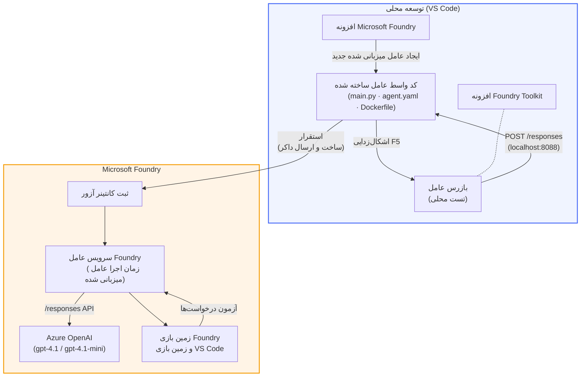

# کارگاه Foundry Toolkit + Foundry Hosted Agents

[](https://www.python.org/)
[](https://github.com/microsoft/agents)
[](https://learn.microsoft.com/azure/ai-foundry/agents/concepts/hosted-agents/)
[](https://ai.azure.com/)
[](https://learn.microsoft.com/azure/ai-services/openai/)
[](https://learn.microsoft.com/cli/azure/install-azure-cli)
[](https://learn.microsoft.com/azure/developer/azure-developer-cli/install-azd)
[](https://www.docker.com/)
[](https://marketplace.visualstudio.com/items?itemName=ms-windows-ai-studio.windows-ai-studio)
[](LICENSE)

عامل‌های هوش مصنوعی را بسازید، تست کنید و به **خدمات عامل Microsoft Foundry** به عنوان **عامل‌های میزبانی شده** مستقر کنید - کاملاً از VS Code با استفاده از **افزونه Microsoft Foundry** و **Foundry Toolkit**.

> **عامل‌های میزبانی شده در حال حاضر در پیش‌نمایش هستند.** مناطق پشتیبانی شده محدود است - [دسترسی منطقه‌ای](https://learn.microsoft.com/azure/foundry/agents/concepts/hosted-agents#region-availability) را ببینید.

> پوشه `agent/` در هر آزمایشگاه توسط افزونه Foundry **به‌طور خودکار ساخته می‌شود** - سپس شما کد را سفارشی می‌کنید، به‌صورت محلی تست می‌کنید و مستقر می‌کنید.

### 🌐 پشتیبانی چندزبانه

#### پشتیبانی شده از طریق GitHub Action (خودکار و همیشه به‌روز)

<!-- CO-OP TRANSLATOR LANGUAGES TABLE START -->
[Arabic](../ar/README.md) | [Bengali](../bn/README.md) | [Bulgarian](../bg/README.md) | [Burmese (Myanmar)](../my/README.md) | [Chinese (Simplified)](../zh-CN/README.md) | [Chinese (Traditional, Hong Kong)](../zh-HK/README.md) | [Chinese (Traditional, Macau)](../zh-MO/README.md) | [Chinese (Traditional, Taiwan)](../zh-TW/README.md) | [Croatian](../hr/README.md) | [Czech](../cs/README.md) | [Danish](../da/README.md) | [Dutch](../nl/README.md) | [Estonian](../et/README.md) | [Finnish](../fi/README.md) | [French](../fr/README.md) | [German](../de/README.md) | [Greek](../el/README.md) | [Hebrew](../he/README.md) | [Hindi](../hi/README.md) | [Hungarian](../hu/README.md) | [Indonesian](../id/README.md) | [Italian](../it/README.md) | [Japanese](../ja/README.md) | [Kannada](../kn/README.md) | [Khmer](../km/README.md) | [Korean](../ko/README.md) | [Lithuanian](../lt/README.md) | [Malay](../ms/README.md) | [Malayalam](../ml/README.md) | [Marathi](../mr/README.md) | [Nepali](../ne/README.md) | [Nigerian Pidgin](../pcm/README.md) | [Norwegian](../no/README.md) | [Persian (Farsi)](./README.md) | [Polish](../pl/README.md) | [Portuguese (Brazil)](../pt-BR/README.md) | [Portuguese (Portugal)](../pt-PT/README.md) | [Punjabi (Gurmukhi)](../pa/README.md) | [Romanian](../ro/README.md) | [Russian](../ru/README.md) | [Serbian (Cyrillic)](../sr/README.md) | [Slovak](../sk/README.md) | [Slovenian](../sl/README.md) | [Spanish](../es/README.md) | [Swahili](../sw/README.md) | [Swedish](../sv/README.md) | [Tagalog (Filipino)](../tl/README.md) | [Tamil](../ta/README.md) | [Telugu](../te/README.md) | [Thai](../th/README.md) | [Turkish](../tr/README.md) | [Ukrainian](../uk/README.md) | [Urdu](../ur/README.md) | [Vietnamese](../vi/README.md)

> **ترجیح می‌دهید به‌صورت محلی کلون کنید؟**
>
> این مخزن شامل ترجمه‌های بیش از ۵۰ زبان است که باعث افزایش قابل توجه حجم دانلود می‌شود. برای کلون کردن بدون ترجمه‌ها، از sparse checkout استفاده کنید:
>
> **Bash / macOS / Linux:**
> ```bash
> git clone --filter=blob:none --sparse https://github.com/microsoft-foundry/Foundry_Toolkit_for_VSCode_Lab.git
> cd Foundry_Toolkit_for_VSCode_Lab
> git sparse-checkout set --no-cone '/*' '!translations' '!translated_images'
> ```
>
> **CMD (ویندوز):**
> ```cmd
> git clone --filter=blob:none --sparse https://github.com/microsoft-foundry/Foundry_Toolkit_for_VSCode_Lab.git
> cd Foundry_Toolkit_for_VSCode_Lab
> git sparse-checkout set --no-cone "/*" "!translations" "!translated_images"
> ```
>
> این همه چیز لازم برای تکمیل دوره را با دانلود بسیار سریع‌تر به شما می‌دهد.
<!-- CO-OP TRANSLATOR LANGUAGES TABLE END -->

---

## معماری


**روند:** افزونه Foundry عامل را اسکلِتون می‌کند → شما کد و دستورالعمل‌ها را سفارشی می‌کنید → با Agent Inspector به‌صورت محلی تست می‌کنید → به Foundry مستقر می‌کنید (تصویر Docker به ACR ارسال می‌شود) → در Playground صحت‌سنجی می‌شود.

---

## چیزی که خواهید ساخت

| آزمایشگاه | توضیحات | وضعیت |
|-----|-------------|--------|
| **آزمایشگاه ۰۱ - عامل تک** | ساخت **عامل "توضیح مانند یک مدیر اجرایی"**، تست محلی و استقرار به Foundry | ✅ موجود |
| **آزمایشگاه ۰۲ - جریان چند عاملی** | ساخت **"رزومه → ارزیاب تناسب شغلی"** - همکاری ۴ عامل برای امتیازدهی تناسب رزومه و تولید نقشه راه یادگیری | ✅ موجود |

---

## آشنایی با عامل اجرایی

در این کارگاه شما **عامل "توضیح مانند یک مدیر اجرایی"** را می‌سازید - عاملی که اصطلاحات فنی پیچیده را می‌گیرد و به خلاصه‌هایی آرام و آماده جلسه هیئت مدیره تبدیل می‌کند. چون بیایید صادق باشیم، هیچ‌کس در سطوح ارشد نمی‌خواهد درباره "کمبود thread pool ناشی از تماس‌های همزمان معرفی شده در v3.2." بشنود.

این عامل را بعد از چندین بار که گزارش کامل من با پاسخ مواجه شد: *"خب... آیا وب‌سایت پایین است یا نه؟"* ساختم.

### چگونه کار می‌کند

شما یک به‌روزرسانی فنی را وارد می‌کنید. او یک خلاصه اجرایی - سه نکته مهم، بدون اصطلاحات تخصصی، بدون لاگ خطا، بدون نگرانی شدید - بازمی‌گرداند. فقط **چه اتفاقی افتاده**، **تأثیر کسب‌وکار** و **گام بعدی**.

### ببینید که چطور عمل می‌کند

**شما می‌گویید:**
> "تاخیر API به دلیل کمبود thread pool ناشی از تماس‌های همزمان معرفی شده در v3.2 افزایش یافته است."

**عامل پاسخ می‌دهد:**

> **خلاصه اجرایی:**
> - **چه اتفاقی افتاد:** پس از آخرین به‌روزرسانی، سیستم کند شد.
> - **تأثیر کسب‌وکار:** برخی کاربران هنگام استفاده از سرویس با تأخیر مواجه شدند.
> - **گام بعدی:** تغییرات بازگردانده شده است و یک رفع مشکل قبل از استقرار مجدد در حال آماده‌سازی است.

### چرا این عامل؟

این یک عامل ساده و تک منظوره است - ایده‌آل برای یادگیری جریان کار عامل میزبانی شده از ابتدا تا انتها بدون پیچیدگی ابزارهای مختلف. و صادقانه؟ هر تیم مهندسی به یکی از این‌ها نیاز دارد.

---

## ساختار کارگاه

```
📂 Foundry_Toolkit_for_VSCode_Lab/
├── 📄 README.md                      ← You are here
├── 📂 ExecutiveAgent/                ← Standalone hosted agent project
│   ├── agent.yaml
│   ├── Dockerfile
│   ├── main.py
│   └── requirements.txt
└── 📂 workshop/
    ├── 📂 lab01-single-agent/        ← Full lab: docs + agent code
    │   ├── README.md                 ← Hands-on lab instructions
    │   ├── 📂 docs/                  ← Step-by-step tutorial modules
    │   │   ├── 00-prerequisites.md
    │   │   ├── 01-install-foundry-toolkit.md
    │   │   ├── 02-create-foundry-project.md
    │   │   ├── 03-create-hosted-agent.md
    │   │   ├── 04-configure-and-code.md
    │   │   ├── 05-test-locally.md
    │   │   ├── 06-deploy-to-foundry.md
    │   │   ├── 07-verify-in-playground.md
    │   │   └── 08-troubleshooting.md
    │   └── 📂 agent/                 ← Reference solution (auto-scaffolded by Foundry extension)
    │       ├── agent.yaml
    │       ├── Dockerfile
    │       ├── main.py
    │       └── requirements.txt
    └── 📂 lab02-multi-agent/         ← Resume → Job Fit Evaluator
        ├── README.md                 ← Hands-on lab instructions (end-to-end)
        ├── 📂 docs/                  ← Step-by-step tutorial modules
        │   ├── 00-prerequisites.md
        │   ├── 01-understand-multi-agent.md
        │   ├── 02-scaffold-multi-agent.md
        │   ├── 03-configure-agents.md
        │   ├── 04-orchestration-patterns.md
        │   ├── 05-test-locally.md
        │   ├── 06-deploy-to-foundry.md
        │   ├── 07-verify-in-playground.md
        │   └── 08-troubleshooting.md
        └── 📂 PersonalCareerCopilot/ ← Reference solution (multi-agent workflow)
            ├── agent.yaml
            ├── Dockerfile
            ├── main.py
            └── requirements.txt
```

> **توجه:** پوشه `agent/` در هر آزمایشگاه همان چیزی است که **افزونه Microsoft Foundry** هنگام اجرای دستور `Microsoft Foundry: Create a New Hosted Agent` از Command Palette ایجاد می‌کند. فایل‌ها سپس با دستورالعمل‌ها، ابزارها و پیکربندی عامل شما سفارشی می‌شوند. آزمایشگاه ۰۱ به شما گام‌به‌گام نحوه ایجاد این پوشه از صفر را آموزش می‌دهد.

---

## شروع کار

### ۱. مخزن را کلون کنید

```bash
git clone https://github.com/microsoft-foundry/Foundry_Toolkit_for_VSCode_Lab.git
cd Foundry_Toolkit_for_VSCode_Lab
```

### ۲. محیط مجازی پایتون را راه‌اندازی کنید

```bash
python -m venv venv
```

آن را فعال کنید:

- **ویندوز (PowerShell):**
  ```powershell
  .\venv\Scripts\Activate.ps1
  ```
- **macOS / لینوکس:**
  ```bash
  source venv/bin/activate
  ```

### ۳. وابستگی‌ها را نصب کنید

```bash
pip install -r workshop/lab01-single-agent/agent/requirements.txt
```

### ۴. متغیرهای محیطی را پیکربندی کنید

فایل نمونه `.env` داخل پوشه agent را کپی کرده و مقادیر خود را وارد کنید:

```bash
cp workshop/lab01-single-agent/agent/.env.example workshop/lab01-single-agent/agent/.env
```

فایل `workshop/lab01-single-agent/agent/.env` را ویرایش کنید:

```env
AZURE_AI_PROJECT_ENDPOINT=https://<your-account>.services.ai.azure.com/api/projects/<your-project>
MODEL_DEPLOYMENT_NAME=<your-model-deployment-name>
```

### ۵. آزمایشگاه‌های کارگاه را دنبال کنید

هر آزمایشگاه به صورت مستقل با ماژول‌های خود است. با **آزمایشگاه ۰۱** شروع کنید تا اصول اولیه را یاد بگیرید، سپس به **آزمایشگاه ۰۲** برای جریان‌های کاری چند عاملی بروید.

#### آزمایشگاه ۰۱ - عامل تک ([دستورالعمل کامل](workshop/lab01-single-agent/README.md))

| # | ماژول | لینک |
|---|--------|------|
| 1 | خواندن پیش‌نیازها | [00-prerequisites.md](workshop/lab01-single-agent/docs/00-prerequisites.md) |
| 2 | نصب Foundry Toolkit و افزونه Foundry | [01-install-foundry-toolkit.md](workshop/lab01-single-agent/docs/01-install-foundry-toolkit.md) |
| 3 | ایجاد پروژه Foundry | [02-create-foundry-project.md](workshop/lab01-single-agent/docs/02-create-foundry-project.md) |
| 4 | ساختن عامل میزبانی شده | [03-create-hosted-agent.md](workshop/lab01-single-agent/docs/03-create-hosted-agent.md) |
| 5 | پیکربندی دستورالعمل‌ها و محیط | [04-configure-and-code.md](workshop/lab01-single-agent/docs/04-configure-and-code.md) |
| 6 | تست به‌صورت محلی | [05-test-locally.md](workshop/lab01-single-agent/docs/05-test-locally.md) |
| 7 | استقرار به Foundry | [06-deploy-to-foundry.md](workshop/lab01-single-agent/docs/06-deploy-to-foundry.md) |
| 8 | تأیید در playground | [07-verify-in-playground.md](workshop/lab01-single-agent/docs/07-verify-in-playground.md) |
| 9 | عیب‌یابی | [08-troubleshooting.md](workshop/lab01-single-agent/docs/08-troubleshooting.md) |

#### آزمایشگاه ۰۲ - جریان چند عاملی ([دستورالعمل کامل](workshop/lab02-multi-agent/README.md))

| # | ماژول | لینک |
|---|--------|------|
| 1 | پیش‌نیازها (آزمایشگاه ۰۲) | [00-prerequisites.md](workshop/lab02-multi-agent/docs/00-prerequisites.md) |
| 2 | درک معماری چند عاملی | [01-understand-multi-agent.md](workshop/lab02-multi-agent/docs/01-understand-multi-agent.md) |
| 3 | اسکلت‌بندی پروژه چند عاملی | [02-scaffold-multi-agent.md](workshop/lab02-multi-agent/docs/02-scaffold-multi-agent.md) |
| 4 | پیکربندی عامل‌ها و محیط | [03-configure-agents.md](workshop/lab02-multi-agent/docs/03-configure-agents.md) |
| 5 | الگوهای هماهنگی | [04-orchestration-patterns.md](workshop/lab02-multi-agent/docs/04-orchestration-patterns.md) |
| 6 | تست به‌صورت محلی (چند عاملی) | [05-test-locally.md](workshop/lab02-multi-agent/docs/05-test-locally.md) |
| 7 | استقرار در Foundry | [06-deploy-to-foundry.md](workshop/lab02-multi-agent/docs/06-deploy-to-foundry.md) |
| 8 | اعتبارسنجی در playground | [07-verify-in-playground.md](workshop/lab02-multi-agent/docs/07-verify-in-playground.md) |
| 9 | رفع اشکال (چندعاملی) | [08-troubleshooting.md](workshop/lab02-multi-agent/docs/08-troubleshooting.md) |

---

## نگهدارنده

<table>
<tr>
    <td align="center"><a href="https://github.com/ShivamGoyal03">
        <br />
        <sub><b>شیوام گویال</b></sub>
    </a><br />
    </td>
</tr>
</table>

---

## مجوزهای مورد نیاز (مرجع سریع)

| سناریو | نقش‌های مورد نیاز |
|----------|---------------|
| ایجاد پروژه جدید Foundry | **مالک Azure AI** روی منبع Foundry |
| استقرار در پروژه موجود (منابع جدید) | **مالک Azure AI** + **همکار** روی اشتراک |
| استقرار در پروژه کاملاً پیکربندی‌شده | **خواننده** روی حساب + **کاربر Azure AI** روی پروژه |

> **مهم:** نقش‌های Azure `مالک` و `همکار` تنها شامل مجوزهای *مدیریتی* هستند، نه مجوزهای *توسعه* (عملیات داده). برای ساخت و استقرار عوامل به **کاربر Azure AI** یا **مالک Azure AI** نیاز دارید.

---

## مراجع

- [شروع سریع: استقرار اولین عامل میزبانی شده‌تان (VS Code)](https://learn.microsoft.com/azure/foundry/agents/quickstarts/quickstart-hosted-agent)
- [عوامل میزبانی شده چیستند؟](https://learn.microsoft.com/azure/foundry/agents/concepts/hosted-agents)
- [ایجاد گردش‌های کاری عامل میزبانی شده در VS Code](https://learn.microsoft.com/azure/foundry/agents/how-to/vs-code-agents-workflow-pro-code)
- [استقرار یک عامل میزبانی شده](https://learn.microsoft.com/azure/foundry/agents/how-to/deploy-hosted-agent)
- [مدیریت مبتنی بر نقش برای Microsoft Foundry](https://learn.microsoft.com/azure/foundry/concepts/rbac-foundry)
- [نمونه معماری بازبینی عامل](https://github.com/Azure-Samples/agent-architecture-review-sample) - عامل میزبانی شده واقعی با ابزارهای MCP، نمودارهای Excalidraw و استقرار دوگانه

---

## مجوز

[MIT](../../LICENSE)

---

<!-- CO-OP TRANSLATOR DISCLAIMER START -->
**سلب مسئولیت**:  
این سند با استفاده از سرویس ترجمه هوش مصنوعی [Co-op Translator](https://github.com/Azure/co-op-translator) ترجمه شده است. در حالی که ما برای دقت تلاش می‌کنیم، لطفاً توجه داشته باشید که ترجمه‌های خودکار ممکن است شامل خطاها یا نادرستی‌هایی باشند. سند اصلی به زبان مادری آن باید به عنوان منبع معتبر در نظر گرفته شود. برای اطلاعات حیاتی، ترجمه حرفه‌ای انسانی توصیه می‌شود. ما مسئول هیچ گونه سوء تفاهم یا تفسیر نادرست ناشی از استفاده از این ترجمه نیستیم.
<!-- CO-OP TRANSLATOR DISCLAIMER END -->