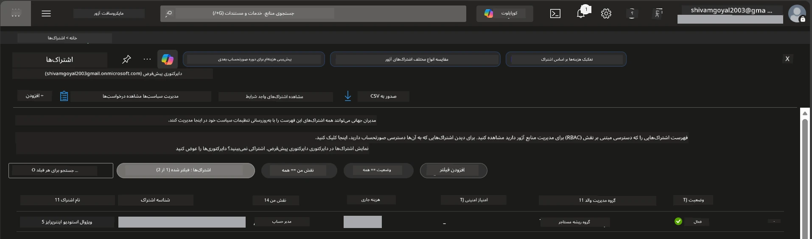

# ماژول 0 - پیش‌نیازها

قبل از شروع کارگاه، تأیید کنید ابزارها، دسترسی‌ها و محیط زیر را آماده دارید. هر مرحله زیر را دنبال کنید - از مراحل جلو نزنید.

---

## 1. حساب و اشتراک آزور

### 1.1 ایجاد یا تأیید اشتراک آزور شما

1. مرورگر را باز کنید و به [https://azure.microsoft.com/free/](https://azure.microsoft.com/free/) بروید.
2. اگر حساب آزور ندارید، روی **شروع رایگان** کلیک کنید و فرآیند ثبت‌نام را دنبال کنید. به یک حساب مایکروسافت (یا ایجاد آن) و کارت اعتباری برای احراز هویت نیاز دارید.
3. اگر حساب دارید، در [https://portal.azure.com](https://portal.azure.com) وارد شوید.
4. در پورتال، در ناوبری سمت چپ روی تیغۀ **اشتراک‌ها** کلیک کنید (یا در نوار جستجوی بالا "Subscriptions" را جستجو کنید).
5. تأیید کنید حداقل یک اشتراک **فعال** می‌بینید. شماره **شناسه اشتراک** را یادداشت کنید - بعداً به آن نیاز دارید.



### 1.2 درک نقش‌های لازم RBAC

استقرار [عامل میزبانی‌شده](https://learn.microsoft.com/azure/foundry/agents/concepts/hosted-agents) نیازمند مجوزهای **اقدام بر روی داده‌ها** است که نقش‌های استاندارد آزور `Owner` و `Contributor` شامل نمی‌شوند. شما به یکی از این [ترکیب‌های نقش](https://learn.microsoft.com/azure/foundry/concepts/rbac-foundry#built-in-roles) نیاز دارید:

| سناریو | نقش‌های لازم | محل اختصاص دادن |
|----------|---------------|----------------------|
| ایجاد پروژه Foundry جدید | **Azure AI Owner** روی منبع Foundry | منبع Foundry در پورتال آزور |
| استقرار در پروژه موجود (منابع جدید) | **Azure AI Owner** + **Contributor** روی اشتراک | اشتراک + منبع Foundry |
| استقرار در پروژه کاملاً پیکربندی‌شده | **Reader** روی حساب + **Azure AI User** روی پروژه | حساب + پروژه در پورتال آزور |

> **نکته کلیدی:** نقش‌های آزور `Owner` و `Contributor` فقط مجوزهای *مدیریتی* (عملیات ARM) را پوشش می‌دهند. شما به [**Azure AI User**](https://learn.microsoft.com/azure/foundry/concepts/rbac-foundry#built-in-roles) (یا بالاتر) برای *اقدامات داده‌ای* مانند `agents/write` نیاز دارید که برای ایجاد و استقرار عوامل لازم است. این نقش‌ها را در [ماژول 2](02-create-foundry-project.md) تعیین خواهید کرد.

---

## 2. نصب ابزارهای محلی

هر ابزار زیر را نصب کنید. پس از نصب، با اجرای دستور بررسی، صحت کارکرد آن را تأیید کنید.

### 2.1 Visual Studio Code

1. به [https://code.visualstudio.com/](https://code.visualstudio.com/) بروید.
2. نصاب برای سیستم‌عامل خود (ویندوز/مک/لینوکس) را دانلود کنید.
3. نصاب را با تنظیمات پیش‌فرض اجرا کنید.
4. VS Code را باز کنید تا مطمئن شوید اجرا می‌شود.

### 2.2 پایتون 3.10 یا بالاتر

1. به [https://www.python.org/downloads/](https://www.python.org/downloads/) بروید.
2. پایتون 3.10 یا بالاتر (ترجیحاً 3.12+) را دانلود کنید.
3. **ویندوز:** در هنگام نصب، گزینه **"Add Python to PATH"** را در صفحه اول علامت بزنید.
4. ترمینال را باز کنید و بررسی کنید:

   ```powershell
   python --version
   ```

   خروجی مورد انتظار: `Python 3.10.x` یا بالاتر.

### 2.3 Azure CLI

1. به [https://learn.microsoft.com/cli/azure/install-azure-cli](https://learn.microsoft.com/cli/azure/install-azure-cli) بروید.
2. دستورالعمل نصب سیستم‌عامل خود را دنبال کنید.
3. تأیید کنید:

   ```powershell
   az --version
   ```

   خروجی مورد انتظار: `azure-cli 2.80.0` یا بالاتر.

4. وارد شوید:

   ```powershell
   az login
   ```

### 2.4 Azure Developer CLI  (azd)

1. به [https://learn.microsoft.com/azure/developer/azure-developer-cli/install-azd](https://learn.microsoft.com/azure/developer/azure-developer-cli/install-azd) بروید.
2. دستورالعمل نصب سیستم‌عامل خود را دنبال کنید. روی ویندوز:

   ```powershell
   winget install microsoft.azd
   ```

3. تأیید کنید:

   ```powershell
   azd version
   ```

   خروجی مورد انتظار: `azd version 1.x.x` یا بالاتر.

4. وارد شوید:

   ```powershell
   azd auth login
   ```

### 2.5 Docker Desktop (اختیاری)

Docker فقط در صورتی لازم است که بخواهید تصویر کانتینر را محلی قبل از استقرار بسازید و آزمایش کنید. افزونه Foundry به طور خودکار ساخت کانتینر را در هنگام استقرار مدیریت می‌کند.

1. به [https://docs.docker.com/get-docker/](https://docs.docker.com/get-docker/) بروید.
2. Docker Desktop را برای سیستم‌عامل خود دانلود و نصب کنید.
3. **ویندوز:** در هنگام نصب اطمینان یابید که بک‌اند WSL 2 انتخاب شده باشد.
4. Docker Desktop را اجرا کنید و صبر کنید تا آیکون در ناحیه سیستم اعلان دهد **"Docker Desktop در حال اجرا است"**.
5. ترمینال را باز کنید و تأیید کنید:

   ```powershell
   docker info
   ```

   باید اطلاعات سیستم Docker بدون خطا چاپ شود. اگر پیغام `Cannot connect to the Docker daemon` را دیدید، چند ثانیه دیگر صبر کنید تا Docker کامل اجرا شود.

---

## 3. نصب افزونه‌های VS Code

شما به سه افزونه نیاز دارید. آنها را **قبل از شروع کارگاه** نصب کنید.

### 3.1 Microsoft Foundry برای VS Code

1. VS Code را باز کنید.
2. کلیدهای `Ctrl+Shift+X` را فشار دهید تا پنل افزونه‌ها باز شود.
3. در باکس جستجو، تایپ کنید **"Microsoft Foundry"**.
4. افزونه **Microsoft Foundry for Visual Studio Code** را پیدا کنید (ناشر: Microsoft، شناسه: `TeamsDevApp.vscode-ai-foundry`).
5. روی **نصب** کلیک کنید.
6. پس از نصب، باید آیکون **Microsoft Foundry** در نوار فعالیت (سایدبار سمت چپ) ظاهر شود.

### 3.2 Foundry Toolkit

1. در پنل افزونه‌ها (`Ctrl+Shift+X`)، جستجو کنید **"Foundry Toolkit"**.
2. افزونه **Foundry Toolkit** را پیدا کنید (ناشر: Microsoft، شناسه: `ms-windows-ai-studio.windows-ai-studio`).
3. روی **نصب** کلیک کنید.
4. آیکون **Foundry Toolkit** باید در نوار فعالیت ظاهر شود.

### 3.3 پایتون

1. در پنل افزونه‌ها، جستجو کنید **"Python"**.
2. افزونه **Python** را پیدا کنید (ناشر: Microsoft، شناسه: `ms-python.python`).
3. روی **نصب** کلیک کنید.

---

## 4. ورود به آزور از VS Code

[چارچوب عامل مایکروسافت](https://learn.microsoft.com/agent-framework/overview/) از [`DefaultAzureCredential`](https://learn.microsoft.com/azure/developer/python/sdk/authentication/credential-chains#defaultazurecredential-overview) برای احراز هویت استفاده می‌کند. باید در VS Code وارد حساب آزور شده باشید.

### 4.1 ورود از طریق VS Code

1. در گوشه پایین سمت چپ VS Code، روی آیکون **حساب‌ها** (شبیه آدمک) کلیک کنید.
2. روی **ورود برای استفاده از Microsoft Foundry** (یا **ورود با Azure**) کلیک کنید.
3. یک پنجره مرورگر باز می‌شود - با حساب آزور که به اشتراک شما دسترسی دارد وارد شوید.
4. به VS Code بازگردید. باید نام حساب شما در پایین سمت چپ نمایش داده شود.

### 4.2 (اختیاری) ورود از طریق Azure CLI

اگر Azure CLI را نصب کرده‌اید و ترجیح می‌دهید با CLI احراز هویت کنید:

```powershell
az login
```

این مرورگر را برای ورود باز می‌کند. پس از ورود، اشتراک صحیح را تنظیم کنید:

```powershell
az account set --subscription "<your-subscription-id>"
```

تأیید کنید:

```powershell
az account show --query "{name:name, id:id, state:state}" --output table
```

باید نام اشتراک، شناسه و وضعیت = `Enabled` نمایش داده شود.

### 4.3 (جایگزین) احراز هویت با سرویس پرینسیپل

برای CI/CD یا محیط‌های اشتراکی، متغیرهای محیطی زیر را به جای آن تنظیم کنید:

```powershell
$env:AZURE_TENANT_ID = "<your-tenant-id>"
$env:AZURE_CLIENT_ID = "<your-client-id>"
$env:AZURE_CLIENT_SECRET = "<your-client-secret>"
```

---

## 5. محدودیت‌های پیش‌نمایش

قبل از ادامه، از محدودیت‌های فعلی آگاه باشید:

- [**عوامل میزبانی‌شده**](https://learn.microsoft.com/azure/foundry/agents/concepts/hosted-agents) در حال حاضر در **پیش‌نمایش عمومی** هستند - برای بارهای کاری تولید توصیه نمی‌شوند.
- **مناطق پشتیبانی‌شده محدود هستند** - قبل از ایجاد منابع، [دسترسی منطقه](https://learn.microsoft.com/azure/foundry/agents/concepts/hosted-agents#region-availability) را بررسی کنید. اگر منطقه پشتیبانی‌نشده انتخاب کنید، استقرار شکست می‌خورد.
- بسته `azure-ai-agentserver-agentframework` در نسخه پیش‌انتشار (`1.0.0b16`) است - ممکن است APIها تغییر کنند.
- محدودیت مقیاس: عوامل میزبانی‌شده تا ۰-۵ نمونه (شامل مقیاس به صفر) پشتیبانی می‌کنند.

---

## 6. چک‌لیست قبل از پرواز

هر مورد را بررسی کنید. اگر هر مرحله‌ای شکست خورد، برگردید و آن را رفع کنید قبل از ادامه.

- [ ] VS Code بدون خطا باز می‌شود
- [ ] پایتون 3.10+ در PATH شما موجود است (`python --version` مقدار `3.10.x` یا بالاتر چاپ می‌کند)
- [ ] Azure CLI نصب شده است (`az --version` مقدار `2.80.0` یا بالاتر چاپ می‌کند)
- [ ] Azure Developer CLI نصب شده است (`azd version` اطلاعات نسخه را چاپ می‌کند)
- [ ] افزونه Microsoft Foundry نصب شده است (آیکون در نوار فعالیت قابل مشاهده است)
- [ ] افزونه Foundry Toolkit نصب شده است (آیکون در نوار فعالیت قابل مشاهده است)
- [ ] افزونه Python نصب شده است
- [ ] در VS Code به آزور وارد شده‌اید (آیکون حساب‌ها در پایین سمت چپ را بررسی کنید)
- [ ] دستور `az account show` اشتراک شما را برمی‌گرداند
- [ ] (اختیاری) Docker Desktop در حال اجرا است (`docker info` اطلاعات سیستم را بدون خطا برمی‌گرداند)

### نقطه چک

نوار فعالیت VS Code را باز کنید و تأیید کنید که هر دو نمای سایدبار **Foundry Toolkit** و **Microsoft Foundry** را می‌بینید. روی هرکدام کلیک کنید تا مطمئن شوید بدون خطا بارگذاری می‌شوند.

---

**بعدی:** [01 - نصب Foundry Toolkit و افزونه Foundry →](01-install-foundry-toolkit.md)

---

<!-- CO-OP TRANSLATOR DISCLAIMER START -->
**سلب مسئولیت**:  
این سند با استفاده از سرویس ترجمه هوش مصنوعی [Co-op Translator](https://github.com/Azure/co-op-translator) ترجمه شده است. در حالی که ما برای دقت تلاش می‌کنیم، لطفاً توجه داشته باشید که ترجمه‌های خودکار ممکن است شامل اشتباهات یا نادرستی‌هایی باشند. سند اصلی به زبان مادری آن باید به عنوان منبع معتبر در نظر گرفته شود. برای اطلاعات حیاتی، توصیه می‌شود از ترجمه حرفه‌ای انسانی استفاده گردد. ما در قبال هرگونه سوء تفاهم یا تفسیر نادرست ناشی از استفاده از این ترجمه مسئولیتی نداریم.
<!-- CO-OP TRANSLATOR DISCLAIMER END -->