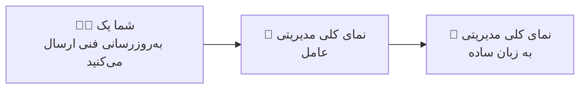

# ماژول ۰ - مقدمه

⏱️ ~۱۰ دقیقه

> [!WARNING]
> **پیش‌نمایش و محدودیت‌ها:** [عامل‌های میزبانی‌شده](https://learn.microsoft.com/azure/foundry/agents/concepts/hosted-agents) در حال حاضر در **پیش‌نمایش عمومی** هستند - برای بارهای کاری تولید توصیه نمی‌شوند. به موارد زیر توجه کنید:
> - **مناطق پشتیبانی‌شده محدود هستند** - قبل از ایجاد منابع، [در دسترس بودن منطقه](https://learn.microsoft.com/azure/foundry/agents/concepts/hosted-agents#region-availability) را بررسی کنید. اگر منطقه‌ای که پشتیبانی نمی‌شود را انتخاب کنید، راه‌اندازی ناموفق خواهد بود.
> - بسته `azure-ai-agentserver-agentframework` پیش‌انتشار است - ممکن است API‌ها بین نسخه‌ها تغییر کنند.
> - محدودیت‌های مقیاس: عامل‌های میزبانی‌شده از ۰ تا ۵ نسخه پشتیبانی می‌کنند (شامل مقیاس تا صفر).
> - برخی ویژگی‌های نشان داده‌شده در این کارگاه ممکن است با حرکت سرویس به سمت نسخه GA تغییر کنند.

## چیزی که خواهید ساخت

در این کارگاه، یک عامل **«توضیح بده انگار من یک مدیر اجرایی هستم»** خواهید ساخت - یک عامل هوش مصنوعی میزبانی‌شده که به‌روزرسانی‌های فنی پیچیده را گرفته و به خلاصه‌های اجرایی به زبان ساده انگلیسی بازنویسی می‌کند.

```mermaid
flowchart LR
    A["🧑‍💻 شما یک\nبه‌روزرسانی فنی ارسال می‌کنید"] --> B["🤖 نمای کلی مدیریتی\nعامل"]
    B --> C["📝 نمای کلی مدیریتی\nبه زبان ساده"]
```

**این عامل از این‌ها استفاده می‌کند:**
- **چارچوب عامل مایکروسافت** - برای منطق و ساختار عامل
- **ابزار Foundry برای VS Code** - برای اسکلته‌سازی، تست محلی، و استقرار
- **یک مدل هوش مصنوعی** (مثلاً `gpt-4.1-mini/gpt-5-mini`) - برای تولید خلاصه‌ها

در پایان این آزمایشگاه، شما یک عامل عملیاتی خواهید داشت که می‌توانید به‌صورت محلی از طریق بازرس عامل تست کنید و در صورت تمایل به ابر مستقر نمایید.

---

## عامل‌های میزبانی‌شده چیستند؟

یک **عامل میزبانی‌شده**، عاملی هوش مصنوعی است که به‌عنوان یک سرویس مدیریت‌شده در Microsoft Foundry اجرا می‌شود. به جای مدیریت زیرساخت خودتان، کد عامل خود را در یک کانتینر بسته‌بندی می‌کنید و Foundry مقیاس‌بندی، میزبانی و ارائه آن را از طریق یک نقطه پایانی HTTP استاندارد مدیریت می‌کند.

| مفهوم | معنای آن |
|---------|--------------|
| **عامل** | کد پایتون شما که پیام کاربر را دریافت می‌کند، مدل هوش مصنوعی را فراخوانی می‌کند و پاسخ ساخت‌یافته‌ای بازمی‌گرداند |
| **میزبانی‌شده** | Foundry کانتینر شما را اجرا می‌کند - بدون ماشین‌های مجازی، بدون کوبرنتیز، بدون زیرساخت برای مدیریت |
| **پروتکل پاسخ‌ها** | API معمولی HTTP (`POST /responses`) که هر مشتری می‌تواند برای تعامل با عامل شما تماس بگیرد |
| **بازرس عامل** | یک رابط آزمایش محلی (درون ابزار Foundry Toolkit) که اجازه می‌دهد قبل از استقرار با عامل خود چت کنید |

در این کارگاه، از صفر به یک عامل کاملاً میزبانی‌شده خواهید رسید - یا اگر خواستید، فقط به تست محلی بسنده کنید.

---

## مسیر خود را انتخاب کنید

> ⚠️ **قبل از ادامه یکی از مسیرها را انتخاب کنید.** انتخاب شما تعیین می‌کند که کدام ابزارها نصب شوند و کدام ماژول‌ها اعمال شوند. می‌توانید بعداً از مسیر ب → مسیر آ تغییر دهید اگر اشتراک داشتید.

<strong>🅰️ مسیر آ - ابر Azure (نیازمند اشتراک Azure)</strong>

| | جزئیات |
|---|---|
| **این مسیر برای چه کسانی است؟** | شما اشتراک فعال Azure دارید و می‌توانید منابع Foundry ایجاد کنید |
| **مدل** | Azure OpenAI از طریق Foundry (مثلاً `gpt-4.1-mini/gpt-5-mini`) |
| **ماژول‌های تحت پوشش** | تمام ماژول‌ها (۰۰–۰۷) |
| **آیا به ابر استقرار می‌دهید؟** | ✅ بله - استقرار کامل انتها به انتها |

<strong>🅱️ مسیر ب - محلی / لایه رایگان (نیازی به اشتراک Azure نیست)</strong>

| | جزئیات |
|---|---|
| **این مسیر برای چه کسانی است؟** | MVPها، دانشجویان، یا هر کسی که به Azure دسترسی ندارد |
| **مدل** | **Foundry Local** (رایگان، روی دستگاه شما اجرا می‌شود) |
| **ماژول‌های تحت پوشش** | ماژول‌های ۰۰–۰۴ (مرحله استقرار و بررسی ابر را رد کنید) |
| **آیا به ابر استقرار می‌دهید؟** | ❌ خیر - فقط تست محلی از طریق بازرس عامل |

---

## همه مسیرها: ابزارهای مورد نیاز

هر ابزار زیر را نصب کنید. پس از نصب، با اجرای فرمان بررسی، صحت کارکرد آن را تأیید کنید.

| # | ابزار | نسخه | نصب | تأیید (خروجی مورد انتظار) |
|---|------|---------|---------|---------------------------|
| ۱ | **Visual Studio Code** | آخرین نسخه | [code.visualstudio.com](https://code.visualstudio.com/) | بدون خطا باز می‌شود |
| ۲ | **Python** | ۳.۱۲ یا بالاتر | [python.org/downloads](https://www.python.org/downloads/) | `python --version` $\rightarrow$ `Python 3.12.x` |
| ۳ | **Foundry Toolkit برای VS Code** | آخرین نسخه | شناسه افزونه: `ms-windows-ai-studio.windows-ai-studio` | آیکون Foundry در نوار فعالیت |
| ۴ | **افزونه Python برای VS Code** | آخرین نسخه | شناسه افزونه: `ms-python.python` | در پنل افزونه‌ها نصب شده است |

> [!TIP]
> **نکات حرفه‌ای برای نصب:**
> - **مسیر Python (ویندوز):** همیشه گزینه **"Add Python to PATH"** را در اولین صفحه نصب‌کننده Python تیک بزنید. بدون این، دستور `python` در ترمینال شما شناسایی نمی‌شود.
> - **چند نسخه Python:** اگر هر دو نسخه Python 3.10 و 3.12 نصب شده است، از `python3.12 -m venv .venv` استفاده کنید تا مطمئن شوید که نسخه صحیح برای محیط مجازی استفاده می‌شود.
> - **Docker WSL 2 (ویندوز):** هنگام نصب Docker Desktop، مطمئن شوید که پشتیبان WSL 2 انتخاب شده است. Docker با Hyper-V کندتر است و ممکن است باعث مشکلات در ساخت کانتینرهای Foundry شود.
> - **Docker شروع نمی‌شود؟** پس از راه‌اندازی Docker Desktop، ۳۰ تا ۶۰ ثانیه صبر کنید. فرمان `docker info` را اجرا کنید - اگر پیام «Cannot connect to the Docker daemon» را دیدید، Docker هنوز در حال راه‌اندازی است.
> - **افزونه‌های VS Code لود نمی‌شوند؟** پس از نصب افزونه‌ها، پنجره را مجدداً بارگذاری کنید: `Ctrl+Shift+P` → `Developer: Reload Window`.

> **کاربران ویندوز:** هنگام نصب Python گزینه **"Add Python to PATH"** را تیک بزنید.

**بعدی:** [۰۱ - راه‌اندازی →](01-setup.md)

---

<!-- CO-OP TRANSLATOR DISCLAIMER START -->
**سلب مسئولیت**:
این سند با استفاده از سرویس ترجمه هوش مصنوعی [Co-op Translator](https://github.com/Azure/co-op-translator) ترجمه شده است. در حالی که ما در تلاش برای دقت هستیم، لطفاً توجه داشته باشید که ترجمه‌های خودکار ممکن است شامل خطاها یا نادرستی‌هایی باشند. سند اصلی به زبان مادری خود باید به عنوان منبع معتبر در نظر گرفته شود. برای اطلاعات حیاتی، ترجمه حرفه‌ای انسانی توصیه می‌شود. ما در قبال هرگونه سوء تفاهم یا برداشت نادرست ناشی از استفاده از این ترجمه مسئولیتی نداریم.
<!-- CO-OP TRANSLATOR DISCLAIMER END -->