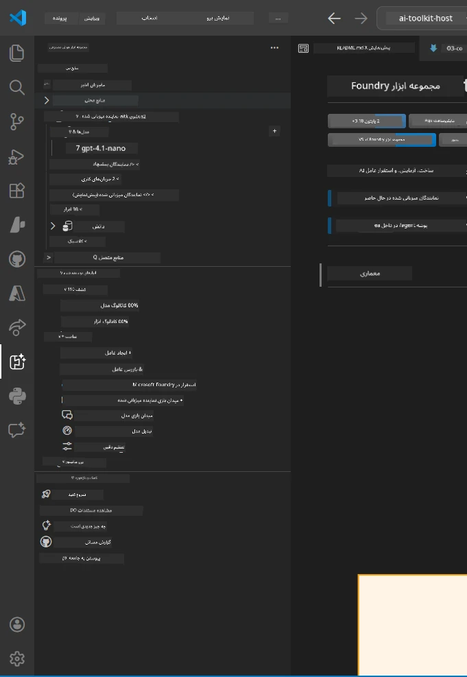
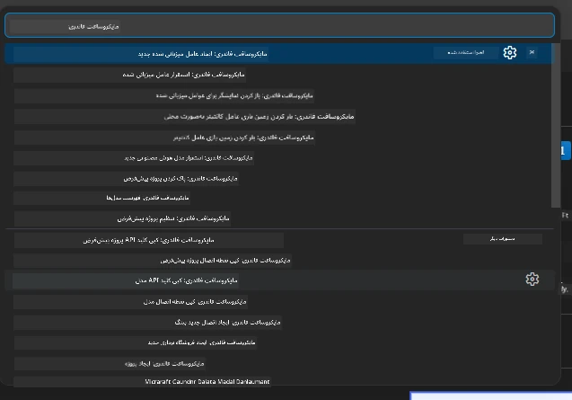

# ماژول 1 - نصب کیت ابزار Foundry و افزونه Foundry

این ماژول شما را در نصب و بررسی دو افزونه کلیدی VS Code برای این کارگاه راهنمایی می‌کند. اگر قبلاً آنها را در [ماژول 0](00-prerequisites.md) نصب کرده‌اید، از این ماژول برای اطمینان از عملکرد صحیح آنها استفاده کنید.

---

## گام 1: نصب افزونه Microsoft Foundry

افزونه **Microsoft Foundry برای VS Code** ابزار اصلی شما برای ایجاد پروژه‌های Foundry، استقرار مدل‌ها، ساخت چارچوب برای عوامل میزبانی شده، و استقرار مستقیم از VS Code است.

1. VS Code را باز کنید.
2. کلیدهای `Ctrl+Shift+X` را فشار دهید تا پنل **Extensions** باز شود.
3. در کادر جستجو در بالا، تایپ کنید: **Microsoft Foundry**
4. به دنبال نتیجه‌ای با عنوان **Microsoft Foundry for Visual Studio Code** بگردید.
   - ناشر: **Microsoft**
   - شناسه افزونه: `TeamsDevApp.vscode-ai-foundry`
5. روی دکمه **Install** کلیک کنید.
6. منتظر بمانید تا نصب کامل شود (یک نشانگر پیشرفت کوچک را خواهید دید).
7. پس از نصب، به **Activity Bar** (نوار آیکون عمودی در سمت چپ VS Code) نگاه کنید. باید یک آیکون جدید **Microsoft Foundry** (شبیه الماس/آیکون AI) مشاهده کنید.
8. روی آیکون **Microsoft Foundry** کلیک کنید تا نمای کناری آن باز شود. باید بخش‌هایی برای موارد زیر ببینید:
   - **Resources** (یا Projects)
   - **Agents**
   - **Models**

> **اگر آیکون ظاهر نشد:** سعی کنید VS Code را مجدداً بارگذاری کنید (`Ctrl+Shift+P` → `Developer: Reload Window`).

---

## گام 2: نصب افزونه Foundry Toolkit

افزونه **Foundry Toolkit** شامل [**Agent Inspector**](https://learn.microsoft.com/azure/foundry/agents/how-to/vs-code-agents-workflow-pro-code) است - یک رابط کاربری بصری برای آزمایش و اشکال‌زدایی عوامل به صورت محلی - علاوه بر ابزارهای playground، مدیریت مدل، و ارزیابی.

1. در پنل Extensions (`Ctrl+Shift+X`)، کادر جستجو را پاک کنید و تایپ کنید: **Foundry Toolkit**
2. در نتایج، **Foundry Toolkit** را پیدا کنید.
   - ناشر: **Microsoft**
   - شناسه افزونه: `ms-windows-ai-studio.windows-ai-studio`
3. روی **Install** کلیک کنید.
4. پس از نصب، آیکون **Foundry Toolkit** در Activity Bar ظاهر می‌شود (شبیه ربات/آیکون درخشان).
5. روی آیکون **Foundry Toolkit** کلیک کنید تا نمای کناری آن باز شود. باید صفحه خوش‌آمدگویی Foundry Toolkit را با گزینه‌هایی برای موارد زیر مشاهده کنید:
   - **Models**
   - **Playground**
   - **Agents**

---

## گام 3: بررسی عملکرد هر دو افزونه

### 3.1 بررسی افزونه Microsoft Foundry

1. روی آیکون **Microsoft Foundry** در Activity Bar کلیک کنید.
2. اگر در Azure وارد شده باشید (از ماژول 0)، باید پروژه‌های خود را زیر **Resources** ببینید.
3. اگر درخواست ورود شد، روی **Sign in** کلیک کرده و روند احراز هویت را دنبال کنید.
4. مطمئن شوید که می‌توانید نمای کناری را بدون خطا ببینید.

### 3.2 بررسی افزونه Foundry Toolkit

1. روی آیکون **Foundry Toolkit** در Activity Bar کلیک کنید.
2. مطمئن شوید که نمای خوش‌آمدگویی یا پنل اصلی بدون خطا بارگذاری می‌شود.
3. هنوز نیازی به پیکربندی چیزی ندارید - از Agent Inspector در [ماژول 5](05-test-locally.md) استفاده خواهیم کرد.

### 3.3 بررسی از طریق Command Palette

1. کلیدهای `Ctrl+Shift+P` را فشار دهید تا Command Palette باز شود.
2. تایپ کنید **"Microsoft Foundry"** - باید دستورات زیر را ببینید:
   - `Microsoft Foundry: Create a New Hosted Agent`
   - `Microsoft Foundry: Deploy Hosted Agent`
   - `Microsoft Foundry: Open Model Catalog`
3. برای بستن Command Palette کلید `Escape` را بزنید.
4. مجدداً Command Palette را باز کنید و تایپ کنید **"Foundry Toolkit"** - باید دستورات زیر را ببینید:
   - `Foundry Toolkit: Open Agent Inspector`

> اگر این دستورات را نمی‌بینید، ممکن است افزونه‌ها به درستی نصب نشده باشند. سعی کنید آنها را حذف و مجدداً نصب کنید.

---

## عملکرد این افزونه‌ها در این کارگاه

| افزونه | کارکرد | زمان استفاده |
|--------|--------|--------------|
| **Microsoft Foundry for VS Code** | ایجاد پروژه‌های Foundry، استقرار مدل‌ها، **ایجاد چارچوب [عوامل میزبانی شده](https://learn.microsoft.com/azure/foundry/agents/concepts/hosted-agents)** (تولید خودکار `agent.yaml`، `main.py`، `Dockerfile`، `requirements.txt`)، استقرار در [Foundry Agent Service](https://learn.microsoft.com/azure/foundry/agents/overview) | ماژول‌های 2، 3، 6، 7 |
| **Foundry Toolkit** | Agent Inspector برای تست/اشکال‌زدایی محلی، رابط کاربری playground، مدیریت مدل | ماژول‌های 5، 7 |

> **افزونه Foundry مهم‌ترین ابزار در این کارگاه است.** این افزونه چرخه عمر کامل پروژه را مدیریت می‌کند: ایجاد چارچوب → پیکربندی → استقرار → بررسی. Foundry Toolkit آن را با ارائه Agent Inspector بصری برای تست محلی تکمیل می‌کند.

---

### نقطه بررسی

- [ ] آیکون Microsoft Foundry در Activity Bar قابل مشاهده است
- [ ] کلیک روی آن بدون خطا نمای کناری را باز می‌کند
- [ ] آیکون Foundry Toolkit در Activity Bar قابل مشاهده است
- [ ] کلیک روی آن بدون خطا نمای کناری را باز می‌کند
- [ ] `Ctrl+Shift+P` → تایپ "Microsoft Foundry" دستورات موجود را نشان می‌دهد
- [ ] `Ctrl+Shift+P` → تایپ "Foundry Toolkit" دستورات موجود را نشان می‌دهد

---

**قبلی:** [00 - پیش‌نیازها](00-prerequisites.md) · **بعدی:** [02 - ایجاد پروژه Foundry →](02-create-foundry-project.md)

---

<!-- CO-OP TRANSLATOR DISCLAIMER START -->
**توجه**:  
این سند با استفاده از سرویس ترجمه هوش مصنوعی [Co-op Translator](https://github.com/Azure/co-op-translator) ترجمه شده است. در حالی که ما در تلاش برای دقت هستیم، لطفاً توجه داشته باشید که ترجمه‌های خودکار ممکن است حاوی خطاها یا نادرستی‌هایی باشند. سند اصلی به زبان بومی آن باید به عنوان منبع معتبر در نظر گرفته شود. برای اطلاعات حیاتی، ترجمه انسانی حرفه‌ای توصیه می‌شود. ما مسئول هیچ سوءتفاهم یا برداشت نادرستی که از استفاده از این ترجمه ناشی شود، نیستیم.
<!-- CO-OP TRANSLATOR DISCLAIMER END -->