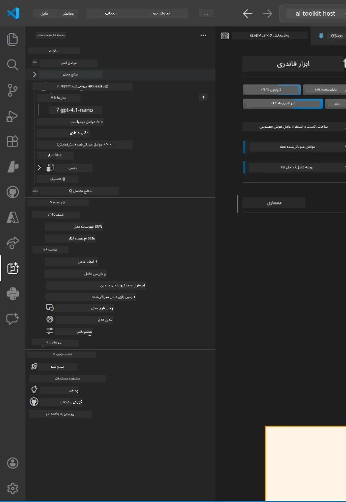
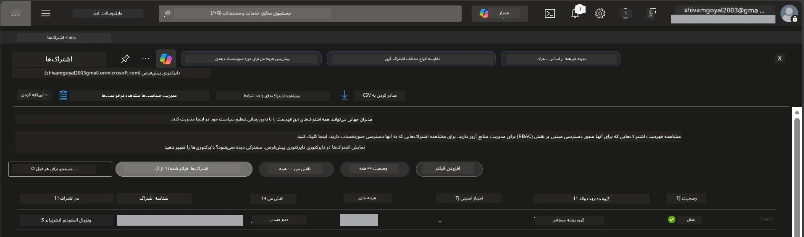
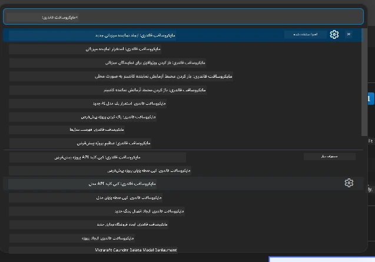
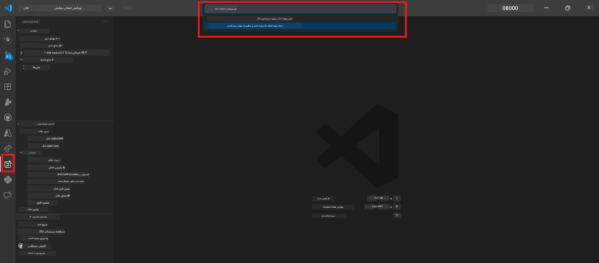
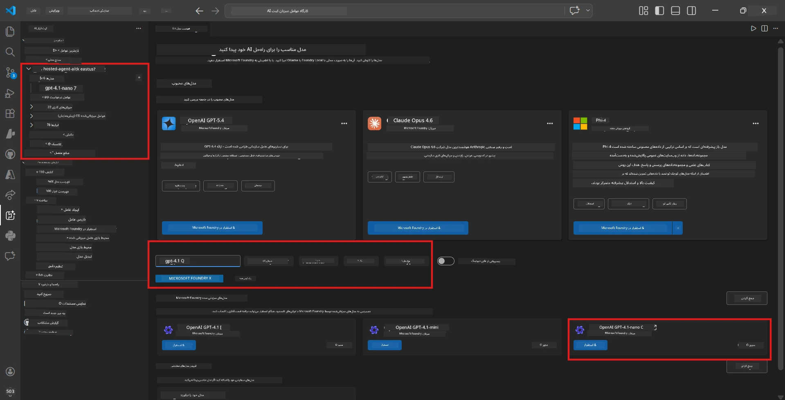
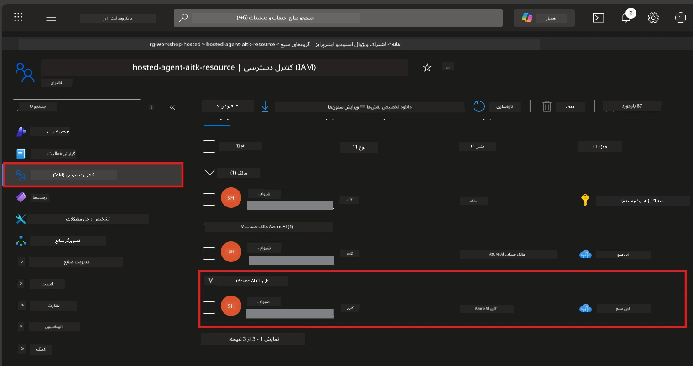

# راه‌اندازی: افزونه، پروژه و مدل

⏱️ ~۱۵ دقیقه

در این ماژول، افزونه Foundry Toolkit را نصب و تأیید می‌کنید، پروژه نفری فاندری ایجاد (یا به آن متصل) می‌شوید و مدلی را که عامل شما استفاده خواهد کرد، پیاده‌سازی می‌کنید.

## گام ۱: نصب Foundry Toolkit

**Foundry Toolkit برای VS Code** افزونه اصلی این کارگاه است. این افزونه ایجاد پروژه، پیاده‌سازی مدل، ساخت اسکلت عامل، تست محلی (Agent Inspector)، و پیاده‌سازی ابری را — همه از طریق VS Code — فراهم می‌کند.

۱. VS Code را باز کنید و سپس `Ctrl+Shift+X` را فشار دهید تا پنل **Extensions** باز شود.
۲. جستجو کنید برای **Foundry Toolkit**.
۳. نصب کنید **Foundry Toolkit for VS Code** (ناشر: Microsoft، شناسه: `ms-windows-ai-studio.windows-ai-studio`).
۴. پس از نصب، آیکون **Foundry Toolkit** در نوار فعالیت (نوار کناری سمت چپ) ظاهر می‌شود.

> *نکته: ممکن است نوار فعالیت در نسخه‌های قدیمی‌تر افزونه با عنوان "AI TOOLKIT" نمایش داده شود. عملکرد یکسان است.*



## گام ۲: تنظیم بر اساس دسترسی شما

> **مسیر خود را انتخاب کنید:** بخش مربوط به راه‌اندازی خود را که در زیر آمده باز کنید. تنها کافی است یک مسیر را کامل کنید.

<details>
<summary><strong>🅰️ مسیر A - ابر Azure (نیاز به اشتراک Azure دارد)</strong></summary>

### Azure CLI

۱. نصب از [learn.microsoft.com/cli/azure/install-azure-cli](https://learn.microsoft.com/cli/azure/install-azure-cli).
۲. تأیید: `az --version` (انتظار نسخه ۲٫۸۰٫۰ به بالا).
۳. ورود: `az login`

### گزینه‌های احراز هویت

فریم‌ورک عامل مایکروسافت [Microsoft Agent Framework](https://learn.microsoft.com/agent-framework/overview/) از [`DefaultAzureCredential`](https://learn.microsoft.com/azure/developer/python/sdk/authentication/credential-chains#defaultazurecredential-overview) استفاده می‌کند که به ترتیب روش‌های مختلف احراز هویت را امتحان می‌کند. یکی را انتخاب کنید که مناسب محیط شما باشد:

#### گزینه ۱: حساب‌های VS Code (توصیه شده برای کارگاه‌ها)
۱. روی آیکون **Accounts** (شکل پرتره شخص) در گوشه پایین چپ VS Code کلیک کنید.
۲. انتخاب کنید **Sign in to use Microsoft Foundry** (یا **Sign in with Azure**).
۳. مرورگری باز می‌شود — با حساب Azure که به اشتراک شما دسترسی دارد وارد شوید.
۴. به VS Code بازگردید. باید نام حساب شما را در پایین سمت چپ ببینید.

#### گزینه ۲: Azure CLI
```bash
az login
az account set --subscription "<your-subscription-id>"
```

#### گزینه ۳: Service Principal (کسب‌وکار/CI)
برای محیط‌های محدود یا خط لوله‌های CI/CD، این متغیرهای محیطی را در فایل `.env` خود تنظیم کنید:
```env
AZURE_TENANT_ID=<your-tenant-id>
AZURE_CLIENT_ID=<your-client-id>
AZURE_CLIENT_SECRET=<your-client-secret>
```

> **نحوه کار `DefaultAzureCredential`:** ابتدا متغیرهای محیطی را امتحان می‌کند، سپس managed identity، بعد ورود VS Code، و در نهایت Azure CLI — و هر کدام که اول موفق باشد را استفاده می‌کند. به مستندات [credential chain](https://learn.microsoft.com/azure/developer/python/sdk/authentication/credential-chains#defaultazurecredential-overview) مراجعه کنید.

### Azure Developer CLI (azd)

۱. نصب: `winget install microsoft.azd` (ویندوز) یا مشاهده مستندات [install docs](https://learn.microsoft.com/azure/developer/azure-developer-cli/install-azd).
۲. تأیید: `azd version`
۳. ورود: `azd auth login`

### Docker Desktop (اختیاری)

داکر فقط درصورتی لازم است که بخواهید کانتینرها را به صورت محلی بسازید. افزونه Foundry در هنگام پیاده‌سازی به طور خودکار ساخت را انجام می‌دهد.

۱. نصب از [docs.docker.com/get-docker](https://docs.docker.com/get-docker/).
۲. تأیید: `docker info`

### اشتراک Azure و RBAC

۱. ورود به [portal.azure.com](https://portal.azure.com).
۲. به **Subscriptions** بروید و تأیید کنید حداقل یک اشتراک **فعال** است.
۳. شناسه **Subscription ID** خود را یادداشت کنید — در ماژول ۰۱ به آن نیاز خواهید داشت.



#### جدول سناریوی RBAC

پیاده‌سازی [Hosted Agent](https://learn.microsoft.com/azure/foundry/agents/concepts/hosted-agents) نیاز به مجوزهای **داده‌ای** دارد که نقش‌های استاندارد Azure `Owner` و `Contributor` شامل آن نمی‌شوند. از جدول زیر استفاده کنید تا نقش‌های مورد نیاز خود را تشخیص دهید:

| سناریو | نقش‌های مورد نیاز | محل اختصاص دادن |
|----------|---------------|----------------------|
| ایجاد پروژه جدید Foundry | **Azure AI Owner** روی منبع Foundry | منبع Foundry در پورتال Azure |
| پیاده‌سازی روی پروژه موجود (منابع جدید) | **Azure AI Owner** + **Contributor** روی اشتراک | اشتراک + منبع Foundry |
| پیاده‌سازی روی پروژه کاملاً پیکربندی شده | **Reader** روی حساب + **Azure AI User** روی پروژه | حساب + پروژه در پورتال Azure |
| فقط تست محلی (بدون پیاده‌سازی) | **Azure AI User** روی پروژه | پروژه در پورتال Azure |

> **نکته کلیدی:** نقش‌های Azure `Owner` و `Contributor` فقط مجوزهای *مدیریتی* (عملیات ARM) را پوشش می‌دهند. برای عملیات‌های *داده‌ای* مانند `agents/write` که برای ایجاد و پیاده‌سازی عوامل لازم است، به [**Azure AI User**](https://learn.microsoft.com/azure/foundry/concepts/rbac-foundry#built-in-roles) (یا بالاتر) نیاز دارید.

## اتصال یا ایجاد پروژه Foundry



۱. فشار دهید `Ctrl+Shift+P` → تایپ کنید **Foundry Toolkit: Create Project** → انتخابش کنید.
۲. از فهرست کشویی، **اشتراک Azure** خود را انتخاب کنید.
۳. یک **گروه منابع** انتخاب یا ایجاد کنید (مثلاً `rg-hosted-agents-workshop`).
۴. منطقه‌ای که از نمایندگان میزبانی شده پشتیبانی می‌کند را انتخاب کنید: `East US`، `West US 2` یا `Sweden Central`. به [ارزیابی منطقه](https://learn.microsoft.com/azure/foundry/agents/concepts/hosted-agents#region-availability) مراجعه کنید.
۵. نام پروژه را وارد کنید (مثلاً `workshop-agents`).
۶. ۲–۵ دقیقه برای ایجاد منتظر بمانید. اعلان پیشرفت در VS Code نشان داده می‌شود.
۷. پس از اتمام، پروژه شما در نوار کناری **Foundry Toolkit** زیر **MY RESOURCES** ظاهر می‌شود.



## پیاده‌سازی مدل و اختصاص نقش RBAC

نماینده میزبانی شده شما به یک مدل هوش مصنوعی برای تولید پاسخ‌ها نیاز دارد.

#### ماتریس انتخاب مدل
بسته به نیازهای خود، می‌توانید از سطوح مختلف مدل انتخاب کنید:

| مدل | مناسب برای | هزینه | توضیحات |
|-------|----------|------|-------|
| `gpt-4.1` | پاسخ‌های با کیفیت بالا و دقیق | بالاتر | بهترین نتایج، توصیه شده برای تست نهایی |
| `gpt-4.1-mini/gpt-5-mini` | تکرار سریع، هزینه کمتر | پایین‌تر | خوب برای توسعه کارگاه و تست سریع |
| `gpt-4.1-nano` | کارهای سبک | کمترین | مقرون به صرفه‌ترین، اما پاسخ‌های ساده‌تر |

۱. فشار دهید `Ctrl+Shift+P` → **Foundry Toolkit: Open Model Catalog** (یا در نوار کناری زیر DEVELOPER TOOLS → Discover روی **Model Catalog** کلیک کنید).
۲. جستجو کنید برای **gpt-4.1** در کاتالوگ.
۳. مدل **OpenAI GPT-4.1-mini** (یا `gpt-5-mini` برای کیفیت بهتر) را پیدا کرده و روی **Deploy** کلیک کنید.



۴. در پیکربندی پیاده‌سازی:
   - **نام پیاده‌سازی:** پیش‌فرض را نگه دارید یا نام دلخواه وارد کنید. **این نام را به یاد داشته باشید.**
   - **هدف:** انتخاب کنید **Deploy to Foundry Toolkit** → پروژه خود را انتخاب کنید.
۵. روی **Deploy** کلیک کرده و ۱–۳ دقیقه منتظر بمانید.

> **توصیه:** برای کارگاه از `gpt-4.1-mini/gpt-5-mini` استفاده کنید — سریع، مقرون‌به‌صرفه، و نتایج خوبی تولید می‌کند.

### مقادیر خود را یادداشت کنید

پس از پیاده‌سازی، این دو مقدار را یادداشت کنید (در ماژول ۰۳ به آن‌ها نیاز دارید):

| مقدار | محل پیدا کردن |
|-------|-----------------|
| **آدرس پایان پروژه** | روی پروژه خود در نوار کناری کلیک کنید → نمای جزئیات URL را نشان می‌دهد (مثلاً `https://<account>.services.ai.azure.com/api/projects/<project>`) |
| **نام پیاده‌سازی مدل** | پروژه را باز کنید → **Models** → نام کنار مدل پیاده‌سازی شده شما (مثلاً `gpt-4.1-mini/gpt-5-mini`) |

### اختصاص نقش RBAC

> ⚠️ **این مرحله معمولاً فراموش می‌شود.** بدون نقش صحیح، پیاده‌سازی در ماژول ۰۵ شکست خواهد خورد.

#### به کدام نقش نیاز دارم؟
بسته به سناریوی خود، ترکیبات نقش زیر را نیاز دارید:

| سناریو | نقش‌های مورد نیاز | محل اختصاص دادن |
|----------|---------------|----------------------|
| ایجاد پروژه جدید Foundry | **Azure AI Owner** روی منبع Foundry | منبع Foundry در پورتال Azure |
| پیاده‌سازی روی پروژه موجود (منابع جدید) | **Azure AI Owner** + **Contributor** روی اشتراک | اشتراک + منبع Foundry |
| پیاده‌سازی روی پروژه کاملاً پیکربندی شده | **Reader** روی حساب + **Azure AI User** روی پروژه | حساب + پروژه در پورتال Azure |

**نکته کلیدی:** نقش‌های Azure `Owner` و `Contributor` فقط مجوزهای *مدیریتی* را پوشش می‌دهند. برای عملیات‌های *داده‌ای* مانند `agents/write` نیاز به **Azure AI User** (یا بالاتر) دارید که برای ایجاد و پیاده‌سازی عوامل لازم است.

۱. باز کنید [portal.azure.com](https://portal.azure.com).
۲. نام **پروژه Foundry** خود را جستجو کنید → روی نتیجه‌ای از نوع **"Foundry Toolkit project"** کلیک کنید (حساب والد نباشد).
۳. در ناوبری سمت چپ روی **Access control (IAM)** کلیک کنید.
۴. روی **+ Add** → **Add role assignment** کلیک کنید.
۵. **زبانه نقش:** جستجو کنید برای **Azure AI User**، آن را انتخاب کرده و روی **Next** کلیک کنید.
۶. **زبانه اعضا:** انتخاب کنید **User, group, or service principal** → کلیک روی **+ Select members** → خود را پیدا کرده و انتخاب کنید → کلیک روی **Select**.
۷. کلیک کنید روی **Review + assign** → دوباره **Review + assign**.
۸. **۱–۲ دقیقه منتظر بمانید** تا تغییرات اعمال شود.

> **چرا این نقش؟** نقش‌های Azure `Owner`/`Contributor` فقط مجوزهای مدیریتی می‌دهند. نقش **Azure AI User** مجوز عملیات داده‌ای `agents/write` را می‌دهد که برای ایجاد و پیاده‌سازی عوامل لازم است. به مستندات [Foundry RBAC docs](https://learn.microsoft.com/azure/foundry/concepts/rbac-foundry#built-in-roles) مراجعه کنید.



</details>

<details>
<summary><strong>🅱️ مسیر B - محلی / سطح رایگان (نیاز به اشتراک Azure ندارد)</strong></summary>

### Foundry Local

Foundry Local به شما امکان می‌دهد مدل‌های هوش مصنوعی را روی دستگاه خود اجرا کنید - نیاز به حساب ابری ندارید. می‌توانید از مدل‌های Foundry Local از طریق Foundry Toolkit و کاتالوگ مدل به صورت زیر استفاده کنید:

۱. به افزونه Foundry Toolkit بروید.
۲. در ناوبری Foundry Toolkit به **Developer Tools** > و سپس **Model Catalog** را انتخاب کنید.
۳. در پنجره جدید، از نوار ناوبری **local** را انتخاب کنید.
۴. به پایین اسکرول کنید تا **Phi 4 Mini**، و روی دکمه **افزودن** کلیک کنید. پیغامی ظاهر می‌شود که مدل در حال دانلود است.
۵. پس از دانلود مدل، می‌توانید به مرحله بعدی بروید.

</details>

### ✅ نقطه بررسی


- [ ] `Ctrl+Shift+P` → "Foundry Toolkit" دستورات موجود را نشان می‌دهد
- [ ] افزونه Foundry Toolkit نصب شده و نوار کناری بدون خطا بارگذاری می‌شود
- [ ] VS Code باز شده و به درستی اجرا می‌شود
- [ ] `python --version` نسخه ۳٫۱۰+ را نشان می‌دهد
- [ ] آیکون Foundry Toolkit در نوار فعالیت VS Code قابل مشاهده است
- [ ] **مسیر A:** `az login` موفقیت‌آمیز است و اشتراک فعال است
- [ ] **مسیر B:** Foundry Local در حال اجرا است (`foundry local status`)
- [ ] **مسیر A:** پروژه Foundry در نوار کناری دیده می‌شود، مدل پیاده‌سازی شده، نقش Azure AI User اختصاص یافته
- [ ] **مسیر B:** Foundry Local با یک مدل در حال اجرا است
- [ ] مقادیر **endpoint** و **نام پیاده‌سازی مدل** خود را یادداشت کرده‌اید


**قبلی:** [00 - پیش‌نیازها](00-prerequisites.md) · **بعدی:** [02 - ایجاد عامل میزبانی شده →](02-create-hosted-agent.md)

---

<!-- CO-OP TRANSLATOR DISCLAIMER START -->
**سلب مسئولیت**:
این سند با استفاده از سرویس ترجمه هوش مصنوعی [Co-op Translator](https://github.com/Azure/co-op-translator) ترجمه شده است. در حالی که ما در تلاش برای دقت هستیم، لطفاً توجه داشته باشید که ترجمه‌های خودکار ممکن است شامل خطاها یا نادرستی‌هایی باشند. سند اصلی به زبان مادری خود باید به عنوان منبع معتبر در نظر گرفته شود. برای اطلاعات حیاتی، ترجمه حرفه‌ای انسانی توصیه می‌شود. ما در قبال هرگونه سوء تفاهم یا برداشت نادرست ناشی از استفاده از این ترجمه مسئولیتی نداریم.
<!-- CO-OP TRANSLATOR DISCLAIMER END -->