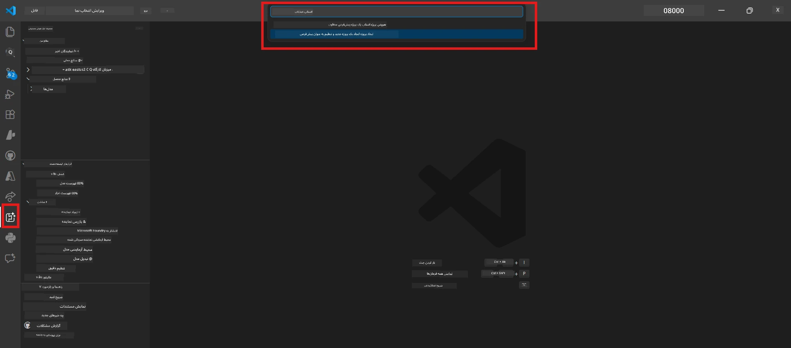
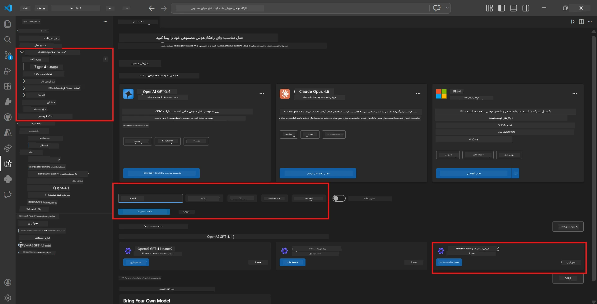
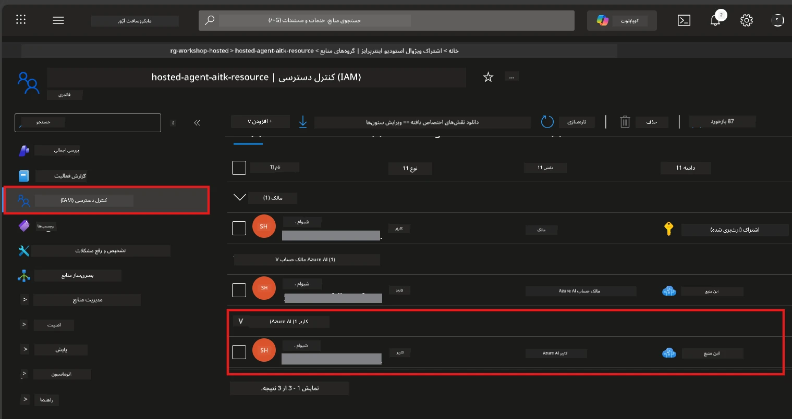

# ماژول ۲ - ایجاد یک پروژه Foundry و استقرار یک مدل

در این ماژول، شما یک پروژه Microsoft Foundry ایجاد (یا انتخاب) می‌کنید و یک مدلی را که عامل شما استفاده خواهد کرد، مستقر می‌کنید. هر مرحله به طور صریح نوشته شده است - آنها را به ترتیب دنبال کنید.

> اگر قبلاً پروژه‌ای در Foundry با مدل مستقر شده دارید، به [ماژول ۳](03-create-hosted-agent.md) بروید.

---

## مرحله ۱: ایجاد پروژه Foundry از VS Code

شما از افزونه Microsoft Foundry استفاده خواهید کرد تا پروژه‌ای را بدون ترک VS Code ایجاد کنید.

۱. کلیدهای `Ctrl+Shift+P` را فشار دهید تا **Command Palette** باز شود.
۲. تایپ کنید: **Microsoft Foundry: Create Project** و آن را انتخاب کنید.
۳. یک منوی کشویی ظاهر می‌شود - اشتراک Azure خود را از فهرست انتخاب کنید.
۴. از شما خواسته می‌شود که یک **resource group** انتخاب یا ایجاد کنید:
   - برای ایجاد جدید: یک نام تایپ کنید (مثلاً `rg-hosted-agents-workshop`) و Enter را بزنید.
   - برای استفاده از یک گروه موجود: آن را از منوی کشویی انتخاب کنید.
۵. یک **منطقه** انتخاب کنید. **مهم:** منطقه‌ای را انتخاب کنید که از عوامل میزبانی شده پشتیبانی می‌کند. بررسی کنید [دسترسی منطقه‌ای](https://learn.microsoft.com/azure/foundry/agents/concepts/hosted-agents#region-availability) - انتخاب‌های رایج شامل `East US`، `West US 2` یا `Sweden Central` هستند.
۶. یک **نام** برای پروژه Foundry وارد کنید (مثلاً `workshop-agents`).
۷. Enter را فشار دهید و منتظر بمانید تا تأمین منابع کامل شود.

> **تأمین منابع ۲-۵ دقیقه طول می‌کشد.** در نوار پایین-راست VS Code اعلان پیشرفت را خواهید دید. در طول تأمین منابع VS Code را نبندید.

۸. پس از اتمام، نوار کناری **Microsoft Foundry** پروژه جدید شما را زیر **Resources** نمایش خواهد داد.
۹. روی نام پروژه کلیک کنید تا باز شود و مطمئن شوید بخش‌هایی مانند **Models + endpoints** و **Agents** را نمایش می‌دهد.



### جایگزین: ایجاد از طریق پرتالت Foundry

اگر ترجیح می‌دهید از مرورگر استفاده کنید:

۱. به [https://ai.azure.com](https://ai.azure.com) بروید و وارد شوید.
۲. روی **Create project** در صفحه اصلی کلیک کنید.
۳. نام پروژه، اشتراک، گروه منبع و منطقه خود را وارد کنید.
۴. روی **Create** کلیک کنید و منتظر تأمین منابع بمانید.
۵. پس از ایجاد، به VS Code بازگردید - پروژه باید پس از رفرش در نوار کناری Foundry ظاهر شود (روی آیکون رفرش کلیک کنید).

---

## مرحله ۲: استقرار یک مدل

عامل [میزبان شما](https://learn.microsoft.com/azure/foundry/agents/concepts/hosted-agents) به یک مدل Azure OpenAI نیاز دارد تا پاسخ‌ها را تولید کند. اکنون [یکی را مستقر خواهید کرد](https://learn.microsoft.com/azure/ai-foundry/openai/how-to/create-resource#deploy-a-model).

۱. کلیدهای `Ctrl+Shift+P` را فشار دهید تا **Command Palette** باز شود.
۲. تایپ کنید: **Microsoft Foundry: Open [Model Catalog](https://learn.microsoft.com/azure/ai-foundry/openai/concepts/models)** و آن را انتخاب کنید.
۳. نمای کاتالوگ مدل در VS Code باز می‌شود. جستجو کنید یا از نوار جستجو برای یافتن مدل **gpt-4.1** استفاده کنید.
۴. روی کارت مدل **gpt-4.1** کلیک کنید (یا `gpt-4.1-mini` اگر هزینه کمتر را ترجیح می‌دهید).
۵. روی **Deploy** کلیک کنید.


۶. در پیکربندی استقرار:
   - **Deployment name**: نام پیش‌فرض را نگه دارید (مثلاً `gpt-4.1`) یا نام دلخواه وارد کنید. **این نام را به خاطر بسپارید** - در ماژول ۴ به آن نیاز خواهید داشت.
   - **Target**: گزینه **Deploy to Microsoft Foundry** را انتخاب کنید و پروژه‌ای را که به تازگی ایجاد کرده‌اید، انتخاب کنید.
۷. روی **Deploy** کلیک کنید و منتظر بمانید تا استقرار کامل شود (۱-۳ دقیقه).

### انتخاب مدل

| مدل | بهترین استفاده برای | هزینه | توضیحات |
|-------|----------|------|-------|
| `gpt-4.1` | پاسخ‌های با کیفیت بالا و دقیق | بیشتر | بهترین نتایج، برای تست نهایی توصیه می‌شود |
| `gpt-4.1-mini` | تکرار سریع، هزینه کمتر | کمتر | مناسب برای توسعه کارگاهی و تست سریع |
| `gpt-4.1-nano` | کارهای سبک | کمترین | اقتصادی‌ترین، اما پاسخ‌ها ساده‌تر |

> **توصیه برای این کارگاه:** از `gpt-4.1-mini` برای توسعه و تست استفاده کنید. سریع، ارزان و نتایج خوبی برای تمرین‌ها ارائه می‌دهد.

### تأیید استقرار مدل

۱. در نوار کناری **Microsoft Foundry** پروژه خود را باز کنید.
۲. زیر بخش **Models + endpoints** (یا بخش مشابه) نگاه کنید.
۳. باید مدل مستقر شده (مثلاً `gpt-4.1-mini`) را با وضعیت **Succeeded** یا **Active** ببینید.
۴. برای دیدن جزئیات، روی استقرار مدل کلیک کنید.
۵. **این دو مقدار را یادداشت کنید** - در ماژول ۴ به آنها نیاز خواهید داشت:

   | تنظیم | محل پیدا کردن | مقدار نمونه |
   |---------|-----------------|---------------|
   | **Project endpoint** | روی نام پروژه در نوار کناری Foundry کلیک کنید. URL نقطه پایانی در نمای جزئیات نشان داده می‌شود. | `https://<account>.services.ai.azure.com/api/projects/<project>` |
   | **Model deployment name** | نام نمایش داده شده در کنار مدل مستقر شده. | `gpt-4.1-mini` |

---

## مرحله ۳: اختصاص نقش‌های RBAC لازم

این رایج‌ترین مرحله‌ای است که فراموش می‌شود. بدون نقش‌های صحیح، استقرار در ماژول ۶ به خطای مجوز منجر خواهد شد.

### ۳.۱ نقش Azure AI User را به خود اختصاص دهید

۱. مرورگر را باز کنید و به [https://portal.azure.com](https://portal.azure.com) بروید.
۲. در نوار جستجوی بالا، نام **پروژه Foundry** خود را تایپ کنید و در نتایج روی آن کلیک کنید.
   - **مهم:** به منبع **پروژه** (نوع: "Microsoft Foundry project") بروید، نه منبع حساب/هاب والد.
۳. در ناوبری چپ پروژه، روی **Access control (IAM)** کلیک کنید.
۴. دکمه **+ Add** در بالا را بزنید → سپس **Add role assignment** را انتخاب کنید.
۵. در تب **Role**، دنبال [**Azure AI User**](https://learn.microsoft.com/azure/foundry/concepts/rbac-foundry#built-in-roles) بگردید و آن را انتخاب کنید. روی **Next** کلیک کنید.
۶. در تب **Members**:
   - گزینه **User, group, or service principal** را انتخاب کنید.
   - روی **+ Select members** کلیک کنید.
   - نام یا ایمیل خود را جستجو کنید، خودتان را انتخاب و سپس روی **Select** کلیک کنید.
۷. روی **Review + assign** کلیک کنید → سپس دوباره برای تأیید روی **Review + assign** کلیک کنید.



### ۳.۲ (اختیاری) اختصاص نقش Azure AI Developer

اگر نیاز به ایجاد منابع اضافی در پروژه یا مدیریت استقرارها به صورت برنامه‌ای دارید:

۱. مراحل بالا را تکرار کنید، اما در مرحله ۵ نقش **Azure AI Developer** را انتخاب کنید.
۲. این نقش را در سطح **Foundry resource (account)** اختصاص دهید، نه فقط در سطح پروژه.

### ۳.۳ تأیید نقش‌های اختصاص داده شده

۱. در صفحه **Access control (IAM)** پروژه، تب **Role assignments** را باز کنید.
۲. نام خود را جستجو کنید.
۳. باید حداقل نقش **Azure AI User** را برای حوزه پروژه ببینید.

> **چرا این مهم است:** نقش [`Azure AI User`](https://learn.microsoft.com/azure/foundry/concepts/rbac-foundry#built-in-roles) اجازه اقدام داده‌ای `Microsoft.CognitiveServices/accounts/AIServices/agents/write` را می‌دهد. بدون آن، هنگام استقرار این خطا را مشاهده خواهید کرد:
>
> ```
> Error: lacks the required data action 
> Microsoft.CognitiveServices/accounts/AIServices/agents/write 
> to perform POST /api/projects/{projectName}/assistants operation.
> ```
>
> برای جزئیات بیشتر به [ماژول ۸ - عیب‌یابی](08-troubleshooting.md) مراجعه کنید.

---

### نقطه بررسی

- [ ] پروژه Foundry ایجاد شده و در نوار کناری Microsoft Foundry در VS Code قابل مشاهده است
- [ ] حداقل یک مدل مستقر شده (مثلاً `gpt-4.1-mini`) با وضعیت **Succeeded**
- [ ] آدرس **project endpoint** و نام **model deployment** را یادداشت کرده‌اید
- [ ] نقش **Azure AI User** را در سطح **پروژه** اختصاص داده‌اید (در Azure Portal → IAM → Role assignments تأیید کنید)
- [ ] پروژه در [منطقه‌ای پشتیبانی شده](https://learn.microsoft.com/azure/foundry/agents/concepts/hosted-agents#region-availability) برای عوامل میزبانی شده قرار دارد

---

**قبلی:** [۰۱ - نصب Foundry Toolkit](01-install-foundry-toolkit.md) · **بعدی:** [۰۳ - ایجاد عامل میزبان →](03-create-hosted-agent.md)

---

<!-- CO-OP TRANSLATOR DISCLAIMER START -->
**سلب مسئولیت**:  
این سند با استفاده از سرویس ترجمه هوش مصنوعی [Co-op Translator](https://github.com/Azure/co-op-translator) ترجمه شده است. در حالی که ما برای دقت تلاش می‌کنیم، لطفاً توجه داشته باشید که ترجمه‌های خودکار ممکن است حاوی اشتباهات یا نادرستی‌هایی باشند. سند اصلی به زبان بومی خود باید به عنوان منبع معتبر در نظر گرفته شود. برای اطلاعات حساس، استفاده از ترجمه حرفه‌ای انسانی توصیه می‌شود. ما مسئول هیچگونه سوءتفاهم یا تفسیر نادرستی که ناشی از استفاده از این ترجمه باشد، نیستیم.
<!-- CO-OP TRANSLATOR DISCLAIMER END -->