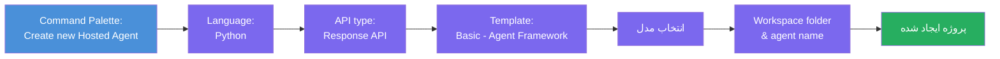
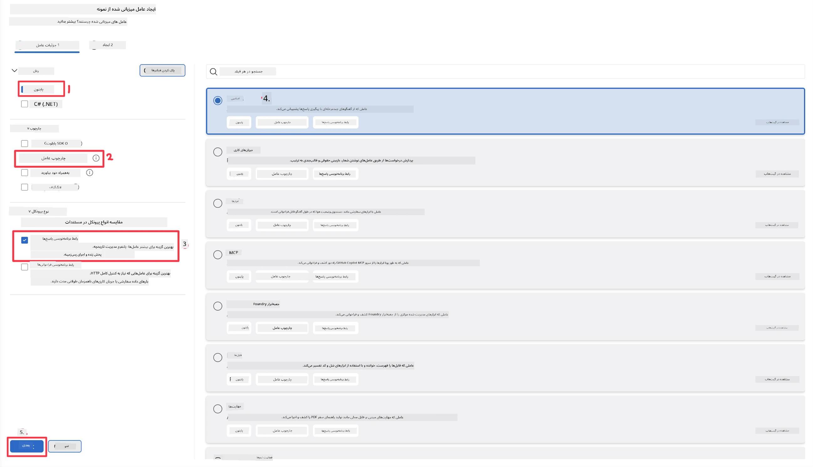
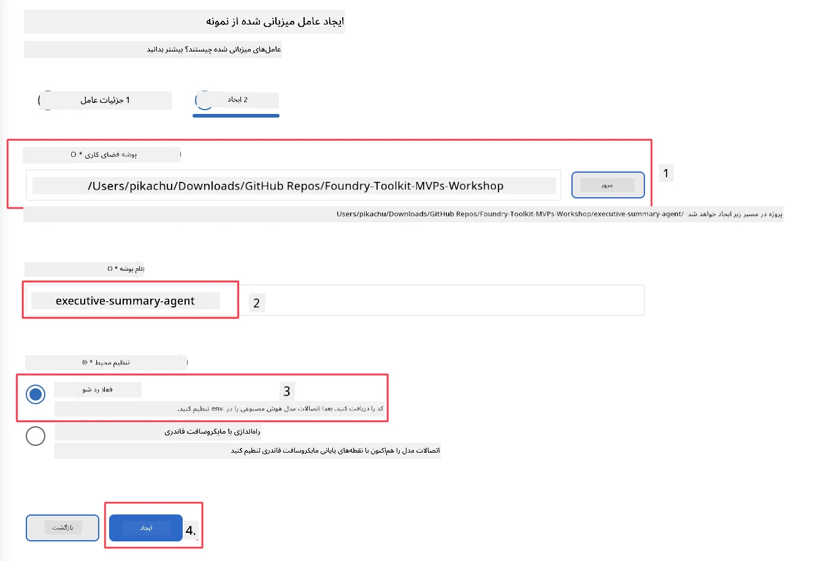

# ماژول ۲ - ایجاد یک عامل میزبانی شده جدید

⏱️ ~۵ دقیقه

در این ماژول، شما از Foundry Toolkit برای **ایجاد ساختار اسکلتی پروژه یک عامل میزبانی شده** استفاده می‌کنید. این اسکللت ساختار کامل پروژه را تولید می‌کند - شامل `agent.yaml`، `main.py`، `Dockerfile`، `requirements.txt` و تنظیمات اشکال‌زدایی VS Code - تا بتوانید روی سفارشی‌سازی رفتار عامل تمرکز کنید.

> **مفهوم کلیدی:** پوشه `agent/` در این آزمایشگاه نمونه‌ای است از آنچه Foundry Toolkit تولید می‌کند. شما این فایل‌ها را از ابتدا نمی‌نویسید.

### جریان جادوگر اسکللت



---

## مرحله ۱: باز کردن جادوگر ایجاد عامل میزبانی شده

۱. کلیدهای `Ctrl+Shift+P` را فشار دهید تا **پالت فرمان** باز شود.
۲. تایپ کنید: **Foundry Toolkit: Create new Hosted Agent** و آن را انتخاب کنید.

> **جایگزین: ایجاد از طریق Foundry Portal**
> اگر مرورگر را ترجیح می‌دهید، می‌توانید پروژه خود را در [https://ai.azure.com](https://ai.azure.com) ایجاد کنید. پس از آماده‌سازی پروژه، به VS Code بازگردید و از نوار کناری **Foundry Toolkit** برای اتصال به آن استفاده کنید.

> **جایگزین:** روی نماد **+** کنار **Hosted Agents (Preview)** در نوار کناری Foundry Toolkit کلیک کنید.

## مرحله ۲: انتخاب تنظیمات



۱. در بخش ناوبری/گزینه‌های سمت چپ موارد زیر را انتخاب کنید:

| منو | انتخاب | توضیحات |
|--------|-----------|-------|
| **زبان** | Python | C# نیز پشتیبانی می‌شود |
| **چارچوب** | Agent Framework | نقطه شروع ساده با استفاده از Agent Framework SDK |
| **نوع API** | Response API | `POST /responses` - مکالمه‌ای، با تاریخچه مدیریت شده توسط پلتفرم |
| **قالب** | Basic | نقطه شروع ساده با استفاده از Agent Framework SDK |

۲. پس از انتخاب، روی **Next** کلیک کنید



۳. در پنجره بعدی، موارد زیر را انتخاب کنید:

| منو | انتخاب | توضیحات |
|--------|-----------|-------|
| **پوشه فضای کاری** | پوشه مقصد را انتخاب کنید | به عنوان مثال، `/workspace/Foundry_Toolkit_for_VSCode_Lab/` یا یک زیرپوشه در این مخزن |
| **نام عامل** | یک نام وارد کنید | به عنوان مثال، `executive-summary-agent` |
| **تنظیم محیط** | فعلاً تنظیم را رد کنید |  |

برای ایجاد عامل ما روی **create** کلیک کنید. یک پوشه جدید با نام عامل میزبانی شده ایجاد خواهد شد.

## مرحله ۳: بررسی پروژه ایجاد شده

پس از اتمام اسکلت‌بندی، بررسی کنید که این فایل‌ها را در Explorer (`Ctrl+Shift+E`) می‌بینید:

```
📂 my-agent/
├── .env                ← Environment variables (placeholders)
├── .vscode/
│   ├── launch.json     ← Debug config (F5 → run + Agent Inspector)
│   └── tasks.json      ← VS Code task definitions
├── agent.yaml          ← Agent definition (kind: hosted)
├── Dockerfile          ← Container config for deployment
├── main.py             ← Agent entry point (your main code)
└── requirements.txt    ← Python dependencies
```

### توضیح فایل‌های کلیدی

| فایل | هدف |
|------|---------|
| `agent.yaml` | اعلام می‌کند که عامل از نوع `kind: hosted` است، متغیرهای محیطی را نگاشت می‌کند، پروتکل `/responses` را تعریف می‌کند |
| `main.py` | یک `FoundryChatClient` می‌سازد → آن را درون یک `Agent` با دستورات قرار می‌دهد → از طریق `ResponsesHostServer` روی پورت ۸۰۸۸ خدمت‌رسانی می‌کند |
| `Dockerfile` | از `python:3.12-slim` استفاده می‌کند، وابستگی‌ها را نصب می‌کند، پورت ۸۰۸۸ را باز می‌کند، `main.py` را اجرا می‌کند |
| `requirements.txt` | شامل `agent-framework-foundry`، `agent-framework-foundry-hosting`، `mcp`، `debugpy` |

> **مهم:** پوشه عامل اسکللت شده را مستقیماً در VS Code باز کنید (خود پوشه `agent/`) تا `.vscode/launch.json` و `tasks.json` برای اشکال‌زدایی با کلید F5 به درستی کار کنند.

---

### ✅ نقطه بازبینی

- [ ] پروژه اسکلت‌بندی شده با تمام فایل‌های مورد انتظار ایجاد شده است
- [ ] فایل `agent.yaml` مقدار `kind: hosted` و `protocol: responses` را نشان می‌دهد
- [ ] در `main.py`، `Agent`، `FoundryChatClient`، `ResponsesHostServer` وارد شده‌اند
- [ ] پوشه عامل به عنوان ریشه فضای کاری در VS Code باز شده است

---

**قبلی:** [۰۱ - راه‌اندازی](01-setup.md) · **بعدی:** [۰۳ - پیکربندی و کدنویسی →](03-configure-and-code.md)

---

<!-- CO-OP TRANSLATOR DISCLAIMER START -->
**سلب مسئولیت**:
این سند با استفاده از سرویس ترجمه هوش مصنوعی [Co-op Translator](https://github.com/Azure/co-op-translator) ترجمه شده است. در حالی که ما در تلاش برای دقت هستیم، لطفاً توجه داشته باشید که ترجمه‌های خودکار ممکن است شامل خطاها یا نادرستی‌هایی باشند. سند اصلی به زبان مادری خود باید به عنوان منبع معتبر در نظر گرفته شود. برای اطلاعات حیاتی، ترجمه حرفه‌ای انسانی توصیه می‌شود. ما در قبال هرگونه سوء تفاهم یا برداشت نادرست ناشی از استفاده از این ترجمه مسئولیتی نداریم.
<!-- CO-OP TRANSLATOR DISCLAIMER END -->